[toc]

# 概述

本文对模糊测试技术进行了综述分析，介绍了开源模糊测试框架Peach的结构、原理及pit文件编写方法，旨在帮助对模糊测试感兴趣的小伙伴能快速入门peach，最后以常见的http协议和工控Modbus协议为例进行了实验。文末搜集了本文所用到的工具和相关资料供大家下载。

**本文为Tide安全团队成员`重剑无锋`原创文章，转载请声明出处！**

# 模糊测试

## 概念

模糊测试 （fuzz testing, fuzzing）技术是安全测试技术的一种，通过构造畸形输入数据使得软件发生异常如崩溃等情况，从而发现软件中存在的安全问题。由于模糊测试技术具有可以充分遍历所有输入数据、代码覆盖全面、测试自动化、能够有效地发现软件中存在的安全问题等特点，受到信息安全中漏洞分析领域的研究人员的广泛欢迎。

目前，Fuzzing技术已经是软件测试、漏洞挖掘领域的最有效的手段之一。Fuzzing技术特别适合用于发现0Day漏洞，也是众多黑客或黑帽子发现软件漏洞的首选技术。Fuzzing虽然不能直接达到入侵的效果，但是Fuzzing非常容易找到软件或系统的漏洞，以此为突破口深入分析，就更容易找到入侵路径，这就是黑客喜欢Fuzzing技术的原因。

## 原理

1、Fuzzing技术首先是一种自动化技术，即软件自动执行相对随机的测试用例。因为是依靠计算机软件自动执行，所以测试效率相对人来讲远远高出几个数量级。比如，一个优秀的测试人员，一天能执行的测试用例数量最多也就是几十个，很难达到100个。而Fuzzing工具可能几分钟就可以轻松执行上百个测试用例。

2、Fuzzing技术本质是依赖随机函数生成随机测试用例，随机性意味着不重复、不可预测，可能有意想不到的输入和结果。

3、根据概率论里面的“大数定律”，只要我们重复的次数够多、随机性够强，那些概率极低的偶然事件就必然会出现。Fuzzing技术就是大数定律的典范应用，足够多的测试用例和随机性，就可以让那些隐藏的很深很难出现的Bug成为必然现象。

## 实现方法
Fuzzing引擎算法中，测试用例的生成方式主要有2种：

1）基于变异：根据已知数据样本通过变异的方法生成新的测试用例；

2）基于生成：根据已知的协议或接口规范进行建模，生成测试用例；

一般Fuzzing工具中，都会综合使用这两种生成方。基于变异的算法核心要求是学习已有的数据模型，基于已有数据及对数据的分析，再生成随机数据做为测试用例。

## 实现流程

一个基于网络协议的 Fuzz 测试的实现过程如下:

1 获得待测协议的正常数据包

2 用变异数据替换该数据包中的某些部分

3 用发包器向目标应用发包

4 观察目标应用的反应 

通常情况下，通过抓包器捕获客户端与被测设备正常交互的数据包作为测试的正常数据包样本。通过任意方式改变随机数据。例如，可以打乱整个数据包，也可以把数据包中的某 个部分替换。不管采用什么方法变异数据，关键是在数据包中放入大量随机数据，然后将该数据包发送到目标应用并观察目标应用的行为能力。

## 常用fuzz框架

在研究网络协议模糊测试时，sulley和peach两大框架是最常见的Fuzz框架，peach相对于sulley有以下几点优势：

1、功能方面：sulley和peach完成的功能点都是一样，peach可对多种协议、文件进行模糊测试，而sulley只能对网络协议进行测试。

2、开发角度：peach专注于xml文件的编写，比较容易理解，但其余部分几乎很少能改写；sulley用python代码来写测试，可以开发一些插件、监视器等,适用于深度开发。

3、维护方面：sulley目前已停止维护，peach相关资料和研究人员相对较多。

4、安装部署：sulley配置环境相对繁琐，而peach配置环境相对简单。


# peach介绍

## 关于peach

Peach由Deja vu Security公司的Michael Eddington创造并开发，是一个遵守MIT开源许可证的模糊测试框架，是第一款综合的开源fuzzing工具，包含进程监视和创建fuzzer，其中创建fuzzer由XML语言实现。Peach主要开发工作已经有7年了，主要有3个版本。最初采用Python语言编写，发布于2004年，第二版于2007年发布，Peach 3发布于2013年初，第三版使用C#重写了整个框架。

Peach支持对文件格式、ActiveX、网络协议、API等进行Fuzz测试；Peach Fuzz的关键是编写Peach Pit配置文件。

## 安装部署

Windows下使用Peach3需要预先安装Microsoft.NET4和windbg；Linux、OS X下需要安装Mono包。

Peach不是开源软件，而是遵循MIT许可证的免费软件。和BSD许可证一样，MIT许可证在Peach的使用和修改上没有限制。

我使用的windows绿色版，在`https://github.com/TideSec/Peach_Fuzzing/`中peach文件夹中包含了收集到的4个版本的peach最新版软件包，分别为windows版（x86）、windows版（x64）、oxs版、linux版、python版，大家可以下载使用。

## 体系结构

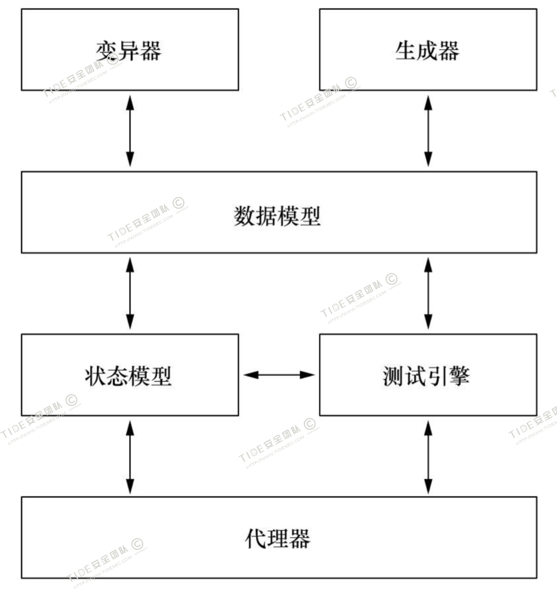

Peach模糊测试工具是一个开源的模糊测试框架，包括数据模型(数据类型、变异器接口等)、状态模型(数据模型接口、状态、动作—输入输出等)、代理器(包括本地调试器如WindowsDebugger和网络监视器如PcapMonitor等)、测试引擎(代理器接口、状态模型接口、发布器、日志记录器等)

Peach有以下几个高级概念：

1) 数据模型： 用来表示输入和输出所需要的数据结构。可以根据需要构造数据模型。数据模型中，用户可以设置数据变量，可以为该数据变量指定数据类型如字符串类型、整数类型等，还可以设置数据变量的数值，并根据变异器的接口指定该变量是否执行变异操作。数据模型中还可以设置数据块，一个数据块可以包括多个数据变量。数据变量之间还可以设置关系，例如size of类型的关系等。

2) 变异器： 包括变异策略，不同数据类型的变异策略不同。

3) 生成器： Peach生成器能够生成字符串数据、整型数值数据等简单类型的数据，还可以生成复杂的分层的二进制数据，还可以将简单的数据生成器串接起来生成更加复杂的数据类型的数据。

4) 状态模型： 在每一个测试用例中，根据状态模型，Peach根据用户配置初始化状态机，并维护该有限状态机，每个状态包括一个或者多个操作。每个状态中，Peach状态机会顺序地执行每个操作。用户可以为操作设置相应的执行条件。当一个状态中所有操作执行结束后还是维持当前状态，则该状态机执行结束。

5) 代理器： 在Peach模糊测试过程中，Peach测试引擎与Peach代理器进行通信，从而对被测目标进行状态监视并对其进行执行控制。用户必须为Peach代理器设置一个Peach监视器，从而对被测程序进行状态监视，并进行执行控制如启动被测程序或者停止被测目标程序。每次测试迭代或者测试子用例执行完毕，Peach代理器将把Peach监视器监视的被测目标程序的异常状态信息(如崩溃)返回给Peach测试引擎，如果被测目标程序正常执行结束，那么将返回正常结束标志信息给Peach测试引擎。

6) 测试引擎： 采用Peach解析器解析用户输入的配置文件(一般为pit格式的文件)，根据配置文件创建相应的组件并进行初始化如对状态模型的状态机进行初始化，然后Peach测试引擎进入执行测试用例的主循环。测试引擎中的发布器可以对任意的生成器提供透明的接口，常见的发布器有文件发布器或者TCP网络发布器等，发布器是针对所生成的数据的一种传输形式。用户(二次开发人员或使用人员)可以将自己的生成器连接到不同的输出中。日志记录器可以设置日志的路径和文件名，并将测试执行过程中的状态信息记录到日志文件中。

## 使用流程

Peach 的测试对象几乎包括了所有常见的Fuzz对象，例如文件结构，com，网络协议、API 等。

使用Peach进行fuzzing的主要步骤如下：

1、创建模型

2、选择/配置Publisher

3、配置代理/监视器

4、配置记录

## 命令参数

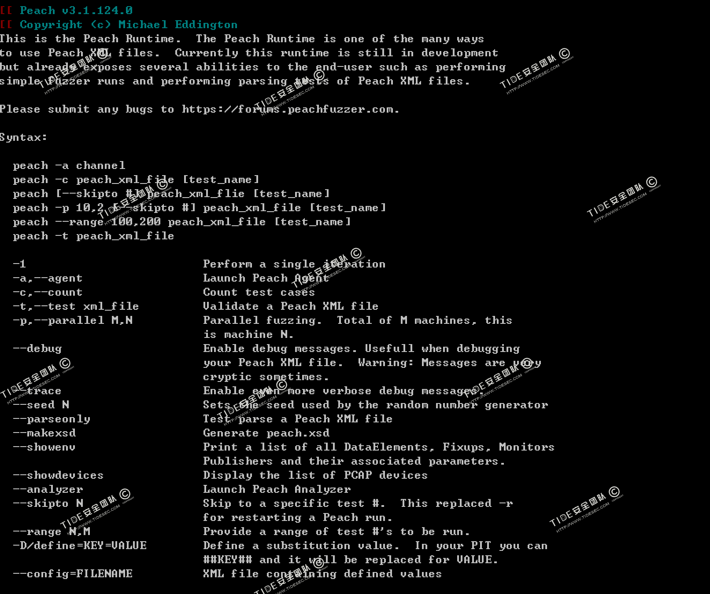
```
-1：执行第1次测试。
-a：启动Peach代理。不指定”channel”默认为本地代理（默认支持，无需显式启动）；“channel”可以指定为”tcp”远程代理。
-c：统计测试用例数。
-t：验证Peach Pit xml文件正确性。
-p：并行Fuzz。运行Peach的机器总数为M，这是第N个。
–debug：调试信息开关。
–skipto：指定Fuzz跳过的测试用例数。
–range：指定Fuzz的测试用例范围
```

# Pit文件

## 文件格式

Peach把用于数据定义的文件叫做Peach pit file。使用Peach时，实际上主要工作就是定义这样一个xml文件指示Peach测试平台去做测试。Peach pit file基本上总是包含以下几个部分：

```
<?xml...版本，编码之类...>
<Peach ...版本，作者介绍之类...>
<Include ...包含的外部文件/> 
<DataModel >原始数据结构定义</DataModel> 
<StateModel >测试逻辑，状态转换定义，如收到什么样的数据包之后，发出什么样对应的数据包</StateModel> 
<Agent >检测 exception，crash 等 </Agent>
<Test >指定将要使用到的 state，agent，publisher 等</Test>
<Run >Fuzzer 执行的进入点</Run>
</Peach>

1)整个文件被一个大标签<Peach> </Peach>包括。

2)文件中的第二级标签包括 Include，DataModel，StateModel，Agent，Test，Run 共 6种。

3)Include 包含的外部文件，其中 defaults.xml 和 PeachTypes.xml 是必须的，里边含有Peach的基本方法、类、数据类型等。

4)DataModel 用于定义数据结构，此标签下还可以有若干级、若干种下级标签。使用这些子标签可以比较容易的定义数据的类型，大小，各个数据块之间的关系，以及 CRC 校 验和等。还可以定义多个 DataModel，多个 DataModel之间可以有关系也可以没有关系。

5)StateModel 用于定义测试的逻辑，实际上相当于一个状态机。下级标签包括 State， 每个 State 中又可以包含若干个 Action 标签。State 表示一个状态，不同的 State 之间可以根 据一些判断条件进行跳转。Action 用于执行打开文件，发送数据包之类的命令。

6)Agent 是一个主要功能是用来监测被测目标的反应，如 crash 等。

7)Test 这个标签域比较简单，一般只是制定使用哪个 Agent，哪个 StateModel，用什么 方法发数据，有时还会指定使用什么方法加工(变异)数据。

8)Run 这个标签域也比较简单，指定当前这次 Fuzz 测试使用哪个 Test。
```
## Include配置

Include元素允许把其他pit文件包含到当前pit文件的名称空间中使用。
当引用被包含的Pit文件时，用名称空间前缀和冒号的格式来命名。格式为：name：DataModel，如下所示：

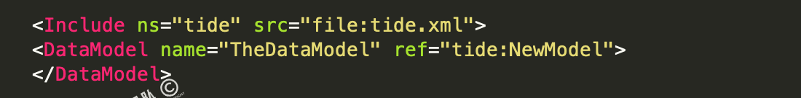
```
属性：
Ns---必须的。名称空间前缀。
Src---必须的。源码URL，用“file：”前缀来命名文件名。
```

## DataModel配置

Peach Pit文件包含至少一个DataModel元素，DataModel描述的数据包括类型信息、关系信息（大小、数目、偏移）和其他让模糊器执行智能变异的信息。DataModel是Peach根元素的子元素之一，它通过添加子元素（比如Number、Blob或者String）的方式定义了数据块的结构。
- 属性
```
Name---必须的。当引用模型或者调试时，友好的DataModel名字是非常有用的。
Ref---可选的。引用一个DataModel模板。
Mutable---可选的，默认为真。该元素是否可变异。
Constraint---可选的。确定一个表达式，它帮助Peach确定数据元素是否已被适当的消耗。
```
- 子元素
```
Block、Choice、Custom、Flag、Flags、Number、Padding、String、XmlAttribute、XmlElement、Relation、Fixup、Transformer、Placement
```

一个名字为“HelloTide”的DataModel包含一个字符串和输出“Hello Tide！”如下所示：

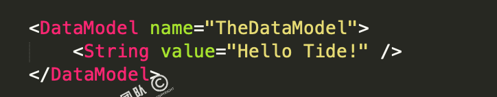

一个DataModel可以引用其他DataModel，可以继承带有ref属性的子元素。如下所示：
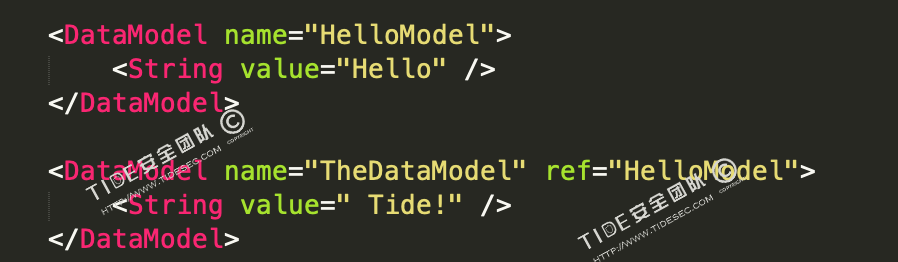

## StateModel配置

StateModel重新创建测试一个协议所必须的基本状态机器逻辑。它定义了怎么给目标发送和接收数据。StateModel的范围从非常简单到及其复杂。建议在开始时，保持状态模型简单，需要时再进行扩展。

StateModel包含一个子元素state，state封装了一个为Peach工作的逻辑单元，进而来执行一个大的状态模型。state由action组成，每个action可以执行与单个状态如何封装逻辑相关的任务。

Action元素能在StateModel中执行多种操作。Action是发送命令给Publisher的一种主要方式，它能发送输出，接收输入或打开一个连接。Action也能在StateModel中改为其他状态，在DataModel之间移动数据，调用被代理定义的方法。

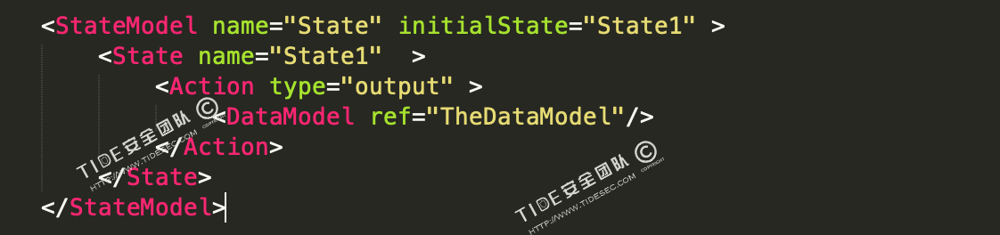

## Agent配置

代理是特殊的Peach进程，它可以在本地或者远程运行。这些进程拥有一个或者多个监视器，这些监视器可以执行加载调试器，查看内存消耗或者探测错误等操作。代理中的监视器可以收集信息和代表fuzzer执行操作。

常用的代理有：本地代理、TCP远程代理、ZeroMQ、REST Json代理，其中前两种使用频率更高。

- 本地代理

Peach运行时支持一个运行在进程中的本地代理。如果不指定的话，这是一个默认的代理类型。配置一个本地代理如下：
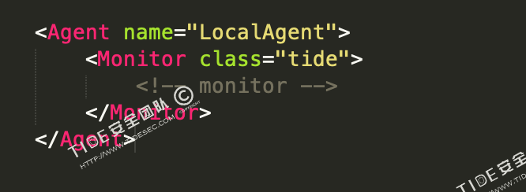

- TCP远程代理

这个代理存活在本地或远程机器的一个单独的进程中，通过TCP远程完成连接，是一种被本地运行时支持的RPC形式。为了使用远程代理，代理进程必须首先运行起来。

代理配置
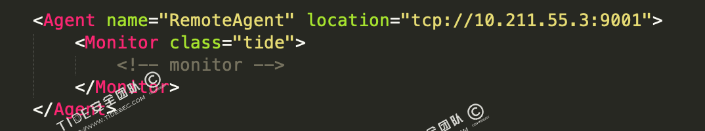

在远程主机上运行`peach.exe -a tcp`

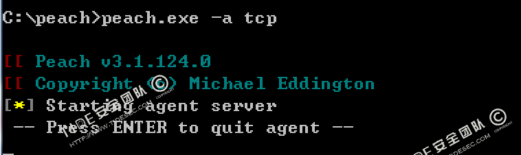

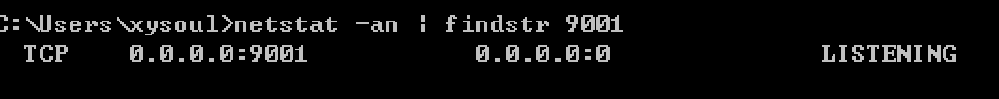


## Monitor配置

Monitor主要有以下几种监视器：windows监视器、OSX监视器、Linux监视器和跨平台监视器，每个平台的监视器都分很多种。

其中windows监视器包括：Windows Debugger Monitor、cleanup registry monitor、pageheap 监视器、PopupWatcher 监视器、windowsService 监视器等

OSX监视器包括：CrashWrangler 监视器、CrashReporter Monitor

Linux监视器包括：LinuxCrash

跨平台监视器包括：canakit relay 监视器、Cleanup Folder监视器、IpPower9258监视器、内存监视器、Pcap监视器、Ping监视器、进程监视器、Processkiller 监视器、保存文件监视器、socket 监视器、ssh监视器、ssh下载器监视器、vmware 监视器等。

官方文档如下：
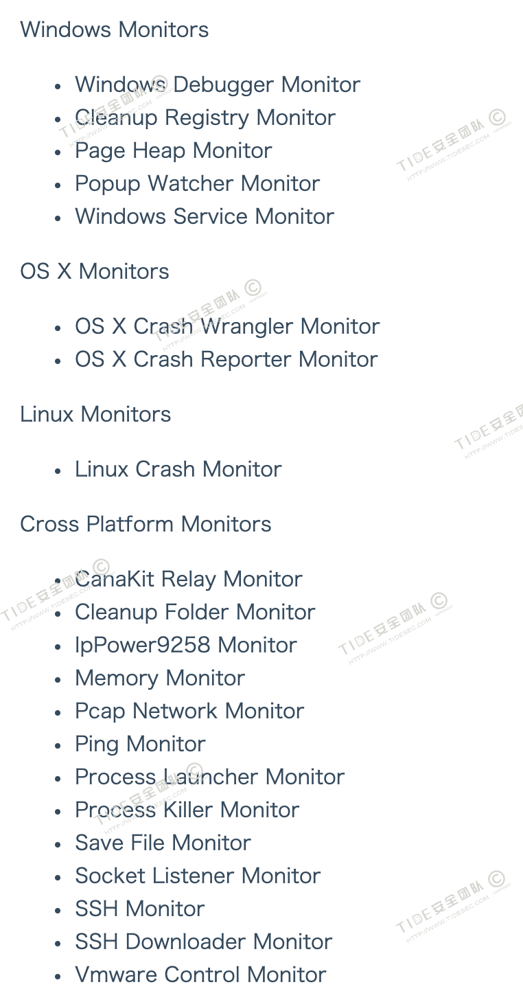

以几个常见的为例进行参考。

- Windows Debugger Monitor

WindowsDebugger监视器控制了一个windows调试句柄。主要有以下用途：进程调试、服务调试、内核调试。

必须参数
```
必须参数：
Commandline---用逗号分隔的窗口名字。
Processname---当找到一个窗口的时候，触发错误，默认为假。
Kernelconnectionstring---内核调试的连接字符串。
Service---要挂载的windows服务名称。如果停止或者崩溃，服务将会被启动。
```
可选参数
```
Symbolspath---符号表路径或者服务。默认为：“SRV*http://msdl.microsoft.com/download/symbols”
Windbgpath---windbg的安装路径。尽量在本地。
Noncrystalline---直到从状态模型的匹配调用完成时，debugger才会被挂载。
Ignorefirstchanceguardpage---忽略第一个机会机会保护页面错误。这些有时是假阳性或反调试错误。默认为假。
Ignoresecondchanceguardpage---忽略第二个机会保护页面错误。这些有时是假阳性或反调试错误。默认为假。
Nocpukill---不要使用进程CPU使用率提前终止。默认为假。
Faultonearlyexit---如果进程存在，触发错误。默认为假。
Waitforexitoncall--如果时间间隔到了，-等待状态模型调用的进程退出和参数故障。
Waitforexittimeout---等待退出，timeout值单位为微秒。（-1位无穷大）默认位10000。
Restaroneachtest---为每次迭代重启进程。默认为假。

```

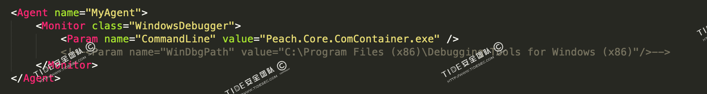

其他参数示例

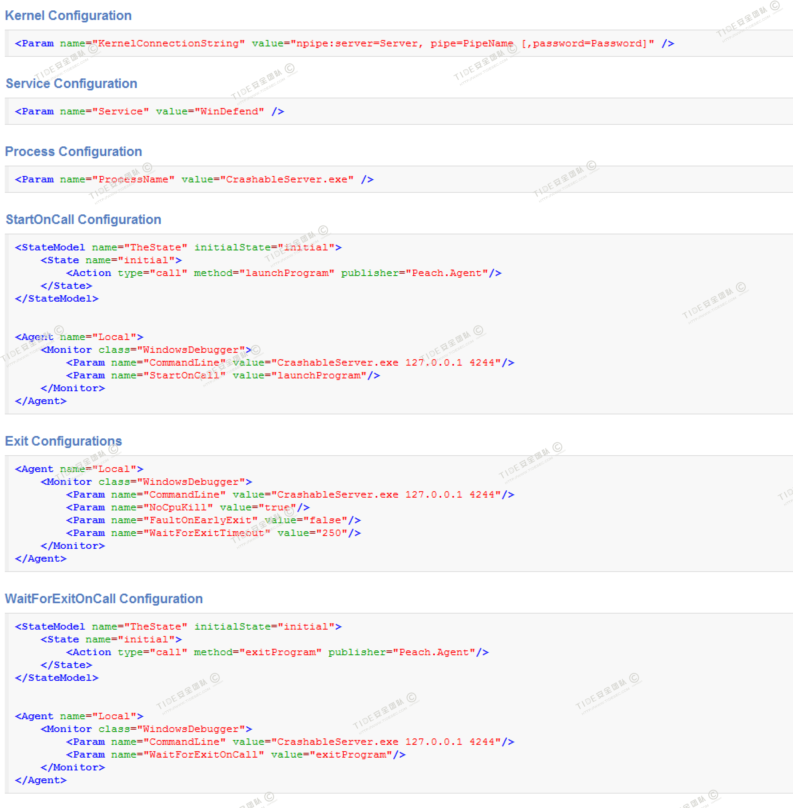


- CrashWrangler 监视器

CrashWangler监视器将启动一个进程和监视器感兴趣的崩溃。这个监视器采用苹果系统自带的CrashWrangler工具，这个工具能从开发者网站下载。为了该工具能够正常运行，它必须在每个机器上进行编译。

参数：
```
Command---要执行的命令。
Arguments---命令行参数，可选，默认没有。
StartOnCall---状态模型调用的启动命令。可选，默认没有。
UseDebugMalloc---使用OSX Debug Malloc（比较慢），可选默认为假。
ExecHandler---Crash Wrangler 执行处理程序，可选，默认为exc_handler。
ExploitableReads---读a / v被认为是可利用的？可选，默认为假。
NoCpuKill---通过CPU使用禁用进程杀死。可选，默认为假。
CwLogFile---CrashWrangler记录文件。可选，默认为cw.log。
CwLockFile---CrashWrangler锁文件，可选，默认为cw.lock。
CwPidFile---CrashWrangler PID文件，可选，默认为cw.pid。
```

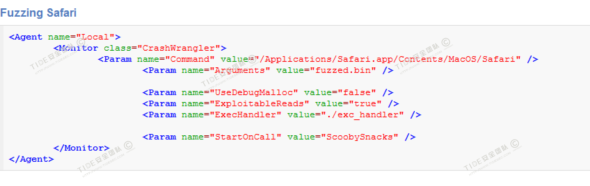

- LinuxCrash监视器

LinuxCrash监视器用一个脚本来捕捉错误进程，该脚本被内置在内核中。

参数：
```
Executable---目标可执行程序，被用于过滤崩溃，可选的，默认为所有。
LogFolder---记录文件的文件夹。可选默认为“/var/peachcrash”。
Mono---mono执行=程序所需的运行时的全路径。可选，默认为“/usr/bin/mono”
```
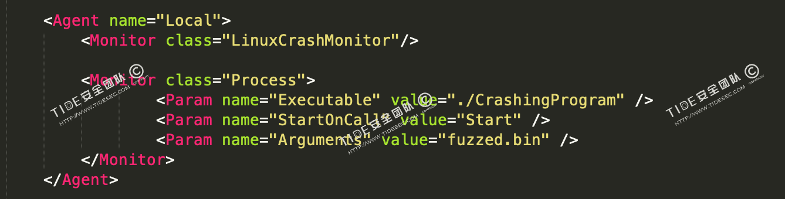

## Test配置

指定使用哪个Agent、StateModel，Publisher用什么方法发送数据，使用什么方法变异数据，日志文件路径等。可以有多个Test，使用时通过peach命令行指定要运行的Test名称，未指定默认运行名称为”Default”的Test。如下图：

属性：
```
Name---必备的，test元素的名字，默认为“Default”。
Waittime---每次测试之间的等待时间，默认为0。
Faultwaittime---在开始下一次迭代时等待错误的时间，默认为0。
controlIneration---我们只需控制迭代的频率，默认为0。
```
有效子元素：
```
Agent（可选）
StateModel（必须）
Publisher（必须）
Include（可选）
Exclude（可选）
Strategy（可选）
Logger（可选，推荐）
```
示例：
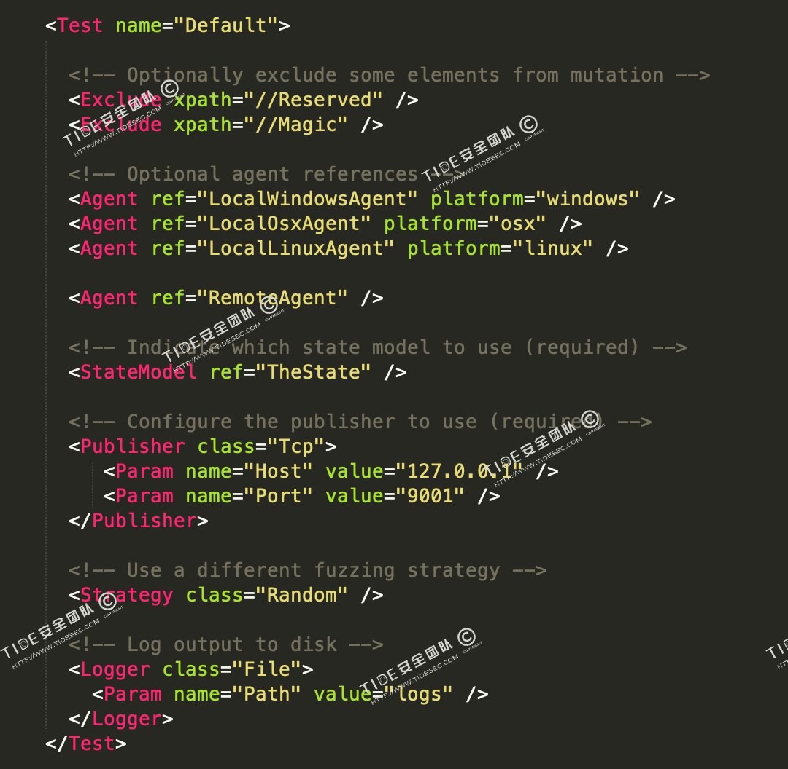

## Loggers配置

Peach有一个可扩展的记录系统，它允许使用者存储他们想要的记录。默认情况下，Peach使用一个单独的文件系统记录器。

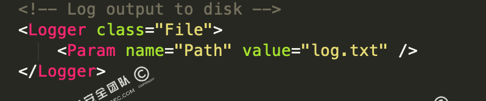

## Strategy配置

Strategy（变异策略）包括：

Random：默认会随机选择最大6个元素（可以通过参数MaxFieldsToMutate设置）利用随机mutator（变异器）进行变异。

Sequential：Peach会顺序对每个元素使用其所有可用的Mutators进行变异。

RandomDeterministic：Peach默认规则。这个规则对pit xml文件中元素根据Mutators生成的Iterations链表做相对随机（由链表中元素数目决定）的顺序混淆，所以每个xml文件每次运行生成的测试用例多少、顺序固定，这样才能保证skipto的准确性。

Peach3包括元素增、删、改、交换，经验值，逐位、双字等Mutators，

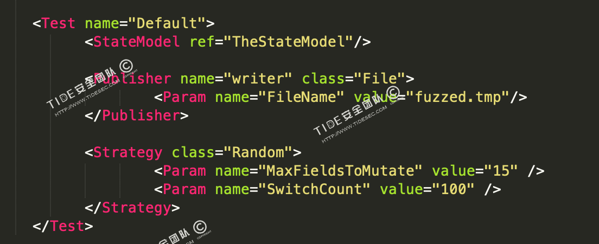

# 示例运行

根据上述pit参数，做了个HelloTide的示例，了解pit文件基本的参数配置及结构。

HelloTide的pit文件已上传github：`https://github.com/TideSec/Peach_Fuzzing/blob/master/pit-xml-samples/HelloTide.xml`

```
<?xml version="1.0" encoding="utf-8"?>
<Peach xmlns="http://peachfuzzer.com/2012/Peach" xmlns:xsi="http://www.w3.org/2001/XMLSchema-instance"
	xsi:schemaLocation="http://peachfuzzer.com/2012/Peach ../peach.xsd">

	<DataModel name="TheDataModel">		
		<String value="Hello Tide!" />
	</DataModel>
	
	<StateModel name="State" initialState="State1" >
		<State name="State1"  >
			<Action type="output" >
				<DataModel ref="TheDataModel"/>
			</Action>
		</State>
	</StateModel>


	<Test name="Default">
		<StateModel ref="State"/>
		<Publisher class="Console" />
		<Logger class="File">
		    <Param name="Path" value="log.txt" />
		</Logger>


	</Test>

</Peach>

```
在cmd中运行`peach.exe samples\HelloTide.xml`，运行后Peach会以这个原始的字符串 为模板变异出许多畸形的数据出来，包括了超长串、NULL结束符缺失的非法串、格式化串等有可能引起程序出错的串，然后依次打印出来。

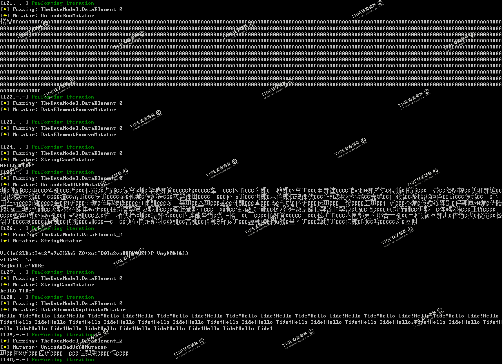

Log日志记录如下

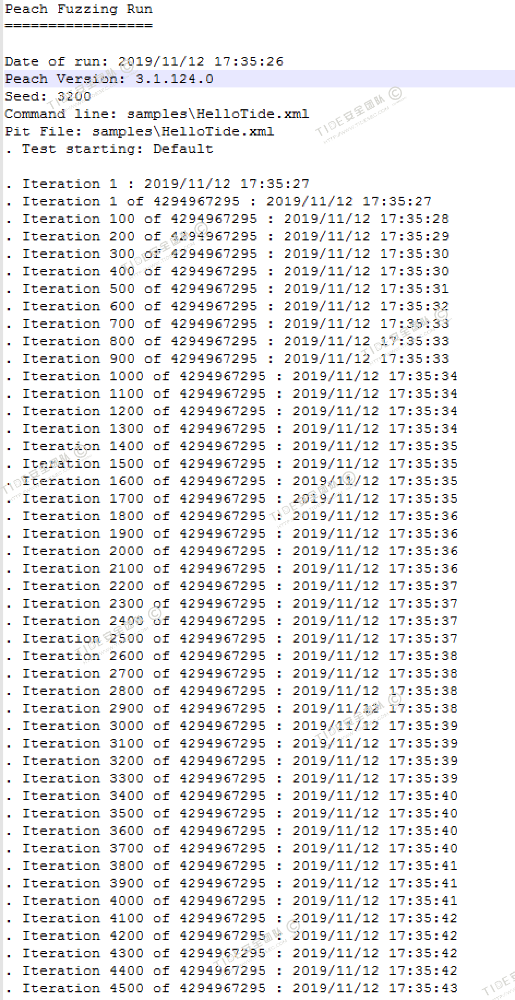

# peach应用——HTTP协议模糊测试

有些peach教程都是对图片或者音视频文件进行fuzz，作为web狗只是对HTTP协议比较熟，所以尝试对http进行peach模糊测试。

## 测试目的

本测试主要是测试 HTTP 协议的健壮性，通过定制Peach pit file，查看是否可以通过对http协议进行模糊测试导致http服务不响应或其他异常现象。

选择的目标是之前写的一个扫描器登录界面`https://github.com/TideSec/WDScanner`，使用phpstudy搭建。因为主要是测试http协议，所以任意web应用都可以。

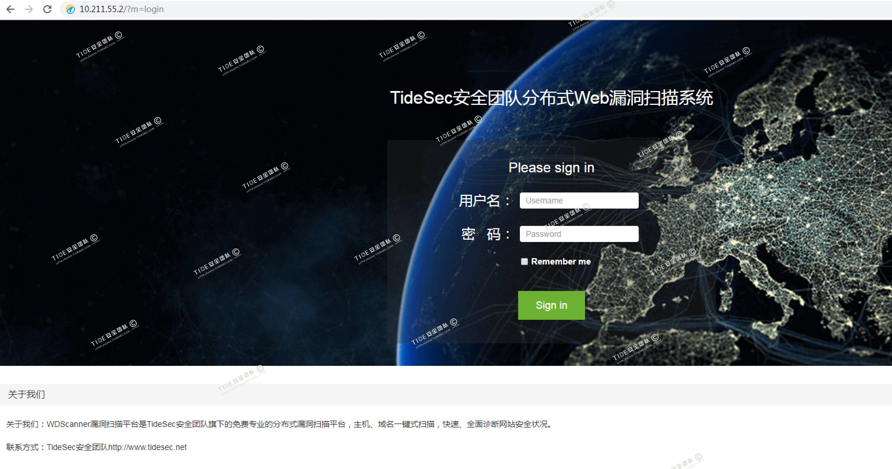

## 分析协议

既然要进项协议fuzz，那么首先应该搞清楚和服务器之间的通信协议是怎么样的。随意下载一个可以在应用层进行抓包的软件就可以满足我们的需求，在此我用的是wireshark。

抓取登录数据包：

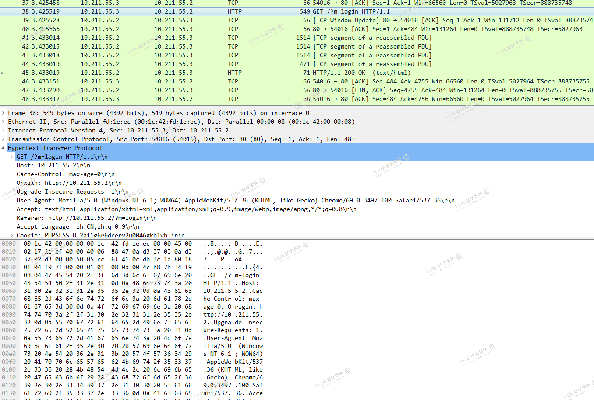

http请求包

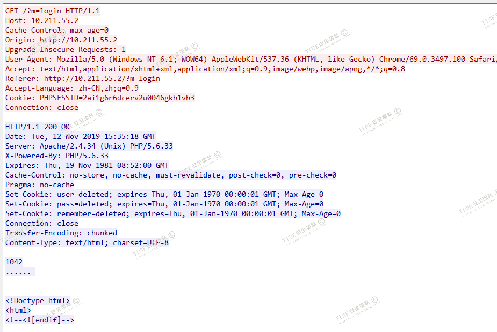

## 定制pit文件

针对Http协议，完善pit文件`httpfuzz.xml`

httpfuzz的pit文件已上传github：`https://github.com/TideSec/Peach_Fuzzing/blob/master/pit-xml-samples/httpfuzz.xml`

```
<?xml version="1.0" encoding="utf-8"?>
<Peach xmlns="http://peachfuzzer.com/2012/Peach" xmlns:xsi="http://www.w3.org/2001/XMLSchema-instance"
    xsi:schemaLocation="http://peachfuzzer.com/2012/Peach ../peach.xsd">

    <DataModel name="DataLogin">
        <String value="GET /index.php?m=login" mutable="false" token="true"/>                   
        <String value=" HTTP/1.1" />   <!-- 不加mutable="false" 说明要对该数值进行fuzz -->
        <String value="\r\n" /> 

        <String value="Content-Type: " mutable="false" token="true"/>
        <String value="application/x-www-form-urlencoded" mutable="false" token="true"/>   
        <String value="\r\n" mutable="false" token="true"/>

        <String value="Accept-Encoding: " mutable="false" token="true"/>
        <String value="gzip, deflate" mutable="false" token="true"/>   
        <String value="\r\n" mutable="false" token="true"/>

        <String value="Accept: " mutable="false" token="true"/>
        <String value="text/html,application/xhtml+xml,application/xml;q=0.9,image/webp,image/apng,*/*;q=0.8,application/signed-exchange;v=b3" mutable="false" token="true"/>   
        <String value="\r\n" mutable="false" token="true"/>  

        <String value="User-Agent: " mutable="false" token="true"/>
        <String value="Mozilla/5.0 (Windows NT 6.1; Win64; x64) AppleWebKit/537.36 (KHTML, like Gecko) Chrome/75.0.3770.100 Safari/537.36" mutable="false" token="true"/>   
        <String value="\r\n" mutable="false" token="true"/>

        <String value="Host: 10.211.55.2" mutable="false" token="true"/>
        <String value="\r\n" mutable="false" token="true"/>

        <String value="Conection: " mutable="false" token="true"/>
        <String value="Keep-Alive" mutable="false" token="true"/>   
        <String value="\r\n" mutable="false" token="true"/>

    </DataModel>   


    <StateModel name="StateLogin" initialState="Initial">
        <State name="Initial">
            <Action type="output">
                <DataModel ref="DataLogin"/>
            </Action>            
        </State>
    </StateModel>   


    <Test name="Default">
        
        <StateModel ref="StateLogin"/>
        <Publisher class="TcpClient">
            <Param name="Host" value="10.211.55.2"/>
            <Param name="Port" value="80"/>
        </Publisher>

        <Logger class="File">
            <Param name="Path" value="C:\peach\logs"/>
        </Logger>

        <Strategy class="Sequential" />

    </Test>   
</Peach>
```

在该pit文件中，针对数值`HTTP/1.1`和`\r\n`进行模糊测试，模糊策略为Sequential。

## 执行测试

在cmd中执行`peach.exe samples\httpfuzz.xml`
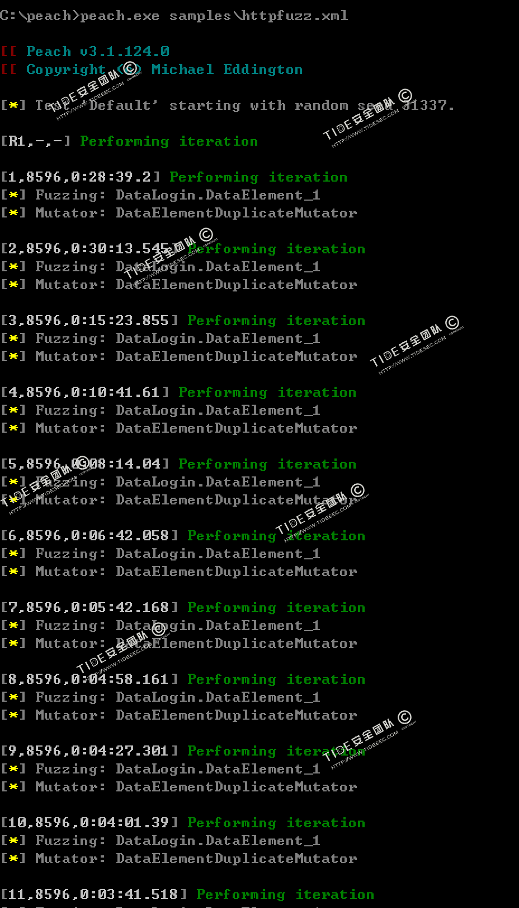

## 测试结果

在wireshark中可看到发送的数据包，peach自动对`HTTP/1.1`和`\r\n`生成了大量fuzz数据。

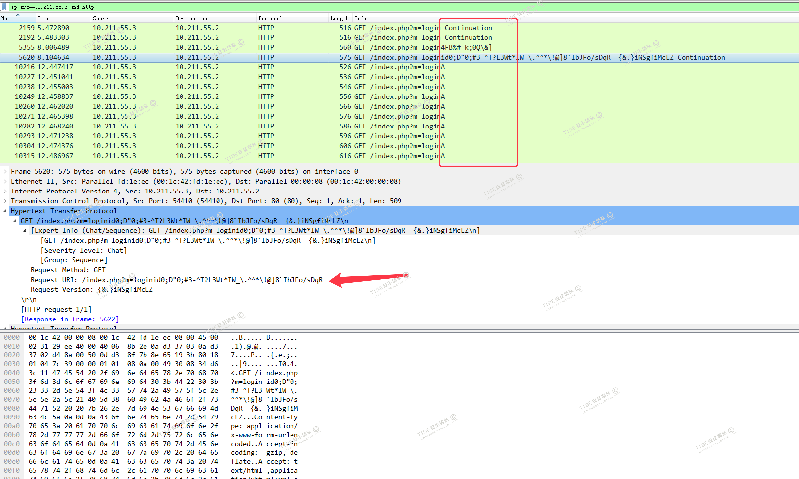

在使用过程中，也可对peach加参数`-debug`进行调试模式，可直接看到发送的数据包。

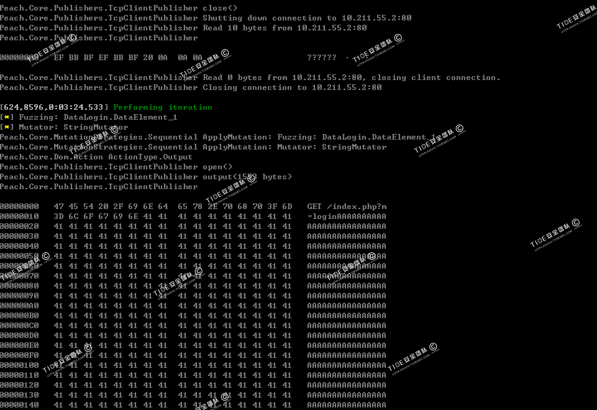

## 他山之石

在查阅各种资料中，发现我上面的写法比较简单粗暴，在网上找到一个实现比较优雅的http fuzz的Pit文件。

httpfuzz1的pit文件已上传github：`https://github.com/TideSec/Peach_Fuzzing/blob/master/pit-xml-samples/httpfuzz1.xml`

```
<?xml version="1.0" encoding="utf-8"?>
<Peach xmlns="http://peachfuzzer.com/2012/Peach" xmlns:xsi="http://www.w3.org/2001/XMLSchema-instance" xsi:schemaLocation="http://peachfuzzer.com/2012/Peach /peach/peach.xsd">
<DataModel name="Headermodel">
    <String name="Header" /> 
    <String value=": "/> 
    <String name="Value" /> 
    <String value="\r\n" /> 
</DataModel>


<DataModel name="HttpRequest">
    <Block name= "RequestLine"> 
        <String name="Method"/>
        <String value=" "/> 
        <String name="RequestUri"/> 
        <String value=" "/>
        <String name="HttpVersion"/>
        <String value="\r\n"/> 
    </Block> 

    <Block name="HeaderHost" ref="Headermodel"> 
        <String name="Header" value="Host" /> 
    </Block> 

    <Block name="HeaderContentLength" ref="Headermodel"> 
        <String name="Header" value="Content-Length" /> 
        <String name="Value"> 
            <Relation type="size" of="httpBody.content"/> 
        </String> 
    </Block> 

    <Block name="httpBody"> 
        <String name="content" value="length is 12" /> 
    </Block> 
</DataModel>


 <Data name="HttpGet" > 
    <Field name="RequestLine.Method" value="GET"/>
    <Field name="RequestLine.RequestUri" value="http://10.211.55.2" />
    <Field name="RequestLine.HttpVersion" value="HTTP/1.1"/>
    <Field name="HeaderHost.Value" value="http://10.211.55.2"/>
    <Field name="httpBody.content" value="\r\nfuzz"/>
 </Data> 

 <Data name="HttpOptions" ref="HttpGet"> 
    <Field name="RequestLine.Method" value="OPTIONS"/> 
    <Field name="RequestLine.RequestUri" value="*" /> 
    <Field name="HeaderHost.Value" value="" /> 
 </Data> 

 <StateModel name="State1" initialState="Initial"> 
    <State name="Initial">
        <Action type="output">
            <DataModel ref="HttpRequest"/>
            <Data ref="HttpGet"/> 
        </Action> 
    </State> 
</StateModel> 

<StateModel name="State2" initialState="Initial"> 
    <State name="Initial"> 
        <Action type="output"> 
            <DataModel ref="HttpRequest" /> 
            <Data ref="HttpOptions" />
        </Action> 
    </State> 
</StateModel>

<Test name="Default">
        <StateModel ref="State1"/>

        <Publisher class="TcpClient">
                <Param name="Host" value="10.211.55.2" />
                <Param name="Port" value="80" />
        </Publisher>
        <Logger class="File">
            <Param name="Path" value="C:\peach\logs"/>
        </Logger>
</Test>
</Peach>
```
效果和上面类似，数据畸变更明显，大家可以自己体验一下。


## 测试结论

可惜的是运行了很大一会，并没发现什么畸形数据能导致http服务宕掉，返回的数据包基本也都是400错误。

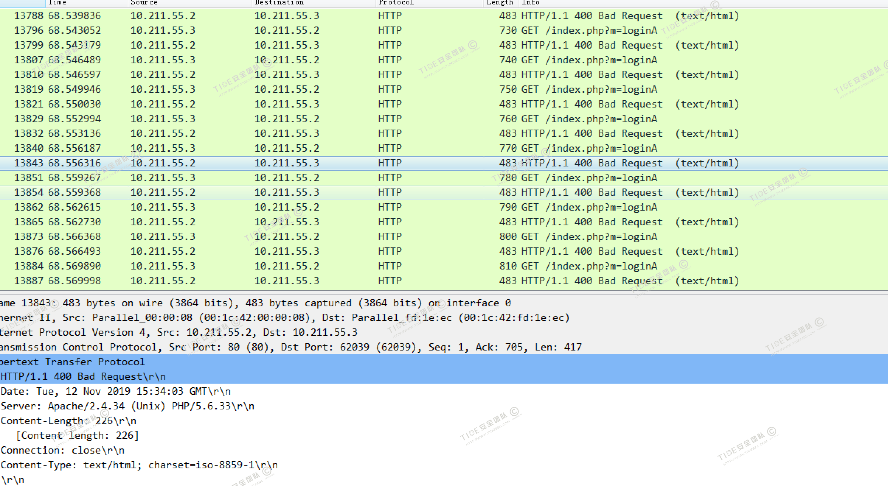

# peach应用——工控协议模糊测试

对modbus协议的模糊测试参考了2019年10月世界信息安全大会中灯塔实验室的几位工控大佬的授课内容，在此表示由衷感谢！

我们Tide安全团队的另外一个小伙伴也写了篇关于工控模糊测试的文章，也可以参考`https://mp.weixin.qq.com/s/h9JWw1lZpfCmlQYZbBJIYA`

工控协议里modbus算是最为常见的了，关于modbus协议相关的资料以及比较多了，就不重复介绍了，不太熟悉的可以参考`https://www.cnblogs.com/luomingui/archive/2013/06/14/Modbus.html`。

在对modbus协议有了一定认识之后，我们开始对modbus协议进行fuzz测试。

## 搭建环境

理论上来讲，应该使用真实的工控plc设备来进行实验，因为仿真软件对这种畸形的modbus协议是不会处理的，而真实的设备可能会因为无法响应请求而导致设备宕掉。但因为比较穷，手头没有设备，所以还是只能用仿真器了。

modbus仿真软件+采集软件下载：`https://github.com/TideSec/Peach_Fuzzing`

在一台虚拟机上打开modbus仿真软件,模拟modbus服务（相关软件在文末提供下载）

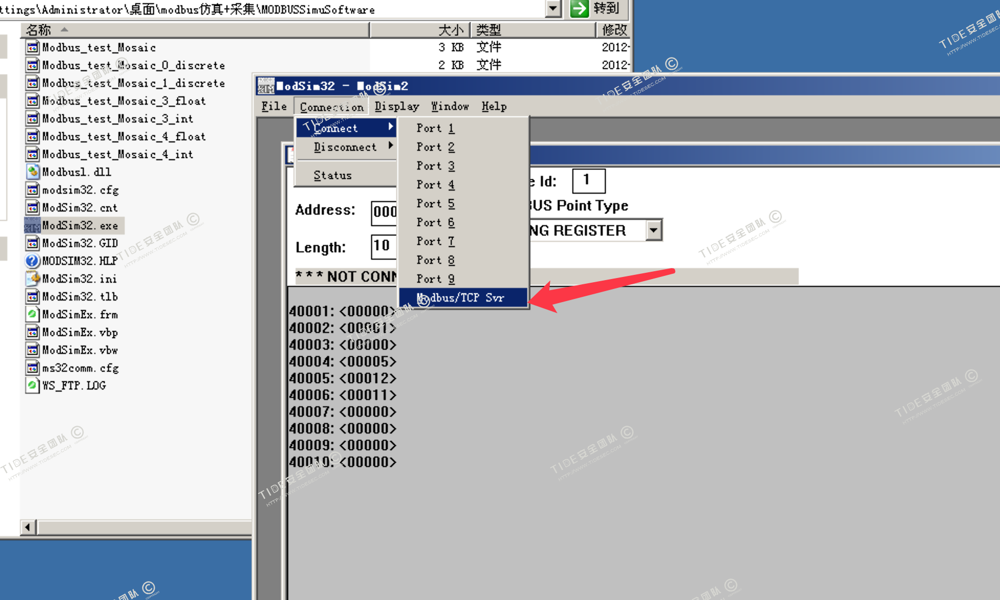

在自己电脑上打开采集器

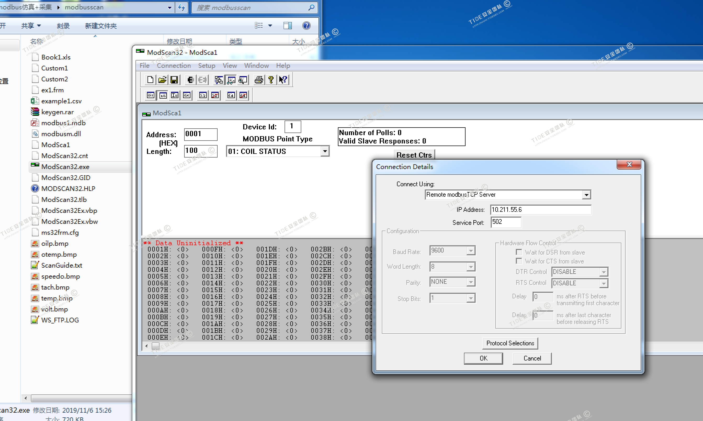

## 分析数据

在采集器连接到仿真器时，使用wireshark可抓取到modbus协议数据

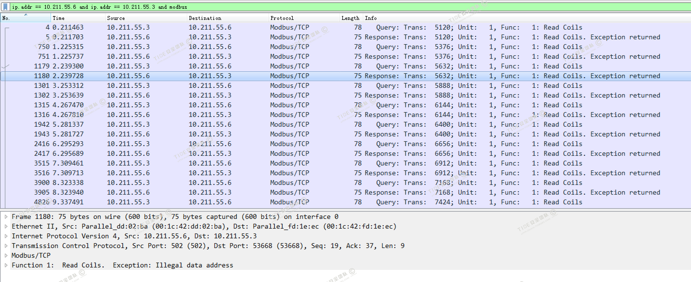

在任一modbus协议数据包上点右键，复制hex流

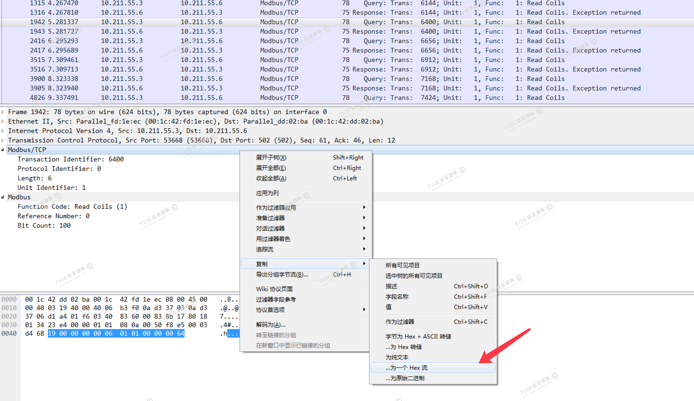

导出的数据为`190000000006010100000064`,这也是modbus协议的报文格式。

## 配置pit

modbus fuzz的pit文件已上传github：`https://github.com/TideSec/Peach_Fuzzing/blob/master/pit-xml-samples/modbus.xml`

```
<?xml version="1.0" encoding="utf-8"?>
<Peach xmlns="http://peachfuzzer.com/2012/Peach" xmlns:xsi="http://www.w3.org/2001/XMLSchema-instance"
 xsi:schemaLocation="http://peachfuzzer.com/2012/Peach ../peach.xsd">

 <DataModel name="send_data"> 
  <Block name="mod">
   <Number name="01" size="16" value="19 00" valueType="hex" signed="false" mutable="false"/>
   <Number name="02" size="16" value="00 00" valueType="hex" signed="false" mutable="false"/>
   <Number name="03" size="16" value="00 06" valueType="hex" signed="false" mutable="false"/>
   <Number name="04" size="16" value="01 01" valueType="hex" signed="false"/>  <!-- 不加mutable="false" 说明要对该数值进行fuzz -->
   <Number name="05" size="16" value="00 00" valueType="hex" signed="false"/>
   <Number name="06" size="16" value="00 64" valueType="hex" signed="false"/>
  </Block>
 </DataModel>

 <StateModel name="TheState" initialState="initialState">
   <State name="initialState">
    <Action type="output">
      <DataModel ref="send_data" />
    </Action>
  </State>
 </StateModel>

 <!--使用socket进行监听端口 -->
 <Agent name="Local">
  <Monitor class="Socket">
   <Param name="Host" value="10.211.55.6" />
   <Param name="port" value="502" />
  </Monitor>
 </Agent>

 <!--log保存-->
 <Test name="Default">
  <Agent ref="Local" />
  <StateModel ref="TheState" />
  <Logger class="File">
   <Param name="Path" value="C:\peach\logs" />
  </Logger>

  <Publisher class="tcp.Tcp">
   <Param name="Host" value="10.211.55.6" />
   <Param name="Port" value="502" /> 
  </Publisher>

 </Test>
</Peach>

```
## 执行测试

在cmd中执行`peach.exe -debug samples\modbus.xml`，使用了debug模式。

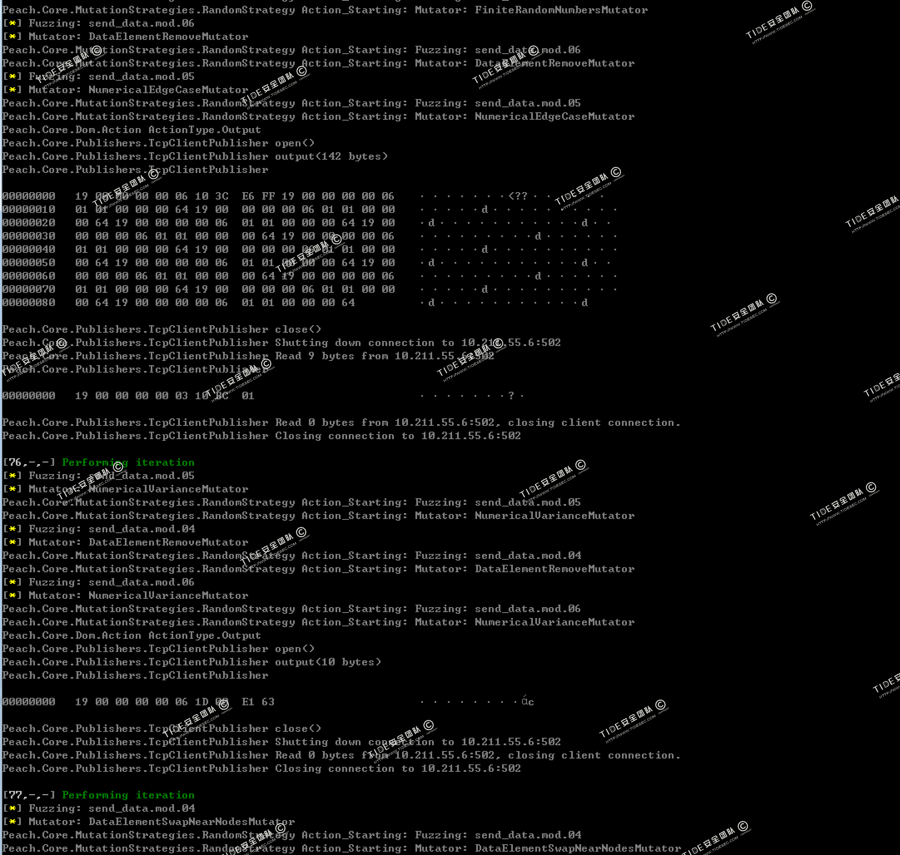

## 查看数据

在wireshark中对数据包进行抓取，发现很多畸变数据

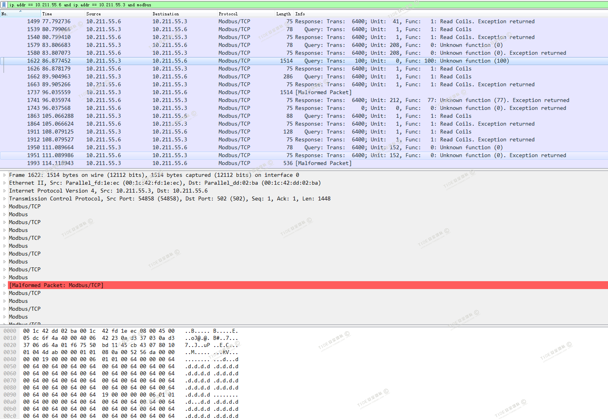

因为在pit文件中指定了只是对后面三组数据进行fuzz，所以前12位是不变的。

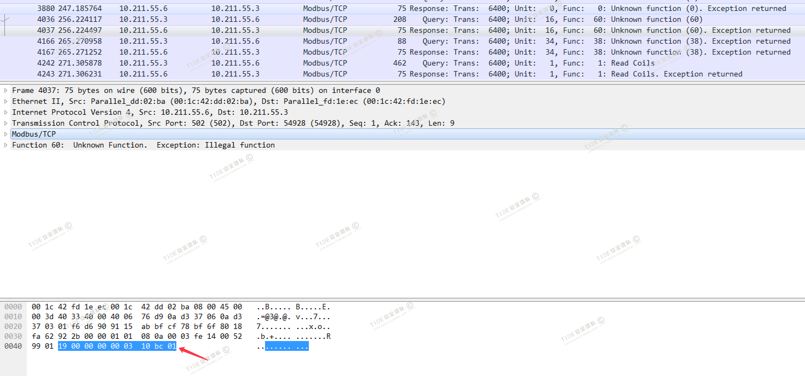


- 针对单个功能码的fuzz数据

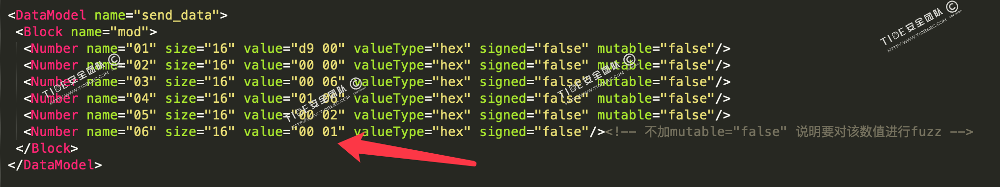

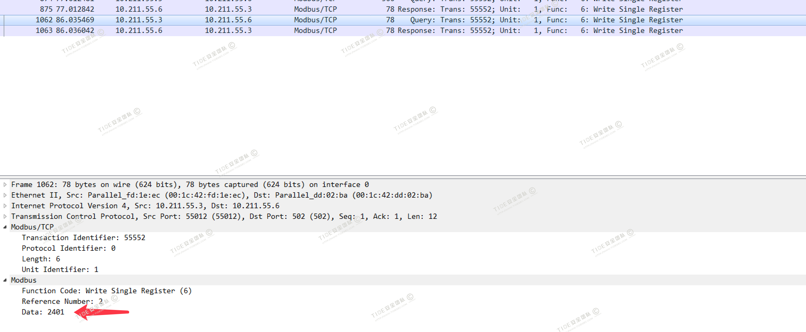

服务端被修改后的数据
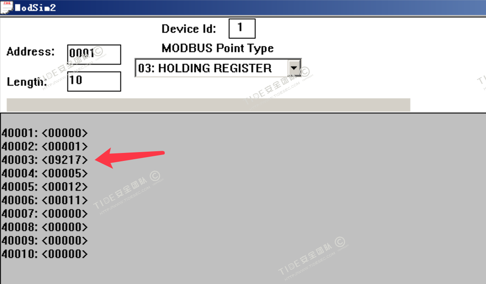
16进制的2401转换为10进制为9217.

## 测试结论

由于仿真器只能接受固定的协议格式和数据类型，所以对畸形的协议和数据都无法响应，所以还是没能找到“设备”的modbus协议实现缺陷。但在对某些功能码进行fuzz测试时，发现还是能偶尔成功更改服务端数据的。

为了提高测试的效率，对于协议安全性的测试可以只测试我们感兴趣的有特殊意义的字段，而不需要把每个字段都进行测试。这样可以避免做无用功，可以在有限的时间内完成最有效的测试。

# 总结

peach模糊测试可以用于对文件、ActiveX控件、网络协议等进行安全测试，发现其存在的畸形输入数据导致的格式错误或者应用逻辑错误等。但这要求对待测协议非常熟悉，掌握它的文件格式或报文规范，这样才能写出正确高效的peach pit文件。

写pit文件这个过程要非常有耐心和细致，而且初期失败率极高且找不出来原因，如果不是为了写这篇文章，我可能放弃peach很多次了，的确不太适合我这种只会用啊D的web脚本小子，还是放弃吧。。。

**最后把本文涉及的所有软件和文献资料都打包放到了Gayhub上，地址奉上：`https://github.com/TideSec/Peach_Fuzzing`**

# 参考文章

从互联网上查阅了很多资料，感谢大佬们的无私奉献。

peach比较推荐的资料是《peach框架模糊测试英文文档》，这是官方指南，最权威的peach使用解读，`https://github.com/TideSec/Peach_Fuzzing`上面已提供原版和中文版。

Fuzzing技术解读与工具列表：https://blog.csdn.net/wcventure/article/details/82085251

Fuzzing技术总结：https://zhuanlan.zhihu.com/p/43432370

基于Peach的Modbus协议模糊测试：https://mp.weixin.qq.com/s/h9JWw1lZpfCmlQYZbBJIYA

peach-fuzz：http://blog.nsfocus.net/peach-fuzz/

深入探究文件Fuzz工具之Peach实战：https://www.freebuf.com/sectool/120650.html

用peach对modbus协议进行模糊测试：https://www.freebuf.com/articles/security-management/88249.html

基于Peach的工业控制网络协议安全分析
：http://jst.tsinghuajournals.com/CN/rhhtml/20170110.htm 