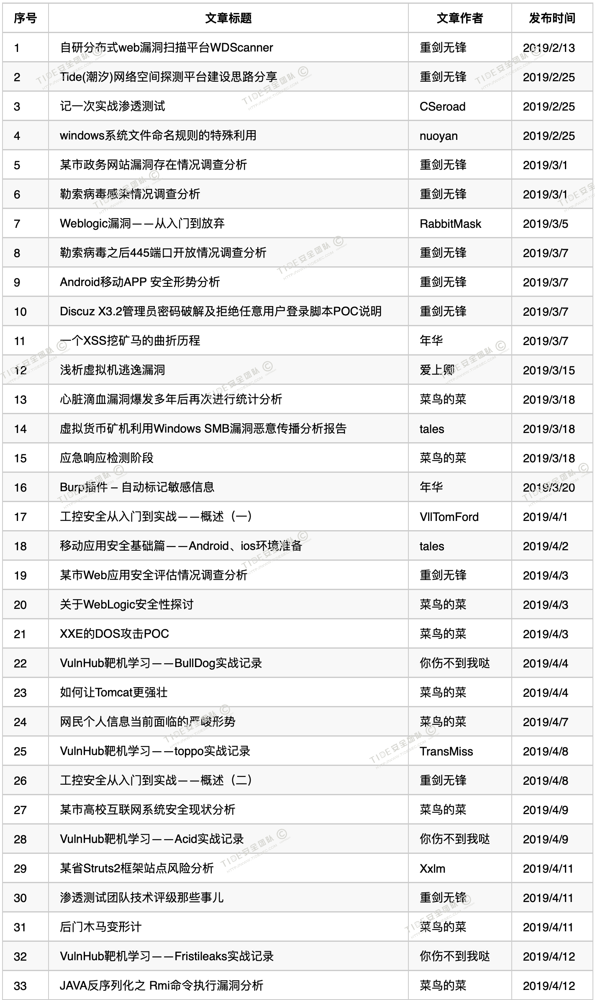

[toc]

光阴如梭，不舍昼夜，又是一年的临近尾声，又到了感慨时光所剩无几的时间，难忘的2019年正匆匆向我们告别。站在时间的交叉口，回首这过往的一年，有收获、有遗憾、有改变，展望新的一年，有憧憬、有激情、有梦想。

2019年1月，山东新潮信息科技有限公司-信息安全实验室正式对外宣布组建Tide安全团队，我们不再只是埋头做项目、出应急，开始在一些从未涉及的方向迈出小心翼翼的第一步。我们开始以Tide的名义在互联网信息安全贡献我们的绵薄之力，参加各种hw和CTF比赛，开源了多个安全平台和工具，在多个安全领域进行技术实践并分享了大量文章，在国家漏洞平台和各大SRC也开始展露头角。

# 一、总体概述

**2019年团队人员基本维持在13人左右，有人离开，有人加入。我们明白天下没有不散的宴席，也更信奉以后不管人在哪大家都是Tide成员之一；**

**2019年我们创建"TideSec安全团队"公众号，在Freebuf、安全客、简书、安全脉搏知识星球等开设团队专栏，发表原创技术文章135篇，其中30余篇获得原创现金奖励，人均11篇；**

**2019年我们组织了66场内部培训和技术分享，人均5场；**

**2019年自研及开源各种安全平台8个，目前自有平台累计数量22个；**

**2019年参加CTF比赛共计12场，进入线下赛5场；**

**2019年共参与重大安保任务21次，其中11次为实战攻防。**

**2019年共向各大平台提交1085个通用/事件型漏洞，人均83个；**

**当然，上面这些都是我们常规安服项目之外的“业余时间”完成的，在2019年，我们完成了大约450多个安服项目（渗透测试、漏洞验证、应急响应、代码审计、软件测试等等），这也是我们的主业和生命线。**

# 二、文章发表

看过知乎上有一个问题“安全从业人员技术到什么程度才有资格去分享自己的经验？”上面有很多的答案，其中有一个回答是“种一棵树的最好时机是十年前，其次是现在，写技术文章同样如此”。

Tide安全团队从创建之初就是为了对内、对外分享，也明白只有分享才能加深自己对技术的理解，能结交更多志同道合的朋友，记录自己的成长轨迹。写文章是一种思考，对技术的思考，对生活的思考，对人生的思考。

总体来看，上半年文章数量多一些，下半年因为项目量和安保任务激增，文章数量大打折扣，把保障项目放在第一位，这是安服团队难以摆脱的宿命。

2019年发表的135篇文章列表如下：

==**另外，已经把所有文章打包PDF，方便喜欢的小伙伴下载，关注"TideSec安全团队"公众号，回复"2019文章"即可获取所有文章下载链接。**==


.png)
.png)
.png)


# 三、内部培训

内部培训开设之初是为了督促、检验个人学习计划完成情况，但随着围观的小伙伴越来越多，也对我们提出了一些较高的挑战，大家在准备授课时也开始更加的专注和细心。

虽然有部分人也在质疑培训的作用，但不能否认的是一些高质量的培训内容的确能激发其他小伙伴的“攀比”之心，让大家意识到自己的差距；另一方面对授课人来说，不管是准备培训时自己学习的过程还是在讲课时对自己表达能力的锻炼，授课人其实才是最大的受益者。


.png)
.png)

# 四、自研平台

2019年，我们陆陆续续写了一些小平台，但大家都不是开发出身，都是做项目之余自学语言，打比赛之余自写小脚本，所以代码质量也是参差不齐，当初发在freebuf上有赞赏也有质疑，但不管怎样，我们在努力写的更好。

截止到2019年12月，我们自研开发的平台达到22个，目前开源12个。

.png)

## WDScanner

.png)

2019年2月，分布式web漏洞扫描器WDScanner开源

```
https://github.com/TideSec/WDScanner
```

.png)

由于平台是很早之前自己的写的，后来有些人向我反馈一些issue，因为各种原因有些就搁置了，计划明年能重写一个更完善的。

## 潮汐网络空间测绘

.png)

2019年2月，潮汐网络空间测绘对外发布，后来由于各种原因下线，目前在内部维护。

```
https://github.com/TideSec/Tide
```

## FuzzScanner

.png)

2019年3月，一个专门针对hw写的信息安全小工具，仓促完成，代码烂的一比。

```
https://github.com/TideSec/FuzzScanner
```

.png)

## TideFinger

.png)

2019年5月，潮汐指纹识别TideFinger上线，上线地址`http://finger.tidesec.net/`

并开源了指纹库`https://github.com/TideSec/TideFinger`

.png)

由于后期工作繁忙，后续的库更新和识别率提升等没有跟上，深感遗憾。

## TideInspire

.png)

2019年10月，TideInspire移动端安全管控平台上线，上线地址`http://app.sdsecurity.org.cn:8181/`，很多功能还在继续完善，暂无开源计划。

移动安全大神`tales`和`mazihan`主导开发，功能大体介绍：

```
https://github.com/TideSec/TideInspire
```

## WeblogicScan

.png)

2019年5月，团队成员rabbitmask开源WeblogicScan工具，可以对Weblogic进行一键漏洞检测，目前是Weblogic同类检测工具第一位。

```
https://github.com/rabbitmask/WeblogicScan
```

.png)

## TideScout

.png)

2019年7月内部上线运行，潮巡web漏洞自动化挖掘平台,可以自动化扫描全网或特定范围web资产，之后获取指纹信息、爬取页面url并提炼，最后进行特定payload测试。计划近期开源。

```
https://github.com/TideSec/TideScout
```

## Mars(战神)

.png)

2019年6月，内部上线运行，算是WDScanner的升级版吧，主要针对hw和src漏洞挖掘而生，计划近期开源。

```
https://github.com/TideSec/Mars
```

## 其他工具

2019年11月，团队大佬`菜鸟的菜`出品应急工具包：`https://github.com/tide-emergency/yingji`

2019年4月，团队大佬`年华`出品BurpExtender：`https://github.com/nian-hua/BurpExtender`

2019年4月，通用web弱口令破解工具：`https://github.com/TideSec/web_pwd_common_crack`

2019年5月，代理资源池：`https://github.com/TideSec/Proxy_Pool`

2019年11月，Weblogic解密工具包：`https://github.com/TideSec/Decrypt_Weblogic_Password`

2019年12月，我的免杀系列文章上线:`https://github.com/TideSec/BypassAntiVirus`,计划每天一篇能更新到春节前后。

在团队内部，还维护着社工库平台、内部SRC平台、安全网络课堂、安全测试案例库、漏洞知识库、代理资源池、字典权重库等等。

# 五、CTF比赛

因为大部分时间都是在做常规项目，所以我们在CTF方面优势不大，主要由`VllTomFord`、`DeceaseWolf`、`MeowChan`领衔参演，其他小伙伴跟着打打酱油。2019年共参加CTF比赛12场，进入线下赛5场。

.png)

# 六、重保及演练

2019年共参与重大安保任务21次，其中11次为实战攻防演练（部委、省级、地市级）。相比2018年，我们在内网渗透方面有了一些进步，在社工、钓鱼、APT等方面也开始深入研究，虽然相比一些专业的红蓝团队还有不小的差距，但大家对内网渗透兴趣都很高，技术文章和内部培训涉及内网渗透的也越来越多，相信会慢慢的缩小差距，也希望大佬们能多带带我们。

因为部分数据比较敏感，这里就不再列举。

# 七、漏洞挖掘

2019年初，我们计划利用业务时间挖一下各大src，上半年的时候利用空闲之余`诺言`、`菜鸟的菜`、`Parad0x`、`VllTomFord`、`vlong`、`年华`等团队几个大佬在补天、爱奇艺、58等平台上刷了一波，但终究是计划不如变化快，后续工作忙起来之后大家就有些心有余而力不足了。

后来在`VllTomFord`大佬提议下陆续申请了`CNVD技术组成员`、`CNNVD技术支撑单位`和`工业信息安全应急服务支撑单位`,同时公司也继续入选第八届`CNCERT网络安全应急支撑单位`（省内唯一），在有了一定授权和需求后，也更为了实战练兵，我们开始在授权范围内挖掘互联网漏洞。

2019年，向各大平台累计提交漏洞1085个，漏洞覆盖web安全、app安全、工控安全、物联网安全等，主要包括SQL注入漏洞、越权访问漏洞、文件上传漏洞和命令执行漏洞等高中危漏洞。并且在我们内部也运维了内部SRC平台，分享最新"0ady"漏洞和挖洞技术。

# 八、兴趣小组

在2019年初，我们还成立了一些兴趣小分队，研究一些安全行业新兴方向以及业务需要的方向，比如`应急响应`、`工控安全`、`代码审计`、`移动安全`、`无线安全`、`物联网安全`等。

红蓝对抗小组：`诺言`、`CSeroad`、`vlong`、`你伤不到我哒`，小组贡献文章18篇

CTF竞赛小组：`VllTomFord`、`DeceaseWolf`、`MeowChan`，小组参加比赛12场

工控安全小组：`VllTomFord`、`重剑无锋`、`Parad0x`，小组贡献文章11篇

移动安全小组：`tales`、`lsummer`，小组贡献文章10篇

应急响应小组：`菜鸟的菜`、`爱上卿`，小组贡献文章10篇

物联网安全小组：`Parad0x`、`jarrott`，小组贡献文章4篇

代码审计小组：`mazihan`、`DeceaseWolf`，小组贡献文章4篇

无线安全小组：`RabbitMask`，小组贡献文章4篇


# 九、团队宣传

为了更好地展示团队，也为了更好地做好技术分享和交流，我们在2019年初开设了公众号`TideSec安全团队`，截止到2019年12月，关注人数为7200人。

团队网站：`http://www.tidesec.com/`或`http://www.tidesec.net/`。

Freebuf专栏：`https://zhuanlan.freebuf.com/column/index/?name=tidesec`

安全客专栏：`https://www.anquanke.com/member/142933`

安全脉搏专栏:`https://www.secpulse.com/newpage/author?author_id=26366`

简书专栏:`https://www.jianshu.com/c/c2edf13d74f4`

团队个人博客地址可在团队官网`http://www.tidesec.com/`的相应个人信息中查看。


# 十、新年期冀

有人会诧异我们十多个人的能量，有人也会对文章和平台质量不屑一顾，也许我们只是网络安全汪洋中的一丝涟漪，只是新潮信息在网络安全征程中的一小步，但却是Tide安全团队的一大步。

迈出了这一步，走向更远的方向，我们的征途是星辰大海!

希望新的一年我们还会一如既往的热爱团队、渴求技术，能为“明天的网络更安全”贡献更多的力量。