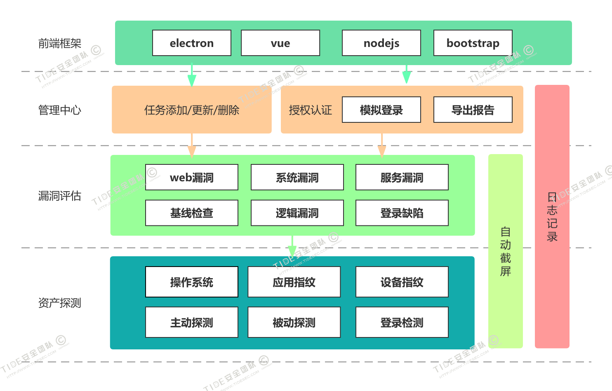
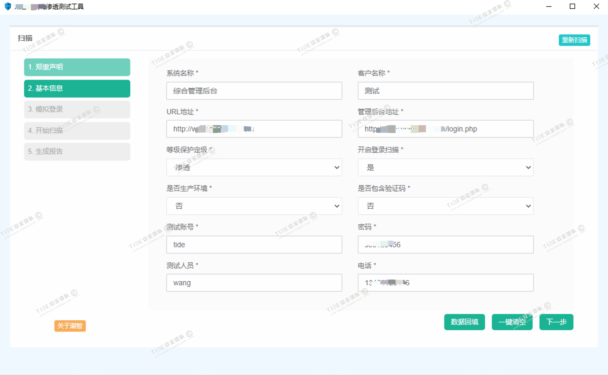
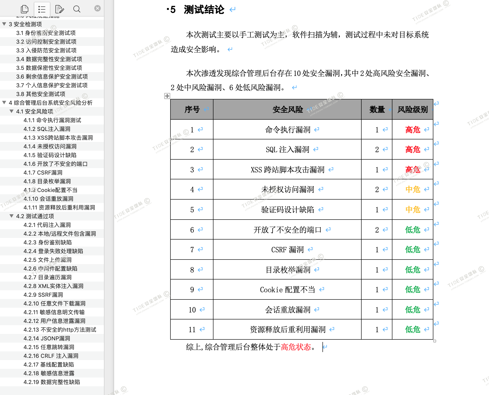
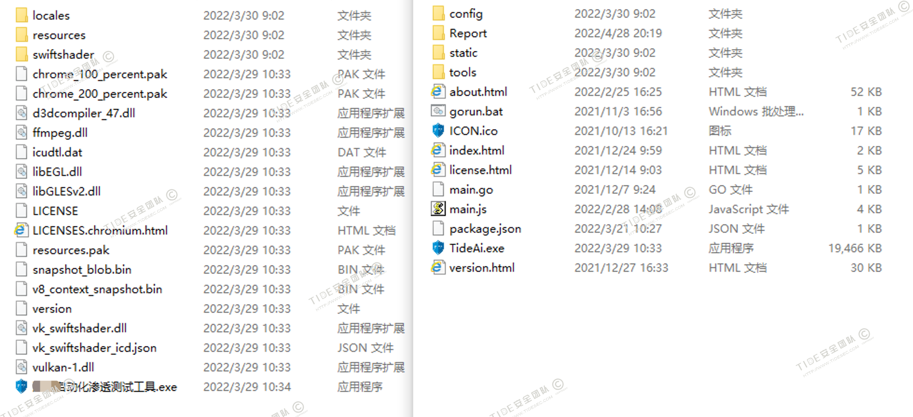
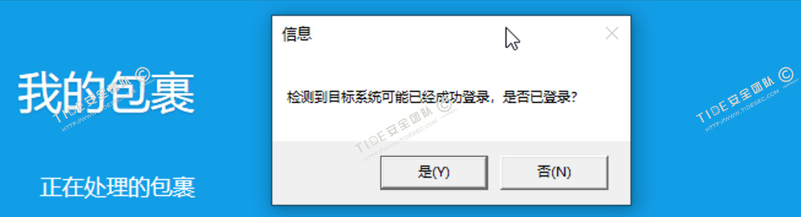
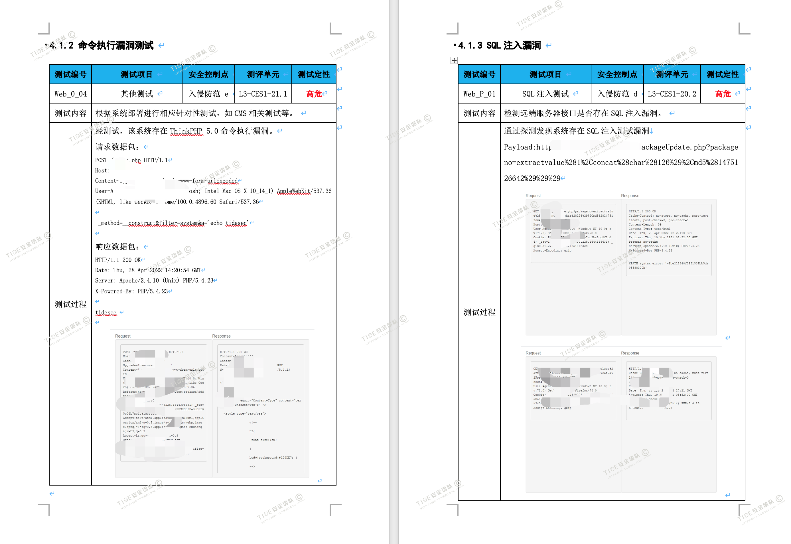
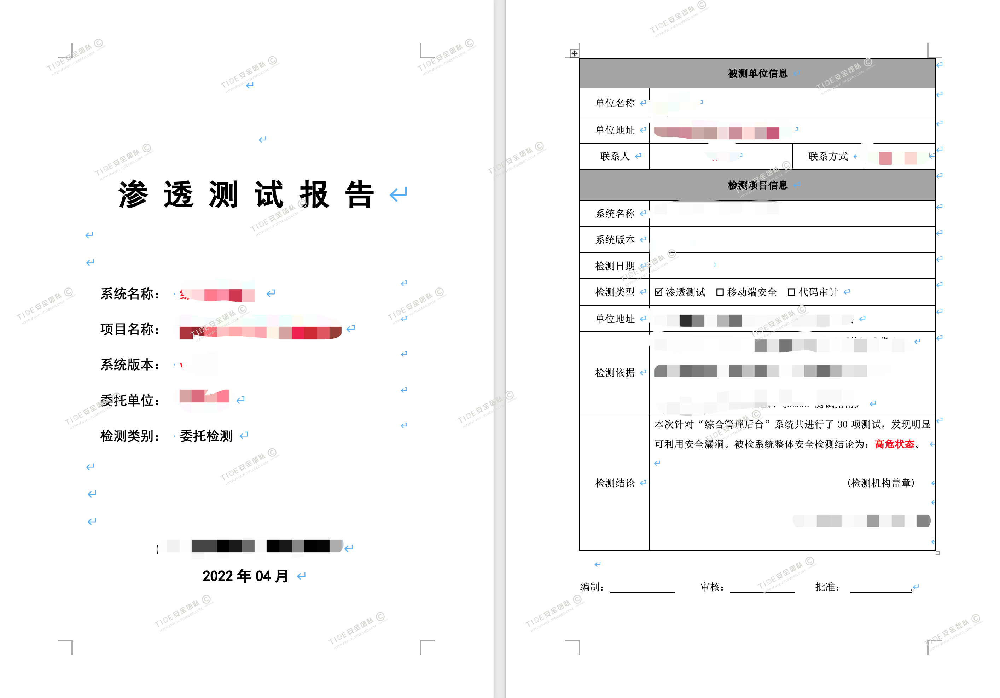
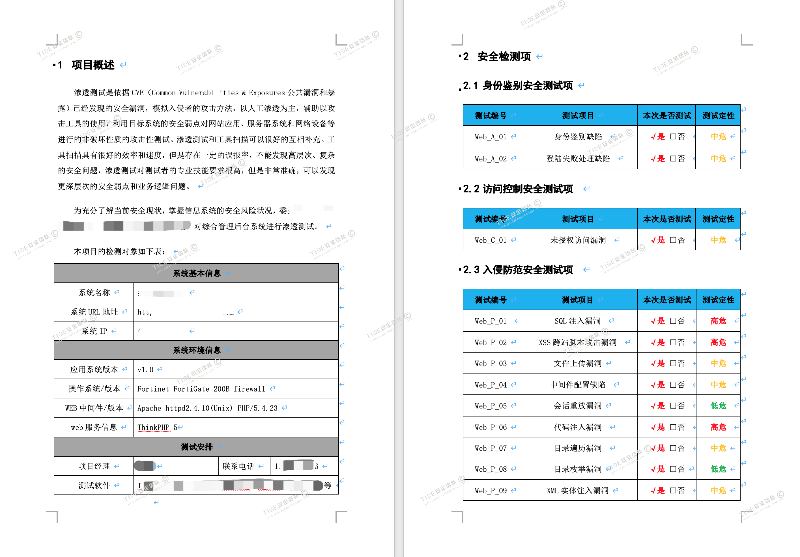

[toc]
 
# 0x01 前言

为了提高安全服务项目的检测效率、规范性、全面性，Tide安全团队结合在渗透测试行业的经验和安全开发方面的积累，开发了一款自动化渗透测试工具。

该工具使用Golang开发为CS架构，集“资产探测-服务识别-爬虫-被动监测-漏洞扫描-POC检测-截屏-报告”于一体，适合甲方或乙方安服团队对目标系统进行全面的安全检测并输出报告。

本文主要介绍一下该工具的框架及部分实现思路。

# 0x02 自动化工具的必要性

传统的渗透测试主要是靠人工进行测试，但由于测试人员的经验、能力、细致度的差别，导致渗透测试的结果可能千差万别。虽然测试用例能让人工测试更规范一些，但每个人的技术擅长点不同，发现漏洞的点也会有很大差异。另外就是，渗透测试的效率相对较低，一般一套CMS系统的纯黑盒测试可能都需要3-5天时间，就算这样也没有人敢保证自己测完之后就不会有任何漏洞，这在快节奏和高时效的今天显得有些格格不入。

而工具扫描从一开始就有它的弊端，比如可能影响业务可用性、误报、漏报、业务逻辑测试盲区、安全设备绕过等。但它也有先天的优势，比如参数检测的全面性，合适的爬虫可以让扫描器能检测系统的每个参数点；比如漏洞检测的快捷性，人工可能还需要识别框架后逐个用POC检测，但工具可以自动化的分析-识别-检测-报告；再比如检测的时效性，一套系统可能30分钟就能做完全部的扫描并完成报告，而人工的话可能才刚把环境配置好。

自动化工具能减轻测试人员繁琐的工作，让大家可以集中精力来测试可能的盲区以及运用其专业知识在最重要的地方，而且自动化测试工具也可以是IT合规检测的关键组成部分。在项目日益激增的时候，在海量资产亟待检测的时候，在重复性报告让人疲于应付的时候，一款适合自己的自动化渗透测试工具就很有必要了。


# 0x03 市面上的自动化工具

现在市面上也有很多优秀的自动化检测工具，比如goby、xray、BurpSuite、Awvs、AppScan、Nessus等，其中goby和xray分别出自国内知名安全公司华顺信安和长亭科技，也是每个渗透测试人员的必备工具。

Goby是由华顺信安扛把子赵武Zwell（Pangolin、JSky、FOFA作者）打造，它的资产探测、高效扫描、漏洞利用等等都让人感觉这不仅仅是一个工具，这是渗透的艺术，赵武大神的工具也向来都是这样让人臣服，当为我辈之楷模。

Xray 是长亭科技推出的免费白帽子工具平台，功能丰富调用简单，现在也被很多人用做自己的扫描核心，而且它的企业版“洞鉴”更是让人眼前一亮，出色的检测能力和用markdown编写的检测报告也是让人心悦诚服。

当然，完全的模仿goby和xray是我们做不到的，而且重复造轮子也不是我们要做的，我们只需要在巨人肩上找到适合自己的最佳实践。

# 0x04 自动化渗透测试工具框架

我们的目的就是让渗透测试服务更快捷、标准化且易操作，因为使用它的可能是专业渗透测试人员，也可能是其他安服部门同事，或者是售前、运维等人员，安装、部署、使用、生成报告都要尽量便捷，所以我们最后是参考了`Goby`的开发框架，使用了`GoLang+Electron+VUE`，也能较好支持Windows/MacOS/Linux多平台使用。

整体功能架构如下所示。



工具界面如下，简单填写，一键出报告。



内置了多种模板报告，下面是我司的渗透测试报告模板



工具是和Tide安全团队的三个小伙伴一起开发，用时大约两个月从GoLang零基础到完成开发，期间还要忙正常的项目，非常感(mai)动(ming)。

`skad`：前端总设计师、API交互、报告生成等

`浮生若梦`：主要负责常规漏洞检测模块、Poc检测模块、日志截图等

`天下兵马大都督`：负责爬虫模块、授权认证、前端设计等

`重剑无锋`：我主要负责他们不屑于干的杂活(⊙﹏⊙)

# 0x05 部分功能实现方法参考

## 1. 前后端交互

前端和后台的模式主要参考了Goby的实现方式，使用`Electron+VUE+nodejs`开发前端后打包即可。在前端启动时也会在后台启动服务端，服务端提供了api接口供前端调用，实现前后端交互。



在最初的方案中，我们是想用Golang自带的GUI模块来实现前端界面，但挑来选去没有发现太好用的，要么繁琐要么移植性差。也想过用BS架构，比如gin框架，类似`gshark`或者`pocassist`，但我们功能不多，专门弄个web有点大材小用了，所以最后还是选了`Electron`，而且GoBy 、中国蚁剑、FOFA客户端等也就是基于此方案进行开发的，向大佬们学习肯定不会有错。

参考资料：
```
一款漏洞验证框架的构思：https://nosec.org/home/detail/2919.html
Vue+Electron项目：https://segmentfault.com/a/1190000038463122
```
## 2. 资产探测

因为该工具主要定位是针对单个web资产进行扫描，所以资产的探测主要是在端口扫描、服务指纹识别、应用指纹识别等方面，也能在后面的POC检测环节根据指纹信息来对POC进行匹配，提高精准度降低不良影响。

1. 端口扫描和探测

直接使用了go代码来进行端口存活的发现，使用`nmap`的指纹库进行服务指纹识别，这部分可以参考`dismap`和`ServerScan`。
```
ServerScan: https://github.com/Adminisme/ServerScan
dismap: https://github.com/zhzyker/dismap
```

2. 应用指纹识别

应用指纹识别方面现在市面上有很多开源工具，我之前也用python写过`tidefinger`，现在也有很多用Golang开发的指纹识别工具，比如`dismap`、`fscan`、`kscan`等，我主要还是根据`tidefinger`的原理融合了其他几个工具的指纹，并参考了goby的指纹识别方式。

```
TideFinger: https://github.com/TideSec/TideFinger
dismap: https://github.com/zhzyker/dismap
fscan: https://github.com/shadow1ng/fscan
kscan: https://github.com/lcvvvv/kscan
```
## 3. 被动探测

我们使用了主动扫描和被动扫描两种方式，被动探测和xray的被动扫描基本一致，实现的流程是：导入证书(监听https)-监听端口-浏览器设置代理-监听数据并分析，这些流程也都是在用户无感知的情况下自动化完成的。而被动监听到的数据用用做后面的爬虫二次爬取、漏洞检测、敏感字检测等。

监听数据主要使用`goproxy`库，并对请求头和返回包都进行了一定的修改，为了能更准确的识别到登录数据包，还使用了机器学习+行为分析的方式进行登录字段的分析，目前分辨登录数据包的成功率大约90%左右。

```
goproxy库： https://github.com/elazarl/goproxy
```
对其中的`RespHandlerFunc`和`ReqHandlerFunc`进行了大量的二次开发，因为判断成功登录数据包是比较关键的一步，这是后面登录机制验证、弱口令猜解、用户名枚举、未授权访问漏洞、cookie配置缺陷等漏洞的基础。

其实这个过程和`appscan`、`awvs`的分析登录数据包是基本一致的，只不过我们让他尽量的自动化了。当然对一些较为复杂或难以识别的登录数据包，还加入了人工辅助验证的方式，在模拟登录的时候会弹出一个登录确认框辅助确认。



## 4. 链接爬虫

爬虫是否强大也是一个扫描器的关键，普通的静态爬虫无法解析和渲染js，所以我们还使用了`Go+Selenium+chromedriver`来抓取一些需要渲染的框架类网站，以便更全面的爬取到页面链接和参数，最初是考虑使用`playwright` 或者`puppeteer`的，但目前大部分都是python代码实现的。静态爬虫主要参考了colly和幽灵珠。

```
Go最强大的爬虫库colly： https://github.com/gocolly/colly
crawlergo：https://github.com/Qianlitp/crawlergo
幽灵蛛爬虫：https://github.com/henrylee2cn/pholcus
Go的selenium：https://github.com/tebeka/selenium
```

为了避免后续的漏洞检测可能影响到业务正常使用，所以在爬虫阶段对部分敏感链接进行了分类，比如涉及添加、删除、更新、注销之类的操作，还有一些POST写入的操作，如果用户确认是测试环境时才会对这些链接进行测试。虽然这样可能导致漏报，但最起码不会删除用户的数据，之前就遇到过Awvs的登录扫描把后台管理员账号删除的情况。

## 5. 登录缺陷测试

登录缺陷测试主要是对登录数据包进行一定的分析，然后根据返回包长度、返回数据、cookie变化等进行判断，主要测试了如下测试项：用户名猜解、密码枚举、验证码绕过测试、敏感信息明文传输、是否进行加密、加密算法是否为弱加密、是否存在会话定置、cookie验证缺陷、cookie中存储敏感信息等。

验证码绕过部分一方面是删除验证码或者重复使用验证码，查看系统返回包是否一致，另一方面我们也在尝试使用卷积神经网络来自动识别简单的验证码，不过目前成功率还不算高。

验证码识别可以参考以下资料：
```
我们团队lmn小姐姐的大作：https://www.yuque.com/tidesec/xxae8n/ucbwtx
基于Go的tensorflow：https://github.com/galeone/tfgo
基于Go的图形识别：https://github.com/tinrab/go-tensorflow-image-recognition
```

## 6. 常规漏洞检测

常规漏洞的检测主要是SQL注入漏洞、XSS漏洞、命令注入、文件包含、目录枚举等等漏洞，虽然常规漏洞出现的越来越少，但只要出现就会是中高危，漏测的话影响也会比较大。虽然常规漏洞看起来简单，但真正想实现一个能接近Xray或者Awvs扫描功能的扫描器还是不太可能的。

后来我们借鉴了`gryffin`的方式来曲线救国，使用了`Arachni`来进行部分常规漏洞的检测，对部分sql注入和xss我们自己用Go实现了一部分，本来也想用`sqlmap`的，但`sqlmap`是用python写的，我们不想再打包个python环境，而exe版的sqlmap也不是我们想要的。`Arachni`是用ruby来实现的，官方也打包了各平台的版本，调用倒算方便。

在第一版完成后，目前也在模仿WASCAN来写个自己的Go扫描器，不过因为各种原因进展一般。当然大家也可以去调用xray或者Awvs之类的进行扫描，但毕竟不是自己写的，后续想完善或者构造数据包截图之类的都有些不便，而且商业软件的版权也是个绕不开的问题。

```
基于Go的扫描器gryffin：https://github.com/yahoo/gryffin
基于Ruby的扫描器Arachni：https://github.com/Arachni/arachni
基于Python的扫描器：https://github.com/FOGSEC/WAScan
```

## 7. POC检测

POC检测的重要性就不用再说了，特别是对诸如weblogic、struts、fastjson、thinkphp、shiro 等框架的高危历史漏洞的检测，集成各类POC然后根据指纹识别情况定向检测，工具的高效快捷是人工检测难以比拟的。

我们在团队内部也一直维护着自己的POC平台，主要是根据`Fscan`和`pocassist`来进行的二次开发，Poc后续的更新就只能靠自己整理了，当然如果有钱的话可以买商业版的Poc库，商业版的更及时高效而且节省人力。

自己整理Poc库的话，最初的Poc可以从`nuclei`、`xray`、`pocassist`、`Fscan`等项目中得到，而且这几个的poc格式基本一致，个别的修改一下就能通用。

```
Nuclei：https://github.com/projectdiscovery/nuclei
Xray：https://github.com/chaitin/xray
pocassist：https://github.com/jweny/pocassist/
fscan：https://github.com/shadow1ng/fscan
```

## 8. 逻辑漏洞检测

逻辑漏洞检测是工具检测的硬伤，也在网上看过一些基于人工智能、大数据分析之类的检测方法，但大都是针对特定业务或特定系统，而且需要一定的样本数据才能对业务的逻辑漏洞进行测试。

所以目前逻辑漏洞检测也只是针对验证码绕过、用户名枚举、未授权访问之类的弱逻辑漏洞，主要还是根据返回数据包的不同来进行判断，目前来看误报不算多。

对于垂直越权，需要对不同权限的账号分别进行请求，根据返回数据来进行判断，但一些公共api可能存在误报。

但对于水平越权和一些业务层面逻辑漏洞（例如0元支付），暂时没有其他更好的实现思路。

## 9. 日志及截图

渗透测试不管是人工还是工具都会有一定的风险，所以我们也比较注重日志的留存，对所有由工具发出的流量和执行的操作都会详细记录，万一出现问题可以进行溯源佐证。

另外对每个漏洞项，不管是存在问题还是测试通过的，也都会进行自动化截图留证，部分截图会插入到报告中。截图功能主要使用了`chromedp`的网页截屏方式。

```
chromedp：https://github.com/chromedp/chromedp
网页截屏：https://www.jianshu.com/p/c4451e488e6a
```

对每个漏洞都进行了测试并自动截图




## 10. 输出报告

报告是安服检测的最重要的交付物了，我司对报告格式也要求比较严格，所以为了能较好的生成报告也是查了不少资料，开始本来是想用`unioffice`，但我们的模板有些地方没法生成，而`unioffice`的代码改起来也比较费劲，而且还不是完全开源免费。最后我们是参考`unioffice`的原理，自己实现了一个报告生成器，虽然笨重一些，但恰好能满足我们的需求。

在生成word版报告后，为了方便还提供了一个pdf版本的报告，主要参考了`doc2pdf-go`，在windows上还有个更方便的vba转格式的方式，可以参考以下资料。

```
unioffice：https://github.com/unidoc/unioffice
doc转PDF：https://github.com/piaobocpp/doc2pdf-go
vba doc转docx：https://www.cnblogs.com/owenzhou/p/10795209.html
PDF/DOC/DOCX：https://github.com/sajari/docconv
```






# 0x06 写在后面

其实相比goby的“资产-指纹-漏洞-验证-横向”和xray的“主被动-爬虫-web全扫描-poc检测”，我们不管代码还是检测能力或者是覆盖面都还差很多，但我们的工具也有一些“神器”难以取代的优势。

1. 我们对渗透、等保、合规等方面的测试项都可以根据需求自行设定，登录机制验证、弱口令猜解、用户名枚举、短信轰炸、未授权访问漏洞、cookie配置等方面都可以进行模块化测试。

2. 自己实现的爬虫，可以有效控制测试时的风险，大大降低系统管理后台登录后扫描测试的风险。

3. 工具使用简单方便，不论是不懂安全的研发，测试人员，还是后期的运维人员，都可以快速上手，在不增加测试工作量的基础上，零成本，可视化的完成项目安全测试。

4. 漏洞截图、日志留存、报告输出相对可知可控，能满足安服团队的日常需求。

5. 测试时间较短，一套常规web系统在10-30分钟左右，这样测试人员可以节省精力去测试一些业务逻辑漏洞之类的就可以。

当然到目前为止，我们还有很多亟待解决的问题。比如：web常规漏洞扫描、poc的持续维护、逻辑漏洞的检测、安全设备绕过、误报漏检、验证码识别准确度问题、漏洞利用链构造等等，距离burp、goby或者xray还有很长很长的路要走。

自动化渗透测试可能是未来发展的趋势，但目前仍处于早期阶段吧，很多问题都还没法用人工智能的方式去实际解决。尽管暂时还无法完全替代渗透测试人员，但有很大一部分内容是完全可以取代人工并且比人工完成的更好更快的，所以才有了我们这个工具。

**也许等有一天人工智能足够成熟，自动化工具能完全代替人工了，还需要你拿着Burpsuite和Nmap测系统么？**

PS：大家就不要问源码了，目前有些功能还在完善，暂时不会开源。部分指纹相关的代码后续会更新到我们的知识星球——**Tide安全攻防**，针对知识星球用户后续也会上线一些新的在线安全服务，敬请期待。