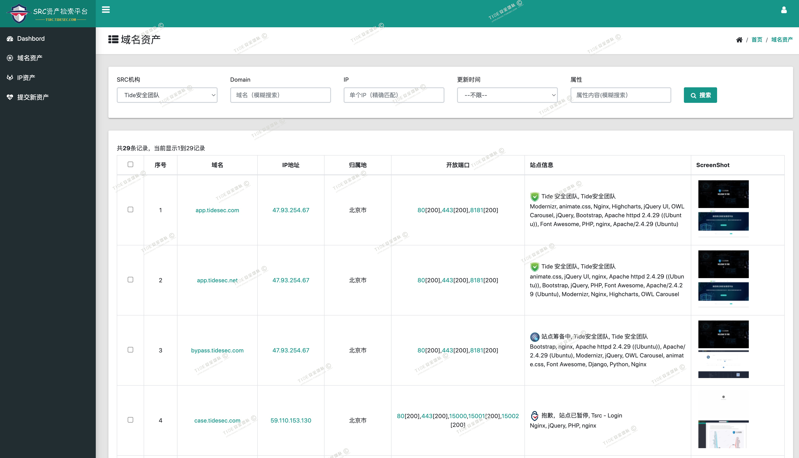
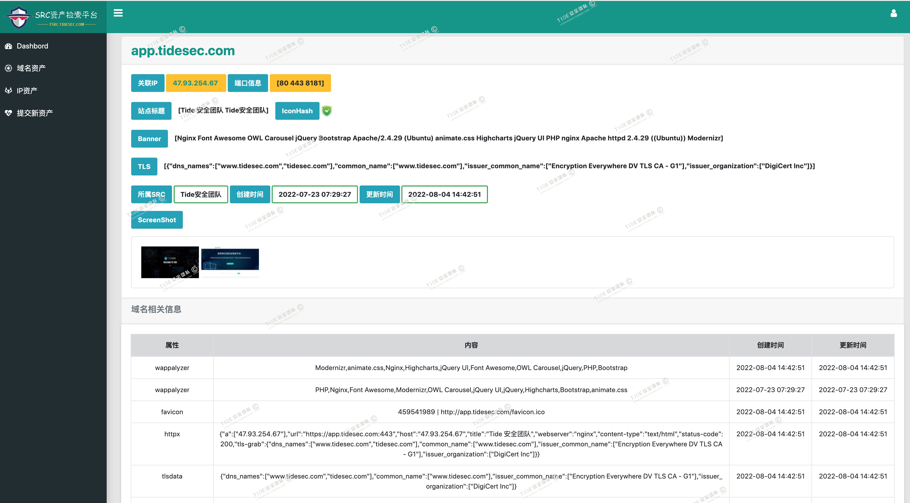
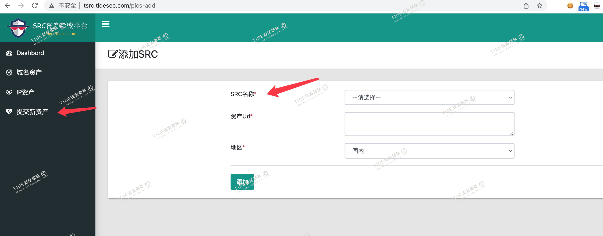

**潮讯SRC资产检索平台: http://tsrc.tidesec.com**

潮讯SRC资产检索平台是Tide安全团队结合资产发现、指纹识别、端口开放等方面的经验，提炼数十种方式，对各大SRC的资产进行实时监测，为白帽子们提供方便。

目前平台已收录111家SRC厂商，其中国内SRC共92个，国外SRC共19个。目前域名资产11.8万个，IP资产1.9万个。

潮讯SRC资产检索平台可以对所有SRC进行定期资产搜集和探测，包含子域名、IP、指纹、端口开放、图标、备案信息、端口变更等。

对平台未收录的SRC资产，大家可提交新资产，我们在审核后会添加到监测列表中。

平台架构：最初是打算基于我之前写的Mars(`https://github.com/TideSec/Mars`)来进行开发，后来发现 `hanc00l`大佬把`Mars`用Go实现了`https://github.com/hanc00l/nemo_go`，而且架构更完整，于是在 `nemo_go` 基础上进行了二次开发，针对SRC特点完善丰富了子域名搜集和指纹探测功能，去掉了Poc检测等功能，方才有了现在的Tsrc。在此感谢 `hanc00l`和`jeffzh3ng`两位大佬的开源项目。

